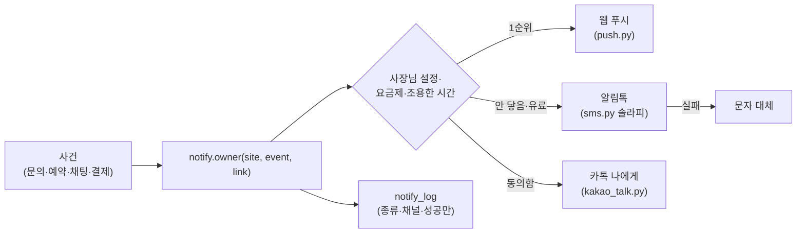

# 사이트 채팅 넣기 + 사장님 휴대폰 알림(문자 말고) 계획 (OWNER_NOTIFY_PLAN)

> 2026-10-03 (KST). 대표 질문: "사이트에 채팅창을 넣고 싶을 때 어떻게 넣나, 그 알림을 선생님(사장님)이 관리자 사이트가 아니라 휴대폰으로 쉽게 받으려면, 문자 말고 다른 방법은?"
> 조사 Claude(코드 확인). 이 문서는 [FEATURE_PLATFORM_PLAN](FEATURE_PLATFORM_PLAN.md)의 '알림' 모듈 상세다.

## 0. 결론

1. **채팅창은 이미 있다.** 사이트를 공개하면 "채팅하기" 버튼이 자동으로 붙는다(기본 켜짐). 손님은 `/chat/<사이트>`에서 AI와 먼저 이야기하고, AI가 모르면 사장님 대기로 넘어간다. 사장님은 `/owner` → 채팅 탭에서 답한다(GUEST_CHAT_CONTRACT).
2. 빈 곳은 두 가지다. ① 버튼이 연락 구역·행동 바 **안쪽 링크**라 눈에 덜 띈다. ② 사장님 휴대폰을 **울리는** 알림이 사실상 없다. 지금은 카톡 "나에게 보내기" 하나인데, 실제 수신은 한 번도 확인하지 못했다(STATUS §4-3).
3. 추천 알림 구성: **웹 푸시(무료, 기본)** + **카카오 알림톡(유료 요금제, 확실히 울림)** + 카톡 나에게 보내기(보조). 문자는 알림톡이 실패할 때만 대체로 쓴다.
4. 채널마다 따로 부르지 않게 **알림 허브** `notify.owner(...)` 하나로 묶는다. 지금 `notify.owner_kakao`를 부르는 6곳(문의·예약·결제·채팅·청첩장·채팅방)이 그대로 허브를 쓴다.
5. 사이트 채팅은 **떠 있는 채팅 버튼(스크립트 없는 링크)** 으로 키운다. 사이트 안에 채팅 창(스크립트·iframe)을 넣는 것은 보안 원칙(공개 사이트 CSP·게시 전 검사)과 부딪혀 하지 않는다.

## 1. 지금 있는 것 (코드 근거)

| 무엇 | 어디 | 상태 |
|---|---|---|
| 손님 채팅 페이지(AI 먼저 답, 모르면 사장님 대기, "사장님께 직접 물어보기") | `static/chat.html`, `app/services/chat_agent.py`, `app/services/guest_chat.py` | ✅ |
| 공개 사이트 "채팅하기" 링크(채팅 켜짐일 때만) | `app/services/site_render.py` `_guest_chat_url`, `templates/sections/contact--*.mustache` | ✅ |
| 사장님 채팅 탭(목록·답·차단·닫기, SSE 즉시 반영) | `static/owner.html` 채팅 탭, `app/api/owner.py` `/chats`·`/chat-stream` | ✅ |
| 채팅 켜기·끄기 | `shop_settings.guest_chat_on`(기본 켜짐), 빌더 '채팅' 칩은 안내 창(10/3 J5) | ✅ |
| 사장님 카톡 "나에게 보내기" | `app/services/notify.py` → `kakao_talk.send_to_room_owner` | 코드 ✅ · **실수신 미확인** |
| 문자(솔라피) | `app/services/sms.py` (손님 번호 인증용) | ✅ 사장님 알림에는 안 씀 |
| 텔레그램 | `app/services/ops_alert.py` | 운영자(우리) 알림 전용 |
| PWA(홈 화면 설치) | `static/sw.js`, `static/pwa.js` | ✅ 설치만. **푸시 처리 없음** |

`notify.owner_kakao`를 부르는 곳: `inquiries.py`(문의·참석 여부), `bookings.py`(예약 신청), `booking_engine.py`, `payments.py`(결제 완료), `guest_chat.py`(새 채팅), `rooms.py`(채팅방).

## 2. 사이트에 채팅창 넣는 방법

| 안 | 모양 | 보안 | 판단 |
|---|---|---|---|
| A. 지금 | 연락 구역·행동 바 안의 "채팅하기" 링크 → 새 탭 | 스크립트 없음 | 있음. 눈에 덜 띈다 |
| **B. 떠 있는 채팅 버튼** | 화면 오른쪽 아래 둥근 버튼(`<a>` 하나, CSS로 고정) → `/chat/<사이트>` 새 탭 | 스크립트 없음, `publish_check` 그대로 통과 | **추천** |
| C. 사이트 안 채팅 창 | 사이트 위에 채팅 상자(iframe 또는 스크립트) | 공개 사이트 CSP sandbox·게시 전 검사(외부 스크립트·우회 iframe 차단)와 충돌 | 하지 않는다(GUEST_CHAT_CONTRACT "하지 말 것") |

B 상세:
- 공용 레이아웃(모든 시안 공통 끝부분)에 `{{#guest_chat_url}}<a class="s-chat-fab" href="{{guest_chat_url}}" target="_blank" rel="noopener" aria-label="채팅하기">…</a>{{/guest_chat_url}}`.
- 크기 56px(누르는 면 44px 이상), 아래 여백은 `env(safe-area-inset-bottom)`, 행동 바가 있는 시안은 그 위로 띄운다. 색은 사이트 토큰(`--c-primary`, `--on-primary`)만.
- 사장님 설정 `guest_chat_fab`(기본 켜짐)으로 끌 수 있다. 채팅 자체가 꺼지면 버튼도 없다.
- 테스트: 켜짐이면 버튼 1개·꺼짐이면 0개, `publish_check` 통과, 390px에서 행동 바와 안 겹침.

## 3. 사장님 휴대폰 알림 — 문자 말고 무엇이 있나

| 방법 | 비용 | 사장님 준비 | 휴대폰이 울리나 | 아이폰 | 우리 개발 | 판단 |
|---|---|---|---|---|---|---|
| **웹 푸시(PWA)** | 무료 | 사장님 화면을 홈 화면에 설치 → "알림 켜기" 한 번 | ● 앱처럼 울림 | iOS 16.4 이상 + 홈 화면 추가 때만 | 표 1개, 서비스워커 푸시 처리, 의존성 1개(`pywebpush`) | **기본 채널** |
| **카카오 알림톡** | 건당 약 7~13원(BUSINESS_STRATEGY §5, 딜러사 가격) | 없음(우리 비즈니스 채널로 보냄) | ● 카톡 알림 | ● | 솔라피에 이미 붙어 있음(문자와 같은 API, 종류만 알림톡). 채널 개설·템플릿 심사 1회 | **유료 요금제 채널**, 손님 알림(예약 확정)에도 같이 씀 |
| 카톡 나에게 보내기 | 무료 | 카카오 로그인 + 메시지 동의 | **확인 필요**: '나와의 채팅'으로 들어가 알림이 약할 수 있다 | ● | 이미 있음 | 보조로 유지, 실측 뒤 판단 |
| 텔레그램 봇 | 무료 | 텔레그램 설치·봇 연결 | ● | ● | 쉬움(운영 알림에 이미 씀) | 국내 사장님에게 낯섦. 선택지로만 |
| 이메일 | 무료 | 없음 | 약함 | ● | 쉬움 | 하루 요약용 |
| 문자 | 알림톡보다 비쌈(확인 필요) | 없음 | ● | ● | 이미 있음(`sms.py`) | 알림톡 실패 때 대체만 |

추천 묶음:

| 요금제 | 새 예약·문의·채팅·결제 알림 |
|---|---|
| 무료 | 웹 푸시 + (동의했으면) 카톡 나에게 보내기 |
| 유료 | 웹 푸시 → 안 닿으면 알림톡(요금제 포함 건수) → 알림톡 실패면 문자 |

알림 공통 규칙(지금 규칙 유지·확장):
- 글 원문은 넣지 않는다. "새 채팅이 왔어요 + 링크"처럼 종류·건수·링크만(개인정보, GUEST_CHAT_CONTRACT §0).
- 같은 대화·같은 종류는 10분에 한 번(지금 채팅 규칙을 허브로 옮김).
- 조용한 시간(기본 끔, 켜면 22~08시): 그 사이 알림은 모아 08시에 한 번.
- 누르면 바로 해당 화면: `/owner?site=<키>&tab=chats&thread=<id>`.

## 4. 구현: 알림 허브

| 번호 | 무엇 | 파일 |
|---|---|---|
| N1 | 표 3개(마이그레이션): `push_subscriptions`(id, user_id, endpoint 유일, p256dh, auth, 기기 이름, created_at, last_ok_at, fail_count) · `notify_prefs`(user_id, site_key, 채널별 켜짐, 조용한 시간) · `notify_log`(site_key, event, channel, ok, at — 글 없음) | `alembic/versions/00xx_notify.py`, `app/db/models.py` |
| N2 | 웹 푸시 보내기: VAPID 키(비공개 키는 `keystore`, 공개 키는 설정), 404·410 응답이면 구독 지움, 5초 제한, 뒤에서(스레드) | `app/services/push.py`(신규), `requirements.txt`(`pywebpush`) |
| N3 | 허브: `notify.owner(site_key, event, text, link)` → 설정·요금제·조용한 시간 보고 채널 차례로. 기존 `owner_kakao(room_id, text)`는 허브를 부르는 얇은 감싸기로 남긴다(호출 6곳 그대로) | `app/services/notify.py` |
| N4 | 알림톡: 솔라피 `type: ATA` + 템플릿 번호. 템플릿은 종류별 4개(새 문의·새 예약·새 채팅·결제 완료). 사용량은 사용 장부에 `alimtalk`로 적는다 | `app/services/sms.py`에 `send_alimtalk`, `app/services/usage.py` |
| N5 | API: `GET /api/push/key`, `POST /api/push/subscribe`, `DELETE /api/push/subscribe`, `POST /api/push/test`, `GET·PUT /api/me/notify` | `app/api/settings.py` 또는 새 `app/api/notify.py` |
| N6 | 서비스워커: `push` → `showNotification(제목, {body, tag, data: {url}})`, `notificationclick` → 열린 창이 있으면 그 창으로, 없으면 `openWindow(url)` | `static/sw.js` |
| N7 | 사장님 화면: 위쪽 "📱 휴대폰 알림 켜기" — 설치 안 됐으면 설치 안내(아이폰은 공유 → 홈 화면에 추가 그림), 설치됐으면 권한 요청 → 구독 → 시험 알림 1건 | `static/owner.html` |
| N8 | 떠 있는 채팅 버튼(§2 B) | `templates/`, `app/services/site_render.py` |

합격 테스트:
1. 구독 저장·같은 endpoint 두 번은 1개, 410이면 지움, 다른 사람 구독 못 지움.
2. 허브: 웹 푸시 성공이면 알림톡 안 보냄, 구독 없음 + 유료면 알림톡, 알림톡 실패면 문자, 무료면 알림톡 안 보냄.
3. 조용한 시간에는 보내지 않고 08시에 모아 1건.
4. 알림 본문에 손님 글 원문·전화번호가 없다.
5. 기존 `owner_kakao` 호출 6곳 테스트가 그대로 통과.
6. Claude: 안드로이드 크롬 실기기에서 설치 → 알림 켜기 → 시험 문의 → 알림 눌러 채팅 탭 열림 캡처.

## 5. 순서

| 단계 | 내용 | 기간(추정) |
|---|---|---|
| 1 | 카톡 나에게 보내기 실수신 확인(STATUS §4-3, 사용자 휴대폰) — 울리면 무료 보조로 충분한지 판단 | 30분 |
| 2 | N1·N2·N3·N5·N6·N7 웹 푸시 | 3~4일 |
| 3 | N8 떠 있는 채팅 버튼 | 반나절 |
| 4 | 카카오 비즈니스 채널 개설·알림톡 템플릿 심사(대표) → N4 | 심사 기간 + 1일 |

## 6. 대표 결정 필요

| # | 질문 | 추천 |
|---|---|---|
| Q1 | 알림톡을 우리 채널("한마디") 이름으로 보낼까, 가게별 채널로 보낼까 | 우리 채널(사장님 준비 없음). 손님 알림도 같은 채널 |
| Q2 | 무료 요금제에 알림톡을 조금이라도 넣을까 | 넣지 않음(웹 푸시로 충분), 유료 전환 이유로 쓴다 |
| Q3 | 조용한 시간 기본값 | 끔(놓치는 것이 더 나쁨), 사장님이 켠다 |
| Q4 | 떠 있는 채팅 버튼 기본값 | 켜짐 |

## 변경 이력

| 날짜 | 내용 |
|---|---|
| 2026-10-03 | 처음 작성(대표 질문: 사이트 채팅 + 문자 말고 휴대폰 알림) |
