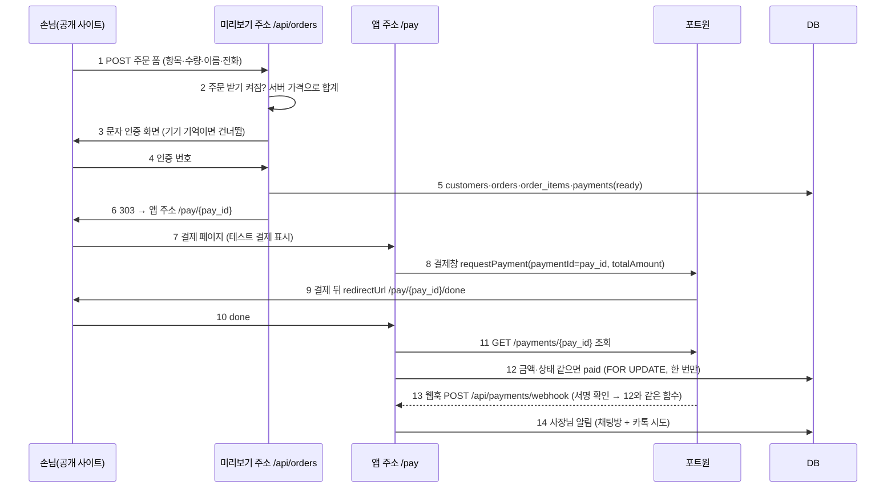

# 물결 3 계약서: 주문·결제(포트원 테스트)·사장님 주문 목록·환불 (PAY_WAVE3_CONTRACT)

> 2026-09-30 (KST) / Claude 작성, OpenCode 구현. 상위 계획 [APP_COMMERCE_PLAN](APP_COMMERCE_PLAN.md) §2 물결 3 (10/5~10/10), 결정 D56 ②. 돈 구조·법은 [PAYMENT_PLAN](PAYMENT_PLAN.md)을 따른다.
> **실결제 금지**: 포트원 **테스트 채널만**. 실결제는 PAYMENT_PLAN §2.3 상담·약관·고지 뒤 대표 결정으로 연다(`portone_live`는 이번 물결에서 늘 False).

## 0. 결론

- **범위**: 포장 주문 가게(청사진 `A-pickup`, 메뉴 구역에 `order: true`)만. 사장님이 설정에서 **"온라인 주문 받기(테스트 결제)"**를 켠 가게만 메뉴에 수량 칸이 생긴다. 끄면 지금처럼 "곧 열려요 · 전화로 주문" 시트.
- **장바구니 = 자바스크립트 없는 폼**: 메뉴 항목마다 수량 칸(`<input type="number">`), 이름·전화, "주문하기". 공개 사이트는 CSP sandbox라 기기 저장소를 못 쓰고(물결 1에서 확인), 폼은 이미 허용된다. 금액은 **서버가 카드 가격으로 다시 계산**한다. 손님이 보낸 가격은 받지 않는다.
- **손님 확인**: 기존 문자 인증(`phone_verify`)과 기기 기억 90일을 그대로 쓴다. 예약과 같은 모양의 확인 화면.
- **결제**: 공개 사이트는 결제창을 못 띄우므로 앱 주소 `/pay/{pay_id}`로 넘긴다(PAYMENT_PLAN §3.3). 포트원 브라우저 SDK로 결제창 → 돌아오면 서버가 포트원 **조회 API로 금액·상태를 대조**한 뒤에만 `paid`. 웹훅도 같은 함수, 한 번만.
- **의존성 추가 없음**: 포트원 서버 호출은 이미 쓰는 `httpx`로 REST 직접(PAYMENT_PLAN §3.1의 `portone-server-sdk` 대신. 이유: 새 의존성 금지, 호출은 조회·취소 2개뿐).
- **정산(`settlements`)은 손대지 않는다**: 파트너 정산 기능이 아직 안 켜졌다(PAYMENT_PLAN §7 단계 5).
- **마이그레이션 0017**은 `shop_settings.order_on` 한 칸. 물결 4 스탬프·쿠폰 표는 **0018**로 민다(APP_COMMERCE_PLAN §3 번호 갱신).

## 1. 흐름



| 번호 | 단계 | 설명 |
|---|---|---|
| 1 | 주문 폼 | 공개 사이트 메뉴 구역 안의 폼. `action="/api/orders/{site_key}"`(상대 주소, 공개 전 검사 통과) |
| 2 | 검사 | 가게 `order_on`, 공개본 있음, 항목 이름이 지금 카드 메뉴에 있음, 수량 1~20, 줄 20개 이하, 합계 1원~500,000원. 가격을 못 읽는 항목(`price_won` None)은 주문 불가 |
| 3 | 문자 인증 | `phone_verify.start(site_key, phone, payload)`. `payload = {"kind": "order", "items": [[이름, 수량], …], "name", "phone"}`. 기기 기억 쿠키면 4를 건너뛴다. 가게가 문자 인증을 안 켰어도 **주문은 항상 인증**(결제·스탬프 손님 식별, APP_COMMERCE_PLAN §0) |
| 4 | 인증 | 예약 인증 화면(`bookings._verify_page`)과 같은 화면, 경로만 `/api/orders/…` |
| 5 | 기록 | 한 트랜잭션. `customers.touch` + `mark_verified`, `orders(channel=online, status=open)`, 항목 스냅샷, `payments(kind=order, provider=portone, status=ready, provider_payment_id=pay_id)` |
| 6 | 넘기기 | `settings.public_base_url` + `/pay/{pay_id}`. `pay_id = "ord_" + secrets.token_urlsafe(16)` (추측 불가, 포트원 paymentId로 그대로 씀) |
| 7 | 결제 페이지 | 가게 이름·항목·합계, **"테스트 결제예요. 실제로 돈이 나가지 않아요"** 띠. 15분 지난 `ready`는 "주문 시간이 지났어요" + 가게로 돌아가기 |
| 8 | 결제창 | `https://cdn.portone.io/v2/browser-sdk.js`의 `PortOne.requestPayment({storeId, channelKey, paymentId, orderName, totalAmount, currency: "CURRENCY_KRW", payMethod: "CARD", redirectUrl})` |
| 9 | 돌아오기 | 휴대폰 결제창은 `redirectUrl`로 돌아온다. PC는 SDK 응답 뒤 페이지가 직접 done으로 이동 |
| 10~12 | 확인 | `payments.complete(pay_id)`. 조회 결과 `status == "PAID"`, `amount.total == payments.amount`, `currency == "KRW"`일 때만 `paid` + `orders.status = paid`. 다르면 `failed`로 두고 사장님께 알리지 않는다 |
| 13 | 웹훅 | 결제창을 닫고 떠나도 확정. 서명이 틀리면 400, 모르는 pay_id는 200(재시도 막음) |
| 14 | 알림 | `paid`로 **처음 바뀔 때만** 방에 "새 주문: 아메리카노 2, 라떼 1 · 13,500원 (테스트 결제)" + `notify.owner_kakao` |

## 2. 데이터

### 2.1 마이그레이션 `alembic/versions/0017_order_on.py`

| 표 | 바뀜 |
|---|---|
| `shop_settings` | `order_on boolean not null default false` 추가 |

그 밖의 표(`orders`·`order_items`·`payments`·`refunds`·`customers`)는 0015 그대로 쓴다. 상태 값:

| 표 | 상태 | 뜻 |
|---|---|---|
| `payments` | `ready` → `paid` / `failed` / `canceled` | `canceled`는 **전액** 환불 뒤. 부분 환불은 `paid` 유지 + `refunds` 행 |
| `orders` | `open` → `paid` → `completed`(가져감) / `canceled`(전액 환불) | 15분 지난 `open`은 목록에서 숨김(지우지 않음) |

### 2.2 설정·키

| 이름 | 어디 | 비고 |
|---|---|---|
| `portone_store_id`, `portone_channel_key` | `app/config.py` 설정(비밀 아님, 결제 페이지에 그대로 나감) | 비어 있으면 결제 준비 안 됨 |
| `portone_api_secret`, `portone_webhook_secret` | `keystore.EDITABLE`(관리자 화면 D50) + `.env.example`에 이름만 | 값은 대표가 넣는다 |
| `portone_live` | `app/config.py`, 기본 False | 이번 물결에서는 True 경로를 만들지 않는다. True면 기동 시 경고 로그만 |

결제 준비 안 됨(`store_id`·`channel_key`·`api_secret` 중 하나라도 비었음) → 설정 화면의 "온라인 주문 받기"를 켤 수 없고(400 "결제 준비 중"), 이미 켜진 가게의 `/pay`는 "결제 준비 중이에요. 전화로 주문해 주세요".

## 3. 서버 구현 경계

### 3.1 `app/services/orders.py` (신규)

```python
MAX_QTY = 20
MAX_LINES = 20
MAX_TOTAL = 500_000
READY_MINUTES = 15

class OrderError(ValueError): ...  # 사람 말 메시지

def menu_prices(site_key: str) -> dict[str, int]:
    """지금 카드의 메뉴 이름 → 원. card_data 카탈로그 + price_won. 못 읽는 가격은 뺀다."""

def parse_form(form: dict) -> list[tuple[str, int]]:
    """폼 → [(이름, 수량)]. 필드: item_<n>=이름, qty_<n>=수량. 0·빈 수량 줄은 버림. 규칙 위반은 OrderError."""

def create(site_key: str, lines: list[tuple[str, int]], name: str | None, phone: str) -> str:
    """검사(§1 2번) → 한 트랜잭션으로 §1 5번 → pay_id. 가격은 menu_prices에서만."""

def summary(pay_id: str) -> dict | None:
    """결제 페이지용: {shop_name, items:[{name, qty, amount}], total, status, expired, site_url}. 전화번호 없음."""

def owner_list(site_key: str, day: datetime.date) -> list[dict]:
    """그날(KST) 주문. 15분 지난 open은 뺀다. 손님 전화는 사장님께 보인다(예약 목록과 같은 규칙)."""

def mark_completed(site_key: str, order_id: int, by: str) -> dict: ...
```

### 3.2 `app/services/payments.py` (신규, 포트원 호출은 이 파일에만)

```python
API = "https://api.portone.io"

def ready() -> bool:
    """store_id·channel_key·api_secret이 다 있으면 True."""

def complete(pay_id: str) -> str:
    """§1 10~12. 반환: 'paid'·'already'·'failed'·'pending'(포트원이 아직 READY)·'unknown'.
    payments 행을 SELECT … FOR UPDATE로 잡고, 이미 paid면 포트원을 부르지 않고 'already'.
    처음 paid가 될 때만 orders.status=paid + 알림(트랜잭션 커밋 뒤 store.after_commit 같은 방식)."""

def refund(site_key: str, order_id: int, amount: int | None, reason: str, by: str) -> dict:
    """POST /payments/{pay_id}/cancel {"amount": 남은 금액 이하, "reason"}. None이면 남은 전액.
    다른 가게 주문이면 LookupError(→404). 남은 금액 = paid 금액 − refunds 합.
    성공하면 refunds 행(provider_cancel_id), 남은 금액 0이면 payments.canceled·orders.canceled."""

def verify_webhook(headers: dict, body: bytes) -> dict:
    """Standard Webhooks 서명(HMAC-SHA256, 헤더 webhook-id·webhook-timestamp·webhook-signature,
    서명 원문 '{id}.{timestamp}.{body}', 비밀은 'whsec_' 뒤 base64 디코드, 시각 차 5분 이내).
    틀리면 ValueError. 맞으면 JSON."""
```

- 포트원 요청 헤더 `Authorization: PortOne {api_secret}`, 시간 제한 10초. 응답 원문은 `payments.raw`에 넣는다(카드 번호는 포트원이 가린 값만 온다).
- **구현 전 확인**: 조회 응답의 필드 이름(`status`, `amount.total`, `currency`)과 웹훅 헤더 이름은 developers.portone.io V2 문서 기준으로 적었다. 다르면 DEVIATIONS에 적고 문서 쪽을 따른다. Claude가 리뷰 때 다시 확인한다.

### 3.3 `app/api/orders.py` (신규)

| 경로 | 주소 | 하는 일 |
|---|---|---|
| `POST /api/orders/{site_key}` | 미리보기 주소 | 폼 → `parse_form` → 기기 기억이면 바로 `create` → 303 `/pay`. 아니면 `phone_verify.start` → 303 인증 화면. 스팸 숨김 칸 `website` 채워지면 조용히 가게로 되돌림. IP당 10분 5건(문의와 같은 방식) |
| `GET·POST /api/orders/{site_key}/verify/{token}` (+ `/resend`) | 미리보기 주소 | `app/api/bookings.py`의 인증 화면·제출·재전송과 같은 동작. 성공하면 `create` → 303 `/pay` + 기기 기억 쿠키 |
| `GET /pay/{pay_id}` | 앱 주소 | `summary` → HTML(서버 문자열, `html.escape`). 이미 paid면 done으로 303 |
| `GET /pay/{pay_id}/done` | 앱 주소 | `complete` → 결과 화면(완료 / 확인 중 / 실패) + 가게로 돌아가기 |
| `POST /api/payments/webhook` | 앱 주소 | `verify_webhook` → 데이터의 paymentId로 `complete` |

- `app/main.py`: `_PREVIEW_PATHS`에 `/api/orders/` 추가, `/pay/`는 넣지 않는다(앱 주소 전용). 라우터 등록.
- `/pay` 응답 헤더: `Content-Security-Policy: default-src 'self'; script-src 'self' 'unsafe-inline' https://cdn.portone.io; connect-src https://*.portone.io; frame-src https://*.portone.io https://*.tosspayments.com https://*.kcp.co.kr; img-src 'self' data: https:; style-src 'self' 'unsafe-inline'`, `Referrer-Policy: no-referrer`, `Cache-Control: no-store`. 결제창 도메인이 더 필요하면 테스트 결제로 확인해 추가(DEVIATIONS에 적기).
- 결제 페이지 문구(쉬운 말): 제목 "주문 확인", 버튼 "{합계}원 결제하기", 띠 "테스트 결제예요. 실제로 돈이 나가지 않아요", 만료 "주문 시간이 지났어요. 가게 사이트에서 다시 주문해 주세요".

### 3.4 공개 사이트 주문 폼

- `app/services/site_data.py` `_fill_catalog`: 메뉴 구역에 `order`가 있고 명세에 `order_form`(아래)이 있으면 `content["order_form"] = {"action": "/api/orders/{site_key}"}`, 항목마다 `order_index`(0부터)와 `orderable`(가격을 읽을 수 있음).
- `design.publish_choice`·`render_variants`: 렌더 전에 `shop_settings.get(requirement_id)["order_on"] and payments.ready()`면 `spec["order_form"] = True`. site_key는 이미 `render_site(site_key=…)`로 들어간다.
- `templates/sections/offerings--categories.mustache`: `order_form`이면 목록 전체를 `<form method="post" action="{{order_form.action}}">`로 감싸고, `orderable` 항목의 "담기" 링크 자리에 `<input type="hidden" name="item_{{order_index}}" value="{{name}}">` + `<input type="number" name="qty_{{order_index}}" min="0" max="20" value="0" inputmode="numeric" aria-label="{{name}} 수량">`. 폼 끝에 이름(선택)·전화(필수, `type="tel"`)·숨김 칸 `website`·개인정보 한 줄(문의 폼 문구 방식)·"주문하기" 버튼. `order_form`이 아니면 지금 그대로(`#order-soon`).
- `templates/site.css`: 수량 칸 44px 이상, 글자 16px(휴대폰 확대 방지).
- `publish_check.py`는 안 고친다(상대 주소 폼은 이미 통과). `evals/run_site_quality.py`의 `_ACTION_FORM_PREFIXES`에 `/api/orders/` 추가.
- 설정을 바꾸면(`order_on` 켜기·끄기) 공개본이 있으면 다시 공개한다(`design.publish_choice`).

### 3.5 사장님 화면

- `app/api/settings.py` + `shop_settings.update(..., order_on=)`: 켜기는 `payments.ready()`일 때만. `static/settings.html`에 스위치 "온라인 주문 받기 (테스트 결제)" + 설명 한 줄 "포장 주문 가게만 메뉴에 수량 칸이 생겨요. 지금은 테스트 결제라 돈이 나가지 않아요".
- `app/api/owner.py` (기존 `_shop` 권한 재사용):

| 경로 | 하는 일 |
|---|---|
| `GET /api/owner/shops/{site_key}/orders?date=YYYY-MM-DD` | `orders.owner_list` (기본 오늘 KST) |
| `POST /api/owner/shops/{site_key}/orders/{order_id}/refund` `{"amount": null|int, "reason": str}` | `payments.refund`. 금액이 남은 금액보다 크면 400 |
| `POST /api/owner/shops/{site_key}/orders/{order_id}/complete` | 가져감 → `completed` |
| `POST /api/owner/shops/{site_key}/orders/{order_id}/recheck` | `ready` 결제를 포트원에 다시 조회(`payments.complete`). 손님이 결제 뒤 창을 닫고 웹훅도 못 받았을 때 |

- `static/owner.html`: "주문" 탭 — 시각·항목·합계·상태·전화, 버튼 "가져감"·"환불"·"다시 확인"(ready일 때)(확인 한 번, 부분 환불은 금액 입력). 쓰기 요청은 기존 owner 화면처럼 출처 검사(`_check_origin`).

## 4. 물결 4 연결점 (지금은 만들지 않음)

- 스탬프 적립은 `payments.complete`가 **처음 paid로 바꾸는 그 자리**, 회수는 `payments.refund`가 전액 환불하는 자리에 붙는다. 이번 물결은 그 자리에 주석 한 줄도 넣지 않는다(물결 4 계약서가 정한다).
- 쿠폰 할인은 `orders.discount`를 쓴다(0015에 이미 있음, 지금은 늘 0).

## 5. 작업 묶음 (OpenCode)

| 묶음 | 담당 파일(이것만 고친다) | 선행 | 날짜 |
|---|---|---|---|
| W3-A 설정·키 | `alembic/versions/0017_order_on.py`(신규), `app/db/models.py`(ShopSettingsRow 한 칸), `app/services/shop_settings.py`, `app/api/settings.py`, `static/settings.html`, `app/config.py`, `app/services/keystore.py`(EDITABLE 2줄), `.env.example`, `tests/unit/test_shop_settings.py` | 없음 | 10/5 |
| W3-B 주문·결제 코어 | `app/services/orders.py`(신규), `app/services/payments.py`(신규), `tests/unit/test_orders.py`(신규), `tests/unit/test_payments.py`(신규) | A의 `order_on` 칸(§2.1 이름만) | 10/5~10/7 |
| W3-C 손님 경로 | `app/api/orders.py`(신규), `app/main.py`(경로·라우터), `app/services/site_data.py`(§3.4), `app/services/design.py`(§3.4 두 곳), `templates/sections/offerings--categories.mustache`, `templates/site.css`(수량 칸), `evals/run_site_quality.py`(접두어 1줄), `tests/unit/test_orders_api.py`(신규) | B | 10/7~10/9 |
| W3-D 사장님 경로 | `app/api/owner.py`(주문 3개 경로), `static/owner.html`(주문 탭), `tests/unit/test_owner_orders.py`(신규) | B | 10/7~10/9 |
| W3-E 테스트 결제 확인 | Claude: 포트원 테스트 채널 키로 실제 결제창 1회(휴대폰 390px) → paid → 환불 → 웹훅 2번 | A~D + 대표가 테스트 키 입력 | 10/10 |

차례: **A ∥ B** → **C ∥ D** → E. 같은 차례의 묶음은 파일이 겹치지 않는다.

**하지 말 것** (가드레일):
- 실결제 경로·`portone_live=True` 동작 금지. 카드 번호·CVC를 받는 입력칸 금지(결제창만).
- 클라이언트가 보낸 금액·가격·성공 여부를 믿는 코드 금지. 금액은 `menu_prices`와 포트원 조회에서만.
- `payments`·`refunds` 행 삭제·금액 수정 금지(PAYMENT_PLAN §3.4). 상태 변경은 `FOR UPDATE` 안에서만.
- 새 pip·npm 의존성 금지(`portone-server-sdk` 포함). 포트원 실제 서버를 부르는 테스트 금지 — `httpx.MockTransport` 등으로 가짜 응답.
- `publish_check.py`, 다른 섹션 템플릿, 청사진 JSON 수정 금지. `settlements`·`subscriptions` 건드리지 않기.
- 커밋은 pytest 종료 코드 0 뒤에만. 테스트 DB는 묶음마다 따로(`TEST_DATABASE_URL`).

## 6. 합격 테스트

| 번호 | 테스트 | 파일 |
|---|---|---|
| 1 | 결제 준비 안 됨이면 `order_on` 켜기 400, 준비되면 켜짐·끄기 가능 | `test_shop_settings.py` |
| 2 | `parse_form`: 수량 0 줄 버림, 21개·음수·글자 거절, 줄 21개 거절 | `test_orders.py` |
| 3 | `create`: 폼에 가격을 넣어도 무시하고 카드 가격으로 합계, 메뉴에 없는 이름 거절, 500,000원 초과 거절, `order_on` 꺼짐 거절 | `test_orders.py` |
| 4 | `complete`: 포트원 금액이 다르면 `failed`, 같으면 `paid`, 두 번 불러도 알림 1번(`already`) | `test_payments.py` |
| 5 | 웹훅: 서명 틀림 400, 맞으면 `complete` 경로, 같은 웹훅 두 번 와도 `paid` 한 번 | `test_payments.py` |
| 6 | `refund`: 부분 → 남은 금액 줄어듦·`paid` 유지, 나머지 전액 → `canceled`, 남은 금액 초과 400, **가게 A가 가게 B 주문 환불 404** | `test_payments.py`, `test_owner_orders.py` |
| 7 | 주문 폼 POST → 인증 화면 303, 인증 성공 → `/pay/ord_…` 303 + 기기 쿠키, 쿠키 있으면 인증 건너뜀 | `test_orders_api.py` |
| 8 | `/pay`: 테스트 결제 띠 있음, 15분 지난 주문은 만료 화면, 응답 CSP 헤더, 전화번호가 HTML에 없음 | `test_orders_api.py` |
| 9 | `order_on` + 준비됨이면 공개본 메뉴에 `qty_0` 칸과 `/api/orders/` 폼, 아니면 `#order-soon` 그대로, 공개 전 검사 통과 | `test_orders_api.py` |
| 10 | 품질 점검 36쪽 전후 같음(주문 끈 기본 상태), 주문 켠 카페 1쪽 390px 넘침·작은 칸 0 | W3-E |
| 11 | 포트원 테스트 채널로 실제 결제 → paid → 부분 환불 → 전액 환불 (휴대폰) | W3-E |

## 7. 위험

| 위험 | 대응 |
|---|---|
| 포트원 응답·웹훅 필드 이름이 문서와 다름 | 조회·검증 함수 두 곳에만 모았다. W3-E 실제 결제로 확인 |
| 결제창이 CSP에 막힘 | `/pay` CSP의 `frame-src`·`connect-src`를 W3-E에서 실제로 맞춘다 |
| 손님이 결제 뒤 창을 닫음 | 웹훅이 확정. 웹훅도 못 받으면 사장님 주문 목록의 "확인 중"에 "다시 확인" 버튼(`/recheck`, W3-D) |
| 메뉴 가격이 글("시가", "5천원대")이라 못 읽음 | 그 항목은 수량 칸 없이 "가격 문의". 주문 불가 |
| 실결제 법 문제 | 테스트 채널만(§0). 띠 문구로 손님에게도 알림 |

## 변경 이력

| 날짜 | 내용 |
|---|---|
| 2026-09-30 | 처음 작성 |
