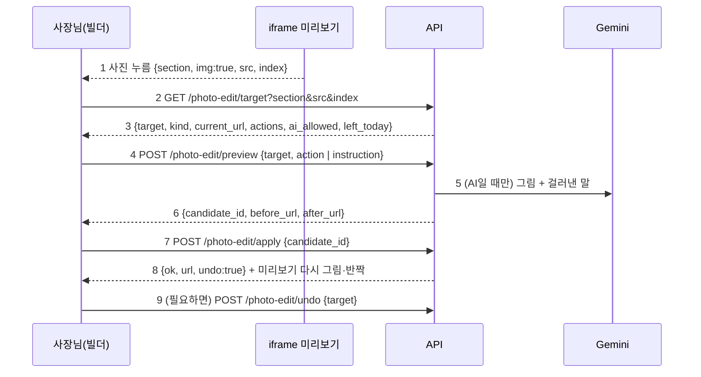

# B6 계약서: 빌더에서 사진 고치기 (PHOTO_EDIT_CONTRACT)

> 2026-09-30 (KST) / Claude 작성, OpenCode 구현. 계획 [BUILDER_PLAN](BUILDER_PLAN.md) §1.6, 결정 D57 ⑤(실제 사진은 보정만), 베타 뒤(10/20~10/24). 선행: [BUILDER_CONTRACT](BUILDER_CONTRACT.md) B1·B2 커밋.
> 재사용: `photos`(사진 저장·`_clean_image`·`url_for`·`_dir`), `ai_images`(`_generate_bytes`의 호출 방식·`_save`·`_record`·쿨다운·"AI 예시 이미지" 배지), W2 미리보기 누름 메시지, B1 후속 처리(시안·공개본 다시 그리기).

## 0. 결론

- 미리보기에서 사진을 누르면 **사진 시트**. 고친 결과는 **후보**로만 만들고, 전·후를 나란히 본 뒤 **"이걸로 쓰기"**를 눌러야 사이트가 바뀐다. 직전 사진으로 **되돌리기** 1단계.
- 사진은 세 종류이고 고치는 방법이 다르다.

| 종류 | 어떻게 알아보나 | 고치는 법 |
|---|---|---|
| 사장님 사진 | `card.photos[*].url`과 같은 주소 | **보정만**(서버 Pillow): 더 밝게·따뜻하게·선명하게·정사각형·가로 4:3 자르기. **내용을 바꾸는 AI 편집 없음**(허위 광고 소지, D57) |
| 가게 AI 사진 | `card.ai_images[slot].url`과 같은 주소 | **AI 고치기**(Gemini: 지금 그림 + 걸러낸 말) + 보정 버튼도 가능 |
| 공용 예시 사진 | `/art/ex/…` 주소 | AI 고치기의 **입력으로만** 쓰고, 결과는 **그 가게 전용 AI 사진**(`card.ai_images[slot]`)으로 저장. 공용 파일은 절대 바꾸지 않는다 |

- AI에는 **그림 + 걸러낸 말**만 보낸다. 가게 이름·전화·주소·가격은 보내지 않는다(D26·D51). 얼굴·사람·글자·간판·로고·상호를 넣어 달라는 말은 거절한다. AI 결과에는 지금처럼 "AI 예시 이미지" 배지.
- 제한: AI 고치기는 칸마다 10분에 1번(지금 생성 쿨다운과 같은 값), 가게당 하루(KST) 10번. 보정은 제한 없음(서버 계산만).

## 1. 흐름

| 번호 | 단계 | 설명 |
|---|---|---|
| 1 | 누름 | B1 편집 스크립트가 사진을 누르면 `src`(img의 src 속성)와 그 구역 안 사진 순서 `index`를 함께 보낸다(§4) |
| 2~3 | 대상 찾기 | 서버가 사진 종류와 **칸(slot)**을 정한다: 첫 화면 → `hero`, 사진첩 구역 → `gallery-1`·`gallery-2`(순서), 메뉴·반·객실 항목 → `item:<이름>`(카드 품목과 alt로 맞춤). 못 정하면 400 "이 사진은 여기서 고칠 수 없어요" |
| 4 | 후보 만들기 | 보정은 즉시(수백 ms), AI는 최대 60초. 후보 파일 `uploads/<방>/cand-<난수>.jpg`, 30분 뒤 무효 |
| 5 | AI | §3. 실패하면 400 "지금은 고칠 수 없어요. 다른 사진을 올리거나 잠시 뒤 다시 해 주세요" |
| 7~8 | 쓰기 | 카드의 그 칸을 후보로 바꾸고(원래 주소는 `prev`로 보관) B1 후속 처리. 공개본이 있으면 공개본도 |
| 9 | 되돌리기 | `prev`로 되돌리고 지운다(1단계) |

## 2. 보정 (`app/services/photo_edit.py`, Pillow만)

| action | 처리 |
|---|---|
| `brighter` | `ImageEnhance.Brightness` 1.15 |
| `warmer` | R ×1.06, B ×0.94 (채널별 point), 넘치면 자름 |
| `sharper` | `ImageEnhance.Sharpness` 1.5 + `Contrast` 1.05 |
| `square` | 가운데 기준 1:1 자르기 |
| `wide` | 가운데 기준 4:3 자르기 |

- 입력 파일은 그 칸의 지금 파일(사장님 사진은 `uploads/<방>/<id>.jpg`). 결과는 `photos._clean_image`와 같은 규칙(RGB·긴 변 1600·JPEG q85·EXIF 없음)으로 저장.
- 사장님 사진에 말(`instruction`)이 오면: 말에서 위 다섯 가지 낱말(밝게·따뜻·선명·정사각·가로)을 찾아 보정으로 바꾸고, 못 찾으면 400 "실제 사진은 밝기·색감·선명도·자르기만 바꿀 수 있어요. 내용을 바꾸려면 AI 예시 사진으로 바꿔 주세요".

## 3. AI 고치기 (`app/services/ai_images.py`에 `edit_bytes(image: bytes, instruction: str, slot: str) -> bytes` 추가)

- 호출은 `_generate_bytes`와 같은 주소·머리글·`imageConfig`(칸 규격), 다만 `parts = [{"inlineData": {"mimeType": "image/jpeg", "data": <b64>}}, {"text": <프롬프트>}]`.
- 프롬프트 = `"Edit this photo. Request (Korean): <걸러낸 말>. Keep it photorealistic and the same place. Do not add any people, faces, text, letters, signs, logos or brand names."`
- 말 거르기(`photo_edit.clean_instruction`): 1~100자, 줄바꿈 제거, 숫자·전화·주소 모양(숫자 4개 이상 연속, `로 \d`, `동 \d`) 제거. 금지 낱말(얼굴·사람·인물·글자·글씨·문구·간판·로고·상호·이름·브랜드·text·logo·face·person)이 있으면 400 "사람·글자·간판·로고는 넣을 수 없어요".
- 결과 저장은 `ai_images._save`와 같은 후처리(1920px·q90), 파일 이름은 후보 규칙(§1-4).
- 퍼널 `ai_image_edited`(`props={"industry", "kind": "hero"|"gallery"|"item", "source": "example"|"ai"}`) — `SERVER_EVENTS` 추가.

## 4. 경로·파일 경계

| 경로 (방장만, 쓰기는 `_check_origin`) | 요청 | 응답 |
|---|---|---|
| `GET /api/rooms/{id}/photo-edit/target` | `section`, `src`, `index` | `{"target": "hero"|"gallery-1"|"item:라떼", "kind": "owner"|"ai"|"example", "current_url", "actions": [...], "ai_allowed": bool, "left_today": n, "cooldown_sec": n}` |
| `POST /api/rooms/{id}/photo-edit/preview` | `{"target", "action"}` 또는 `{"target", "instruction"}` | `{"candidate_id", "before_url", "after_url"}` |
| `POST /api/rooms/{id}/photo-edit/apply` | `{"candidate_id"}` | `{"ok": true, "url", "undo": true}` |
| `POST /api/rooms/{id}/photo-edit/undo` | `{"target"}` | `{"ok": true, "url"}` 또는 400 "되돌릴 게 없어요" |

- **카드에 쓰는 법**: 사장님 사진은 그 `photos` 항목의 `url`을 새 파일로 바꾸고 `prev_url`을 남긴다(사진 id·태그 그대로, 원본 파일은 지우지 않음). AI·예시는 `ai_images[slot] = {"url", "at", "prev_url"}`(`_record` 확장). 공용 예시를 고친 경우 그 칸은 이제 가게 AI 사진이다.
- **하루 제한**: `card["ai_edit_day"] = {"date": KST 날짜, "n": 횟수}`. 쿨다운은 `ai_images[slot].at` 기준(지금 생성과 공유).
- **후보**: `session["photo_candidates"][candidate_id] = {"target", "file", "at"}` — 30분 지난 것은 apply 때 거절, apply·새 preview 때 지난 후보 파일 삭제.
- 편집 스크립트(`site_render._EDIT_SCRIPT`): 사진을 누르면 메시지에 `src`(`getAttribute('src')`)와 `index`(같은 `[data-section-id]` 안 `img` 중 순서)를 더한다.

## 5. 화면 (`frontend/src/builder/PhotoSheet.tsx` 신규)

- 미리보기 누름 메시지에 `img: true`면 구역 패널 대신 사진 시트. `GET target` → 지금 사진 크게.
- 보정 버튼 5개(`actions`). `ai_allowed`면 말 입력 한 줄 + 예시 칩("여름 느낌으로", "배경 흐리게", "더 따뜻한 조명") + "오늘 n번 남았어요". 사장님 사진이면 입력 대신 안내 한 줄("실제 사진은 밝기·색감·자르기만 바꿔요").
- 후보가 오면 **전·후 나란히**(휴대폰은 위·아래), "이걸로 쓰기" / "그대로 두기". 쓰면 미리보기 다시 그림 + 그 구역 반짝 + "되돌리기".
- AI는 기다리는 동안 "사진을 고치는 중이에요(최대 1분)" + 취소(요청 무시).
- "다른 사진 올리기"는 기존 사진 올리기(태그는 칸에 맞춰 `hero`·`space`·`item:<이름>`).

## 6. 작업 묶음 (OpenCode)

| 묶음 | 담당 파일 | 선행 |
|---|---|---|
| P1 서버 | `app/services/photo_edit.py`(신규: 대상 찾기·보정·말 거르기·후보·적용·되돌리기), `app/services/ai_images.py`(`edit_bytes`·`_record` 확장만), `app/api/start.py`(경로 4개), `app/services/site_render.py`(편집 스크립트 `src`·`index`만), `app/services/funnel.py`(사건 1개), `tests/unit/test_photo_edit.py`(신규, Gemini는 가짜) | B1 커밋 |
| P2 화면 | `frontend/src/builder/PhotoSheet.tsx`(신규)·연결, `frontend/src/editor/cardApi.ts`(4개 함수), 테스트 | B2 커밋, §4 모양만 |
| P3 확인 | Claude: 실제 Gemini로 6업종 예시 사진 고치기 1번씩 + 금지 말 거절 확인, 비용 기록, 390px 흐름 캡처 | P1·P2 |

**하지 말 것**: 공용 예시 파일(`templates/art/…`) 수정, 사장님 사진에 AI 내용 편집, AI에 가게 정보 보내기, 원본 파일 삭제, 제한(쿨다운·하루 10번) 우회, 새 의존성.

## 7. 합격 테스트 (`test_photo_edit.py`)

| 번호 | 테스트 |
|---|---|
| 1 | 대상 찾기: 첫 화면 공용 예시 → `hero`·example / 사장님 사진 주소 → owner / 사진첩 두 번째 → `gallery-2` / 메뉴 항목 → `item:<이름>` / 모르는 src 400 |
| 2 | 보정 5종: 결과 크기·비율(정사각 1:1, 가로 4:3), 밝게는 평균 밝기 증가, EXIF 없음, 원본 파일 그대로 |
| 3 | 사장님 사진 + "배경 바꿔 줘" → 400 안내, "좀 밝게" → brighter 보정 |
| 4 | AI 고치기(가짜 Gemini): 요청 본문에 inlineData + 프롬프트, **가게 이름·전화·주소가 본문에 없음**, 결과가 후보로만 저장되고 카드는 그대로 |
| 5 | 금지 말("사람 넣어 줘", "간판에 가게 이름") 400, 숫자·주소 모양은 프롬프트에서 빠짐 |
| 6 | 제한: 같은 칸 10분 안 두 번째 400(남은 분), 하루 11번째 400 |
| 7 | apply: 카드 칸이 후보 주소로, prev 보관, 미리보기 HTML에 새 주소, 공개본이 있으면 공개본도 / 30분 지난 후보 거절 |
| 8 | undo: prev로 되돌림, 두 번째 undo 400 |
| 9 | 공용 예시를 고친 뒤 `templates/art/ex/*` 파일 변화 없음(해시 비교) |
| 10 | 방장 아님 403, 출처 다름 403 |

## 변경 이력

| 날짜 | 내용 |
|---|---|
| 2026-09-30 | 처음 작성 |
