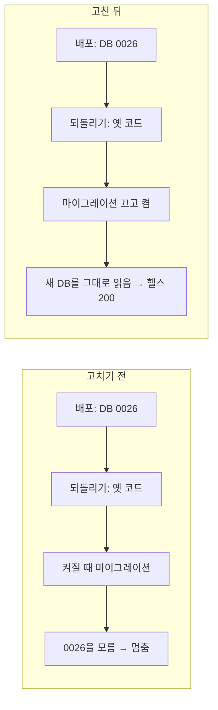
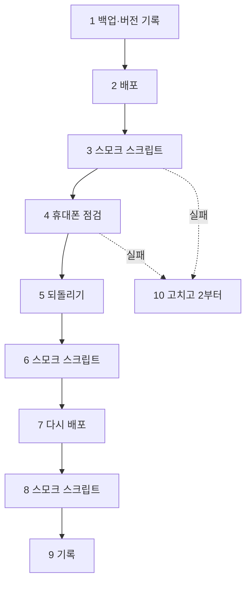

# 10/15 동결·리허설 점검표 (REHEARSAL_1015)

> 2026-10-01 (KST) 작성, 2026-10-10 고침 / Claude. 근거: D47(10/15 배포 동결, 10/17 비공개 베타), [COMMERCE_WAVE5_PLAN](COMMERCE_WAVE5_PLAN.md) 5-8·5-9·Q5, [PREBETA_RUNBOOK](PREBETA_RUNBOOK.md), [DB_OPERATIONS](DB_OPERATIONS.md) §3·§4·§8.
> 동결 뒤에는 버그 수정만 배포한다(D47). 돈·개인정보에 닿는 버그는 동결 중에도 이 절차 그대로 고쳐 배포한다(Q5).

## 0. 결론

- 10/1에 쓴 전제("운영 DB 0019, 새 마이그레이션 없음, 코드만 되돌리면 됨")는 **틀렸다**. main은 이제 마이그레이션 **0026**이고, 운영 DB는 웹 푸시(10/5)가 나갔으니 **0022 이상**이다. 동결 배포에서 0023~0026이 새로 들어간다.
- 백엔드는 켜질 때 마이그레이션을 돈다. 그래서 예전 `rollback.sh`는 옛 코드를 켜자마자 `Can't locate revision '0026'`으로 **멈췄다**(로컬 리허설에서 재현, §5). 되돌리기가 안 되는 상태였다.
- 고침(10/10):
  - `scripts/rollback.sh`는 되돌린 옛 코드를 **마이그레이션 없이** 켠다(`RUN_MIGRATIONS_ON_STARTUP=false`). 다음 배포 때 원래대로 돌아간다.
  - `app/db/migrate.py`는 DB가 코드보다 앞서 있으면 마이그레이션을 건너뛰고 켜면서 ERROR를 남긴다. 다음 동결 배포부터는 이 코드가 되돌릴 대상이 되므로 같은 일이 다시 생기지 않는다.
  - 0020 이후 마이그레이션은 **더하기만** 한다(표·칸·인덱스 추가, 새 칸은 빈 값 허용). 그래서 옛 코드가 새 DB를 그대로 읽는다. `tests/unit/test_migrations_expand_only.py`가 매 커밋 이것을 검사한다([DB_OPERATIONS](DB_OPERATIONS.md) §8).
- 리허설 = 백업 → 배포 → 스모크(스크립트 + 휴대폰) → 되돌리기 → 다시 배포 → 스모크. 10/14에 한 번, 10/15 동결 배포는 같은 순서.
- 스모크 스크립트 `scripts/smoke_prod.py`는 읽기만 하고, 공개 사이트의 "채팅하기"를 **실제로 따라가** 본다(10/1 404 같은 것을 잡는다).



| 번호 | 단계 | 고치기 전 | 고친 뒤 |
|---|---|---|---|
| 1 | 배포 | 새 코드가 DB를 0026으로 올림 | 같음 |
| 2 | 되돌리기 | `docker compose up -d --build backend` | 같은 명령 + `RUN_MIGRATIONS_ON_STARTUP=false` 덧씌움 |
| 3 | 옛 코드 기동 | 마이그레이션 시도 → 실패, 백엔드 멈춤 | 마이그레이션 안 함 |
| 4 | 결과 | 헬스 실패, 사이트 전부 멈춤 | 헬스 200, 새 칸·표는 옛 코드가 안 씀 |

## 1. 동결 전에 정할 것 (대표)

| PR·브랜치 | 내용 | 상태(10/10) |
|---|---|---|
| #8 | 공개 사이트 "채팅하기" 404 (운영 버그) | 병합됨. 배포 뒤 `republish_all.py --apply` |
| #5 | 보관 기간 정리를 하루에 한 번 | 병합됨 |
| #7 | 운영자 텔레그램 알림 | 병합됨. 켜기는 `.env` |
| #6 (`privacy-1001`) | 개인정보처리방침 초안(9/28 뒤 기능) | **병합 안 됨.** 대표 문구 승인 대기. main의 `static/privacy.html`에는 그 뒤 기능(손님 회원·삭제 30일)이 이미 들어가 있으니 승인 때 둘을 맞춘다 |
| `admin-console` (#14) | 관리자 화면 | 병합됨 |
| `group-cards` (#12) | 그룹 카드 | 병합됨(10/1에는 "베타 뒤"였음) |

## 2. 서버 설정(`.env`) 점검

| 값 | 베타 값 | 왜 |
|---|---|---|
| `PUBLIC_BASE_URL` | `https://144.24.91.250.sslip.io` | 채팅·결제·알림 링크(없으면 채팅 링크가 빠진다) |
| `PREVIEW_HOST` | `144-24-91-250.sslip.io` | 공개 사이트를 앱과 다른 주소에서 연다(격리) |
| `PUBLISH_LOGIN_REQUIRED` | `true` | 공개는 로그인한 사장님만 |
| `COMMERCE_PAUSED` | `false` (문제 생기면 `true` + 재시작) | 주문·결제·스탬프 비상 스위치 |
| `ART_LIB_DAILY_CAP` | `0` | 메뉴 태그 사진 하루 상한 없음(D58) |
| `GEMINI_API_KEY` | 있음 | 예시 사진 |
| 카카오 REST 키·Client Secret(키 저장소), `KAKAO_JS_KEY` | 있음 | 로그인·카톡 알림·주소 검색·지도 |
| `TOKEN_ENC_KEY` | 있음(긴 무작위 값) | 키 교체·저장 키 암호화, 손님 회원 기기 기억 쿠키 서명(없으면 매번 인증) |
| `ADMIN_USER_IDS` | 대표 `users.id` (`/api/me`로 확인) | 관리자 화면 |
| `TELEGRAM_BOT_TOKEN`·`TELEGRAM_CHAT_ID` | 있음 | 운영자 알림 (OPS_ALERT_CONTRACT §3) |
| `VAPID_PRIVATE_KEY` (+ `VAPID_SUBJECT` 선택) | 있음 (`scripts/gen_vapid.py`로 한 번 만들고 **바꾸지 않기**) | 사장님 휴대폰 알림. 바꾸면 켜 둔 기기가 모두 꺼진다 |
| `SOLAPI_API_KEY`·`SOLAPI_API_SECRET`·`SMS_SENDER` | 있음(가게 키가 없을 때 쓰는 우리 키) | 주문 문자 인증·손님 회원 인증번호. 없으면 손님 회원 가입이 닫힌다(503) |
| `SMS_DEV_MODE` | `false` | `true`면 문자를 보내지 않고 기록만 한다(운영 금지) |
| `RUN_MIGRATIONS_ON_STARTUP` | 적지 않음(기본 `true`) | 되돌리기 때만 `rollback.sh`가 잠깐 `false`로 덧씌운다. `.env`에 `false`를 적으면 배포해도 DB가 안 올라간다 |

## 3. 리허설 순서 (10/14 추천)



| 번호 | 단계 | 누가 | 명령·방법 | 합격 |
|---|---|---|---|---|
| 1 | 백업·버전 기록 | 대표(서버) | `~/agt001/scripts/backup_db.sh` 그리고 아래 "버전 보기" | 새 `~/agt001-backups/agt001-<시각>.dump`, 지금 코드 커밋·DB 버전을 §5에 적음 |
| 2 | 배포 | Claude | 깨끗한 main에서 `./scripts/deploy.sh --auto-rollback` | 헬스 https·http 둘 다 200, DB 버전 0026 |
| 3 | 스모크 | Claude | `python scripts/smoke_prod.py https://144.24.91.250.sslip.io --site <가게 키>` | 실패 0 |
| 4 | 휴대폰 | 대표 | 아래 §3-3 표 | 모두 됨 |
| 5 | 되돌리기 | Claude | 아래 §3-1 "되돌리기 전 확인" → `scripts/rollback.sh --list` → `scripts/rollback.sh` | 헬스 200, 로그에 마이그레이션 오류 없음, DB 버전 그대로 0026 |
| 6 | 스모크 | Claude | 3과 같음 | 실패 0(되돌린 코드 기준. 새 기능 항목은 ℹ️일 수 있음) |
| 7 | 다시 배포 | Claude | 2와 같음 | 헬스 200, 백엔드 컨테이너가 새로 만들어짐(되돌리기 덧씌움이 빠짐) |
| 8 | 스모크 | Claude | 3과 같음 | 실패 0 |
| 9 | 기록 | Claude | §5 표 | — |
| 10 | 되돌아가기 | Claude | 고치고 PR → 2부터 | — |

### 3-0. 버전 보기 (1·2·5·7단계)

```bash
cd ~/agt001
git log --oneline -1                                   # 지금 서버 코드
sudo docker compose exec -T db psql -U agt001 -d agt001 -tAc "select version_num from alembic_version"   # DB 버전
sudo docker compose logs --since 5m backend | grep -E "마이그레이션|alembic|ERROR" | tail -20
```

### 3-1. 되돌리기 전 확인 (5단계, 동결 배포 뒤 실제로 되돌릴 때도 같음)

| 번호 | 확인 | 왜 | 어떻게 |
|---|---|---|---|
| 1 | 백업이 있다 | DB 복원은 마지막 수단(§3-2) | 1단계 덤프 파일 |
| 2 | 배포 뒤 "지운 프로젝트"가 없다 | 지금 운영 코드에는 '지우기'(10/5)가 없을 수 있다. 그 옛 코드는 `deleted.json`을 모르므로, 배포 뒤 사장님이 지운 사이트가 되돌린 동안 **다시 열린다** | `find ~/agt001/generated -name deleted.json` → 0개면 됨. 있으면 대표와 정함: 되돌리지 않거나, 그 가게를 관리자 화면에서 잠시 내림(다시 배포 뒤 관리자 화면에서 올리기) |
| 3 | 되돌릴 대상이 맞다 | 스냅샷은 배포 직전 코드 | `scripts/rollback.sh --list`의 가장 최근 |

되돌린 동안 생기는 일(운영 코드가 0022까지만 안다고 볼 때. 옛 코드는 새 표·칸을 안 쓰고, 데이터는 지워지지 않는다):

| 마이그레이션 | 더한 것 | 되돌린 동안 |
|---|---|---|
| 0020~0022 | 사용량 장부·방명록·휴대폰 알림 표 | 웹 푸시(10/5)와 함께 운영에 이미 있음(1단계 DB 버전으로 확인). 영향 없음 |
| 0023 | `customers.member_since` 칸 | 손님 회원·'내 정보'가 안 열린다(링크 404). 가입한 손님 기록은 남는다 |
| 0024 | `rooms.deleted_at` 칸 | 지운 프로젝트가 목록에 다시 보이고 30일 청소가 멈춘다(§3-1 2번) |
| 0025 | `archived_transactions` 표 | 거래기록 분리 보관이 멈춘다. 옛 코드는 주문·결제를 지우지 않으니 법정 보관 문제 없음 |
| 0026 | 사용량 종류에 `chat_ai` 허용 | 옛 코드는 쓰지 않는다 |

다시 배포하면(7단계) 새 코드가 그대로 이어 쓴다. DB를 0019·0022로 **내리지 않는다**(내리면 표·칸이 지워져 데이터가 사라진다).

### 3-2. 되돌려도 안 될 때 (마지막 수단)

| 번호 | 상황 | 할 일 |
|---|---|---|
| 1 | 되돌린 옛 코드도 헬스 실패 | `sudo docker compose logs --tail 100 backend`로 원인. 마이그레이션 오류면 `RUN_MIGRATIONS_ON_STARTUP=false` 덧씌움이 빠진 것(`rollback.sh`가 옛 버전인지 확인) |
| 2 | DB가 깨졌다(데이터 문제) | [DB_OPERATIONS](DB_OPERATIONS.md) §4 복원(`pg_restore --clean`). **백업 뒤 들어온 주문·예약·채팅은 사라진다** → 대표 결정 뒤에만 |

### 3-3. 휴대폰 점검 (대표, 실제 가게 하나)

| 번호 | 무엇 | 합격 |
|---|---|---|
| 1 | 빌더 "가게 정보 입력 → 주소 검색"으로 주소 고르기 → 공개 | 빌더 미리보기와 공개 사이트 "오시는 길"에 실제 카카오 지도(빈 상자 아님) |
| 2 | 공개 사이트 "채팅하기" → 질문 → "사장님께 직접 물어보기" | 채팅방에 "손님 문의(채팅)" 한 줄(카톡 알림 켰으면 카톡도) |
| 3 | 채팅방 더보기 → 사장님 화면 → 채팅 탭에서 답 | 몇 초 안에 손님 화면에 답 |
| 4 | 공지에 사진 2장 + 팝업 켜기 | 들어오면 팝업, 사진 옆으로 넘김 |
| 5 | 메뉴 하나 더하기 | 20초쯤 뒤 예시 사진 + "예시 이미지" 표시 |
| 6 | 채팅방 "고칠 게 있어요" → 칩 → 새 내용 | 그 칸만 바뀜 |
| 7 | (주문 켠 가게) 주문 → 문자 인증 → 테스트 결제 | 주문 탭에 결제 완료, 도장 1개 |
| 8 | 예약 신청(예약 봇 또는 양식) | 채팅방·사장님 화면에 예약 |
| 9 | 사장님 화면 → 휴대폰 알림 켜기 → 시험 알림 | 잠금 화면에 "휴대폰 알림이 잘 켜졌어요." 그리고 2번 문의 때 알림 |
| 10 | 빌더 전화번호 칸에 숫자만 입력 | 하이픈이 저절로 들어가고, 공개 사이트 전화 걸기가 맞는 번호 |
| 11 | 빌더 주변 정보(대제목·소제목)·사진 구역(장수·자동 넘김) 고치기 → 공개 | 공개 사이트에 그대로, 주변 사진 손가락으로 옆으로 넘어감 |
| 12 | (회원 켠 가게) 공개 사이트 '내 정보' → 번호 인증 → 가입 | 내 정보에 예약·주문, 사장님 화면 '손님' 탭에 1명 |
| 13 | 내 프로젝트 → 시험용 프로젝트 지우기 → 되살리기 | 지우면 공개 사이트가 바로 닫히고, 되살리면 다시 열림(5단계 전에 **되살려 둔다**, §3-1 2번) |

## 4. 동결 배포(10/15)와 베타 당일(10/17)

| 언제 | 할 일 |
|---|---|
| 10/12 | 여정 테스트(Q2)를 CI 필수로 |
| 10/15 동결 배포 | §3의 1→2→3→4. 그 뒤 버그 수정만 |
| 동결 배포 뒤 한 번 | PREBETA_RUNBOOK: `republish_all.py --apply --geo`(새 채팅하기 링크·지도 반영), `prefill_art_lib.py --apply`(아직이면) |
| 동결 중 버그 수정 배포 | §3 1→2→3. 되돌릴 대상이 10/15 코드라 0026까지 알고, 이번 고침도 들어 있다 |
| 10/17 베타 당일 | 사장님 초대·[BETA_OWNER_GUIDE](BETA_OWNER_GUIDE.md) 전달, 주문·스탬프는 고른 가게만 켜기(Q1), 텔레그램 시험 알림, 관리자 화면 열림 확인 |

## 5. 결과 기록

| 날짜 | 단계 | 결과 | 메모 |
|---|---|---|---|
| 2026-10-01 | 스모크(사이트 없이) | 10개 중 실패 0 | 앱 페이지·로그인 경로·주소 분리 |
| 2026-10-10 | 로컬 리허설(빈 DB, 옛 코드 = `1b535a1` 웹 푸시 커밋, DB 0022) | 1단계 됨 | 옛 코드로 방 만들기·메시지 읽기 |
| 2026-10-10 | 〃 새 코드(main) 배포 | 됨 | DB 0022 → 0026, 옛 방 그대로 읽힘 |
| 2026-10-10 | 〃 되돌리기(고치기 전 방식) | **실패** | 옛 코드 기동 중 `Can't locate revision identified by '0026'` |
| 2026-10-10 | 〃 되돌리기(마이그레이션 끄고) | 됨 | 옛 코드가 0026 DB에서 방·메시지 읽음 |
| 2026-10-10 | 〃 다시 배포 | 됨 | 새 코드, DB 0026 그대로 |
| 2026-10-10 | 〃 DB가 코드보다 앞선 경우(0027로 표시) | 됨 | 새 코드가 ERROR 남기고 켜짐 |
| 2026-10-10 | `rollback.sh` 모의 실행(ssh·sudo·rsync 가짜) | 됨 | 덧씌움 파일로 `RUN_MIGRATIONS_ON_STARTUP=false`, 스냅샷 복원, 임시 파일 지움 |

## 변경 이력

| 날짜 | 내용 |
|---|---|
| 2026-10-01 | 처음 작성 (스모크 스크립트와 함께) |
| 2026-10-10 | 전제 고침(DB 0019 → 0022 이상, 새 마이그레이션 0023~0026). 되돌리기가 멈추던 것 고침(`rollback.sh`·`migrate.py`), 마이그레이션 표·되돌리기 전 확인·마지막 수단, PR 상태, `.env` 4줄, 휴대폰 점검 9~13, 로컬 리허설 결과 |
