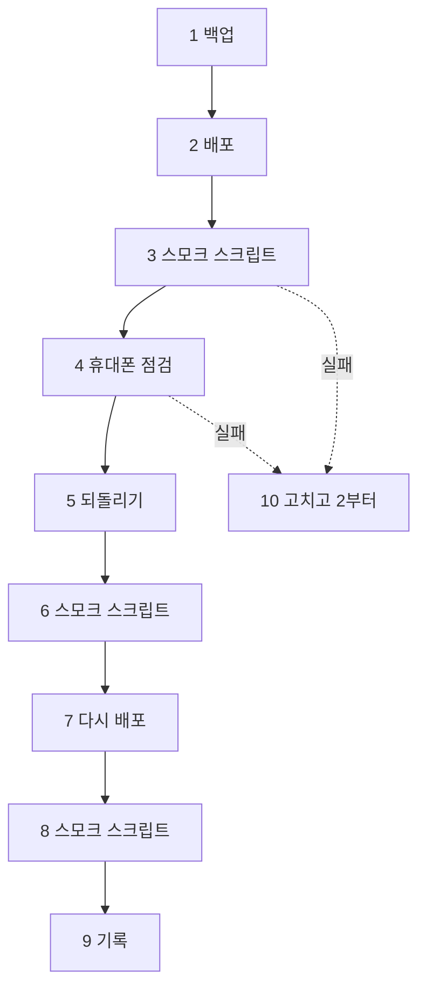

# 10/15 동결·리허설 점검표 (REHEARSAL_1015)

> 2026-10-01 (KST) / Claude. 근거: D47(10/15 배포 동결, 10/17 비공개 베타), [COMMERCE_WAVE5_PLAN](COMMERCE_WAVE5_PLAN.md) 5-8·5-9·Q5, [PREBETA_RUNBOOK](PREBETA_RUNBOOK.md), [DB_OPERATIONS](DB_OPERATIONS.md) §3·§4.
> 동결 뒤에는 버그 수정만 배포한다(D47). 돈·개인정보에 닿는 버그는 동결 중에도 이 절차 그대로 고쳐 배포한다(Q5).

## 0. 결론

- 운영 DB는 이미 마이그레이션 **0019**이고 main에도 새 마이그레이션이 없다. 동결 배포는 **코드만** 바뀌므로 되돌리기는 코드 스냅샷(`scripts/rollback.sh`)으로 된다.
- 리허설 = 백업 → 배포 → 스모크(스크립트 + 휴대폰) → 되돌리기 → 다시 배포 → 스모크. 10/14에 한 번, 10/15 동결 배포는 같은 순서.
- 스모크 스크립트 `scripts/smoke_prod.py`는 읽기만 하고, 공개 사이트의 "채팅하기"를 **실제로 따라가** 본다(10/1 404 같은 것을 잡는다).

## 1. 동결 전에 정할 것 (대표)

| PR·브랜치 | 내용 | 동결 전 병합 |
|---|---|---|
| #8 | 공개 사이트 "채팅하기" 404 (운영 버그) | **지금** — 배포 뒤 `republish_all.py --apply` |
| #5 | 보관 기간 정리를 하루에 한 번 | 예 (추천) |
| #7 | 운영자 텔레그램 알림 | 예 (추천). 켜기는 `.env` |
| #6 | 개인정보처리방침 초안 | 대표 문구 승인 + 보관 기간 Q2 뒤 |
| `admin-console` | 관리자 화면 | `app/main.py` 두 줄 연결(대표) → 테스트 → PR → 예 |
| `group-cards` | 그룹 카드 | **아니오** (베타 뒤) |

## 2. 서버 설정(`.env`) 점검

| 값 | 베타 값 | 왜 |
|---|---|---|
| `PUBLIC_BASE_URL` | `https://144.24.91.250.sslip.io` | 채팅·결제·알림 링크(없으면 채팅 링크가 빠진다) |
| `PREVIEW_HOST` | `144-24-91-250.sslip.io` | 공개 사이트를 앱과 다른 주소에서 연다(격리) |
| `PUBLISH_LOGIN_REQUIRED` | `true` | 공개는 로그인한 사장님만 |
| `COMMERCE_PAUSED` | `false` (문제 생기면 `true` + 재시작) | 주문·결제·스탬프 비상 스위치 |
| `ART_LIB_DAILY_CAP` | `0` | 메뉴 태그 사진 하루 상한 없음(D58) |
| `GEMINI_API_KEY` | 있음 | 예시 사진 |
| 카카오 REST 키·Client Secret(키 저장소), `KAKAO_JS_KEY` | 있음 | 로그인·카톡 알림·주소 검색·지도 |
| `TOKEN_ENC_KEY` | 있음(긴 무작위 값) | 키 교체·저장 키 암호화 |
| `ADMIN_USER_IDS` | 대표 `users.id` (`/api/me`로 확인) | 관리자 화면 |
| `TELEGRAM_BOT_TOKEN`·`TELEGRAM_CHAT_ID` | 있음 | 운영자 알림 (OPS_ALERT_CONTRACT §3) |

## 3. 리허설 순서 (10/14 추천)

| 번호 | 단계 | 누가 | 명령·방법 | 합격 |
|---|---|---|---|---|
| 1 | 백업 | 대표(서버) | `~/agt001/scripts/backup_db.sh` | `~/agt001-backups/agt001-<시각>.dump`가 새로 생김 |
| 2 | 배포 | Claude | 깨끗한 main에서 `./scripts/deploy.sh --auto-rollback` | 헬스 https·http 둘 다 200 |
| 3 | 스모크 | Claude | `python scripts/smoke_prod.py https://144.24.91.250.sslip.io --site <가게 키>` | 실패 0 |
| 4 | 휴대폰 | 대표 | 아래 §3-1 표 | 모두 됨 |
| 5 | 되돌리기 | Claude | `scripts/rollback.sh --list` → `scripts/rollback.sh` | 헬스 200 |
| 6 | 스모크 | Claude | 3과 같음 | 실패 0(되돌린 코드 기준. 새 기능 항목은 ℹ️일 수 있음) |
| 7 | 다시 배포 | Claude | 2와 같음 | 헬스 200 |
| 8 | 스모크 | Claude | 3과 같음 | 실패 0 |
| 9 | 기록 | Claude | §5 표 | — |
| 10 | 되돌아가기 | Claude | 고치고 PR → 2부터 | — |

### 3-1. 휴대폰 점검 (대표, 실제 가게 하나)

| 번호 | 무엇 | 합격 |
|---|---|---|
| 1 | 빌더 "가게 정보 입력 → 주소 검색"으로 주소 고르기 → 공개 | 공개 사이트 "오시는 길"에 실제 카카오 지도 |
| 2 | 공개 사이트 "채팅하기" → 질문 → "사장님께 직접 물어보기" | 채팅방에 "손님 문의(채팅)" 한 줄(카톡 알림 켰으면 카톡도) |
| 3 | 채팅방 더보기 → 사장님 화면 → 채팅 탭에서 답 | 몇 초 안에 손님 화면에 답 |
| 4 | 공지에 사진 2장 + 팝업 켜기 | 들어오면 팝업, 사진 옆으로 넘김 |
| 5 | 메뉴 하나 더하기 | 20초쯤 뒤 예시 사진 + "예시 이미지" 표시 |
| 6 | 채팅방 "고칠 게 있어요" → 칩 → 새 내용 | 그 칸만 바뀜 |
| 7 | (주문 켠 가게) 주문 → 문자 인증 → 테스트 결제 | 주문 탭에 결제 완료, 도장 1개 |
| 8 | 예약 신청(예약 봇 또는 양식) | 채팅방·사장님 화면에 예약 |

## 4. 동결 배포(10/15)와 베타 당일(10/17)

| 언제 | 할 일 |
|---|---|
| 10/15 동결 배포 | §3의 1→2→3→4. 그 뒤 버그 수정만 |
| 동결 배포 뒤 한 번 | PREBETA_RUNBOOK: `republish_all.py --apply --geo`(새 채팅하기 링크·지도 반영), `prefill_art_lib.py --apply`(아직이면) |
| 10/17 베타 당일 | 사장님 초대·[BETA_OWNER_GUIDE](BETA_OWNER_GUIDE.md) 전달, 주문·스탬프는 고른 가게만 켜기(Q1), 텔레그램 시험 알림, 관리자 화면 열림 확인 |

## 5. 결과 기록

| 날짜 | 단계 | 결과 | 메모 |
|---|---|---|---|
| 2026-10-01 | 스모크(사이트 없이) | 10개 중 실패 0 | 앱 페이지·로그인 경로·주소 분리 |

## 변경 이력

| 날짜 | 내용 |
|---|---|
| 2026-10-01 | 처음 작성 (스모크 스크립트와 함께) |
