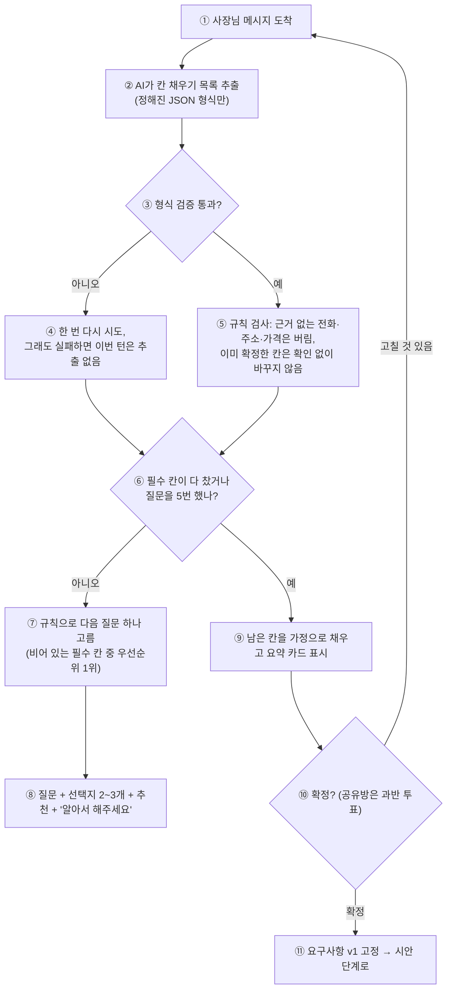
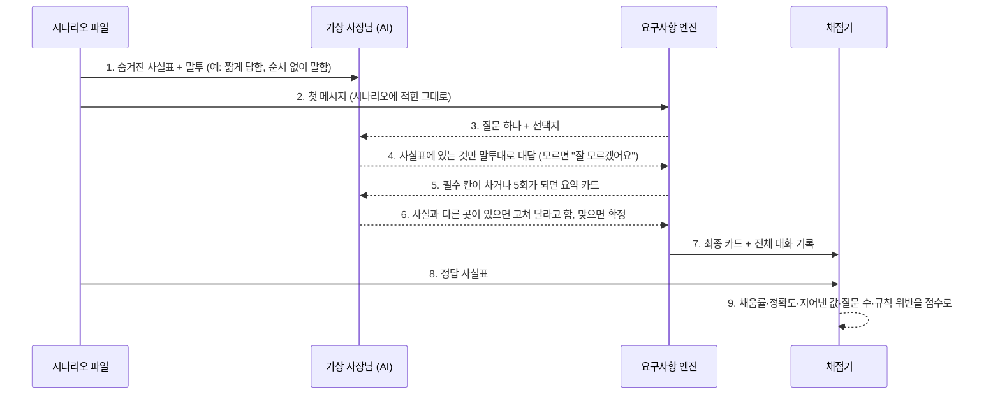

# 요구사항 엔진 (P-1) — 설계와 테스트 계획

> 작성일: 2026-09-25 / 상위: [PRODUCT_ROADMAP.md](PRODUCT_ROADMAP.md) 2단계, [DESIGN_PIPELINE_PLAN.md](DESIGN_PIPELINE_PLAN.md) §13.6 P-1
> **v2 (2026-09-26): 조사([research/REQUIREMENTS_ENGINE_RESEARCH.md](research/REQUIREMENTS_ENGINE_RESEARCH.md))와 인터뷰 결정(DECISIONS.md D20~D28) 반영. §7이 앞 절과 다르면 §7을 따른다.**
> 근거: 초기 개발 때 정리한 [PRD_REQUIREMENTS_ELICITATION.md](../hackathon/PRD_REQUIREMENTS_ELICITATION.md) (REQ-ELICIT-001~024)의 골격을 실서비스 기준으로 다시 짠다.

## 0. 현재 상태 (2026-09-25 실측)

| 항목 | 상태 |
|---|---|
| 동작 | 요청 한 줄을 받아 "이렇게 이해했어요"로 되짚은 뒤 바로 견적 승인으로 넘어간다. **되묻는 질문이 없다** |
| 저장 | `sessions.last_request`에 원문 한 줄만 저장. 가게 이름·연락처·섹션 같은 구조 정보가 없다 |
| 제작 연결 | 코드생성에 원문 한 줄(최대 800자)만 넘어간다 |
| 테스트 | 대화 상태가 순서대로 넘어가는지만 검사한다. **요구사항을 잘 뽑는지 재는 테스트는 없다** |

## 1. 목표와 원칙

**목표:** 사장님이 순서 없이 몇 마디 하면, 사이트를 만드는 데 필요한 정보가 빠짐없이 정리되고, 사장님이 그 정리본을 보고 확정한다.

1. **추출은 AI, 질문 고르기는 규칙.** AI는 대화에서 칸을 채우는 일만 한다(정해진 JSON 형식). 무엇을 되물을지는 칸의 우선순위 규칙으로 정한다. 규칙이면 결과를 예측하고 테스트할 수 있다.
2. **한 번에 하나만, 선택지와 함께.** 한 턴에 질문 하나. 선택지 2~3개 + 추천 + "알아서 해주세요".
3. **모양은 묻지 않는다.** 색·분위기·배치는 시안 단계에서 보여주고 고르게 한다(DESIGN_PIPELINE_PLAN.md 원칙 1). 요구사항 엔진은 **무엇을 담을지**만 다룬다.
4. **지어내지 않는다.** 사장님이 말하지 않은 사실(전화번호, 가격, 주소)을 채우지 않는다. 기본값으로 채운 칸은 "가정"으로 표시하고 확정 때 따로 보여준다.
5. **질문은 최대 5번.** 그 뒤에는 남은 칸을 가정으로 채운 요약을 보여주고 확정을 받는다. 바쁜 사장님을 붙잡지 않는다.

## 2. 요구사항 카드 (칸)

| 칸 | 예 | 필수 | 누가 채우나 |
|---|---|---|---|
| 업종 | 펜션, 카페 | ✓ | 추출 (템플릿으로 시작하면 미리 채움) |
| 가게 이름 | 바다정원 펜션 | ✓ | 추출. 없으면 질문 |
| 사이트 목적 | 예약 문의 늘리기 / 가게 알리기 / 메뉴·가격 안내 | ✓ | 추출. 없으면 질문(선택지) |
| 담을 내용(섹션) | 객실, 바비큐, 주변 안내, 오시는 길 | ✓ 3개 이상 | 추출 + 업종 기본값 제안 |
| 연락 방법 | 전화 / 카카오톡 채널 / 외부 예약 링크 | ✓ 하나 이상 | 추출. 번호·주소 원문은 사장님이 말한 것만 |
| 영업시간 | 매일 10~21시 | 업종에 따라 | 추출. 모르면 "나중에 넣기"로 둘 수 있음 |
| 위치 | 강릉시 ○○ | 업종에 따라 | 추출 |
| 사진 | 객실 사진 있음 / 없음 | — | 추출. 사진 업로드(4단계)와 연결 |
| 꼭 넣을 것·빼고 싶은 것 | "가격은 빼주세요" | — | 추출 |
| 기타 요청 | 자유 서술 | — | 추출 |

- 칸마다 상태를 둔다: `비어 있음` / `채움`(사장님이 말함) / `가정`(기본값) / `확정`.
- 채운 칸에는 근거가 된 메시지 순번을 붙인다. 확정 카드에서 "이 내용은 3번째 메시지에서 가져왔어요"를 보여줄 수 있고, 테스트에서 지어낸 값인지 검사할 수 있다.
- 형식은 JSON 스키마로 고정하고 버전을 붙인다(`prd_versions`).

## 3. 한 턴의 처리

| 번호 | 설명 |
|---|---|
| ① | 사장님(공유방이면 참여자 누구든)이 메시지를 보낸다 |
| ② | AI가 대화에서 칸을 채우는 목록을 뽑는다. 문장을 쓰지 않고 정해진 형식의 값만 낸다 |
| ③ | 서버가 형식을 검사한다 |
| ④ | 형식이 틀리면 한 번만 다시 시도한다. 그래도 틀리면 이번 턴은 칸을 바꾸지 않고 질문만 이어 간다(대화가 멈추지 않게) |
| ⑤ | 규칙 검사를 한다. 사장님 메시지에 없는 전화번호·주소·가격은 버린다(지어내기 차단). 확정한 칸을 바꾸려 하면 먼저 확인을 받는다 |
| ⑥ | 필수 칸이 다 찼는지, 질문을 5번 했는지 본다 |
| ⑦ | 비어 있는 필수 칸 중 우선순위가 가장 높은 것 하나를 규칙으로 고른다. 업종마다 우선순위가 다르다(펜션은 연락 방법, 학원은 상담 방법이 먼저) |
| ⑧ | 질문 하나와 선택지, 추천, "알아서 해주세요"를 보여준다 |
| ⑨ | 남은 칸을 업종 기본값으로 채우고 "가정"으로 표시한 요약 카드를 보여준다 |
| ⑩ | 사장님이 확정하거나 고칠 것을 말한다. 공유방이면 과반 투표 |
| ⑪ | 요구사항 1판을 고정하고 시안 단계로 넘어간다 |

**공유방:** 질문은 방 전체에 한다. 두 사람이 다른 답을 하면 두 답을 나란히 보여주고 투표로 정한다. "알아서 해주세요"도 한 사람이 누르면 되돌릴 수 있게 표시만 한다.

**견적:** 베타 기간에는 참고 견적(D13)을 확정 뒤 한 줄로만 보여준다. 확정의 조건이 아니다.

## 4. 테스트 계획 (가장 중요)

"대화가 넘어가는가"가 아니라 **"사장님이 말한 것을 빠짐없이, 지어내지 않고, 적은 질문으로 정리하는가"**를 잰다. 네 층으로 나눈다.

| 층 | 무엇을 | 어떻게 | 언제 |
|---|---|---|---|
| T1 규칙 | 질문 고르기, 5회 상한, 지어낸 값 버리기, 확정 칸 보호, 공유방 충돌 처리 | 가짜 AI로 결정적 단위 테스트 | CI, 매 커밋 |
| T2 추출 | AI가 정해진 형식으로 칸을 채우는지. 형식 깨짐·빈 응답·엉뚱한 칸 처리 | 발화 60개 × 기대 칸 목록. 실제 AI 응답을 녹화해 두고 CI에서는 녹화본으로, 주 1회 실제 호출로 다시 녹화 | CI(녹화본), 주 1회(실제) |
| T3 대화 시뮬레이션 | 끝까지 대화했을 때 결과 카드의 품질 | **가상 사장님**(AI)이 숨겨진 사실표만 보고 대답하고, 엔진과 끝까지 대화. 결과 카드를 사실표와 비교해 점수화 | 엔진을 바꿀 때마다, 배포 전 필수 |
| T4 실제 사용 | 실제 방에서 확정까지 가는지 | 퍼널 지표(`request_submitted` → `requirement_approved`), 확정까지 턴 수, 질문별 이탈 | 운영 중 상시 |

### 4.1 대화 시뮬레이션 (T3)

| 번호 | 설명 |
|---|---|
| 1 | 시나리오 파일에는 가게의 숨겨진 사실(이름, 연락처, 원하는 섹션 등)과 말투가 적혀 있다. 가상 사장님만 이것을 본다 |
| 2 | 엔진에는 시나리오의 첫 메시지만 들어간다(실제 사장님처럼 불완전하게) |
| 3 | 엔진이 질문을 한다 |
| 4 | 가상 사장님은 사실표에 있는 것만 정해진 말투로 대답한다. 사실표에 없으면 "잘 모르겠어요"라고 한다 |
| 5 | 엔진이 요약 카드를 보여준다 |
| 6 | 가상 사장님이 카드를 사실표와 비교해 틀린 곳을 고쳐 달라고 하거나 확정한다 |
| 7 | 엔진의 최종 카드와 대화 기록을 채점기로 보낸다 |
| 8 | 채점기는 정답 사실표를 따로 받는다 |
| 9 | 아래 지표로 점수를 낸다 |

**시나리오 묶음 (36개):** 업종 6개(펜션·카페·식당·미용실·공방·학원) × 사장님 유형 6가지.

| 유형 | 특징 | 확인하려는 것 |
|---|---|---|
| 말 많은 사장님 | 첫 메시지에 거의 다 말함 | 질문을 줄이는가(이미 말한 것을 또 묻지 않는가) |
| 짧게 답하는 사장님 | "네", "전화요" | 선택지로 끌어내는가 |
| 순서 없이 말하는 사장님 | 영업시간을 먼저, 이름을 나중에 | 알맞은 칸에 넣는가 |
| "알아서 해줘" | 대부분 맡김 | 가정으로 채우고 표시하는가, 지어내지 않는가 |
| 도중에 바꾸는 사장님 | "아 바비큐는 빼주세요" | 칸을 고치고 이전 값을 남기지 않는가 |
| 공유방 두 사람 | 연락 방법에서 의견이 갈림 | 두 답을 나란히 보여주고 투표로 넘기는가 |

**지표와 합격선 (배포 전 필수):**

| 지표 | 정의 | 합격선 |
|---|---|---|
| 필수 칸 채움률 | 확정 카드에서 사실표의 필수 사실이 채워진 비율 | 95% 이상 |
| 정확도 | 채운 값이 사실표와 일치하는 비율 | 95% 이상 |
| **지어낸 값** | 사실표에도 대화에도 없는데 "채움"으로 들어간 값의 수 | **0개** (전화·주소·가격은 1건만 나와도 불합격) |
| 질문 수 | 확정까지 엔진이 한 질문 수 | 평균 3회 이하, 최대 5회 |
| 중복 질문 | 이미 말한 것을 다시 묻기 | 0회 |
| 규칙 위반 | 한 턴 질문 2개 이상, 선택지 없는 질문, 모양(색·분위기) 질문 | 0회 |

- 가상 사장님과 채점기는 엔진과 다른 모델(또는 다른 설정)을 쓴다. 같은 모델이면 서로 맞춰 줘서 점수가 부풀 수 있다.
- 결과는 `docs/product/evals/<날짜>.md`에 표로 남기고, 이전 결과보다 떨어지면 배포하지 않는다.
- AI 호출 비용: 36개 × 약 12번 호출 ≈ 430번. NIM 사용량 한도 안에서 도는지 첫 실행 때 잰다(확인 필요).

## 5. 데이터

| 테이블·열 | 내용 |
|---|---|
| `sessions.prd_draft` (JSONB) | 작업 중인 카드(칸·상태·근거 순번), 질문 횟수 |
| `prd_versions` | 확정본: 판 번호, 카드 JSON, 확정 방식(단독·투표), 확정 시각 |
| `funnel_events` | `prd_question_asked`, `prd_confirmed` 추가 (개인정보 없음) |

기존 PostgreSQL 안이며 추가 비용이 없다.

## 6. 작업 순서

| WP | 내용 | 담당 | 의존 |
|---|---|---|---|
| P-1a | 카드 스키마(JSON) + 업종별 우선순위·기본값·질문 문구표 | Claude | — |
| P-1b | 시나리오 36개(사실표·말투·첫 메시지) 작성 | OpenCode → Claude 검토 | P-1a |
| P-1c | 엔진: 추출(NIM, 형식 검증·재시도) + 규칙(질문 고르기·지어내기 차단·확정 칸 보호) + 상태머신 연결 | Claude | P-1a |
| P-1d | T1 규칙 테스트 + T2 추출 녹화 테스트 | Claude + OpenCode | P-1c |
| P-1e | T3 시뮬레이션 실행기·채점기 + 첫 성적표 | Claude | P-1b, P-1c |
| P-1f | 요구사항 카드 화면 (채팅방 옆, 휴대폰은 탭). 채팅방 React 이전과 함께 | Claude + OpenCode(화면) | P-1c, R-2/R-3 이전 |
| P-1g | 확정 게이트(공유방 투표), `prd_versions`, 퍼널 이벤트 | Claude | P-1c |

P-1a~P-1e는 화면 없이 서버와 테스트만으로 진행한다. 성적표가 합격선을 넘은 뒤 화면(P-1f)을 붙인다.

## 7. v2 변경 (조사 + 인터뷰 결정)

| 항목 | v1 초안 | v2 확정 | 근거 |
|---|---|---|---|
| 질문 상한 | 5회 | **8회** + 진행 표시 + 언제든 "나머지는 알아서, 시안 먼저" | D20 |
| 숨은 항목 | 없음 | 업종별 숨은 항목 목록(5개 안팎)을 **여러 개 고르기 질문 한 번**으로 | D21, 조사 #5 |
| 질문 고르기 | 고정 우선순위 | 첫 메시지로 칸 점수 → 턴마다 재계산 → "필요 없어요" 영역 제외 | 조사 #3 |
| 질문 모양 | 한 가지 | 언급만 된 것은 확인형, 일부만 말한 것은 구체화형 | 조사 #4 |
| 선택지 | 2~3 + 추천 + 알아서 | 합계 4개 이하, 자유 입력 항상 | 조사 #9 |
| 추출 | JSON 형식 검증 | NIM `guided_json`으로 스키마 강제 + 검증(모델 지원 여부 확인 필요) | 조사 #10 |
| 확정 | 요구사항 확정 → 시안 | **시안과 함께 한 번 확정.** 카드는 시안 옆 | D22 |
| 모르는 사실 | 가정 표시 | 전화·주소·가격 등은 **자리 표시**, 공개 전 필수 | D23 |
| 공유방 | 방 전체에 질문, 충돌 시 투표 | + 사실은 방장 확인 | D24 |
| 견적 | 확정 뒤 한 줄(AI) | 완성 후 한 줄, **규칙 계산**(섹션 수·기능) | D25 |
| 템플릿 시작 | 업종 미리 채움 | 업종·구성만 가정, 가게 사실은 비움 | D26 |
| 완성 후 수정 | 범위 밖 | 직접 편집(명세 값) + 구조·분위기는 채팅 | D27 |
| 평가 | 가상 사장님 + 채점 | NIM 다른 모델, 엔진 변경·배포 전. 가상 사장님 기본은 수동 응답(묻지 않으면 말하지 않음). 성적표에 IRE·TKQR 추가 | D28, 조사 §2·§3 |
| 근거 없는 대상·기능 (E2) | 없음 | required도 아니고 물어본 칸도 아닌 target·features는 대화에 근거가 있을 때만 채운다 | T3 r3·N-3 |
| 메뉴·가격 뭉침 (E2) | 마지막 값 덮어쓰기 | 추출이 메뉴·가격을 뭉치면 규칙으로 분리하고, 같은 턴 가격은 하나로 합친다 | T3 r3·N-2 |

### 7.1 필수 칸과 숨은 항목 (업종별, P-1a에서 확정)

| 업종 | 필수 칸 (업종·이름·목적·담을 내용·연락 방법 공통 +) | 숨은 항목 후보 (여러 개 고르기) |
|---|---|---|
| 펜션·숙박 | 객실 구성, 체크인·아웃 | 주차, 반려동물, 바비큐·취사, 픽업, 장기 숙박 할인 |
| 카페 | 영업시간, 대표 메뉴 | 주차, 반려동물, 콘센트·와이파이, 단체석, 예약 |
| 식당 | 영업시간, 메뉴·가격 | 주차, 단체 예약, 포장·배달, 아이 의자, 휠체어 |
| 미용실 | 시술 메뉴·가격, 예약 방법 | 디자이너 지정, 주차, 당일 예약, 남성 전용 메뉴 |
| 공방 | 수업 종류, 신청 방법 | 준비물, 주차, 단체·기업 수업, 완성품 배송 |
| 학원 | 대상·반 구성, 상담 방법 | 차량 운행, 체험 수업, 보강, 형제 할인 |

### 7.2 한 턴 순서 (v2)

1. 추출(`guided_json`) → 2. 규칙 검사(근거 없는 사실 버림, 확정 칸 보호, 공유방 사실은 방장 확인 대기) → 3. 칸 점수 재계산 → 4. 필수 칸이 다 찼거나 8회면 시안 단계로(남은 칸은 가정·자리 표시) → 5. 아니면 최고 점수 칸 하나를 확인형/구체화형으로 질문(숨은 항목은 여러 개 고르기 1회).
