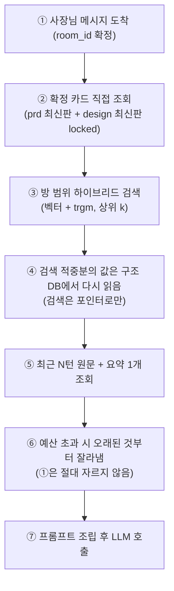
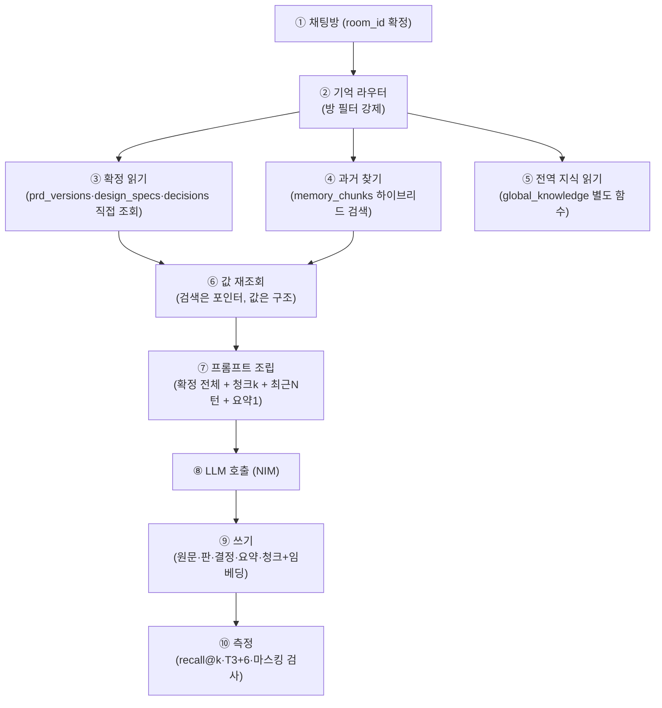

# 사장님 요구사항 지속 관리(RAG/기억) 설계 검토

> 작성일: 2026-09-25 / 검토자: M (agt001 AI 설계 검토자)
> 읽은 것: `REQUIREMENTS_ENGINE_PLAN.md`(P-1), `DESIGN_PIPELINE_PLAN.md`(§5·§13), `DECISIONS.md`,
> `app/services/rag.py`, `app/llm.py`, `app/config.py`, `app/db/models.py`, `DB_OPERATIONS.md`, `PRODUCT_ROADMAP.md`, `COST_MONITORING.md`
> 전제: 코드 수정 없음. 이 문서 1개만 산출.

## 0. 한 줄 결론

| 항목 | 결론 |
|---|---|
| 핵심 원칙 | **"확정된 사실은 검색이 아니라 구조 데이터에서 가져온다"에 동의.** RAG(의미 검색)는 과거 맥락을 "찾는" 보조 수단으로만 쓴다 |
| 검색 방식 | **pgvector(기존 PostgreSQL 16 확장) + pg_trgm 보조.** 별도 벡터 DB 없음 |
| 범위 | 모든 기억 행에 `room_id` 필수, 쿼리 단에서 강제 필터. 업종 공통 지식은 별도 모음으로 분리 |
| 시기 | **구조 데이터(카드 판·결정 기록·요약)는 P-1과 함께 지금. 벡터 검색은 나중에(P-6 이후).** 이유는 §7 |
| 월 비용 | 추가 $0 (pgvector·pg_trgm은 기존 DB 확장, NIM 임베딩은 수만 토큰 수준이라 무시 가능) |

---

## 1. 저장해야 할 정보 — (a) 구조 DB / (b) 임베딩 / (c) 둘 다 판정

### 1.1 판정표

| # | 정보 | (a) 구조 DB 그대로 조회 | (b) 임베딩 의미 검색 | 판정 | 이유 |
|---|---|---|---|---|---|
| 1 | 대화 원문(`room_messages`) | ○ (이미 있음, `room_id`+`seq`) | ○ 마스킹 후 | **(c) 둘 다** | 원문은 진실의 원천(근거 순번). 임베딩용은 전화·주소 마스킹한 복사본만(§6) |
| 2 | 요구사항 카드 판(`prd_versions`) | ○ JSON 통째 + 버전 | ✕ | **(a)** | 확정값이다. 검색 유사도로 가져오면 "비슷하지만 다른 판"을 가져올 위험. `based_on` 체인으로 직접 조회 |
| 3 | 디자인 명세 판(`design_specs`) | ○ JSON 통째 + 버전 | ✕ (설명문만 예외, #4) | **(a)** | #2와 동일. `locked` 값은 구조 조회가 아니면 보호(§5 규칙)를 강제할 수 없음 |
| 4 | 수정 요청과 결과(`design_feedback`) | ○ (섹션ID·원문·수정목록·결과버전) | ○ 원문만 | **(c) 둘 다** | "저번에 사진 크게 해달라고 했는데" 같은 재요청을 찾을 때 의미 검색이 유효. 결과 버전은 구조에서 |
| 5 | 결정 기록(무엇·왜·누가·투표) | ○ 전용 테이블(§7) | ○ 이유(`reason`) 텍스트만 | **(c) 둘 다** | "왜 바비큐를 뺐지?"는 이유 텍스트 검색으로 찾고, 결정 본문(무엇·투표 결과)은 구조에서 그대로 인용 |
| 6 | 사진 설명(캡션·용도) | ○ (`attachments` 메타 + 용도) | ○ 캡션만 | **(c) 둘 다** | "사장님 얼굴 사진" 같은 용도 회상에 검색이 유효. 파일 자체는 임베딩 금지 |
| 7 | 배포 기록(언제·무엇을·어디에) | ○ 전용 테이블 | ✕ | **(a)** | 사실(버전·URL·시각)이다. 의미 검색으로 찾을 이유가 없고, 틀리면 치명적 |

### 1.2 핵심 원칙 판정: "확정된 사실은 검색이 아니라 구조 데이터에서 가져온다"

| 입장 | 근거 |
|---|---|
| **동의 (채택)** | ① 확정값은 정확히 일치해야지 "비슷"하면 안 된다. 임베딩 top-k는 순서가 뒤집힐 수 있고, 임계값 아래면 누락된다. ② P-1 §3 ⑤(확정 칸 보호), DESIGN §5 `locked`는 서버 규칙인데, 규칙 입력이 검색 결과면 규칙 자체가 비결정적이 된다. ③ 테스트가 가능해진다: 구조 조회는 단위 테스트, 검색은 재현율 테스트(§5)로 분리. ④ 디버깅: "왜 이 값을 썼나"에 답이 `prd_versions.v3` 한 줄이면 되는데, 검색이면 매번 다르다 |
| 반대 의견 검토(기각) | "전부 임베딩하면 스키마 변경이 필요 없다" — 초기에는 빠르나, 몇 주 뒤 수정 요청에서 확정값을 뒤집을 확률이 올라가고, 뒤집혔을 때 원인 추적이 불가. 공유방 투표 결과 같은 관계형 사실을 벡터로 표현할 수 없음 |
| 예외(검색을 1순위로 써도 되는 것) | 확정 전의 탐색("예전에 비슷한 고민을 한 적 있나"), 이유 회상("왜 그랬더라"), 사진 용도 회상. 단, 찾아낸 후보의 **값 자체는 구조 DB에서 다시 읽어** 프롬프트에 넣는다(검색은 포인터, 값은 구조) |

---

## 2. 검색 방식 비교 (OCI 1대·무료 한도·운영 부담 기준)

### 2.1 후보 비교표

| # | 방식 | 월 비용 | 운영 부담 | 한국어 품질 | 수만~수십만 벡터 성능 | 판정 |
|---|---|---|---|---|---|---|
| 1 | **pgvector (기존 PG 16 확장)** | $0 (확장만 설치) | 낮음 (백업·모니터링 기존 절차 그대로, `DB_OPERATIONS.md`) | 임베딩 모델에 의존(아래) | 충분 (단일 노드 수백만 벡터까지 실용, 출처: TigerData·Qdrant 블로그 벤치) | **채택** |
| 2 | 별도 벡터 DB (Qdrant·Chroma 자가호스팅) | $0 (같은 OCI에 컨테이너)이나 메모리 경쟁 | 높음 (컨테이너 1개 추가, 백업·업그레이드·동기화 버그 별도. 현재 A1 2OCPU/12GB의 절반 사용 중) | 동일(모델 의존) + 필터 검색이 빠름 | pgvector보다 빠름(대규모·고동시에서) | **기각 (지금은)**. 수백만 벡터·고동시가 되면 재검토 |
| 3 | 관리형 벡터 DB (Qdrant Cloud·Pinecone 등) | 무료 티어 있음(Qdrant Cloud 무료 티어 존재)이나 벤더 추가·API키·데이터 외부 반출 | 중간 (운영은 맡기나 가게 정보가 외부로 나감. DESIGN §13.1의 "외부 반출 금지" 원칙과 충돌) | — | — | **기각.** 개인정보·가게정보 외부 저장 + D2(도메인 보류) 상태의 sslip.io 환경에서 경계 관리 불가 |
| 4 | 전문 검색 (tsvector·pg_trgm) 단독 | $0 | 낮음 | 한국어 형태소 미지원이 약점(아래) | — | **단독 기각, 보조로 채택** |
| 5 | **하이브리드: pgvector + pg_trgm** | $0 | 낮음 | 의미(벡터) + 정확 문자열(trgm) 상호 보완 | 현재 규모(방당 수백 메시지, §7 추산)에 충분 | **채택** |

### 2.2 한국어 처리

| 항목 | 내용 |
|---|---|
| tsvector 기본형 | 한국어 형태소 분석 없이 공백·기호 기준 토큰화라 "영업시간"/"영업 시간" 같은 변형에 약함. 한국어용 파서(예: mecab-ko 기반 `textsearch_ko`)는 별도 설치·사전 관리가 필요해 OCI 1대 운영 부담이 큼 → **도입하지 않는다** |
| pg_trgm 역할 | 형태소 없이 부분일치·오타에 강함. 전화번호·가게명·"바비큐" 같은 **정확 문자열 회상**을 담당. 한국어 추가 설치 없이 `pg_trgm` 확장만으로 동작(표준 contrib) |
| 역할 분담 | 의미 유사("가격 얘기한 적 있나") → 벡터. 정확한 단어·번호("010-XXXX가 맞나") → trgm + 구조 DB. 둘을 합쳐 순위를 매김(간단한 가중합으로 시작, §7 WP-R5) |

### 2.3 임베딩 모델 (nemotron-3-embed-1b)

| 항목 | 내용 |
|---|---|
| 확인된 사실 | 34개 언어 평가에 **한국어 포함**. 동급 크기 SOTA 주장(RTEB 72.38, MMTEB Retrieval 71.05, NDCG@10). 차원 2048, 최대 32,768 토큰. NIM 서버리스 요금 $0.01/1M 토큰 표기. 출처: https://build.nvidia.com/nvidia/nemotron-3-embed-1b , https://docs.api.nvidia.com/nim/reference/nvidia-nemotron-3-embed-1b , https://huggingface.co/blog/nvidia/nemotron-3-embed-wins-rteb |
| 확인 필요 | **언어별(한국어 단독) 점수 미확인.** 벤치 평균만 공개돼 있고 한국어 NDCG@10 단독 수치는 모델카드·MTEB 리더보드에서 찾지 못함. 출처: https://leaderboard.mteb.org/models/nvidia/Nemotron-3-Embed-1B-BF16 (점수 로딩 미확인). → WP-R0에서 한국어 질문-정답 30쌍으로 직접 잰다(§5) |
| 대안 (교체 가능성만 확보, 지금 교체 아님) | `multilingual-e5-large-instruct`, `Qwen3-Embedding` 계열이 한국어 포함 다국어 강자로 알려짐. 단, NIM 제공 여부·요금은 **확인 필요** (NIM 카탈로그에서 `qwen3-embedding`·`e5` 제공 여부 미확인). `app/llm.py`가 단일 진입점이라 교체는 모델명 변경 수준 — 교체가 필요해지면 그때 실측 비교 |
| 현재 코드의 문제 | `app/services/rag.py`는 해커톤용 가짜 문서 3개 + 임계값 0.70 하드코딩(`config.py` 실측 주석). 실데이터 연결 시 이 파일은 폐기하고 §7 스키마로 교체. 임계값은 WP-R0 실측으로 다시 정함 |

---

## 3. 범위와 격리 — "그 프로젝트(방) 안에서만"

### 3.1 원칙

| # | 규칙 | 방법 |
|---|---|---|
| 1 | 모든 기억 행은 `room_id` 필수 (NULL 금지) | 스키마 `NOT NULL` + FK. 방 = 프로젝트 단위(현재 `rooms.session_id` unique 1:1이므로 `room_id` 하나로 충분) |
| 2 | 벡터 검색 함수는 `room_id`를 필수 인자로 받고, SQL `WHERE room_id = %s`를 항상 포함 | 애플리케이션 옵션이 아니라 함수 시그니처로 강제. `room_id` 없이 호출되는 검색 API를 만들지 않는다 |
| 3 | 업종 공통 지식(업종 기본값·좋은 사례)은 별도 모음으로 분리 | `room_id IS NULL`이 아니라 **별도 테이블**(`global_knowledge`, §7)에 두고 **별도 함수**로만 조회. 두 모음을 합치는 쿼리를 금지(실수로 섞이는 것을 구조적으로 차단) |
| 4 | 공유방 참여자 표시는 닉네임만 | `member_id` 원값·식별자는 검색 결과·프롬프트에 넣지 않는다. "누가"는 `room_messages.nickname` + `decisions.decided_by_nickname`으로만 |

### 3.2 격리 테스트 방법

| # | 테스트 | 층 | 합격선 |
|---|---|---|---|
| 1 | 오염 방 2개(A펜션·B카페)에 서로 다른 영업시간을 넣고, A에서 "영업시간 알려줘" 검색 시 B의 값이 0건 | CI 단위·통합 | B 행 혼입 0건 (top-k=10에서도) |
| 2 | `room_id` 인자 없이 검색 함수 호출 시 예외 발생(타입·런타임) | CI 단위 | 호출 불가 확인 |
| 3 | 전역 지식 함수와 방 기억 함수의 결과 합집합 테스트: 방 쿼리에 전역 행이 섞이지 않음 | CI 통합 | 혼입 0건 |
| 4 | 삭제된 방의 벡터가 검색에 안 나옴(하드 삭제 + 인덱스) | 주 1회 | 0건 |

---

## 4. 기억을 AI에 넣는 방법 (매 턴 프롬프트 구성)

### 4.1 매 턴 구성표 (우선순위 순, 위가 먼저)

| 순서 | 넣는 것 | 출처 | 예산 |
|---|---|---|---|
| 1 | 시스템 지시 + 현재 확정 카드 전체(요구사항 최신 판 + 디자인 최신 판의 `locked` 값) | 구조 DB 직접 조회 | 카드 전체 (수 KB. 잘라내지 않는다 — 잘라내면 확정 뒤집기의 원인이 됨) |
| 2 | 이번 턴과 직접 관련된 과거 대화 k개 (검색 상위) | 하이브리드 검색 (§2.1 #5), 방 범위 | k=3~5개, 개당 500자 상한 |
| 3 | 관련 결정 기록 1~2개 (무엇·왜·누가·투표) | 구조 DB (검색은 포인터로만 사용) | 개당 300자 상한 |
| 4 | 최근 대화 원문 N턴 (직접 문맥) | 구조 DB `room_messages` 최신 순 | N=10턴 또는 4,000자 중 먼저 닿는 쪽 |
| 5 | 오래된 대화 요약 (N턴 이전) | `summaries` 최신 1개 | 1,000자 상한 |

### 4.2 흐름도

| 번호 | 설명 |
|---|---|
| ① | 방을 먼저 확정한다. 방 없이 기억 조회 함수를 호출할 수 없게 한다(§3 규칙 2) |
| ② | 확정 카드 전체를 자르지 않고 넣는다. 토큰이 부족하면 아래 항목부터 자른다 |
| ③ | 마스킹된 텍스트로 임베딩한 청크 + trgm으로 검색. 방 필터 필수 |
| ④ | 검색 결과의 `ref_type`·`ref_id`·`seq`로 원문·결정·버전을 구조 DB에서 다시 읽는다. 검색 텍스트를 값으로 쓰지 않는다 |
| ⑤ | 최신 원문 N턴과 요약 최신 1개를 붙인다 |
| ⑥ | 길이 예산(표 4.3) 초과 시 ⑤→③→④ 순으로 줄이고, ①·②는 유지한다 |
| ⑦ | 호출 후 이번 턴의 추출·응답은 다음 턴의 원문·요약 재료가 된다 |

### 4.3 길이 예산 (초안, WP-R0에서 실측 조정)

| 항목 | 상한 | 근거 |
|---|---|---|
| ① 확정 카드 전체 | 무제한 (삭감 금지) | 카드가 수십 KB를 넘지 않는다는 가정. 넘으면 카드 스키마가 비대해진 것이므로 스키마를 고친다 |
| 검색 청크 | 5개 × 500자 = 2,500자 | 과거 맥락은 참고용. 초과분은 버린다 |
| 결정 기록 | 2개 × 300자 = 600자 | 결정은 짧게 인용하고, 전문은 필요할 때만 추가 조회 |
| 최근 원문 | 4,000자 | N=10턴과 병행 상한 |
| 요약 | 1,000자 | 최신 1개만 |
| 합계 가늠 | 약 8,000자 + 카드 (현재 NIM 컨텍스트 안에 충분히 들어감) | NIM 채팅 모델 컨텍스트는 **확인 필요** (모델카드에서 컨텍스트 길이 미확인, 출처: https://build.nvidia.com/nvidia/nemotron-3-embed-1b — 임베딩 모델 페이지이며 채팅 모델 `nemotron-3-super-120b-a12b` 컨텍스트는 별도 확인 필요) |

### 4.4 오래된 대화 요약

| 항목 | 결정 |
|---|---|
| 주기 | 50턴마다 또는 메시지 50개마다 1회 (둘 중 먼저). 방당 수백 턴이면 요약 2~6개 수준 |
| 누가 | 서버 배치(비동기 작업 큐, 0-3 도입 후) 또는 턴 처리 후 백그라운드. 채팅 응답 경로(동기)를 막지 않는다 |
| 저장 | `summaries(room_id, seq_from, seq_to, text, model, created_at)`. 범위가 겹치지 않게 `seq` 구간으로 관리 |
| 요약 오류의 위험과 대책 | 위험: 요약이 사실을 뒤집으면 이후 모든 턴이 오염. 대책 3중: ① 요약에는 **원문 근거 순번(seq 범위)을 반드시 포함**하고 프롬프트에 "요약과 원문이 다르면 원문이 우선" 지시. ② 요약은 확정 카드를 **절대 대체하지 않는다**(① 확정 카드는 별도 유지). ③ 요약 재생성 가능(원문이 있으니 언제든 다시 요약). 요약 단독 테스트: 요약만 보고 답한 결과와 원문 보고 답한 결과의 일치율 측정(§5 지표에 포함) |

---

## 5. 품질 측정

### 5.1 검색 품질 (질문-정답 쌍 셋, recall@k)

| 항목 | 내용 |
|---|---|
| 셋 구성 | 방당 30쌍 × 대표 방 6개(업종 6종) = 180쌍. 예: Q "겨울 요금 언제 정했지?" → A `decisions.id` 또는 `room_messages.seq`. Q "사장님 연락처 뭐였지?" → A `prd_versions` 특정 판(단, 값은 구조에서 — 검색이 포인터를 맞혔는지만 잰다) |
| 지표 | **recall@3 / recall@5** (정답이 상위 k 안에 드는 비율), 방 혼입률(다른 방 행이 상위 10 안에 뜨는 비율, 합격선 0%), 마스킹 누락률(§6) |
| 합격선 (초안) | recall@5 ≥ 85%, 방 혼입 0건, 마스킹 누락 0건. WP-R0 실측 후 확정 |
| 실행 | 벡터 도입 후 CI 주 1회(실제 NIM 호출) + 녹화본 CI 매 커밋(P-1 T2와 같은 방식) |
| 임계값 재설정 | 현재 0.70은 가짜 문서 3개 기준 실측이라 무효. 실데이터 180쌍으로 분리점을 다시 그리고, **임계값 대신 top-k + 구조 재조회를 기본**으로(임계값 탈락으로 확정 정보를 잃는 일을 방지) |

### 5.2 T3 시뮬레이션에 "몇 주 뒤 수정 요청" 시나리오 추가

| # | 추가 시나리오 (P-1 T3 36개에 추가, 6개) | 확인하려는 기억 능력 |
|---|---|---|
| 1 | 영업시간 변경 ("10시→9시 오픈으로 바뀌었어요") | 이전 확정값을 기억하고 해당 칸만 갱신, 다른 칸 유지 |
| 2 | 겨울 요금 추가 ("겨울 성수기 요금 추가해 주세요") | 기존 요금 체계를 기억한 위에 추가. 기존 요금 삭제 금지 |
| 3 | 이전 결정 번복 시도 ("바비큐 빼기로 했는데 다시 넣어주세요", 공유방 다른 사람이) | 결정 기록(누가·투표)을 근거로 확인 절차. 확정 칸 보호 규칙(§3 ⑤) 동작 |
| 4 | 사진 용도 회상 ("저번에 올린 사장님 사진 어디에 쓰기로 했지?") | 사진 설명 검색 + 구조 재조회 |
| 5 | 배포 후 하자 ("전화번호가 틀렸대요") | 배포 기록 + 확정 카드 대조, 어느 판에서 틀렸는지 추적 |
| 6 | 재방문 망각 ("그때 정한 색 뭐였지?") | 디자인 확정 판 직접 조회. 검색이 아니라 구조에서 답하는지 |

| 지표 추가 (P-1 T3 지표에 병기) | 정의 | 합격선 초안 |
|---|---|---|
| 확정 유지율 | 수정 시나리오에서 바꾸지 말아야 할 칸이 그대로인 비율 | 100% |
| 근거 인용률 | 답에 원문 seq·버전 번호가 붙은 비율 | 90% 이상 |
| 오염 수정 | 다른 방·다른 판의 값으로 답한 횟수 | 0회 |

---

## 6. 개인정보

| # | 항목 | 결정 |
|---|---|---|
| 1 | 임베딩에 전화번호·주소를 넣어도 되는가 | **안 된다.** 임베딩은 (a) 벡터가 원문을 복원 가능할 수 있고, (b) 삭제·감사가 어렵고, (c) 검색 스니펫으로 노출되기 때문. 전화·주소는 구조 DB(`prd_versions` JSON, `design_specs.contact`)에만 두고, 임베딩용 텍스트는 정규식으로 마스킹(`010-XXXX-XXXX`, `주소 [마스킹]`) 후 저장 |
| 2 | 마스킹 범위 | 전화번호(휴대·일반·080), 주소(도로명·지번 패턴 + 숫자+동/로/길 포함 구문), 계좌번호, 이메일. 패턴표는 WP-R1에서 작성하고 테스트로 고정 |
| 3 | 마스킹 검증 | CI에 마스킹 단위 테스트(전화·주소 20 패턴) + 주 1회 실데이터 샘플 검사. 누락 0건이 합격선 |
| 4 | 삭제 요청 시 | 방 삭제(또는 탈퇴·폐기) 시 `ON DELETE CASCADE`로 원문·청크·임베딩·요약·결정 기록을 **같은 트랜잭션에서 하드 삭제**. 벡터만 남기는 소프트 삭제를 금지. 삭제 후 격리 테스트(§3.2 #4)로 검증 |
| 5 | 백업과의 충돌 | 일일 백업(`DB_OPERATIONS.md` §3, 14개 보관)에 삭제 전 데이터가 최대 14일 남는다. 개인정보처리방침(D14로 필요)에 "백업 보관 14일 후 완전 삭제"를 명시. 필요 시 백업 보관 단축은 사용자 결정(§8 Q4) |
| 6 | 로그·프롬프트 | NIM 호출 로그에 전화·주소 원문을 남기지 않는다(마스킹 후 전송이 원칙이나, 카드 확정 조회는 값 자체가 필요하므로 전송 로그 보관 금지·전송 구간 TLS로 한정). `funnel_events`는 기존대로 개인정보 없음 유지 |

---

## 7. 추천 아키텍처 1안

### 7.1 구성도

| 번호 | 설명 |
|---|---|
| ① | 모든 요청은 방에서 시작. 방 없는 기억 접근 경로를 만들지 않는다 |
| ② | 기억 접근 단일 진입점. `room_id` 필수, 전역 지식 합류 금지(코드 리뷰 항목으로 고정) |
| ③ | 확정값은 SQL 직접 조회. 임베딩·유사도 없음 |
| ④ | `memory_chunks`에 `WHERE room_id` + 벡터 유사도 + trgm. 마스킹된 텍스트만 대상 |
| ⑤ | 업종 기본값·좋은 사례는 `global_knowledge`에서만. 방 쿼리와 합치지 않는다 |
| ⑥ | 검색 적중은 `ref_type`·`ref_id`·`seq`로 구조에서 다시 읽는다 |
| ⑦ | §4.1 순서·§4.3 예산대로 조립. 확정 카드는 삭감 금지 |
| ⑧ | 채팅·추출·요약 모두 `app/llm.py` 단일 진입점 유지 |
| ⑨ | 쓰기는 턴 처리 후 비동기로도 가능(임베딩은 응답을 막지 않음). 실패해도 대화는 계속되고 다음 턴에 재시도 |
| ⑩ | §5 지표로 회귀 방지. 떨어지면 배포하지 않는다(P-1 T3 규율과 동일) |

### 7.2 테이블 초안 (열 수준, 기존 PG 16 + `pgvector`·`pg_trgm` 확장)

기존(`sessions`, `rooms`, `room_messages`, `room_votes`, `funnel_events`)은 유지. `room_messages`는 원문 보관소로 그대로 쓰고 아래를 추가한다.

| 테이블 | 열 (형식·제약) | 비고 |
|---|---|---|
| `prd_versions` | `id` BIGSERIAL PK, `room_id` TEXT NOT NULL FK→rooms(id) ON DELETE CASCADE, `version` INT NOT NULL, `card` JSONB NOT NULL, `decided_by` TEXT NOT NULL (`solo`·`vote`), `created_at` TIMESTAMPTZ DEFAULT now(), UNIQUE(`room_id`,`version`) | P-1 §5와 동일. 요구사항 카드 판 |
| `design_specs` | `id` BIGSERIAL PK, `room_id` TEXT NOT NULL FK CASCADE, `version` INT NOT NULL, `based_on_prd_version` INT NOT NULL, `spec` JSONB NOT NULL, `status` TEXT NOT NULL (`후보`·`선택`·`확정`), UNIQUE(`room_id`,`version`) | DESIGN §9와 동일 |
| `design_feedback` | `id` BIGSERIAL PK, `room_id` TEXT NOT NULL FK CASCADE, `section_id` TEXT, `raw_text` TEXT NOT NULL, `edits` JSONB NOT NULL, `result_spec_version` INT, `created_at` TIMESTAMPTZ | DESIGN §9와 동일 |
| `decisions` | `id` BIGSERIAL PK, `room_id` TEXT NOT NULL FK CASCADE, `seq` INT NOT NULL(대화 순번), `topic` TEXT NOT NULL, `decision` TEXT NOT NULL, `reason` TEXT NOT NULL, `decided_by_nickname` TEXT NOT NULL, `vote_result` TEXT(단독이면 NULL), `prd_version_id` BIGINT NULL, `spec_version_id` BIGINT NULL, `created_at` TIMESTAMPTZ | 공유방 "누가 무엇을 정했는지"의 정본. 값은 여기서 직접 인용 |
| `summaries` | `id` BIGSERIAL PK, `room_id` TEXT NOT NULL FK CASCADE, `seq_from` INT NOT NULL, `seq_to` INT NOT NULL, `text` TEXT NOT NULL, `model` TEXT NOT NULL, UNIQUE(`room_id`,`seq_from`) | §4.4. 구간 겹침 금지(체크 제약 또는 애플리케이션 검사) |
| `memory_chunks` | `id` BIGSERIAL PK, `room_id` TEXT NOT NULL FK CASCADE, `kind` TEXT NOT NULL (`message`·`feedback`·`decision_reason`·`photo_caption`), `ref_type` TEXT NOT NULL, `ref_id` BIGINT NOT NULL, `seq` INT NULL, `text_masked` TEXT NOT NULL, `embedding` VECTOR(2048) NOT NULL, `model` TEXT NOT NULL, `created_at` TIMESTAMPTZ, INDEX HNSW(`embedding`), INDEX trgm(`text_masked`), INDEX(`room_id`) | 유일한 벡터 테이블. 전화·주소 마스킹된 것만 저장. 차원 2048은 현 모델 기준, 모델 교체 시 열 재생성 필요(마이그레이션 기록) |
| `global_knowledge` | `id` BIGSERIAL PK, `industry` TEXT NOT NULL, `kind` TEXT NOT NULL (`default`·`example`), `content` JSONB NOT NULL, `embedding` VECTOR(2048) NULL, `created_at` TIMESTAMPTZ | 방과 무관. D15 템플릿 6종·업종 기본값의 저장소. 별도 함수로만 조회 |
| `deploys` | `id` BIGSERIAL PK, `room_id` TEXT NOT NULL FK CASCADE, `prd_version` INT NOT NULL, `spec_version` INT NULL, `url` TEXT NOT NULL, `status` TEXT NOT NULL, `created_at` TIMESTAMPTZ | 배포 기록. 현재 `sessions.deploy_url` 1개 값에서 이력 형태로 확장 |
| (`attachments` 확장) | 기존 계획(DESIGN §9)의 `attachments`에 `caption` TEXT, `purpose` TEXT 열 추가 | 사진 설명. 캡션은 `memory_chunks(kind=photo_caption)`에도 복사 |

규모 가늠: 방 1,000개 × 메시지 300개 × 청크 1KB(텍스트) + 벡터 2048×4B = 약 8KB/청크 → 약 2.4GB. 텍스트만 보면 수백 MB. 블록 스토리지 200GB 한도(COST_MONITORING §2, 현재 47GB 사용) 안. pg_dump 백업에 벡터 포함 시 백업 시간이 늘 수 있어 WP-R5에서 실측.

### 7.3 작업 패키지 (반나절 단위)

| WP | 내용 | 담당 | 의존 | 시기 |
|---|---|---|---|---|
| R-0 | 한국어 실측: 질문-정답 30쌍으로 nemotron-3-embed-1b recall@k 측정, 임계값 재검토, 결과 기록 | Claude | — | P-1a와 병렬 (지금) |
| R-1 | 구조 스키마: `prd_versions`·`decisions`·`summaries`·`deploys` + 마스킹 패턴표·테스트 | Claude | P-1a(카드 스키마) | P-1c와 함께 (지금) |
| R-2 | 기억 라우터(③ 확정 읽기 + ⑦ 조립 + ⑥ 재조회) — 벡터 없이 구조+최근N턴+수동 요약부터 | Claude | R-1 | P-1c 직후 (지금) |
| R-3 | T3 +6 시나리오(몇 주 뒤 수정) 추가 + 확정 유지율·근거 인용률 채점 | Claude (시나리오는 OpenCode 초안→Claude 검토, P-1b 방식) | P-1b, R-1 | P-1e와 함께 (지금) |
| R-4 | 요약 배치(50턴 주기) + seq 구간 관리 + "원문 우선" 지시 | Claude | R-1, 0-3(작업 큐) | P-1 이후, 0-3 완료 후 |
| R-5 | pgvector+trgm 도입: 확장 설치, `memory_chunks`·`global_knowledge`, 하이브리드 검색, 격리 테스트 §3.2, recall@k 180쌍 | Claude | R-0~R-4, P-6(수정 흐름 안정 후) | **나중에 (P-6 이후)** |
| R-6 | 사진 캡션·용도 임베딩 + `attachments` 확장 | Claude + OpenCode(화면) | R-5, 4단계 사진 업로드 | 나중에 (R-5 이후) |

**왜 벡터는 나중에(R-5)인가:** ① P-1~P-6의 핵심(확정·보호·투표)은 구조 데이터만으로 동작하고 테스트 가능. ② 방당 수백 턴까지는 최근 N턴 + 요약으로 충분(토큰 예산 §4.3 안). ③ 가짜 임계값(0.70) 상태로 벡터를 먼저 넣으면 확정 뒤집기 버그를 양산. ④ R-0 실측 없이 모델을 고정할 수 없음.

### 7.4 지금 만들지 않는 것 (명시적 제외)

| 제외 | 이유 | 재검토 조건 |
|---|---|---|
| Qdrant·Chroma 등 별도 벡터 DB | §2.1 #2. 메모리·백업·동기화 부담이 이득(수백만 벡터급 성능)보다 큼 | 벡터 300만 초과 또는 검색 p95 500ms 초과 시 |
| 관리형 벡터 DB | §2.1 #3. 외부 반출 + 월 $5 상한 내라도 벤더·키 관리가 과함 | — (원칙적으로 제외 유지) |
| 한국어 형태소 파서(textsearch_ko 등) | §2.2. trgm + 임베딩으로 충분, 운영 부담이 큼 | recall@k 불합격이 trgm 탓으로 판명되면 |
| 방 간(가게 간) 추천·유사 가게 검색 | 격리 원칙(§3) 위반 소지. 요구사항에 없음 | 사용자가 "다른 가게처럼 해주세요"를 요구하면 별도 설계 |

---

## 8. 사용자 결정이 필요한 질문 (추천 답 포함)

| # | 질문 | 추천 답 | 이유 |
|---|---|---|---|
| Q1 | 벡터 검색을 P-1과 함께 지금 도입하는가, P-6 이후로 미루는가 | **미룬다 (R-5). 구조 기억(R-1~R-4)만 지금** | 확정 뒤집기 방지가 우선. 벡터 없이도 T3+6은 통과 가능 |
| Q2 | 임베딩 모델을 nemotron-3-embed-1b로 고정하는가 | **고정하되 R-0 실측이 조건. 불합격이면 교체 검토** | 한국어 단독 점수가 확인 필요 상태. 교체 경로는 `llm.py` 단일 진입점이라 저렴 |
| Q3 | 전화번호·주소를 임베딩에서 제외(마스킹)하는가 | **제외한다** | 복원·노출·삭제 위험. 값은 구조 DB에서만 취급 |
| Q4 | 백업에 삭제된 개인정보가 최대 14일 남는 것을 약관에 명시하는가, 백업 보관을 단축하는가 | **명시한다 (보관 14일 유지)** | 복구 안전성과 비용(0원) 유지. 단축은 복구 훈련 후 재논의 |
| Q5 | 요약 주기 50턴·예산(§4.3 초안)으로 시작하는가 | **그대로 시작하고 R-0·T3 실측으로 조정** | 이론 최적값은 없음. 실측 조정 전제 |

---

## 부록: 확인 필요 목록

| # | 사실 | 상태 | 출처 URL |
|---|---|---|---|
| 1 | nemotron-3-embed-1b 한국어 단독 검색 점수 | 확인 필요 (평균만 공개) | https://leaderboard.mteb.org/models/nvidia/Nemotron-3-Embed-1B-BF16 · https://build.nvidia.com/nvidia/nemotron-3-embed-1b |
| 2 | NIM 채팅 모델(`nemotron-3-super-120b-a12b`) 컨텍스트 길이 (§4.3 예산 전제) | 확인 필요 | NIM 모델 카탈로그에서 해당 모델 페이지 확인 필요 |
| 3 | NIM 임베딩 요금 $0.01/1M 토큰 (월 비용 계산 전제) | 확인 필요 (배포 페이지 표기 기준) | https://build.nvidia.com/nvidia/nemotron-3-embed-1b/deploy |
| 4 | 운영 PG에 `pgvector`·`pg_trgm` 확장 설치 가능 여부 (이미지·버전) | 확인 필요 (이번 검토에서 DB 접속 금지라 미확인) | 서버 compose의 db 이미지 태그 확인 시 판명 |
| 5 | 대안 임베딩(`Qwen3-Embedding`, `e5`)의 NIM 제공 여부 | 확인 필요 | NIM 카탈로그 검색 필요 |
| 6 | OCI 아웃바운드·오브젝트 스토리지 한도 (벡터 백업 크기 전제) | 확인 필요 | COST_MONITORING.md §2에 "확인 필요"로 이미 표기 |

*비용: 신규 유료 서비스 제안 없음. pgvector·pg_trgm $0, NIM 임베딩은 월 수만 토큰 수준(방 1,000개 × 300청크 × 약 200토큰 ≈ 6,000만 토큰이 최대치여도 $0.6 수준, 그것도 점진 적재라 월 $5 상한 안). Qdrant Cloud 등은 제안하지 않음.*
