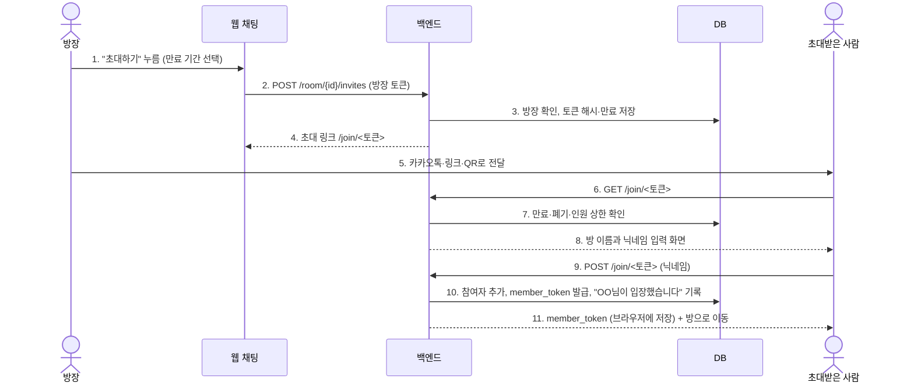
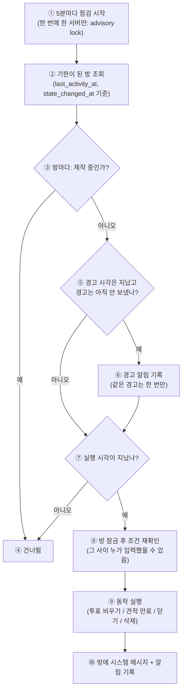

# 채팅방 정책 — 초대, 기록, 종료·초기화, 알림

> 작성일: 2026-09-25 / 상위: [PRODUCT_ROADMAP.md](PRODUCT_ROADMAP.md), [DELIVERY_PIPELINE.md](DELIVERY_PIPELINE.md)
> 전제: 0-2(PostgreSQL 전환) 완료. 계정(1단계)이 없어도 동작하는 부분과 계정이 있어야 하는 부분을 나눠 둔다.

## 0. 요약

| 영역 | 정책 한 줄 |
|---|---|
| 초대 | 방 ID가 아니라 **따로 발급하는 초대 링크**로 들어온다. 링크는 7일 뒤 만료되고, 방장이 언제든 폐기·재발급한다. 한 방은 최대 10명 |
| 기록 | 메시지는 방이 삭제되기 전까지 **지우지 않는다**. 카카오톡처럼 최신 50개부터 보이고 위로 올리면 이전 기록을 불러온다. 안 읽은 수와 "여기까지 읽었습니다" 표시 |
| 초기화 | 입력이 없으면 **진행 단계만 되돌린다**(투표 24시간, 견적 7일). 대화 기록은 남는다 |
| 종료 | 30일 동안 활동이 없으면 방이 **닫힌다**(읽기 전용, 언제든 다시 열기). 방장이 직접 닫거나 삭제할 수도 있다. 삭제하면 30일 뒤 영구 삭제 |
| 알림 | 모든 변화는 방 안 시스템 메시지로 남는다. 방 밖 알림은 1차 웹 푸시, 2차 이메일. 카카오 알림톡은 비용 결정 뒤(D6) |

## 1. 먼저 고칠 보안 문제 (R-0)

지금 구조에서 확인된 문제다. 정책 기능보다 먼저 고친다.

| # | 문제 | 영향 | 조치 |
|---|---|---|---|
| 1 | `GET /room/{id}/messages`가 다른 참여자의 `member_id`를 응답에 담는다. 그런데 `member_id`는 본인 확인 수단이다 | 같은 방 참여자가 남의 `member_id`로 메시지를 보내거나 **대신 투표**할 수 있다 | 비밀 토큰(`member_token`, 본인 브라우저에만 저장)과 공개 식별자(`member_handle`, 화면 표시용)를 분리한다. 응답에는 공개 식별자만 담는다 |
| 2 | 방 ID(8자)만 알면 입장하지 않은 사람도 전체 기록을 읽을 수 있다 | 링크가 한 번 퍼지면 되돌릴 수 없다 | 조회·전송 모두 `member_token`으로 참여자인지 확인한다. 참여자가 아니면 404를 준다(방이 있는지도 알려주지 않음) |
| 3 | 방 ID가 곧 초대 수단이라 폐기할 수 없다 | 원치 않는 사람을 막을 방법이 없다 | 초대 링크를 따로 발급한다(§2) |

**R-0 구현 (2026-09-25):** 1번은 해결했다. 응답에는 `member_id` 대신 되돌릴 수 없는 공개 식별자(`member_handle` = 방 ID와 member_id의 SHA-256 앞 12자)만 담는다. 2번은 절반만 해결했다. 기록 조회에 `X-Member-Id` 헤더로 참여자 확인을 붙였다(URL에 넣지 않아 접근 로그에 남지 않음). 다만 초대 링크가 생기기 전까지는 방 ID를 아는 사람이 입장하면 읽을 수 있고, 이 부분은 R-2에서 막는다. 비밀값을 해시로 저장하는 작업은 R-1 스키마 변경 때 함께 한다.

**기존 방 호환:** 이미 공유된 `?room=<id>` 링크는 기존 참여자에 한해 계속 열린다(기존 `member_id`를 첫 접속 때 `member_token`으로 교환). 새 참여자는 초대 링크로만 들어온다.

## 2. 초대

### 2.1 규칙

| 항목 | 기본값 | 비고 |
|---|---|---|
| 초대 수단 | 링크 복사, 카카오톡 공유(기존 버튼), QR 코드(매장에 붙이기) | 모두 같은 초대 링크 |
| 링크 형식 | `/join/<토큰>`. 토큰은 128비트 무작위, DB에는 해시만 저장 | 추측·목록화 불가 |
| 만료 | 발급 후 7일 | 방장이 1일·7일·30일·무기한 중 선택 |
| 사용 횟수 | 제한 없음(방 인원 상한까지) | 1회용 링크 선택 가능 |
| 방 인원 상한 | 10명 | 투표·폴링 부하와 소상공인 사용 형태 기준 |
| 역할 | 방장(owner) 1명, 참여자(member) | 방장 = 방을 만든 사람. 방장이 나가면 가장 먼저 들어온 참여자에게 넘어간다 |
| 방장만 할 수 있는 일 | 초대 링크 발급·폐기, 참여자 내보내기, 방 이름 변경, 닫기·삭제, 방장 넘기기 | 참여자는 받은 링크를 다시 공유하는 것만 가능 |
| 로그인 | 필요 없음(닉네임만 입력). 로그인하면 "내 채팅방" 목록에 저장된다 | 1단계 계정과 연결(§3.3) |
| 내보낸 참여자 | 다시 들어오려면 새 링크가 필요하다. 그가 쓴 메시지는 남는다 | 기존 링크는 자동 폐기되지 않으므로 방장에게 재발급을 안내 |
| 투표 정족수(요약 승인) | 참여자 전원 동의. 모두가 '동의'를 보내야 다음 단계로 넘어간다. 한 명이라도 '고칠 게 있어요'를 보내면 바로 다시 모으는 단계(GATHERING)로 돌아간다 (D52, 2026-09-27) | 나간·내보낸 사람은 제외. 투표 중 인원이 바뀌면 다시 계산. 1:1 방은 동의 1/1이면 바로 진행 |

### 2.2 초대 흐름

| 번호 | 설명 |
|---|---|
| 1 | 방장이 방에서 초대 버튼을 누르고 링크 유효 기간을 고른다 |
| 2 | 웹이 백엔드에 초대 링크 발급을 요청한다. 방장 본인인지 확인할 비밀 토큰을 함께 보낸다 |
| 3 | 백엔드가 방장인지 확인하고, 초대 토큰은 원문이 아닌 해시로 저장한다(DB가 유출돼도 링크를 만들 수 없게) |
| 4 | 초대 링크를 돌려준다 |
| 5 | 방장이 카카오톡 공유, 링크 복사, QR 중 하나로 전달한다 |
| 6 | 초대받은 사람이 링크를 연다 |
| 7 | 링크가 만료·폐기되지 않았는지, 방이 꽉 차지 않았는지, 방이 닫히지 않았는지 확인한다 |
| 8 | 문제가 없으면 방 이름과 닉네임 입력 칸을 보여준다. 문제가 있으면 이유("링크가 만료됐어요. 방장에게 새 링크를 요청하세요")를 보여준다 |
| 9 | 닉네임을 입력하고 입장한다 |
| 10 | 참여자로 등록하고, 본인 확인용 비밀 토큰을 만들고, 입장 메시지를 방에 남긴다 |
| 11 | 비밀 토큰은 이 브라우저에만 저장된다. 로그인한 사용자는 계정에도 연결된다 |

### 2.3 공유방 진행 (D52, 2026-09-27)

| 항목 | 정책 |
|---|---|
| 답하기 | 누구나 답할 수 있고, 답은 바로 정리에 넣는다. 답마다 묻던 "방장님, 맞나요?" 확인은 하지 않는다 (D52, 2026-09-27) |
| 요약 승인 | 요약 단계(AWAIT_APPROVAL)에서는 참여자 전원이 '동의'를 보내야 다음 단계로 넘어간다. 한 명이라도 '고칠 게 있어요'를 보내면 바로 다시 모으는 단계(GATHERING)로 돌아간다. 서버에는 '동의'가 "승인", '고칠 게 있어요'가 "거절"로 들어간다 (D52, 2026-09-27) |
| 투표 안내 글 | "OO님이 동의했습니다 (동의 n/N) · 모두 동의하면 다음 단계로 넘어가요". 동의 바에는 "모두 동의하면 다음 단계로 넘어가요 · 동의 n/N", 내가 동의했으면 "✓ 동의함"을 보여준다. 1:1 방은 동의 1/1이면 바로 진행한다 (D52, 2026-09-27) |
| 우리끼리 말 | 보내기 본문에 `to_ai: false`로 보내면 '우리끼리' 대화가 된다. 채팅 기록에만 남고 AI 정리·투표에는 넣지 않는다. 기록 조회에서는 그 메시지에 `"aside": true`가 붙는다 (D52, 2026-09-27) |
| 함께 쓰는 방 안내 | 참여자가 2명이 되는 순간 아래 안내를 한 번만 보여준다 (D52, 2026-09-27). "여러 분이 함께하는 방이 됐어요. 사람끼리 나누는 이야기는 입력칸 위 '우리끼리'로 보내면 AI가 읽지 않아요. AI 질문에는 누구나 답할 수 있고, 정리가 끝나면 모두 '동의'를 눌러야 다음 단계로 넘어가요." |
| 화면 | 2명 이상이면 입력칸 위에 "보낼 곳: AI에게 / 우리끼리" 전환을 보여준다. '우리끼리' 말풍선은 점선으로 보여주고 "우리끼리 · AI는 읽지 않아요"를 함께 보여준다. 1:1 방은 그대로 둔다 (D52, 2026-09-27) |

## 3. 기록 (카카오톡처럼)

### 3.1 방 안

| 기능 | 정책 |
|---|---|
| 처음 열 때 | 최신 50개. 안 읽은 메시지가 있으면 "여기까지 읽었습니다" 위치로 스크롤 |
| 이전 기록 | 위로 스크롤하면 50개씩 더 불러온다(`GET /room/{id}/messages?before=<seq>&limit=50`) |
| 새 메시지 | 기존 폴링(`since`) 유지. 2단계에서 스트리밍(SSE)으로 바꾼다 |
| 날짜 구분선 | 날짜가 바뀌는 곳에 "2026년 9월 25일 목요일" |
| 읽음 표시 | 참여자별 마지막으로 읽은 순번(`last_read_seq`)을 저장하고, 각 메시지 옆에 안 읽은 사람 수를 표시한다(카카오톡의 숫자 1) |
| 보관 | 방이 삭제되기 전까지 모든 메시지를 보관한다. 닫힌 방도 읽을 수 있다 |
| 메시지 삭제 | 본인 메시지는 5분 안에 "삭제된 메시지입니다"로 바꿀 수 있다. AI가 이미 반영한 요구사항은 바뀌지 않는다는 안내를 함께 보여준다(2단계 PRD 엔진과 연결) |
| 검색 | 방 안 텍스트 검색은 3단계 이후(`pg_trgm`) |

### 3.2 내 채팅방 목록

| 항목 | 정책 |
|---|---|
| 누가 보나 | 로그인 사용자: 계정에 연결된 모든 방. 게스트: 이 기기에서 들어간 방(브라우저 저장) |
| 보이는 정보 | 방 이름, 마지막 메시지 미리보기, 시각, 안 읽은 수, 상태 배지(요구사항 정리 중 / 투표 대기 / 견적 확인 / 제작 중 / 완료 / 닫힘) |
| 정렬 | 최근 활동순. 닫힌 방은 아래 "보관함"으로 |
| 방 이름 | 처음에는 첫 요청 요약(예: "강릉 펜션 소개 홈페이지"). 방장이 바꿀 수 있다 |

### 3.3 계정 연결

게스트로 쓰던 방은 로그인하면 계정으로 옮겨진다(1-3 게스트 귀속). 다른 기기에서 로그인해도 같은 목록이 보인다.

## 4. 종료·초기화

### 4.1 두 가지를 구분한다

- **초기화:** 대화 **진행 단계**(투표, 견적)를 되돌린다. 방은 계속 열려 있고 기록도 그대로다.
- **종료(닫힘):** 방 전체를 읽기 전용으로 바꾼다. 기록은 볼 수 있고, 다시 열 수 있다.

기록을 지우는 것은 방장이 **삭제**할 때뿐이다.

### 4.2 타이머 기본값

모두 설정값으로 둔다(`settings`). 숫자는 소상공인이 하루 이틀 답이 늦을 수 있다는 점을 기준으로 잡았다.

| # | 조건 | 경고 | 동작 | 방에 남는 메시지 |
|---|---|---|---|---|
| T1 | 투표 중(AWAIT_APPROVAL) 24시간 동안 결론이 안 남 | 20시간 | 투표만 비운다. 요청 내용은 유지 | "투표가 24시간 동안 끝나지 않아 초기화됐습니다. 다시 '승인' 또는 '거절'을 보내 주세요" |
| T2 | 견적(QUOTED) 7일 동안 '진행'이 없음 | 6일 | 견적을 만료시키고 요구사항 정리 단계로 되돌린다 | "견적 유효기간(7일)이 지났습니다. 요구사항이 바뀌지 않았다면 '다시 견적'을 보내 주세요" |
| T3 | 요구사항 정리 중 72시간 동안 입력 없음 | — | 상태는 그대로 두고 알림만 보낸다 | "이어서 진행할까요? 지금까지 정리한 내용: …" |
| T4 | 방 전체에 30일 동안 활동 없음 | 27일 | 방을 닫는다(읽기 전용) | "30일 동안 활동이 없어 방이 닫혔습니다. 방장이 다시 열 수 있습니다" |
| T5 | 완료(DONE) 후 30일 | 27일 | 방을 닫는다. **배포된 사이트는 계속 운영** | "프로젝트가 완료되어 방을 보관함으로 옮겼습니다" |
| T6 | 게스트만 있는 방(로그인 참여자 없음)이 닫힌 뒤 30일 | 닫힐 때 안내 | 영구 삭제(메시지·첨부) | — |
| T7 | 방장이 삭제 | 즉시 확인창 | 즉시 숨김, 30일 뒤 영구 삭제. 30일 안에는 복구 가능 | 참여자들에게 "방장이 방을 삭제했습니다" 알림 |

- 제작 중(GENERATING)은 어떤 타이머로도 초기화하지 않는다. 코드생성 자체의 타임아웃(0-3b)이 처리한다.
- 로그인 참여자가 있는 방은 자동 삭제하지 않는다(T6 제외 대상). 닫힌 채로 보관한다.
- "활동"은 사람이 보낸 메시지와 투표를 말한다. 조회(폴링)나 시스템 메시지는 활동이 아니다.

### 4.3 판정 흐름 (5분마다 도는 점검 작업)

| 번호 | 설명 |
|---|---|
| ① | 점검 작업이 5분마다 돈다. 서버가 여러 대여도 한 곳에서만 돌도록 DB 잠금을 잡는다 |
| ② | 타이머 기한(경고 시각 또는 실행 시각)이 지난 방만 골라 온다 |
| ③ | 코드를 만들고 있는 방은 건드리지 않는다 |
| ④ | 해당 없음. 다음 방으로 넘어간다 |
| ⑤ | 경고를 보낼 시각이 됐는데 아직 안 보냈는지 확인한다 |
| ⑥ | 경고를 기록한다. 같은 방·같은 타이머의 경고는 한 번만 나가도록 중복 방지 키를 둔다 |
| ⑦ | 실제 동작(초기화·닫기·삭제) 시각이 됐는지 확인한다 |
| ⑧ | 방을 잠그고 조건을 다시 확인한다. 점검 직전에 누가 메시지를 보냈다면 취소한다 |
| ⑨ | 표 4.2의 동작을 실행한다 |
| ⑩ | 무엇이 왜 바뀌었는지 방에 남기고, 방 밖 알림 대상에 올린다 |

## 5. 알림

### 5.1 무엇을 알리나

| 사건 | 방 안 | 방 밖 알림 대상 |
|---|---|---|
| 초대받은 사람이 입장 | 시스템 메시지 | 방장 |
| 투표 필요 | 투표 바 | 아직 투표 안 한 참여자 |
| 견적 준비됨 | AI 메시지 | 전원 |
| 시안·제작 완료 | AI 메시지 + 링크 | 전원 |
| 제작 실패 | AI 메시지 | 전원 |
| 초기화·닫힘 경고(T1~T5) | 시스템 메시지 | 전원 |
| 내보내짐, 방 삭제 | — | 당사자 / 전원 |

### 5.2 채널

| 순서 | 채널 | 조건 | 비용 | 비고 |
|---|---|---|---|---|
| 1 | 방 안 시스템 메시지, 안 읽은 수 배지 | 항상 | 0 | 모든 알림의 원본 |
| 2 | 웹 푸시(Web Push) | 사용자가 허용한 경우. 아이폰은 홈 화면에 추가한 경우만(iOS 16.4 이상) | 0 | 서비스 워커 + VAPID 키 |
| 3 | 이메일 | 로그인 사용자(구글은 이메일 제공, 카카오는 동의 시) | 무료 한도 안에서 0 | 경고·완료처럼 급하지 않은 것 |
| 4 | 카카오 알림톡 | **결정 D6** | 건당 과금 | 카카오 비즈니스 채널, 발송 대행사, 템플릿 심사가 필요하다. 카카오 로그인의 "나에게 보내기"는 본인에게만 보낼 수 있어 다른 참여자 알림에는 쓸 수 없다 |

- 방해 금지: 22:00~08:00(한국 시간)에는 방 밖 알림을 모아 두었다가 08:00에 보낸다. 완료 알림만 예외(사용자 설정).
- 방별 알림 끄기를 둔다.
- 같은 사건은 한 번만 보낸다(중복 방지 키: 방·받는 사람·사건 종류·대상 순번).

## 6. 데이터 변경 (Alembic 0002)

| 테이블 | 추가 |
|---|---|
| `rooms` | `title`, `status`(ACTIVE/CLOSED/DELETED), `last_activity_at`, `closed_at`, `deleted_at`, `purge_after` |
| `sessions` | `state_changed_at` (T1·T2 기준 시각) |
| `room_members` | `member_handle`(공개), `member_token_hash`(비밀, 해시만 저장), `role`, `last_read_seq`, `left_at`, `removed_at`, `user_id`(1단계에서 연결) |
| `room_invites` (신규) | `id`, `room_id`, `token_hash`, `created_by`, `created_at`, `expires_at`, `max_uses`, `use_count`, `revoked_at` |
| `notifications` (신규) | `id`, `room_id`, `recipient_member`, `kind`, `payload`, `dedup_key`(UNIQUE), `created_at`, `sent_at`, `channels`, `read_at` |
| `push_subscriptions` (신규, R-5) | `id`, `member`/`user_id`, `endpoint`, `keys`, `created_at` |

## 7. 작업 패키지

| WP | 내용 | 담당 | 의존 |
|---|---|---|---|
| R-0 | 비밀 토큰·공개 식별자 분리, 조회·전송 참여자 확인, 기존 방 호환 교환 | Claude | 0-2b |
| R-1 | Alembic 0002 스키마 | Claude | R-0 |
| R-2 | 초대 링크 API, `/join` 흐름, 인원 상한, 역할·내보내기 | Claude (API) + OpenCode (화면, QR) | R-1 |
| R-3 | 기록: `before` 페이지네이션, 읽음 순번, 날짜 구분선, 안 읽은 수 | Claude (API) + OpenCode (화면) | R-1 |
| R-4 | 점검 작업(5분), 타이머 T1~T7, 시스템 메시지. 시각은 주입 가능하게 만들어 테스트에서 시간을 앞당긴다 | Claude | R-1, 0-3a(작업 큐가 생기면 그쪽으로 이동) |
| R-5 | 알림 기록·방해 금지·중복 방지 + 웹 푸시 | Claude (서버) + OpenCode (서비스 워커) | R-4 |
| R-6 | 내 채팅방 목록, 게스트 방 계정 귀속 | Claude | 1-2, 1-3 |
| R-7 | 테스트: 권한(남의 토큰으로 투표 불가), 초대 만료·폐기·상한, 타이머 경계값, 중복 알림 없음 | OpenCode | 각 WP |

순서: R-0 → R-1 → R-2·R-3 병렬 → R-4 → R-5. R-6은 계정(1단계) 뒤. R-0~R-5는 계정이 없어도 되므로, 사용자의 OAuth 콘솔 작업(1-6)을 기다리는 동안 진행한다.

## 8. 사용자 결정

| # | 결정 | 추천 |
|---|---|---|
| D6 | 카카오 알림톡 도입(건당 비용, 비즈니스 채널 개설) | 보류. 웹 푸시·이메일로 시작하고 실제 사용자가 생기면 판단 |
| D7 | 타이머 값(표 4.2) | 기본값으로 시작하고 사용 데이터로 조정 |
| D8 | 방 인원 상한 10명 | 기본값 유지 |
