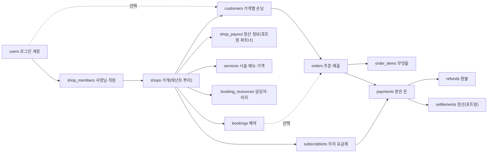

# 매출 DB·계정 구조: 여러 가게를 한 DB에 (SALES_DB_PLAN)

> 2026-09-29 (KST) / Claude. 대표 요청: "사장님이 어떤 매출이 많이 나왔는지 인사이트가 나오는 DB. 한 사이트만 보는 게 아니니 잘 짜인 DB가 필요. **우리 홈페이지를 쓰는 사용자(사장님)와, 우리가 만든 가게 사이트에서 가입하는 사용자(손님)가 따로 있을 수 있는데 어떻게 정할지 검토.**"
> 먼저 읽은 것: [DATA_ARCHITECTURE_REVIEW](DATA_ARCHITECTURE_REVIEW.md) §3(shops·shop_members·sites 목표 구조), [research/RESEARCH_CUSTOMER_IDENTITY](research/RESEARCH_CUSTOMER_IDENTITY.md) §4.3·R1(손님 회원가입 없음), [CUSTOMER_PLAN](CUSTOMER_PLAN.md), [BOOKING_RULES_PLAN](BOOKING_RULES_PLAN.md) §2, [PAYMENT_PLAN](PAYMENT_PLAN.md), `app/db/models.py`.
> 성격: 설계 제안. §2·§8 대표 결정 필요.

## 0. 요약

1. **계정은 하나, 역할과 데이터는 가게별.** 로그인하는 사람은 누구든 `users` 한 표. "사장님인지 손님인지"는 사람의 종류가 아니라 **관계**다. 가게 권한은 `shop_members`, 손님 기록은 가게별 `customers`. 한 사람이 A 가게 사장이면서 B 가게 손님일 수 있다.
2. **모든 가게 데이터 표에 `site_key NOT NULL`(→ `shops`)**을 넣고, 조회는 "이 사람이 이 가게 멤버인가" 한 함수를 지난다. 가게는 자기 손님·매출만 본다.
3. **매출은 `orders`(주문) → `order_items`(무엇을) → `payments`(어떻게 받았나) → `refunds`·`settlements`.** 금액·이름은 그때 값으로 복사해 두고, 기록은 고치지 않고 새 행을 쌓는다.
4. 인사이트는 **처음엔 SQL 뷰**(일별 매출·시술별·담당자별·요일×시간·재방문·노쇼). 느려지면 그때 일별 집계 표를 만든다.
5. 부딪히는 규칙 하나: **예약은 방문일 뒤 지우는데, 매출·결제 기록은 5년 보관(확인 필요)**. §7에서 나눈다.

## 1. 지금 구조의 문제 (이 주제만)

| 지금 | 문제 |
|---|---|
| 가게 = `site_key` 글자(`sessions.requirement_id`), 외래키 없음 | 가게 표가 없어 요금·정산·권한을 붙일 곳이 없다(DATA_ARCHITECTURE D-3) |
| 주인 = 방에 처음 들어온 사람(`user_rooms` + `rooms.owner_id`) | 직원 권한, 주인 이전, 가게 여러 개가 어렵다 |
| `customers` = (site_key, phone) | 가게별로 잘 나뉘어 있음. **이 방향은 맞다** — 그대로 키운다 |
| 가격이 카드 JSONB·예시값에만 | 매출을 시술별로 묶을 기준이 없다 |
| `bookings`는 방문일 + 30일 뒤 삭제 | 매출 기록을 여기에 두면 사라진다 |

## 2. 핵심 검토: 사장님 계정 vs 가게 사이트 손님 계정

### 2.1 세 가지 안

| | ① 완전 분리 | ② 플랫폼 통합 회원 | ③ 계정 하나 + 가게별 관계 (**추천**) |
|---|---|---|---|
| 모양 | `users`(사장님) + 가게마다 `site_users`(손님, 가게별 아이디·비번) | 손님도 우리 회원. 한 번 가입하면 모든 가게에서 로그인, 가게는 "우리 회원" 전체를 앎 | `users`는 로그인 수단(카카오·구글)만. 가게와의 관계는 `shop_members`(일하는 사람)·`customers`(손님) |
| 같은 사람이 A 사장 + B 손님 | 계정 두 개 | 계정 하나, 권한 섞임 위험 | 계정 하나, 관계 두 개 |
| 손님 편의 | 가게마다 가입 | 가장 편함 | 카카오 로그인 한 번이면 어느 가게든(선택), 안 해도 전화번호로 됨 |
| 개인정보 | 가게별로 깔끔 | **가게 A의 손님이 가게 B에 보이는 사고 위험, 우리가 손님 정보를 모으는 플랫폼이 됨**(D35 "사용자 사이 사실 공유 금지"와 충돌) | 가게는 자기 `customers`만. 우리가 가게를 넘어 묶는 건 로그인 수단뿐 |
| 비밀번호 | 가게마다 비번 저장·재설정 필요(보안 부담) | 한 곳 | 비번 없음(카카오·구글·문자 인증) |
| 지금 코드와 | 새 인증 체계 | 큰 변경 | **지금 그대로 확장**: `users`·`oauth_accounts` 유지, `customers.user_id` 한 칸 추가 |
| 비슷한 곳 | 옛 쇼핑몰 빌더 | 네이버 예약·카카오헤어샵(플랫폼이 손님을 가짐) | Shopify(가게별 고객 + 공통 로그인), Stripe Connect(계정별 고객) |

### 2.2 추천 ③의 규칙

| 규칙 | 내용 |
|---|---|
| R-1 | `users` = "로그인할 수 있는 사람". 종류 칸(`type = owner/customer`)을 **두지 않는다**. 역할은 관계 표로 안다 |
| R-2 | 사장님·직원 = `shop_members(shop_id, user_id, role: owner·staff)`. 가게 관리 화면·매출은 이 표로만 연다 |
| R-3 | 손님 = `customers(shop_id, phone, user_id null)`. **전화번호가 기본 열쇠**(로그인 없이 예약하는 손님이 대부분). 손님이 가게 사이트에서 카카오 로그인하면 `user_id`가 채워질 뿐이다 |
| R-4 | 같은 `user_id`가 여러 가게 `customers`에 있어도 **가게끼리는 서로 모른다.** 가게 화면·API·내보내기 어디에도 다른 가게 기록을 내지 않는다 |
| R-5 | 우리 운영 통계(가게를 넘는 것)는 **개인을 알 수 없는 집계만**(업종별 평균 객단가 등). 손님 단위로 가게를 넘어 분석하지 않는다 |
| R-6 | 손님 회원가입(RESEARCH R1 "만들지 않는다")은 **그대로**. ③은 나중에 손님 로그인을 켜도 표를 바꿀 필요가 없게 해 두는 것 |
| R-7 | 개인정보 역할: 가게 손님 정보는 **가게가 처리자, 우리가 수탁자**(확인 필요 — 개인정보처리방침·가게 입점 약관에 반영). 로그인 계정(`users`)은 우리가 처리자 |

### 2.3 "우리 홈페이지 사용자"와 "가게 사이트 사용자"가 같은 카카오 앱을 쓰면

- 손님이 가게 사이트에서 카카오 로그인 → 동의 화면에 "한마디"가 뜬다. 문구: "○○헤어 예약을 위해 한마디 계정으로 로그인". 가게 이름은 본문에.
- 로그인 세션 쿠키는 앱 주소(`__Host-` 쿠키)에만 있다. 생성 사이트는 별도 호스트(M-4)라 쿠키가 닿지 않으므로, 손님 로그인은 우리 예약·결제 페이지(`/pay`, 예약 페이지)에서만 한다. **사이트 자체에는 로그인 상태가 없다.**
- 사장님이 로그인한 채로 다른 가게 예약 페이지에 가면 같은 계정으로 손님이 된다(R-1). 관리 화면 권한은 `shop_members`로만 열리므로 섞이지 않는다.

## 3. 전체 구조

## 4. 표 (Alembic 0014~)

원칙: 돈은 `integer`(원), 시각은 `timestamptz`(집계는 `Asia/Seoul`로 날짜 자름), 가게 데이터 표는 전부 `shop_id NOT NULL` + `(shop_id, …)`로 시작하는 인덱스, 결제·환불 기록은 수정·삭제 없이 쌓기.

### 4.1 가게·권한 — **구현됨(0014, 2026-09-29)**

[OWNER_CONSOLE_PLAN §3.1](OWNER_CONSOLE_PLAN.md)에 맞춰 **`site_key`(= `sessions.requirement_id`)를 그대로 PK**로 쓴다. 기존 site_key 표는 고치지 않는다. 이 문서의 `shop_id`는 전부 `site_key`로 읽는다.

| 표 | 주요 칸 |
|---|---|
| `shops` | site_key PK, name, kind(slot·table·night·class), created_at, deleted_at |
| `shop_members` | (site_key, user_id) PK, role(`owner`·`manager`·`staff`), owner는 가게당 1명(부분 유니크) |
| `shop_payout` (0015) | site_key PK, business_no, owner_name, bank, account_enc, account_last4, holder, portone_partner_id, status(`none`·`pending`·`active`·`rejected`) |

채우기: 공개됐거나 예약·문의·손님·설정이 있는 세션 → `shops`, 방장 기기를 붙인 계정(`user_rooms`) → owner. 새 공개는 `app/services/shops.ensure`(`chat_flow._publish`에서 호출)가 만든다. 기존 표에 외래키 걸기·권한 모으기(`shops.require`)는 OWNER_CONSOLE O1.

### 4.2 상품·자원

| 표 | 주요 칸 | 비고 |
|---|---|---|
| `services` | id, shop_id, name, category(컷·펌·염색 등, 선택), price, duration_min, buffer_min, active | BOOKING_RULES_PLAN `booking_services`와 **같은 표로 합친다**(가격 칸 추가) |
| `booking_resources` | id, shop_id, kind(`staff`·`table`·`room`), name, seats, active | BOOKING_RULES_PLAN §2.1 그대로. 담당자별 매출의 기준 |

### 4.3 손님

| 표 | 바뀌는 것 |
|---|---|
| `customers` | **`user_id` null FK users** 추가(§2.2 R-3, 0015). 나머지 그대로 |

### 4.4 매출 — **구현됨(0015)**. 시술·담당자 표가 아직 없어 `service_id`는 외래키 없이, 담당자는 `staff_name` 글자로 둔다

| 표 | 주요 칸 | 설명 |
|---|---|---|
| `orders` | id, shop_id, customer_id null, booking_id null(FK SET NULL), channel(`online`·`onsite`·`manual`), status(`open`·`paid`·`completed`·`canceled`·`no_show`), subtotal, discount, total, served_at(방문·시술 시각), staff_name, created_at | **매출 1건.** 예약 없이 현장 매출만 적어도 된다 |
| `order_items` | id, order_id, shop_id, service_id null, name(스냅샷), unit_price(스냅샷), qty, amount, staff_name | 가격이 나중에 바뀌어도 그때 값 유지 |
| `payments` | id, site_key(구독·제작비도 그 가게), order_id null(kind=order일 때만 필수, DB 검사), kind(`order`·`subscription`·`setup_fee`), method(`card`·`easy_pay`·`transfer`·`cash`·`onsite_card`), provider(`portone`·`manual`), provider_payment_id UNIQUE null, amount, status(`ready`·`paid`·`failed`·`canceled`), paid_at, raw jsonb | A·B 공통 결제 원장. 현장 결제는 `manual` |
| `refunds` | id, payment_id, shop_id, amount, reason, by_user_id, provider_cancel_id, created_at | 부분 환불 여러 번 가능 |
| `settlements` | id, shop_id, payment_id, portone_transfer_id, gross, pg_fee, platform_fee, net, settle_date, status | 포트원 주문 정산과 1:1. 사장님 "입금 예정" 화면용 |
| `subscriptions` | shop_id PK, payer_user_id, plan, status, billing_key_enc, card_last4, current_period_end, next_schedule_id, fail_count, cancel_at_period_end | PAYMENT_PLAN §4 |

`orders.status`와 결제 상태를 나누는 이유: 예약금 1만 원 결제(`payments`) + 현장 카드 4만 원(`payments manual`) = 주문 1건 5만 원(`orders.total`). 매출은 주문, 돈은 결제로 본다.

## 5. 매출이 쌓이는 길

| 상황 | 기록 |
|---|---|
| 예약금 온라인 결제 | 예약 신청 때 `orders(open)` + `order_items` + `payments(ready)` → 결제 완료 `paid` |
| 시술 끝 | 사장님이 채팅방 예약 카드에서 **"완료"** → 실제 금액·추가 시술 입력 → 남은 금액을 `payments(manual, onsite_card/cash)` → `orders.completed` |
| 예약 없이 현장 손님 | 사장님 "매출 적기"(채팅: "오늘 컷 2만원 현금" → LLM이 표 값으로, 사장님 확인) |
| 노쇼 | `orders.no_show`, 예약금은 매출로 남음 |
| 환불 | `refunds` 행 추가(원래 결제는 그대로) |

**사장님 입력이 없으면 인사이트는 온라인 결제분만 보인다.** 그래서 "완료" 버튼과 말로 적기를 가장 쉽게 만든다(PAYMENT_PLAN P4).

## 6. 인사이트 (처음엔 SQL 뷰)

| 인사이트 | 근거 표 | 예 |
|---|---|---|
| 기간 매출·순매출(환불 뺀)·주문 수·객단가 | orders, payments, refunds | "9월 순매출 312만 원, 지난달보다 8%↑" |
| 많이 팔린 시술 TOP | order_items | "펌이 매출의 41%" |
| 담당자별 매출·예약 수 | order_items.staff_id | |
| 요일 × 시간대 | orders.served_at | "화요일 오후가 가장 비어요" |
| 신규 vs 재방문, 재방문 주기 | customers, orders | "재방문 손님 평균 38일마다" |
| 이번 주 올 때 됐는데 안 온 손님 | 위와 같음 | 알림톡 안내 후보(손님 동의 범위 확인 필요) |
| 노쇼율·노쇼로 지킨 예약금 | orders.no_show | |
| 입금 예정 | settlements | |

- 뷰 `v_shop_daily`(shop_id, day, gross, refunds, net, orders, new_customers, returning_customers) 하나 + 화면별 쿼리.
- 인덱스: `orders(shop_id, served_at)`, `orders(shop_id, customer_id)`, `order_items(shop_id, service_id)`.
- 화면: `/shop/{id}/sales`(표·그래프) + 채팅방에서 "이번 달 매출 어때?" → 정해진 쿼리 목록 중 고르기(LLM이 SQL을 직접 쓰지 않는다, D31과 같은 이유).
- ponytail: 가게당 하루 수십 건이라 가게 수천 곳까지 뷰로 충분. 느려지면 `shop_daily_sales` 일별 집계 표를 밤에 채운다.
- 우리 운영 통계(가게를 넘는): 관리자 화면만, 업종별 집계만(§2.2 R-5).

## 7. 가게 사이의 벽과 보관

### 7.1 벽 (테넌트 분리)

- 서비스 함수는 전부 `shop_id`를 첫 인자로 받고, API는 `require_member(user_id, shop_id, role)` 한 함수를 지난다(지금 `bookings._owner_site_key`를 이 함수로 바꿈).
- 테스트 하나: 가게 A 사장님 계정으로 가게 B의 매출·손님·환불 API를 부르면 전부 404.
- 다음 단계(가게 수 늘면): Postgres Row Level Security로 DB 차원에서 한 번 더 막기. 지금은 서비스 계층 + 테스트로 충분.

### 7.2 보관 기간이 부딪힘

| 기록 | 지금 규칙 | 필요 |
|---|---|---|
| bookings(연락처·메모) | 방문일 + 30일 삭제 | 그대로 |
| orders·payments·refunds·settlements | — | 전자상거래 대금·결제 기록 **5년**(확인 필요) |
| customers(전화번호) | 예약·문의에 딸림 | 재방문 분석에 필요, 하지만 5년 보관은 과함 |

추천: 매출 표에는 **전화번호·이름을 두지 않고 `customer_id`만.** 손님이 마지막 방문 뒤 N개월(예: 12개월, 대표 결정) 오지 않으면 `customers`의 번호·이름을 지우고 행만 남긴다(익명 손님이 되어 매출 통계는 유지). 결제 기록은 5년.

## 8. 대표 결정 필요

| # | 질문 | 추천 |
|---|---|---|
| S1 | 사장님·손님 계정 구조 | **③ 계정 하나 + 가게별 관계** |
| S2 | 손님 로그인(카카오)을 가게 예약·결제 페이지에 켤까 | 표는 준비(`customers.user_id`), **기능은 끔**(R1 유지). 결제 때 전화번호 + 문자 인증으로 충분 |
| S3 | `shops` 이행을 지금 할까 | **완료(2026-09-29, 0014)** |
| S4 | 현장 매출 기록 | "완료 + 금액" 버튼 + 말로 적기 |
| S5 | 손님 개인정보 보관 | 마지막 방문 뒤 12개월 익명화, 결제 기록 5년 |
| S6 | 개인정보 역할(가게 = 처리자, 우리 = 수탁자) | 법무 확인 뒤 방침·입점 약관 반영 |
