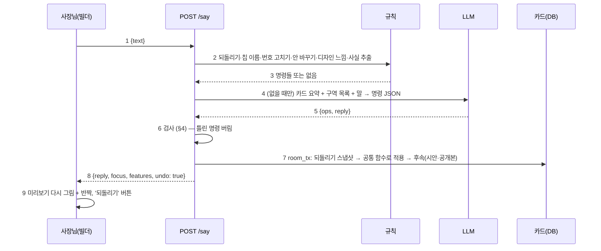

# B5 계약서: 빌더에서 말로 고치기 (SAY_CONTRACT)

> 2026-09-30 (KST) / Claude 작성, OpenCode 구현. 계획 [BUILDER_PLAN](BUILDER_PLAN.md) §1.5, 결정 D57(베타 뒤, 10/18~10/22). 선행: [BUILDER_CONTRACT](BUILDER_CONTRACT.md) B1~B3 커밋.
> 재사용: `prd_engine.extract`(근거 검사 포함)·`correct_item_row`·`apply_updates`, `design_concept.is_style_request`·`adjust`·`apply_lock`, `llm.chat_json`, B1이 `app/api/card.py`에서 꺼낸 공통 함수(구역·공지·후속 처리), `ui_agent`의 숫자 검사 방식.

## 0. 결론

- 빌더 아래 입력줄(글·음성)에 말하면 `POST /api/rooms/{id}/say`. **규칙 먼저, 못 읽은 말만 LLM 1번.** LLM은 **명령 JSON만** 내고(§3), 명령은 칩·눌러 고치기와 **같은 공통 함수**로 적용된다. HTML·CSS·새 적용 경로 없음.
- **사실 값(가격·전화·주소·시간·이름·공지 글)은 사장님이 이번에 한 말에 그대로 있어야** 통과한다. 없으면 적용하지 않고 한 줄로 되묻는다.
- 적용 직전 카드를 **1단계 되돌리기**용으로 세션에 둔다. 답은 한 줄 + 바뀐 구역으로 스크롤·반짝(B1의 `agt-flash`).
- 스탬프·온라인 주문은 B1 칩과 같이 "공개한 뒤 사장님 화면에서" 안내만. 공개는 "위 공개하기를 눌러 주세요"로 안내만(말로 공개하지 않는다 — 로그인·빈칸 확인이 버튼 흐름에 있다).

## 1. 흐름

| 번호 | 단계 | 설명 |
|---|---|---|
| 1 | 입력 | 1~300자. 방장만(`_member_room` + 방장 확인), `_check_origin` |
| 2 | 규칙 | §2 순서대로. 하나라도 읽으면 LLM을 부르지 않는다 |
| 4 | LLM | 방 잠금 **밖에서** 읽기 전용 스냅샷으로 부른다(12초, `max_tokens` 400). 방당 1시간 30번(메모리 제한), 넘으면 "잠시 뒤 다시 말해 주세요" |
| 6 | 검사 | 명령마다 §4. 통과한 명령만 남기고, 하나도 없으면 되묻기 |
| 7 | 적용 | 방 잠금 안에서 다시 검사(그 사이 카드가 바뀌었을 수 있음) 후 적용. 명령 최대 5개 |
| 8 | 응답 | `focus`는 마지막으로 보이게 된 구역 id(없으면 null). `features`는 B1 `GET /features`와 같은 모양 |

## 2. 규칙 먼저 (`builder_agent.rules(card, text, ctx) -> list[Op] | None`)

| 순서 | 규칙 | 예 | 명령 |
|---|---|---|---|
| 1 | 되돌리기 말 | "되돌려", "방금 거 취소" | `undo` |
| 2 | 공개 말(`chat_flow.PUBLISH_WORDS`) | "공개해 줘" | 없음, 답만 "위 **공개하기**를 눌러 주세요" |
| 3 | 칩 이름 + 켜기/끄기 말 | "후기 넣어 줘", "사진첩 빼", "공간 보여 줘" | `section` (칩 라벨·구역 id 둘 다로 찾음. 켜기: 넣/추가/보여/켜, 끄기: 빼/숨/지워/없애/꺼) |
| 4 | 안 바꾸기 | "1안", "앱처럼", "사진 크게 보이는 걸로" | `variant` (앱→v3, 사진 강조→v2, 기본→v1) |
| 5 | 품목 번호 고치기 | "2번 가격 1만원" | `prd_engine.correct_item_row` 그대로 (카드에 바로 적용되는 함수라 §5 적용 단계에서 부른다) |
| 6 | 디자인 느낌 | "더 밝게", "고급스럽게" (`design_concept.is_style_request`) | `style` |
| 7 | 사실 칸 | "전화번호 02-123-4567", "영업시간 10시부터 9시" | `prd_engine.extract` → 가게 이름·전화·영업시간·위치·소개·연락 방법 칸만 `set_field` (근거 검사는 extract가 이미 함) |

규칙이 여러 개 걸리면(예: "후기 넣고 더 밝게") 모두 명령으로 모은다. 3·4·6이 애매하면 LLM으로 넘긴다.

## 3. LLM 명령 (`builder_agent.ask_llm(ctx, text) -> dict`)

시스템 글(요지): "너는 가게 사이트 빌더의 편집 도우미다. HTML·CSS를 쓰지 않는다. 아래 명령만 JSON으로 낸다. 사장님이 이번에 말하지 않은 가격·전화·주소·시간·이름·숫자는 절대 쓰지 않는다. 모르면 ask 하나만 낸다. 출력: `{"ops":[...], "reply":"한 줄"}`"

사용자 글 = 짧은 맥락(JSON) + `[요청] <말>`. 맥락: 업종, 가게 이름(있으면), 이 안의 구역 목록 `[{id,label,on}]`(+더할 수 있는 것), 품목 목록 `[{name,price}]`, 공지 여부, 지금 안(v1~v3). 전화·주소 같은 사실 값은 **맥락에 넣지 않는다**(LLM이 옮겨 쓸 수 없게).

| 명령 | 칸 | 적용 (공통 함수) |
|---|---|---|
| `set_field` | key(가게 이름·전화·영업시간·위치·소개·연락 방법), value | `PUT /card` fields와 같은 저장 |
| `item` | name, rename?, price?, note?, add?, remove? | `PUT /card` items와 같은 `_apply_items` |
| `section` | id, action(add·hide·show·up·down) | B1 features / `_apply_layout` |
| `notice` | text, popup?, off? | 공지 저장 공통 함수 |
| `style` | text | `design_concept.adjust` + `apply_lock` (채팅 `_restyle`과 같은 규칙, 시안 파일은 뒤에서) |
| `variant` | v1·v2·v3 | `design_choice` |
| `feature` | key(stamps·order) | 적용 없음, 답 "공개한 뒤 사장님 화면에서 켤 수 있어요" |
| `ask` | question | 적용 없음, 답 = question |

## 4. 검사 (`builder_agent.validate(card, ctx, text, ops) -> (kept, rejected)`)

| 대상 | 통과 조건 |
|---|---|
| 모든 명령 | 표의 이름·칸만, 문자열 길이(W2 PUT과 같은 한도), 명령 5개 이하 |
| `set_field` value | 공백을 뺀 value가 공백을 뺀 **이번 말** 안에 그대로 있음. 전화는 숫자만 비교. 영업시간·위치처럼 사장님 말을 다듬은 값은 **말에 있는 숫자 전부가 value에 있고 value의 숫자가 전부 말에 있음** |
| `item` price | 가격 숫자(쉼표·원·만 풀어서)가 이번 말의 숫자와 같음 (`card_data.price_won` 재사용). name은 기존 품목이거나(add가 아니면) 말 안에 있음, rename·add의 새 이름은 말 안에 있음 |
| `notice` text | 따옴표 안 글이거나 공백을 뺀 text가 말 안에 있음 |
| `section` id | 이 안의 구역 또는 더할 수 있는 구역. hero·inquiry는 hide·up·down 불가 |
| `style` | `design_concept.adjust`가 바꾼 게 있어야(없으면 버림) |
| 버린 명령 | 응답의 `rejected`에 사람 말 사유("말씀하지 않은 가격이라 넣지 않았어요")를 넣고, 남은 명령이 없으면 그 사유를 되묻기로 |

## 5. 적용·되돌리기

- `store.room_tx` 안에서: `session["builder_undo"] = {"prd": deepcopy(card), "at": 지금}` → 명령 차례로 적용 → B1 후속 처리 한 번(공개본 있으면 다시 공개, 아니면 시안 파일 뒤에서) → 시스템 메시지 "말로 고쳤어요: 후기 켬, 라떼 가격" → 퍼널 `builder_say`(`props={"kind": 첫 명령 종류, "source": "rule"|"llm"}`).
- `undo` 명령 또는 `POST /api/rooms/{id}/undo`: `builder_undo`가 있으면 카드를 되돌리고 지운다(1단계만). 없으면 "되돌릴 게 없어요". 되돌리기 뒤에도 후속 처리.
- 되돌리기 스냅샷은 30분 지나면 무시한다.

## 6. API

| 경로 | 요청 | 응답 |
|---|---|---|
| `POST /api/rooms/{id}/say` | `{"text"}` | `{"reply", "focus": id\|null, "features": [...], "undo": bool, "rejected": [str], "source": "rule"\|"llm"\|"none"}` |
| `POST /api/rooms/{id}/undo` | — | `{"reply", "features": [...], "undo": false}` |

둘 다 방장만, `_check_origin`, 응답 `Cache-Control: no-store`.

## 7. 화면 (B2의 입력줄 자리를 켠다)

- 입력줄(글) + 마이크(기존 `frontend/src/voice.ts`의 말→글, 글이 입력줄에 들어가고 사장님이 보내기).
- 보내면 칩 줄 위에 답 한 줄 말풍선(4초 뒤 흐려짐, 누르면 다시), `undo: true`면 **되돌리기** 버튼(다음 변경 전까지).
- `rejected`가 있으면 말풍선 아래 작은 글로.
- 보내는 중에는 입력줄 잠금 + "고치는 중…".

## 8. 평가 (합격 기준)

- `evals/builder_say/cases.jsonl` 60개: 6업종 × 10개(구역 켜기/끄기·품목 추가/가격·사실 칸·공지·디자인·안 바꾸기·애매한 말·**지어낸 값 유혹**("가격 적당히 넣어 줘", "주소 알아서") 각 1개 이상). 칸: `industry`, `card`(작은 고정 카드), `text`, `expect_ops`(정답 명령), `must_not`(들어가면 안 되는 값).
- `evals/run_builder_say.py`: 실제 LLM으로 돌려 **명령 일치율 ≥ 85%, 지어낸 값 0건, 규칙으로 끝난 비율, 평균 지연**을 표로. 결과 `docs/product/evals/builder-say-<날짜>.md`. **Claude가 돌린다**(키·비용).

## 9. 작업 묶음 (OpenCode)

| 묶음 | 담당 파일 | 선행 |
|---|---|---|
| S1 서버 | `app/services/builder_agent.py`(신규: rules·ask_llm·validate·apply·undo), `app/api/start.py`(`/say`·`/undo` 2개 경로), `app/services/funnel.py`(사건 1개), `tests/unit/test_builder_say.py`(신규, LLM은 가짜) | B1 커밋 |
| S2 화면 | `frontend/src/builder/*`(입력줄·말풍선·되돌리기), `frontend/src/editor/cardApi.ts`(say·undo), 테스트 | B2 커밋, §6 모양만 |
| S3 평가 세트 | `evals/builder_say/cases.jsonl`, `evals/run_builder_say.py` | S1 함수 이름만 |
| S4 평가 실행·조정 | Claude: 실제 LLM으로 돌리고 실패 사례로 규칙·시스템 글 조정, 합격 기준 확인 | S1~S3 |

**하지 말 것**: LLM에 전화·주소·가격 같은 사실 값 넘기기, LLM 출력을 검사 없이 적용, 새 적용 경로(카드 직접 수정) 만들기 — 모두 공통 함수로, HTML·CSS 생성, 말로 공개하기, 스탬프·주문 켜기.

## 10. 단위 합격 테스트 (`test_builder_say.py`)

| 번호 | 테스트 |
|---|---|
| 1 | 규칙: "후기 넣어 줘" → section add, LLM 부르지 않음(가짜 LLM이 불리면 실패) |
| 2 | 규칙: "2번 가격 1만원" → 품목 가격, "앱처럼" → v3, "더 밝게" → style |
| 3 | LLM 명령 적용: 가짜 LLM이 `item add 빙수 6000원` → 말에 "빙수 6천원"이 있으면 적용, 없으면 버리고 rejected |
| 4 | 지어낸 값: 가짜 LLM이 `set_field phone 02-999-9999`(말에 없음) → 버림, 카드 그대로 |
| 5 | 잠긴 구역: `section hide inquiry` → 버림 |
| 6 | 되돌리기: 적용 → undo → 카드가 적용 전과 같음, 두 번째 undo는 "되돌릴 게 없어요" |
| 7 | 방장 아님 403, 출처 다름 403, 300자 넘음 400, LLM 실패·시간 초과 → 되묻기 답(500 아님) |
| 8 | 공개 말 → 적용 없음 + "공개하기를 눌러 주세요", 스탬프 → 안내만 |
| 9 | 공개본이 있으면 적용 뒤 공개본에도 반영(후속 처리), 편집 표시 0 |

## 변경 이력

| 날짜 | 내용 |
|---|---|
| 2026-09-30 | 처음 작성 |
