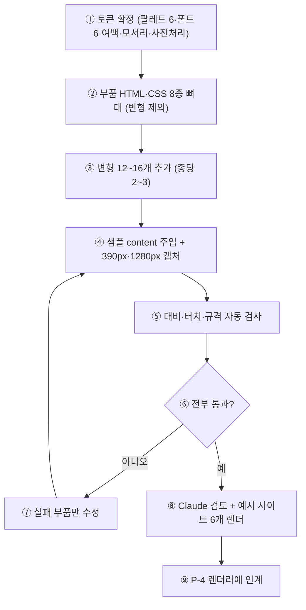

# 섹션 부품 라이브러리 명세 초안 (WP P-3)

> 상태: 초안 (WP P-3 준비용) / 작성: agt001 UI 부품 설계자(P) / 일자: 2026-09-26
> 상위: `DESIGN_PIPELINE_PLAN.md` §5(디자인 명세)·§6(섹션 부품 목록)·§13 보안 S-2·S-5·생성물 규격,
> `reviews/DESIGN_PREVIEW_R2_SECURITY.md` §3.3(생성물 규격),
> `LANDING_PLAN.md` §3(템플릿 명세 초안 6종),
> `app/services/prd_schema.py`(업종·칸), `frontend/src/templates.ts`(업종 색), `DECISIONS.md` D13·D15·D23·D26
> 범위: 시안 렌더러(P-4)와 제작(Hermes, P-8)이 공통으로 쓰는 부품·토큰·수정 목록 형식의 계약 초안.
> 코드는 이 문서에서 확정하지 않는다. 값은 전부 정해진 선택지 안에서만 고른다(자유 값 금지).

## 0. 명세(JSON) 골격

시안 1개 = 디자인 명세 1개. 형식은 파이프라인 §5를 따른다.

```json
{
  "version": 3,
  "based_on_prd_version": 2,
  "tokens": {
    "palette": {"primary": "#2F5D50", "accent": "#E9B872", "ground": "#FAF7F2", "ink": "#1F2622"},
    "font_pair": "serif-warm",
    "density": "comfortable",
    "radius": "soft",
    "image_style": "full-bleed"
  },
  "sections": [
    {"id": "hero", "type": "hero", "variant": "photo-overlay", "content": {"title": "…", "subtitle": "…", "image": "asset:12"}}
  ],
  "locked": ["contact.phone"]
}
```

- `tokens.*`: §1의 선택지 ID만 허용.
- `sections[].type` / `variant`: §2 목록 안에서만 허용.
- `locked`: `"<section-id>.<content-key>"` 형태. §5 검증 규칙 적용.
- `content`의 사실 칸(`phone`·`hours`·`location`·`price` 계열)은 D23·D26을 따른다(§2.0 공통 규칙).

---

## 1. 디자인 설정값(tokens)

### 1.1 palette (4키 + 파생 규칙)

4키만 명세에 저장하고, 나머지는 아래 규칙으로 렌더러가 계산한다. AI·제작물은 파생값을 직접 지정할 수 없다.

| 키 | 의미 | 사용처 |
|---|---|---|
| `primary` | 브랜드 주색. 헤더·버튼·강조 띠 | 버튼 배경, 링크·아이콘 강조, 섹션 타이틀 바 |
| `accent` | 보조 강조색. 뱃지·가격·별점·구분선 | 뱃지, 가격 숫자, 카드 상단 띠, 지도 링크 아이콘 |
| `ground` | 페이지 바탕색 | `body` 배경, 섹션 교대 배경의 기준 |
| `ink` | 기본 글자색 | 본문·제목 기본색 |

파생 규칙(렌더러가 계산, CSS 변수로 주입):

| 파생값 | CSS 변수 | 계산 규칙 (정확한 수치) |
|---|---|---|
| 버튼 글자색 | `--on-primary` | `primary`와 흰색(`#FFFFFF`) 대비율을 계산해 4.5:1 이상이면 흰색, 아니면 `#1A1A1A`. 경계값은 미리 계산해 팔레트 표(§1.6)에 기재 |
| 옅은 바탕 | `--ground-soft` | `ground`를 기준으로 흰색과 1:1 혼합(`color-mix(in srgb, var(--ground) 50%, #FFFFFF)`). 대체값(구형 브라우저): 각 팔레트별 고정값 §1.6에 기재 |
| 카드 배경 | `--card` | 항상 `#FFFFFF` (ground가 어두운 팔레트는 쓰지 않는다 — 전 팔레트의 ground는 명도 90% 이상으로 제한) |
| 구분선 | `--line` | `ink` 14% 투명도(`color-mix(in srgb, var(--ink) 14%, transparent)`). 대체: `rgba()` 고정값 §1.6 |
| 포커스 링 | `--focus` | `accent` 3px 실선 + 외곽 2px 오프셋(`outline: 3px solid var(--accent); outline-offset: 2px`) |
| 비활성·자리표시 | `--muted` | `ink` 60% 투명도(`color-mix(in srgb, var(--ink) 60%, var(--ground))`). 대비율 4.5:1을 요구하는 본문에는 사용 금지(장식·자리표시 테두리 전용) |

제약:

- `primary`·`ink`는 흰색 카드(`#FFFFFF`) 위에서 4.5:1 이상이어야 한다. 팔레트 후보는 P-3에서 대비 검사(§6.3)를 통과한 것만 등록한다.
- `ground` 명도 제한: HSL 명도(L) 88~98%. 어두운 테마는 1차 범위 밖(나중에 별도 토큰으로).
- 색은 16진 6자리 소문자(`#rrggbb`)만 허용. `red` 같은 이름·`rgba()` 직접 지정 금지.

### 1.2 font_pair 6종

전부 한국어 표시 가능한 무료 라이선스 웹폰트만 사용한다. 한글 서브셋(`unicode-range: U+AC00-D7A3`) + `font-display: swap`이 기본이다.
표의 `느낌`·`어울리는 업종`은 시안 후보 3개(따뜻한/깔끔한/고급스러운) 조합용 추천이다.

| ID | 제목 / 본문 | CSS (정확한 값) | 라이선스 | 느낌 | 어울리는 업종 |
|---|---|---|---|---|---|
| `serif-warm` | Noto Serif KR 600 / Pretendard 400·500 | `--font-h: "Noto Serif KR", "Nanum Myeongjo", serif; --font-b: "Pretendard", "Noto Sans KR", sans-serif;` 제목 24/28px(모바일)·32/40px(PC) 600, 본문 16/26px 400, 굵은 본문 500 | OFL (둘 다) | 따뜻·정겨움 | 펜션·공방 |
| `sans-clean` | Pretendard 700 / Pretendard 400·500 | 제목·본문 동일 패밀리. 제목 24/30px(모바일)·30/38px(PC) 700, 본문 16/26px 400 | OFL | 깔끔·현대적 | 카페·식당·학원 |
| `serif-elegant` | Gowun Batang 700 / Pretendard 400 | `--font-h: "Gowun Batang", "Noto Serif KR", serif;` 제목 24/32px(모바일)·30/40px(PC) 700, 본문 16/27px 400, 자간 제목 +0.01em | OFL | 차분·고급 | 미용실 |
| `round-soft` | Gowun Dodum 400 / Gowun Dodum 400 | `--font-h: "Gowun Dodum", "Pretendard", sans-serif;` 제목 24/30px 400(굵게 안 함, 크기·여백으로 강조), 본문 16/27px 400 | OFL | 부드러움·친근 | 학원(아동)·공방 |
| `gothic-strong` | IBM Plex Sans KR 700 / IBM Plex Sans KR 400·500 | `--font-h: "IBM Plex Sans KR", "Pretendard", sans-serif;` 제목 24/30px(모바일)·32/40px(PC) 700, 본문 16/26px 400, 버튼 16px 700 | OFL | 단정·신뢰 | 식당·학원 |
| `pop-point` | Jua 400(제목만) / Pretendard 400·500 | `--font-h: "Jua", "Gowun Dodum", sans-serif;` 제목 26/32px(모바일)·32/40px(PC) 400, 본문 16/26px 400. 제목은 24자 이내에서만 사용 | OFL | 발랄·개성 | 카페·공방(캐주얼) |

공통 타이포 CSS 수치:

```css
body { font-family: var(--font-b); font-size: 16px; line-height: 1.625; /* 26px */ color: var(--ink); }
h1.s-title { font-family: var(--font-h); font-size: 24px; line-height: 1.25; letter-spacing: -0.01em; margin: 0 0 8px; }
@media (min-width: 1024px) { h1.s-title { font-size: 32px; line-height: 1.25; } }
p.s-lead { font-size: 16px; line-height: 1.625; margin: 0 0 16px; }
small.s-note { font-size: 13px; line-height: 1.54; } /* 부가 정보 전용, 본문에는 사용 금지 */
```

### 1.3 density 3단계 (여백 px 값)

| 단계 | 섹션 상하 패딩 | 섹션 내 요소 간격 | 카드 패딩 | 카드 간격 | 최대 내용 너비 |
|---|---|---|---|---|---|
| `compact` | 32px (모바일 24px) | 8px | 12px | 8px | 720px |
| `comfortable` | 48px (모바일 32px) | 12px | 16px | 12px | 720px |
| `roomy` | 64px (모바일 40px) | 16px | 24px | 16px | 720px |

CSS 변수: `--pad-y`, `--gap`, `--card-pad`, `--content-max: 720px`. 모바일 기준은 `@media (max-width: 767px)`에서 작은 값 적용. PC(1024px+)에서는 내용 영역을 가운데 정렬(`margin-inline: auto; max-width: var(--content-max)`), 1280px 화면에서도 본문 너비는 720px을 넘기지 않는다(가독성).

### 1.4 radius 3단계

| 단계 | 카드·이미지 | 버튼·뱃지 | CSS 변수 |
|---|---|---|---|
| `sharp` | 2px | 2px | `--r-card: 2px; --r-btn: 2px;` |
| `soft` | 12px (이미지 12px) | 999px(알약형) | `--r-card: 12px; --r-btn: 999px;` |
| `round` | 20px | 999px | `--r-card: 20px; --r-btn: 999px;` |

### 1.5 image_style 3종

| ID | 처리 | CSS (정확한 값) |
|---|---|---|
| `full-bleed` | 화면 가득(좌우 여백 없음) | `.s-media img { width: 100%; height: 220px; object-fit: cover; border-radius: 0; } @media(min-width:1024px){ height: 360px; }` |
| `card` | 둥근 카드 안에 | `.s-media img { width: 100%; height: 200px; object-fit: cover; border-radius: var(--r-card); } @media(min-width:1024px){ height: 280px; }` |
| `circle-mini` | 작은 원형 썸네일(인물·프로필용) | `.s-media img { width: 72px; height: 72px; object-fit: cover; border-radius: 50%; }` 인물 사진이 없을 때는 이니셜 원(`background: var(--ground-soft)`)으로 대체, 사람 얼굴 자리표시 이미지 금지 |

### 1.6 팔레트 후보 6종 (업종 기본값, §4에서 참조)

`templates.ts` 값을 출발점으로 하되, 대비율 4.5:1 검증을 통과하도록 미세 조정한다(검증은 §6.3).

| ID | primary | accent | ground | ink | `--on-primary` | `--ground-soft`(대체) | `--line`(대체) | 용도 |
|---|---|---|---|---|---|---|---|---|
| `forest` | `#2f5d50` | `#b97f26` | `#faf7f2` | `#1f2622` | `#ffffff` | `#fdfbf7` | `rgba(31,38,34,.14)` | 펜션 기본 |
| `coffee` | `#6f4e37` | `#a86a1f` | `#fbf6ef` | `#2a2320` | `#ffffff` | `#fdfaf5` | `rgba(42,35,32,.14)` | 카페 기본 |
| `brick` | `#8c2f2f` | `#a86a1f` | `#fdf8f1` | `#26211e` | `#ffffff` | `#fefaf5` | `rgba(38,33,30,.14)` | 식당 기본 |
| `charcoal-gold` | `#3a3a3c` | `#8a6d2b` | `#fafaf8` | `#1e1e20` | `#ffffff` | `#fdfdfc` | `rgba(30,30,32,.14)` | 미용실 기본 |
| `moss` | `#4a6741` | `#8a6d2b` | `#f7f4ec` | `#23281f` | `#ffffff` | `#fbf9f3` | `rgba(35,40,31,.14)` | 공방 기본 |
| `navy` | `#2b4c9b` | `#0f7aa8` | `#f4f7fd` | `#1d2433` | `#ffffff` | `#f9fbfe` | `rgba(29,36,51,.14)` | 학원 기본 |

> 주의: `templates.ts`의 accent 중 일부(예: 밝은 노랑 `#f0c05a`·하늘 `#5bb8e6`)는 흰 바탕 위 장식 외에 글자로 쓰면 대비 미달이 된다. 본 규격에서는 accent를 **글자색이 아니라 배경·띠·아이콘**에만 쓰고, 글자로 써야 하면 `--on-primary` 규칙을 그대로 적용한다. 어두운 금색·짙은 파랑으로 조정한 값이 위 표다.

---

## 2. 섹션 부품 8종

### 2.0 전 부품 공통 규칙

- **클래스 이름 규칙:** 최상위 `<section>`에 `s-<type> s-<type>--<variant>` 두 클래스를 함께 둔다. 예: `<section class="s-hero s-hero--photo-overlay">`.
- **반응형:** 모바일 390px 기준 1열이 기본. 768px 이상에서 2열 허용(부품별 명시). PC 1280px에서도 본문 최대 720px.
- **접근성(전 부품):** 본문 대비 4.5:1 이상(§6.3 자동 검사). 터치 대상 44×44px 이상(버튼 `min-height: 44px`, 링크 패딩 포함). 이미지 `alt` 필수(장식 이미지는 `alt=""`). 제목 순서 유지(`h1`은 hero 1개만, 이후 섹션은 `h2`). 키보드 포커스 표시(`:focus-visible { outline: 3px solid var(--focus); outline-offset: 2px }`).
- **CSS만으로 동작:** `:target`·체크박스 핵·`details/summary`까지 허용. 인라인·외부 `<script>` 금지(§3).
- **빈 칸·자리 표시(D23):** 사실 칸(`phone`·`hours`·`location`·`price` 계열)이 비었으면 값을 지어내지 않고 `[전화번호 입력]`·`[영업시간 입력]`·`[주소 입력]`·`[가격 입력]` 형태로 표시한다. 자리 표시는 점선 테두리(`border: 1.5px dashed var(--muted)`) + `aria-label`에 "아직 입력되지 않음" 명시. `REJECTED`(필요 없음) 칸은 섹션마다 숨기고, `PENDING_OWNER`는 자리 표시 + "(방장 확인 중)" 꼬리표.
- **가짜 후기 금지:** 후기 부품은 실제 문구가 있을 때만 렌더한다(§2.7).
- **`locked` 칸:** 잠긴 값은 렌더 시 그대로 표시하고, 수정 목록에서 변경 시도는 §5 규칙으로 거부·확인한다.

### 2.1 S1 hero — 첫 화면 (`type: hero`)

| variant | 용도 |
|---|---|
| `photo-overlay` | 사진 위 문구. 펜션·식당·공방 기본. 시각 임팩트 우선 |
| `photo-side` | 사진 옆 문구. 카페·학원 기본. 정보 전달 우선 |
| `text-only` | 문구만. 사진이 없거나 미용실처럼 차분한 업종 |

content 스키마:

```json
{
  "title": {"type": "string", "required": true, "maxLength": 30, "slot": "shop_name"},
  "subtitle": {"type": "string", "required": true, "maxLength": 60, "slot": "detail"},
  "image": {"type": "string", "required": false, "format": "asset:<id> | httpsㅡ상대경로", "slot": null},
  "cta": {"type": "object", "required": false, "properties": {
    "label": {"type": "string", "maxLength": 12},
    "href": {"type": "string", "pattern": "^(tel:|https://|#)"}
  }}
}
```

- 요구사항 카드 연결: `shop_name` → title, `detail`/`goal` → subtitle, 사진은 `attachments`(4단계). D26(템플릿 시작): 예시 가게 이름은 넣지 않고 `[가게 이름 입력]` 자리 표시로 시작한다.
- 비어 있을 때: title이 비면 `[가게 이름 입력]`, image가 비면 `text-only`로 자동 폴백(회색 박스 금지).
- 배치: 모바일 — `photo-overlay`는 높이 320px 오버레이(글자 뒤 `rgba(0,0,0,.45)` 그라데이션), `photo-side`는 글→사진 세로 쌓기. 데스크톱 — `photo-overlay` 높이 440px, `photo-side`는 2열(글 1fr·사진 1fr).
- 접근성: 오버레이 위 흰 글자는 배경 그라데이션 위에서 4.5:1 보장. CTA 버튼 44px.
- HTML 스케치:

```html
<section class="s-hero s-hero--photo-overlay" aria-labelledby="hero-title">
  <div class="s-media"></div>
  <div class="s-hero__body">
    <p class="s-kicker">예시</p>
    <h1 class="s-title" id="hero-title">…</h1>
    <p class="s-lead">…</p>
    <a class="s-btn" href="tel:01000000000">전화하기</a>
  </div>
</section>
```

### 2.2 S2 intro — 소개 (`type: intro`)

| variant | 용도 |
|---|---|
| `short` | 짧은 글 2~3문장. 전 업종 기본 |
| `owner` | 사장님 인사말. 카페·공방(정 붙는 업종) |
| `stats` | 숫자로 보는 가게(좌석 수·주차·수업 정원). 식당·학원 |

content 스키마:

```json
{
  "body": {"type": "string", "required": true, "maxLength": 300, "slot": "detail"},
  "owner_name": {"type": "string", "required": false, "maxLength": 20, "slot": "shop_name"},
  "stats": {"type": "array", "required": false, "maxItems": 4, "items": {
    "type": "object", "properties": {
      "value": {"type": "string", "maxLength": 10},
      "label": {"type": "string", "maxLength": 12}
    }
  }, "slot": "detail"}
}
```

- 연결: `detail` → body, 숨은 항목(D21, 예: 주차·반려동물)이 확정되면 `stats`로 승격 가능.
- 빈 칸: body가 비면 섹션 자체를 렌더하지 않는다(소개는 사실 칸이 아니라서 자리 표시를 두지 않음).
- 배치: 모바일 1열, 데스크톱 `stats`만 4열(`grid-template-columns: repeat(4, 1fr)`), 768px 미만은 2×2.
- HTML: `<section class="s-intro s-intro--short"><h2>소개</h2><p>…</p></section>` / stats는 `<dl>` 사용.

### 2.3 S3 offerings — 상품·객실·메뉴 (`type: offerings`)

업종별 표시 이름만 다름(펜션: 객실 / 카페·식당: 메뉴 / 미용실: 시술 / 공방: 수업 / 학원: 반). `type`은 전부 `offerings`로 통일한다.

| variant | 용도 |
|---|---|
| `photo-grid` | 사진 격자(객실·스타일·작품). 사진이 3장 이상일 때 |
| `list-price` | 목록+가격. 메뉴·시술·수강료 |
| `tabs` | 탭(원데이/정규·초등/중등). CSS `:target` 방식, JS 없음 |

content 스키마:

```json
{
  "label": {"type": "string", "required": false, "maxLength": 12, "slot": null},
  "items": {"type": "array", "required": true, "minItems": 1, "maxItems": 12, "items": {
    "type": "object", "properties": {
      "name": {"type": "string", "required": true, "maxLength": 30},
      "desc": {"type": "string", "required": false, "maxLength": 80},
      "price": {"type": "string", "required": false, "maxLength": 20},
      "image": {"type": "string", "required": false}
    }
  }, "slot": "offerings + price(가격은 사실 칸)"}
}
```

- 연결: `offerings` → items[].name/desc, `price` → items[].price. 가격이 비었으면 `[가격 입력]` 표시(행 자체를 숨기지 않음 — 가격 빠짐을 사장님이 발견해야 하므로).
- 빈 칸: items가 비면 `[메뉴 입력]` 자리 카드 1장만 표시.
- 배치: 모바일 1열(`photo-grid`는 2열 썸네일 160px). 데스크톱 `photo-grid` 3열, `list-price` 2열.
- 접근성: `tabs`는 앵커 탭(`<a href="#tab-1">`) + `:target` 표시, 키보드 이동 가능. 가격은 `accent` 글자가 아니라 굵은 본문색으로(대비 보장).
- HTML: `<section class="s-offerings s-offerings--list-price"><h2>메뉴</h2><ul><li>…</li></ul></section>`.

### 2.4 S4 gallery — 사진첩 (`type: gallery`)

| variant | 용도 |
|---|---|
| `grid` | 격자. 사진첩 기본 |
| `swipe` | 가로 넘기기. 카페 매장 사진 등 5장 이상일 때. CSS `scroll-snap`만 사용 |

content 스키마:

```json
{
  "items": {"type": "array", "required": true, "minItems": 1, "maxItems": 12, "items": {
    "type": "object", "properties": {
      "src": {"type": "string", "required": true},
      "alt": {"type": "string", "required": true, "maxLength": 60}
    }
  }}
}
```

- 연결: `attachments`(사진 용도 태그). alt는 업종+내용으로 자동 초안(예: "펜션 객실 사진 1") + 사장님 수정 가능.
- 빈 칸: 사진 0장이면 섹션 숨김(빈 갤러리는 자리 표시도 두지 않음).
- 배치: `grid` 모바일 2열·PC 3열, `swipe`는 `overflow-x: auto; scroll-snap-type: x mandatory` + 스크롤 힌트 그림자.
- HTML: `<section class="s-gallery s-gallery--grid"><h2>사진첩</h2><ul><li><figure></figure></li></ul></section>`.

### 2.5 S5 around — 주변·오시는 길 (`type: around`)

| variant | 용도 |
|---|---|
| `map-list` | 지도 링크+목록. 전 업종 기본 |
| `transit` | 교통 안내(버스·주차·픽업). 펜션·식당 |

content 스키마:

```json
{
  "address": {"type": "string", "required": false, "maxLength": 80, "slot": "location"},
  "map_url": {"type": "string", "required": false, "pattern": "^https://(map\\.kakao\\.com|maps\\.google\\.com|naver\\.me)/"},
  "items": {"type": "array", "required": false, "maxItems": 8, "items": {
    "type": "object", "properties": {
      "name": {"type": "string", "maxLength": 30},
      "note": {"type": "string", "maxLength": 60}
    }
  }, "slot": "sections + location"}
}
```

- 연결: `location` → address. `map_url`은 사장님이 준 링크만(서버가 좌표→URL을 지어내지 않음).
- 빈 칸: address가 비면 `[주소 입력]`, map_url이 비면 버튼 숨김(지도 없음 표시 금지).
- 배치: 모바일 1열(지도 버튼 최상단 44px), 데스크톱 2열(주소+버튼 / 목록).
- 보안: 지도는 **외부 링크만**. `<iframe>` 삽입 금지(§3).
- HTML: `<section class="s-around s-around--map-list"><h2>오시는 길</h2><address>…</address><a rel="noopener" href="…">지도로 보기</a><ul>…</ul></section>`.

### 2.6 S6 contact — 영업시간·연락 (`type: contact`)

| variant | 용도 |
|---|---|
| `call-first` | 전화 먼저. 펜션·식당·학원 기본. 모바일 상단 고정 전화 버튼 포함 |
| `booking-first` | 예약 문의 먼저. 미용실·공방 |
| `chat-first` | 카카오톡 채널 먼저. 카페 |

content 스키마:

```json
{
  "phone": {"type": "string", "required": false, "maxLength": 20, "slot": "phone"},
  "hours": {"type": "string", "required": false, "maxLength": 80, "slot": "hours"},
  "address": {"type": "string", "required": false, "maxLength": 80, "slot": "location"},
  "channel_url": {"type": "string", "required": false, "pattern": "^https://"},
  "booking_url": {"type": "string", "required": false, "pattern": "^https://"}
}
```

- 연결: `phone`·`hours`·`location`(사실 칸). 전화번호는 사장님이 말한 값만. `channel_url`·`booking_url`은 `contact_method`에서 온 외부 예약·채널 링크.
- 빈 칸: `phone`이 비면 `[전화번호 입력]` 버튼(누르면 수정 안내, `tel:` 링크는 걸지 않음). `hours`가 비면 `[영업시간 입력]`.
- 배치: 전화 버튼은 모바일에서 하단 고정(`position: sticky; bottom: 0; min-height: 48px`) — 파이프라인 §6 "모바일 상단 고정"은 implementations에서 하단 고정이 오탭이 적어 하단으로 확정(상·하단 중 택1, P-3에서 실기 확정).
- 접근성: 전화 링크는 `aria-label="가게에 전화하기"`, 번호는 읽기 쉬운 표기 그대로.
- HTML:

```html
<section class="s-contact s-contact--call-first" aria-labelledby="contact-t">
  <h2 id="contact-t">영업시간·연락</h2>
  <dl><dt>전화</dt><dd><a href="tel:01000000000">010-0000-0000</a></dd>
  <dt>영업시간</dt><dd>…</dd></dl>
</section>
```

### 2.7 S7 reviews — 후기 (`type: reviews`)

| variant | 용도 |
|---|---|
| `slot-only` | 자리만. 실제 후기가 없을 때의 유일한 변형 |
| `list` | 실제 후기 목록. 사장님이 제공한 실명·동의 기반 문구만 |

content 스키마:

```json
{
  "items": {"type": "array", "required": false, "maxItems": 6, "items": {
    "type": "object", "properties": {
      "quote": {"type": "string", "maxLength": 140},
      "author": {"type": "string", "maxLength": 20},
      "source": {"type": "string", "maxLength": 30}
    }
  }}
}
```

- **가짜 후기 금지(LANDING_PLAN §2 S12):** `items`가 비었으면 `slot-only`로 "후기가 모이면 여기에 표시됩니다" 1줄만. 예시 문구·별점 그래픽을 지어내지 않는다. `list`는 출처·동의가 확인된 문구만.
- HTML: `<section class="s-reviews s-reviews--slot-only"><h2>후기</h2><p>…</p></section>`.

### 2.8 S8 cta — 예약·문의 (`type: cta`)

| variant | 용도 |
|---|---|
| `call-sms` | 전화·문자. 전 업종 기본 |
| `external` | 외부 예약 링크(네이버 예약 등). 미용실·펜션 |

content 스키마:

```json
{
  "phone": {"type": "string", "required": false, "maxLength": 20, "slot": "phone"},
  "booking_url": {"type": "string", "required": false, "pattern": "^https://"},
  "channel_url": {"type": "string", "required": false, "pattern": "^https://"}
}
```

- 연결: `contact_method` → variant 선택(`call-sms` vs `external`), `phone` → 전화 버튼.
- 결제 없음(D13): 결제·장바구니 UI 금지. 외부 링크는 새 탭 + `rel="noopener"`.
- 외부 폼 금지(§3): `<form>`을 부품에 두지 않는다. 문의는 전화·문자(`sms:`)·외부 링크만.
- HTML: `<section class="s-cta s-cta--call-sms"><h2>예약·문의</h2><a href="tel:…">전화하기</a> <a href="sms:…">문자로 문의</a></section>`.

---

## 3. 생성물 규격 준수 (R2 §3.3 + 파이프라인 §13 S-2·S-5)

부품이 기본적으로 지켜야 할 규칙이다. 렌더러 출력과 Hermes 제작물에 동일 적용되며, 게시 전 검사(P-8, S-5)의 검사 항목이 된다.

| # | 규칙 | 부품에서의 구현 |
|---|---|---|
| G1 | 외부 스크립트 금지 | `<script src="http…">` 없음. 부품 HTML에 `<script>` 태그 자체를 두지 않음 |
| G2 | 인라인 스크립트는 없음이 기본 | `onclick`·`javascript:` URL 금지. 탭·스크롤·고정 버튼은 CSS(`:target`·`scroll-snap`·`sticky`)로만 구현 |
| G3 | 외부 폼 금지 | `<form action="http…">` 없음. 부품에 `<form>` 태그 없음(예약은 링크 버튼) |
| G4 | iframe 금지 | 지도·영상 임베드용 `<iframe>` 없음. 지도는 외부 링크(`map_url`)만 |
| G5 | 자동 이동 금지 | `<meta http-equiv="refresh">` 없음 |
| G6 | 전화는 `tel:` 링크 | `href="tel:…"` + 숫자 외 문자 제거는 렌더러가 처리. 자리 표시 상태에서는 `tel:` 링크를 걸지 않음 |
| G7 | 문자·외부 링크 | `sms:`·`https://`만 허용. `target="_blank"`에는 반드시 `rel="noopener"` |
| G8 | 미리보기 격리 전제 | 채팅방 미리보기는 `sandbox` iframe(`allow-same-origin`·`allow-forms`·`allow-top-navigation` 금지, S-2). 부품은 이 안에서 깨지지 않아야 함(폼·팝업 의존 금지) |
| G9 | CSP와 충돌 금지 | 허용 리소스는 동일 호스트 상대경로 + 이미지·폰트만. `form-action 'none'`·`frame-src 'none'`을 깨는 요소를 부품에 넣지 않음 |

게시 전 자동 검사(정규식 수준 초안): `외부 <script src=http` · `<form action=http` · `<iframe` · `<meta http-equiv=refresh` · `onclick=` · `javascript:` 중 하나라도 적중하면 게시 차단(상세 패턴은 P-8에서 확정).

---

## 4. 업종 6종 기본 조합 (LANDING_PLAN §3 정리)

LANDING_PLAN §3.2 초안을 본 명세 형식(`tokens` + `sections[type,variant]`)으로 정리한 것이다. 전 템플릿 공통: 전부 "예시" 표시, 예시 가게의 가짜 사실(이름·전화·가격)은 넣지 않고 자리 표시로 시작(D26).

### T1 펜션 (`pension`) — tokens: `forest / serif-warm / comfortable / soft / full-bleed`

| 순서 | id | type | variant | 비고 |
|---|---|---|---|---|
| 1 | hero | hero | photo-overlay | title `[가게 이름 입력]` |
| 2 | intro | intro | short | |
| 3 | rooms | offerings | photo-grid | 라벨 "객실" |
| 4 | gallery | gallery | grid | |
| 5 | around | around | transit | 지도 링크+목록 |
| 6 | contact | contact | call-first | phone `[전화번호 입력]` |
| 7 | booking | cta | call-sms | |
| 8 | reviews | reviews | slot-only | 자리만 |

### T2 카페 (`cafe`) — tokens: `coffee / sans-clean / comfortable / soft / card`

| 순서 | id | type | variant |
|---|---|---|---|
| 1 | hero | hero | photo-side |
| 2 | intro | intro | owner |
| 3 | menu | offerings | list-price |
| 4 | gallery | gallery | swipe |
| 5 | around | around | map-list |
| 6 | contact | contact | chat-first |
| 7 | booking | cta | call-sms |
| 8 | reviews | reviews | slot-only |

### T3 식당 (`restaurant`) — tokens: `brick / gothic-strong / compact / sharp / card`

| 순서 | id | type | variant |
|---|---|---|---|
| 1 | hero | hero | photo-overlay |
| 2 | intro | intro | stats |
| 3 | menu | offerings | list-price |
| 4 | gallery | gallery | grid |
| 5 | around | around | transit |
| 6 | contact | contact | call-first |
| 7 | booking | cta | call-sms |
| 8 | reviews | reviews | slot-only |

### T4 미용실 (`salon`) — tokens: `charcoal-gold / serif-elegant / comfortable / soft / card`

| 순서 | id | type | variant |
|---|---|---|---|
| 1 | hero | hero | text-only |
| 2 | intro | intro | short |
| 3 | price | offerings | list-price |
| 4 | gallery | gallery | grid |
| 5 | contact | contact | booking-first |
| 6 | booking | cta | external |
| 7 | reviews | reviews | slot-only |

### T5 공방 (`workshop`) — tokens: `moss / serif-warm / roomy / soft / full-bleed`

| 순서 | id | type | variant |
|---|---|---|---|
| 1 | hero | hero | photo-overlay |
| 2 | intro | intro | owner |
| 3 | classes | offerings | tabs |
| 4 | gallery | gallery | grid |
| 5 | contact | contact | booking-first |
| 6 | booking | cta | external |
| 7 | reviews | reviews | slot-only |

### T6 학원 (`academy`) — tokens: `navy / sans-clean / compact / round / card`

| 순서 | id | type | variant |
|---|---|---|---|
| 1 | hero | hero | photo-side |
| 2 | intro | intro | stats |
| 3 | programs | offerings | list-price |
| 4 | gallery | gallery | grid |
| 5 | around | around | map-list |
| 6 | contact | contact | call-first |
| 7 | booking | cta | call-sms |
| 8 | reviews | reviews | slot-only |

---

## 5. 수정 목록(명세 patch) 형식 초안

AI는 명세를 직접 쓰지 않고 아래 연산 목록만 낸다. 서버가 검증 후 적용하고 새 버전을 저장한다(파이프라인 §5·§8).

### 5.1 연산 6종

```json
[
  {"op": "set_token", "key": "palette", "value": "forest"},
  {"op": "set_variant", "section": "hero", "variant": "photo-side"},
  {"op": "set_content", "section": "contact", "key": "phone", "value": "010-0000-0000"},
  {"op": "move_section", "section": "gallery", "to_index": 2},
  {"op": "add_section", "type": "gallery", "variant": "grid", "after": "menu", "content": {}},
  {"op": "remove_section", "section": "reviews"}
]
```

| 연산 | 의미 | 검증 규칙 |
|---|---|---|
| `set_token` | 토큰 변경 (`palette`·`font_pair`·`density`·`radius`·`image_style`) | `key`는 5종 중 하나. `value`는 §1 선택지 ID 안(팔레트는 §1.6 ID). 자유 색·폰트명 거부. 팔레트 변경 시 대비율 재검사(§6.3) 통과분만 적용 |
| `set_variant` | 섹션 변형 변경 | `section` id 존재. `variant`는 해당 `type`의 §2 목록 안. 존재하지 않는 조합 거부 |
| `set_content` | 내용 값 변경 | `section`·`key` 존재 + §2 스키마(타입·`maxLength`·`pattern`) 통과. 사실 칸(`phone`·`hours`·`location`·`price` 계열)은 **빈 문자열 허용**(자리 표시로 렌더) + 30자 이내 전화번호 형식 검사. `locked` 경로는 §5.2 규칙 |
| `move_section` | 순서 변경 | `to_index`는 0 이상 sections 길이 미만. `hero`는 0번 고정(이동 시도 거부 + "첫 화면은 맨 위에 둡니다" 안내) |
| `add_section` | 섹션 추가 | `type`·`variant`는 §2 목록 안. 전체 섹션 수 상한 10개. 같은 `type` 중복은 `gallery`·`offerings`만 허용(그 외 중복 거부). `content`는 스키마 통과분만 |
| `remove_section` | 섹션 제거 | `hero`·`contact`는 제거 불가(필수). `locked` 값을 포함한 섹션 제거는 §5.2 확인 흐름. `reviews` 제거는 `slot-only`일 때만 허용(실제 후기 삭제는 별도 확인) |

### 5.2 locked 칸 보호

- `locked`는 `"<section-id>.<content-key>"` 목록(예: `contact.phone`). 사장님이 직접 확정한 값이다.
- AI의 `set_content`·`remove_section`이 `locked` 경로를 건드리면 서버가 **적용하지 않고** 채팅에 `"직접 정하신 값이에요. 바꿀까요?"` 확인을 올린다(파이프라인 §8 ⑥).
- 확인 없이 재시도 2회째는 해당 연산만 버리고 나머지 연산은 적용(부분 적용 + 결과 보고).
- `set_token`·`set_variant`·`move_section`은 `locked`와 무관하므로 항상 허용(값은 선택지 안에서만).

### 5.3 검증 실패 시

형식·범위 오류는 전부 거부하고, 무엇을 바꿀지 선택지 2~3개로 되묻는다(파이프라인 §8 ④). 서버 로그에는 원문 말을 남기지 않고 연산·결과만 남긴다.

---

## 6. 작업 분해와 테스트 방법

### 6.1 부품 제작 흐름도



| 번호 | 설명 |
|---|---|
| ① | §1 토큰을 CSS 변수 파일 1개로 확정한다. 팔레트 6종의 파생값·대체값을 계산하고 대비율을 미리 잰다. 반나절 |
| ② | 8종(type)의 기본 변형 1개씩 HTML·CSS 뼈대를 만든다. 시맨틱 태그·클래스 규칙·공통 접근성(포커스·44px)을 먼저 고정한다. 반나절 |
| ③ | 나머지 변형(종당 1~2개 추가, 총 20개 안팎)을 만든다. `tabs`·`swipe` 같은 CSS 전용 인터랙션을 포함한다. 반나절 |
| ④ | 각 부품에 샘플 content 2종(가득 찬 경우 / 빈·자리 표시 경우)을 넣어 390px·1280px로 캡처한다. 반나절 |
| ⑤ | §6.3 자동 검사를 돌린다(대비·터치 크기·금지 패턴). 반나절(④와 묶어 하루) |
| ⑥·⑦ | 실패분만 고치고 ④·⑤ 반복. 자리 표시·오버레이 대비가 자주 걸리므로 예비 반나절 |
| ⑧ | Claude가 본 명세 대비 어긋남(스키마·규격·가짜 후기 여부)을 검토하고, §4 템플릿 6종을 렌더해 예시 사이트로 낸다. 반나절 |
| ⑨ | 부품·토큰·샘플을 P-4(렌더러)에 넘긴다. 렌더러 입력이 본 명세 JSON임을 확인한다 |

합계: 약 3~3.5일(반나절 × 6~7). 담당: OpenCode 제작 → Claude 검토(파이프라인 §11 P-3 그대로).

### 6.2 테스트 방법

- **렌더 캡처:** 각 부품 × 각 변형 × 샘플 2종(정상/빈 칸) × 2개 너비(390px·1280px). 헤드리스 브라우저 스크린샷, 파일명 `s-<type>--<variant>-<normal|empty>-<390|1280>.png`. 눈으로 볼 항목: 자리 표시 점선 노출 여부, 오버레이 글자 읽힘, 가로 스크롤 없음(모바일), `tabs`·`swipe` CSS 동작.
- **대비 검사 자동화:** 렌더된 페이지에서 본문·제목·버튼의 계산된 색(`getComputedStyle`)을 뽑아 WCAG 대비율을 계산. 4.5:1 미만이면 실패. 팔레트 6종 × 폰트 위 3종 조합을 매트릭스로 돌린다. 도구는 기존 의존성 안에서(추가 비용 0원): 헤드리스 브라우저 + 30줄 이내 스크립트.
- **터치·규격 검사 자동화:** 모든 `<a>`·`<button>`의 렌더 박스가 44×44px 이상인지 검사. 금지 패턴(G1~G5) 정규식 스캔. `alt` 누락 `` 검사. `h1` 2개 이상 검사.
- **합격 기준:** 20개 안팎 변형 전부 캡처 존재 + 대비·터치·규격 검사 통과 + Claude 검토 승인. 하나라도 미달이면 P-4로 넘기지 않는다.

---

## 부록. 근거 문서 대조표

| 본 명세 | 근거 |
|---|---|
| 8종 × 2~3변형 목록 | 파이프라인 §6 |
| 명세 JSON·locked·수정 목록 | 파이프라인 §5·§8 |
| 외부 스크립트·폼·iframe 금지, tel:·외부 링크 | R2 §3.3, 파이프라인 §13 S-5 |
| sandbox iframe 전제 | 파이프라인 §13 S-2 |
| 업종 6종·예시 표시·첫 메시지 | LANDING_PLAN §3, D15 |
| 업종별 칸·숨은 항목·사실 칸 | `prd_schema.py` |
| 업종 색 출발값 | `templates.ts` |
| 자리 표시 `[전화번호 입력]`·공개 전 필수 | D23, `prd_schema.py` PLACEHOLDER |
| 결제 없음 | D13 |
| 예시 가게 가짜 사실 비우기 | D26 |
