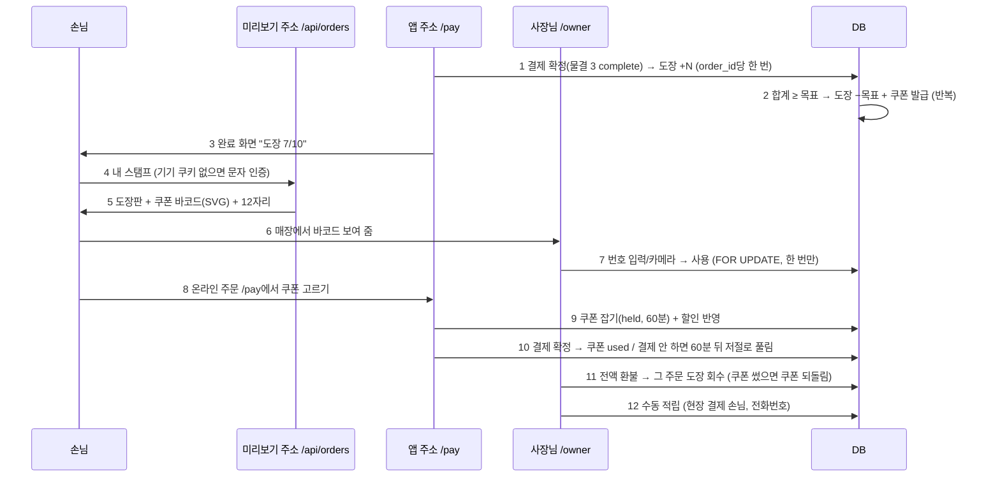

# 물결 4 계약서: 스탬프 자동 적립 · 바코드 쿠폰 발급·사용 · 결제 할인 (STAMP_WAVE4_CONTRACT)

> 2026-09-30 (KST) / Claude 작성, OpenCode 구현. 상위 계획 [APP_COMMERCE_PLAN](APP_COMMERCE_PLAN.md) §1 9~12번·§2 물결 4 (10/8~10/13), 결정 D56 ②③. 물결 3 [PAY_WAVE3_CONTRACT](PAY_WAVE3_CONTRACT.md) 위에 올린다.

## 0. 결론

- **도장은 결제 확정 때 자동**(`payments.complete`가 처음 `paid`로 바꾸는 자리), **전액 환불 때 회수**. 현장 결제 손님은 사장님이 `/owner`에서 전화번호로 **수동 적립**.
- **도장 수는 저장하지 않는다**: `stamp_events.delta` 합계가 곧 도장 수(APP_COMMERCE_PLAN §3). 같은 주문으로 두 번 적립·두 번 회수는 DB 유일 제약이 막는다.
- 목표 개수가 차면 **같은 트랜잭션에서 쿠폰 발급**(도장 −목표 + 쿠폰 1장). 넘친 도장은 이월.
- **쿠폰 = 12자리 숫자 + Code128 바코드(SVG, 서버에서 직접 그림, 외부 라이브러리 없음)**. 가게 안에서 유일, 서버 난수.
- **쓰는 길 두 개**: ① 매장에서 바코드 보여 주기 → 사장님이 `/owner`에 번호 입력(또는 카메라가 되는 기기에서 읽기) → 사용 ② 온라인 주문 결제 페이지에서 쿠폰 고르기 → 할인. 어느 쪽이든 **한 번만**(`FOR UPDATE`).
- **손님 화면 "내 스탬프"**는 미리보기 주소 `/api/orders/{site_key}/my`. 주문 때 받은 기기 기억 쿠키(경로 `/api/orders/{site_key}`)를 그대로 쓰고, 없으면 문자 인증 한 번. 따로 회원가입 없음.
- **자동 작업(cron) 없음**: 쿠폰 만료·결제 대기 중 잡아 둔 쿠폰 풀기는 읽을 때 시각으로 판단한다.

## 1. 흐름



| 번호 | 단계 | 설명 |
|---|---|---|
| 1 | 적립 | 규칙이 켜진 가게만. `per = order`면 주문 1건에 1개, `per = item`이면 수량 합. 쿠폰 할인으로 합계 0원인 주문도 적립(가게 선택 아님, 단순하게) |
| 2 | 발급 | 한 트랜잭션. 도장 30개 한꺼번에 들어오면(목표 10) 쿠폰 3장 |
| 3 | 완료 화면 | 물결 3 done 화면에 한 줄 추가. 규칙 꺼진 가게는 안 보임 |
| 4 | 내 스탬프 | 쿠키의 번호로 손님을 찾는다(§3.3 `device_phone`). 인증은 물결 3 주문 인증과 같은 화면 |
| 5 | 보기 | 도장판(목표 개수 칸), 쓸 수 있는 쿠폰(제목·기한·바코드·숫자), 쓴·지난 쿠폰은 흐리게 최근 5장. "화면을 밝게 하고 보여 주세요" |
| 6~7 | 매장 사용 | 사장님이 번호 입력 → 제목·손님 전화 뒤 4자리 확인 → "사용". 카메라는 `BarcodeDetector`가 있는 기기에서만 버튼이 보인다(iOS 사파리는 없음, APP_COMMERCE_PLAN §4) |
| 8~9 | 결제 할인 | `/pay`에 그 손님의 쓸 수 있는 쿠폰 목록. 고르면 `held`(잡아 둠) + `orders.discount`·`total`·`payments.amount` 다시 계산. 다른 쿠폰으로 바꾸거나 빼기 가능 |
| 10 | 확정 | `paid`가 되면 잡은 쿠폰 `used`. 합계 0원이면 포트원을 거치지 않고 바로 확정(§3.2) |
| 11 | 회수 | 전액 환불 때만. 부분 환불은 도장·쿠폰 그대로. 회수로 도장 합이 음수가 될 수 있다(이미 쿠폰을 받은 뒤) — 그대로 두고 다음 적립이 메운다. 이미 발급된 쿠폰은 취소하지 않는다 |
| 12 | 수동 적립 | 사장님이 전화번호 + 개수(1~10). 손님 명단(`customers.touch`)에 없으면 만든다. 인증 표시는 하지 않는다 |

## 2. 데이터 — 마이그레이션 `alembic/versions/0018_stamps_coupons.py`

| 표 | 칸 | 제약 |
|---|---|---|
| `stamp_rules` | `site_key` PK(FK shops), `active` bool 기본 false, `goal` int 기본 10(2~50), `per` text `order`·`item` 기본 `order`, `reward_title` text 기본 '음료 1잔 무료'(1~30자), `reward_kind` text `free`·`amount`·`percent` 기본 `free`, `reward_value` int 기본 0, `coupon_days` int 기본 90(7~365), `updated_by`, `updated_at` | |
| `stamp_events` | `id`, `site_key`(FK), `customer_id`(FK customers, CASCADE), `order_id`(FK orders, SET NULL, null 가능), `delta` int(0 아님), `reason` text `order`·`refund`·`manual`·`reward`, `coupon_id`(reward일 때), `by_user_id`, `created_at` | 부분 유일 인덱스 `(order_id, reason) WHERE order_id IS NOT NULL` — 같은 주문 적립·회수 한 번씩 |
| `coupons` | `id`, `site_key`(FK), `customer_id`(FK, CASCADE), `code` char(12) 숫자, `title`, `kind`, `value`, `status` `issued`·`held`·`used`·`expired`, `issued_at`, `expires_at`, `held_order_id`, `held_until`, `used_at`, `used_by`(user id 또는 'order'), `used_order_id`, `source` `stamp`·`owner` | `UNIQUE(site_key, code)`, 인덱스 `(site_key, customer_id, status)` |

- **쓸 수 있음** = `status = issued` 이고 `expires_at > 지금`, 또는 `status = held` 이고 `held_until < 지금`(버려진 결제). 이 판단은 `stamps.usable()` 한 곳에만.
- `expired` 상태는 읽을 때 바꿔 쓰지 않는다(화면에서만 "기간 지남"). 필요하면 나중에.
- 손님 삭제: `customers.purge_orphans`가 도장·쿠폰이 있는 손님은 지우지 않게 고친다(W4-C). 도장 기록 보관 기간은 CUSTOMER_PLAN 보관 규칙을 따르고, 이번 물결에서 새 규칙을 만들지 않는다.

## 3. 서버 구현 경계

### 3.1 `app/services/stamps.py` (신규, 도장·쿠폰 규칙은 여기에만)

```python
CODE_LEN = 12
HOLD_MINUTES = 60  # 결제 페이지 만료(15분)보다 길게 — 변경 이력 참고

def rule(site_key: str) -> dict | None: ...                 # 꺼졌거나 없으면 None
def set_rule(user_id: str, site_key: str, **fields) -> dict: # 범위 검사, 사람 말 ValueError
def balance(db, site_key: str, customer_id: int) -> int:     # delta 합
def earn(db, order_id: int) -> list[int]:
    """주문 적립(reason=order, 유일 제약으로 한 번) → 목표 넘으면 발급. 새 쿠폰 id 목록. 규칙 꺼짐·손님 없음이면 []."""
def revoke(db, order_id: int) -> None:
    """전액 환불: 그 주문 적립만큼 reason=refund 음수(한 번). 잡거나 쓴 쿠폰이 이 주문 것이면 issued로 되돌림."""
def manual(db, site_key: str, phone: str, count: int, by: str) -> dict:   # 1~10, 발급 포함
def issue(db, site_key: str, customer_id: int, *, source: str, title=None, kind=None, value=None) -> int:
    """코드 = f"{secrets.randbelow(10**12):012d}", 유일 충돌이면 다시(최대 5번)."""
def usable(db, site_key: str, customer_id: int) -> list[dict]: ...
def discount(coupon: dict, items: list[dict], subtotal: int) -> int:
    """free: 주문에서 가장 비싼 한 개의 단가(value>0이면 그 값이 상한). amount: min(value, subtotal).
    percent: subtotal*value//100 (1~100). 결과는 0~subtotal."""
def hold(db, order_id: int, coupon_id: int | None) -> dict:
    """결제 대기 주문에 쿠폰 잡기/바꾸기/빼기(None). 주문·결제·쿠폰 FOR UPDATE.
    같은 손님·같은 가게 쿠폰만. orders.discount/total, payments.amount 다시 계산. 반환 {subtotal, discount, total}."""
def settle_held(db, order_id: int) -> None:       # paid 순간: held → used(used_by='order')
def redeem(db, site_key: str, code: str, by: str) -> dict:
    """매장 사용. 숫자만 남겨 12자리 아니면 ValueError. 다른 가게·없음 → LookupError.
    쓸 수 없음(used·기간 지남·결제 대기 중 held) → ValueError('이미 쓴 쿠폰이에요' 등). 성공 {title, phone_last4, used_at}."""
```

### 3.2 물결 3 코드에 붙이는 곳 (W4-C)

| 파일 | 붙이는 것 |
|---|---|
| `app/services/payments.py` `complete` | 처음 `paid`가 되는 트랜잭션 안에서 `stamps.settle_held` → `stamps.earn`. 알림 문구 끝에 "쿠폰 사용"(있으면) |
| `app/services/payments.py` `refund` | 남은 금액이 0이 되는 트랜잭션 안에서 `stamps.revoke` |
| `app/services/payments.py` | `complete_free(pay_id)`: 합계 0원 결제를 포트원 없이 `paid`(provider='manual', method='coupon'). `hold` 뒤 합계가 0이면 `/pay`가 결제창 대신 "쿠폰으로 주문하기" 버튼 → 이 함수 |
| `app/api/orders.py` | `POST /pay/{pay_id}/coupon` `{coupon_id|null}` → `stamps.hold`, `/pay` 화면에 쿠폰 목록·할인·합계, done 화면에 "도장 N/목표" |
| `app/api/orders.py` | 내 스탬프 `GET /api/orders/{site_key}/my`, 인증 `POST /api/orders/{site_key}/my` (전화 → 인증 화면, 성공 → 쿠키 + my로 303) |
| `app/services/phone_verify.py` | `device_phone(cookie, site_key) -> str | None`: `device_ok`와 같은 서명·만료 검사, 맞으면 쿠키 안 번호 |

- **쿠키 경로**: 물결 3 주문 인증이 기기 쿠키를 `path=/api/orders/{site_key}`로 둔다(PAY_WAVE3 §3.3에 명시). 그래서 `/my`에서 그 쿠키가 온다. 예약 쿠키(`/api/bookings/…`)는 따로다 — 합치지 않는다.
- `/pay` 쿠폰 변경은 앱 주소 폼 POST(스크립트 없이도 동작), `_check_origin` 적용.

### 3.3 `app/services/barcode.py` (신규)

```python
def code128c_svg(digits: str, *, height: int = 80, module: int = 2) -> str:
    """짝수 자리 숫자 → Code128 코드 C SVG 문자열. 시작 C(105) + 두 자리씩 + 검사값((105 + Σ값×위치) % 103) + 멈춤.
    양옆 조용한 여백 10모듈, 흰 바탕 검정 막대(색 토큰 쓰지 않음 — 스캐너 대비), role="img" aria-label="쿠폰 번호 {digits}"."""
```

- 막대 패턴 표 107개(0~106)를 파일 안 상수로. 외부 호출·라이브러리 없음. SVG는 `<rect>`만, 스크립트 없음.
- 숫자는 바코드 아래에 4자리씩 띄어서 글자로도(`1234 5678 9012`), 16px 이상.

### 3.4 공개 사이트

- 규칙이 켜진 가게는 `site_data.resolve`가 `navbar.links`에 `{"label": "스탬프", "href": "/api/orders/{site_key}/my"}`를 더한다(링크 4개 한도 안이면). `design.publish_choice`·`render_variants`가 렌더 전에 `stamps.rule(site_key)`를 보고 `spec["stamps"] = True`를 둔다(물결 3 `order_form`과 같은 방식).
- `site_render._app_tabs`: 구역 링크 검사(`href[1:] in body_ids`)에 **`/api/orders/` 로 시작하는 링크도 통과**를 더한다. 아이콘 낱말표에 `("스탬프", "쿠폰")` → 도장 모양 한 줄.
- 규칙을 켜거나 끄면 공개본이 있으면 다시 공개.

### 3.5 사장님 화면 (`app/api/owner.py` + `static/owner.html` "스탬프·쿠폰" 탭)

| 경로 | 하는 일 |
|---|---|
| `GET·PUT /api/owner/shops/{site_key}/stamps/rule` | 규칙 보기·바꾸기(켜기, 목표, 적립 기준, 혜택 이름·종류·값, 기한) |
| `POST /api/owner/shops/{site_key}/coupons/redeem` `{"code"}` | `stamps.redeem`. 응답을 화면에 크게: "음료 1잔 무료 · 손님 ****5678 · 사용 완료" |
| `POST /api/owner/shops/{site_key}/stamps/manual` `{"phone", "count"}` | 수동 적립. 응답 `{balance, issued: n}` |
| `POST /api/owner/shops/{site_key}/coupons/issue` `{"phone", "title"?}` | 사장님이 직접 쿠폰 한 장(source=owner, 규칙의 혜택 기본값) |
| `GET /api/owner/shops/{site_key}/coupons?status=` | 최근 50장: 번호 뒤 4자리·제목·손님 뒤 4자리·상태·날짜 |

- 화면: 맨 위 "쿠폰 사용" 입력칸(숫자 키패드 `inputmode="numeric"`, 12자리 되면 바로 확인 단계) + 카메라 버튼(`'BarcodeDetector' in window`일 때만, `formats: ['code_128']`, 읽으면 입력칸에 넣고 멈춤). 그 아래 수동 적립, 쿠폰 보내기, 규칙, 최근 쿠폰.
- 권한은 기존 `_shop`, 쓰기는 `_check_origin`. 번호 입력 오타가 많으면 막기: 같은 사장님이 1분에 틀린 번호 10번이면 1분 잠금(메모리, 문의 IP 제한과 같은 방식).

## 4. 작업 묶음 (OpenCode)

| 묶음 | 담당 파일(이것만 고친다) | 선행 | 날짜 |
|---|---|---|---|
| W4-A 도장·쿠폰 코어 | `alembic/versions/0018_stamps_coupons.py`(신규), `app/db/models.py`(표 3개 추가만), `app/services/stamps.py`(신규), `tests/unit/test_stamps.py`(신규) | 물결 3 커밋 | 10/8~10/9 |
| W4-B 바코드 | `app/services/barcode.py`(신규), `tests/unit/test_barcode.py`(신규) | 없음 | 10/8 |
| W4-C 손님·결제 연결 | `app/services/payments.py`, `app/api/orders.py`, `app/services/phone_verify.py`(`device_phone`만), `app/services/customers.py`(`purge_orphans`만), `app/services/site_data.py`(§3.4), `app/services/design.py`(§3.4), `app/services/site_render.py`(`_app_tabs`·아이콘만), `tests/unit/test_stamps_api.py`(신규) | A·B | 10/10~10/12 |
| W4-D 사장님 화면 | `app/api/owner.py`(§3.5 경로), `static/owner.html`(탭), `tests/unit/test_owner_stamps.py`(신규) | A·B | 10/10~10/12 |
| W4-E 확인 | Claude: 실제 휴대폰으로 바코드 1회 읽기(사장님 화면 카메라 또는 일반 바코드 앱), 결제→적립→발급→매장 사용→두 번째 사용 거절 흐름 390px 캡처 | C·D | 10/13 |

차례: **A ∥ B** → **C ∥ D** → E.

**하지 말 것**:
- 도장 수를 따로 저장하는 칸·캐시 금지(합계로만). `stamp_events`·`coupons` 행 삭제 금지(상태만 바꿈).
- 쿠폰 번호를 순서대로·시각으로 만들기 금지(서버 난수만). 쿠폰 번호 전체를 로그·사장님 목록에 찍지 않기(뒤 4자리만, 손님 화면만 전체).
- 새 pip·npm 의존성, 외부 바코드 서비스·CDN 금지. 공개 사이트에 스크립트 추가 금지.
- 물결 3에서 정한 금액 규칙(서버 가격만, 포트원 조회 대조)을 우회하는 코드 금지. 할인은 `stamps.discount` 한 곳에서만.
- `publish_check.py`, 섹션 템플릿, 청사진 JSON 수정 금지. 커밋은 pytest 종료 코드 0 뒤에만, 묶음마다 따로 테스트 DB.

## 5. 합격 테스트

| 번호 | 테스트 | 파일 |
|---|---|---|
| 1 | `earn` 두 번 불러도 한 번 적립, `per=item`이면 수량 합, 규칙 꺼지면 0 | `test_stamps.py` |
| 2 | 목표 10에 도장 25개 → 쿠폰 2장·남은 도장 5 | `test_stamps.py` |
| 3 | `revoke` 두 번 불러도 한 번, 부분 환불(=`revoke` 안 부름)은 그대로, 쓴 쿠폰 되돌림 | `test_stamps.py` |
| 4 | `redeem`: 성공 뒤 두 번째 거절, 다른 가게 번호 LookupError, 기간 지남 거절, 12자리 아님 거절, **두 스레드가 동시에 써도 한 번만 성공** | `test_stamps.py` |
| 5 | `discount`: free는 가장 비싼 한 개(상한 적용), amount·percent 경계, 음수·합계 초과 없음 | `test_stamps.py` |
| 6 | `hold`: 다른 손님 쿠폰 거절, 바꾸기·빼기 뒤 금액 복원, 잡힌 쿠폰은 매장 사용 거절, 60분 지나면 다시 쓸 수 있음, 15분 지난 주문은 잡기 거절 | `test_stamps.py` |
| 7 | 바코드: 패턴 107개가 모두 6개 막대·합 11모듈이고 서로 다름, 알려진 입력의 검사값, 홀수 자리·숫자 아님 ValueError, SVG에 `<script` 없음 | `test_barcode.py` |
| 8 | 결제 확정 → 도장 +1, 합계 0원 쿠폰 주문 → 포트원 부르지 않고 paid + 쿠폰 used, 전액 환불 → 도장 회수 | `test_stamps_api.py` |
| 9 | `/my`: 쿠키 없으면 전화 입력, 인증 뒤 도장판·바코드, 다른 가게 쿠키로는 못 봄, 쿠폰 번호는 이 화면에만 전체 | `test_stamps_api.py` |
| 10 | 규칙 켠 가게 공개본 내비·앱형 탭에 "스탬프" 링크, 공개 전 검사 통과, 끄면 없음 | `test_stamps_api.py` |
| 11 | 사장님: 다른 가게 쿠폰 사용 404, 수동 적립 11개 거절, 규칙 범위 밖 400, 목록에 번호 전체 없음 | `test_owner_stamps.py` |
| 12 | 실제 휴대폰으로 바코드 읽기 1회 + 전체 흐름 390px 캡처 | W4-E |

## 6. 위험

| 위험 | 대응 |
|---|---|
| 바코드를 스캐너가 못 읽음 | 흰 바탕·검정 막대·조용한 여백·모듈 2px 이상. W4-E에서 실제 기기로. 안 되면 숫자 입력이 기본 길 |
| 결제 버리고 쿠폰이 묶임 | `held_until` 60분 뒤 저절로 쓸 수 있음(cron 없음) |
| 환불 뒤 도장 음수 | 허용(§1 11번). 화면에는 0 이하를 0으로 보인다 |
| 한 사람이 번호 여러 개로 도장 모으기 | 문자 인증으로 번호 소유는 확인됨. 그 이상(기기·사람 묶기)은 하지 않는다 — 소규모 가게 규모에서 수동 적립보다 위험하지 않음 |
| 일정(10/13) 밀림 | APP_COMMERCE_PLAN §4대로 베타는 수동 적립 + 매장 사용만 먼저(W4-C의 결제 할인은 뒤로) |

## 변경 이력

| 날짜 | 내용 |
|---|---|
| 2026-09-30 | 처음 작성 |
| 2026-09-30 | W4-A 검토: 쿠폰 잡기 15분→60분. 15분이면 14분에 연 결제창이 16분에 끝날 때 그 사이 풀린 쿠폰이 매장·다른 주문에서 한 번 더 쓰일 수 있었다. 결제 페이지는 15분 뒤 새 결제창을 안 열고, 15분 지난 주문은 쿠폰 잡기 거절 |
