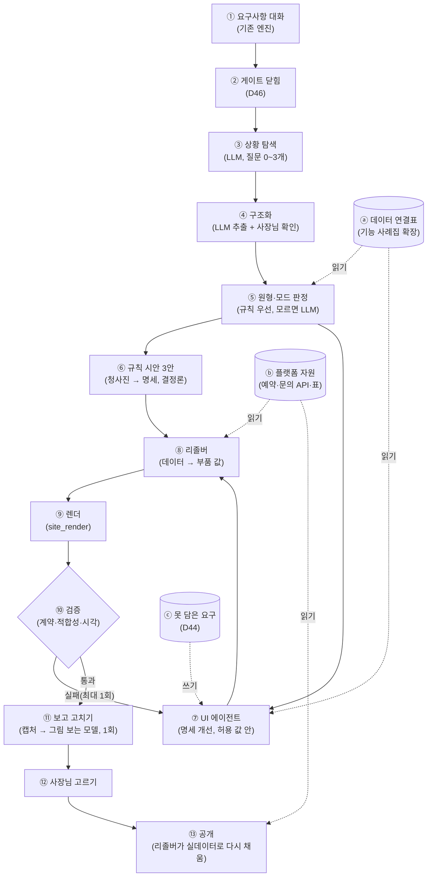
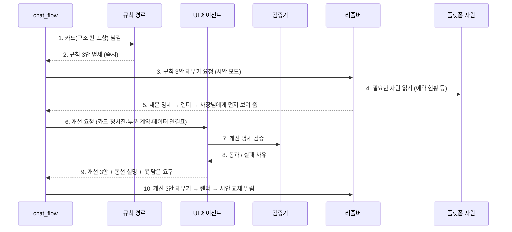

# 요구사항 → UI 에이전트와 데이터 연결 계획 (UI_AGENT_PLAN)

> 2026-09-28 (KST). 대표 질문 세 가지:
> ① 정답 시안 품질이 학원이나 다른 요구사항에서도 동적으로 나올 수 있나?
> ② 요구사항 → UI를 에이전트로 만들어야 하나?
> ③ UI 에이전트가 DB 에이전트와 연결돼, 필요할 때 데이터를 매핑해야 하나?
>
> 지킬 것: D31(AI는 화면만, 서버·DB는 플랫폼 공용), D38(AI는 명세를 쓰고 그리는 건 엔진), D26(사실 지어내지 않기), D53(예시 값은 시안 전용), D47(10/15 동결, 10/17 베타).
> 구현 계약·작업판: [BUILD_W1_W2](BUILD_W1_W2.md) (D54).
> 선행 문서: [DESIGN_FIT_PLAN](DESIGN_FIT_PLAN.md)(부품·정답 시안·색), [MOTION_PLAN](MOTION_PLAN.md), [FEATURE_CATALOG](FEATURE_CATALOG.md), [DATA_ARCHITECTURE_REVIEW](DATA_ARCHITECTURE_REVIEW.md).

## 0. 답

| 질문 | 답 | 핵심 |
|---|---|---|
| ① 동적 생성 | **가능하다. 단, 업종이 아니라 '손님 동선 원형'으로 일반화해야 한다** | 업종은 끝이 없지만 손님이 움직이는 방식은 8가지 정도다. 원형 8개 × 공용 부품 × 구조 데이터로 만들면, 학원·필라테스·반려견 미용처럼 처음 보는 업종도 가까운 원형에 붙어 같은 품질이 나온다 |
| ② 에이전트로? | **예. 단, 울타리를 친 에이전트** | 흐름은 정해진 파이프라인이고, LLM은 4곳(상황 탐색·원형 판정·명세 쓰기·보고 고치기)에서만 판단한다. HTML은 쓰지 않는다. 규칙 경로가 먼저 3안을 만들고, 에이전트가 더 나은 안으로 바꾼다 |
| ③ DB 에이전트 연결 | **매핑은 필요하다. DB 에이전트는 두지 않는다** | 사이트마다 표를 만들거나 SQL을 쓰는 에이전트는 D31 위반이고 위험하다. 대신 **부품 ↔ 데이터 연결표(계약) + 리졸버(결정론 코드)**로 매핑한다. UI 에이전트는 "지금 쓸 수 있는 데이터 목록"만 보고 부품을 고른다. 새 데이터가 필요하면 D44 느린 경로(사람 승인)로 간다 |

## 1. 정답 시안 품질은 어디서 나왔나 → 무엇을 자동화하나

| # | 품질 요소 | 정답 시안에서 누가 했나 | 자동화 담당 |
|---|---|---|---|
| Q1 | 동선에 맞는 부품과 순서 (메뉴판 → 길찾기, 디자이너 → 예약) | 사람(Claude)이 명세를 손으로 씀 | **원형 청사진**(결정론) + **UI 에이전트**(동선 3가지 중 강조 고르기) |
| Q2 | 구조 데이터 (분류·가격 짝·디자이너·예약 현황) | 사람이 카드 값을 나눠 적음 | **구조화 단계**(LLM 추출 + 사장님 확인) → 카드 구조 칸 |
| Q3 | 맥락 사진·예시 값 ('예시' 표시) | 사람이 사진·예시 가격을 고름 | **예시 팩**(원형·슬롯별 사진) + 원형별 예시 값 표. 리졸버가 빈 칸에만 채움 |
| Q4 | 색 역할·제목·문구 | 사람이 팔레트·제목을 고름 | **UI 에이전트**(허용 목록 안에서 톤·팔레트·제목·문구) + 색 채점(DESIGN_FIT_PLAN §11) |

## 2. 손님 동선 원형 8개

| 원형 | 예시 업종 | 주 행동 | 핵심 부품 | 구조 데이터 | 상황 질문 예 (LLM이 고름) | 부품 상태 |
|---|---|---|---|---|---|---|
| **A 방문·메뉴형** | 카페·식당·베이커리·주점 | 길찾기 / 주문 | 분류 메뉴판, 공간, 예시 지도, 주문 준비 중 | `catalog` | 메뉴 분류, 주문 방식 | ✅ |
| **B 사람 예약형** | 미용실·네일·피부·PT·1:1 레슨·병원 | 예약 (담당자 지정) | 디자이너(여러 명/1인), 예약 현황, 시술·가격 | `staff`, `services`, `schedule` | 혼자/여러 명, 지정 예약 | ✅ |
| **C 공간 예약형** | 펜션·캠핑·스튜디오·파티룸 | 날짜 예약 | 객실 카드, 날짜 달력, 주변·지도 | `rooms`(인원·시즌 요금), `schedule` | 객실 수, 성수기 여부 | 필요: `rooms--cards`, `booking--dates` |
| **D 상담·등록형** | 학원·교습소·과외·태권도·어린이 수영 | 상담 신청 | 반 카드, 주간 시간표, 선생님, 상담 예약, 고민 말풍선 | `classes`(대상·요일·시간·정원·수강료), `teachers` | 대상 학년, 반 운영 방식, 차량·체험 수업 | 필요: `classes--cards`, `timetable--week` (나머지는 재사용) |
| **E 클래스·체험형** | 공방·원데이·쿠킹 | 회차 신청 | 회차 목록(잔여석), 작품, 수업 카드 | `sessions`(날짜·잔여석), `classes` | 원데이/정규, 정원 | 필요: `sessions--list` |
| **F 작업·의뢰형** | 사진·인테리어·개인 전문가·연주자 | 문의·견적 | 작업 격자, 패키지 가격, 진행 순서 | `works`, `packages` | 주력 작업, 견적 방식 | 필요: `works--grid`, `packages--cards` |
| **G 모임·단체형** | 동호회·교회·봉사단체 | 가입·참여 | 활동, 일정 목록, 공지 | `events`, `notices` | 가입 조건, 정기 모임 | 필요: `events--list` |
| **H 서비스·상품형** | 웹서비스·작은 판매 | 가입·문의 (결제는 D32④) | 기능 소개, 요금제, 자주 묻는 질문 | `plans`, `faq` | 무료 체험, 요금제 수 | 필요: `pricing--plans`, `faq--list` |

**지금 업종 키 → 원형**: `cafe`·`restaurant` → A, `salon` → B, `pension` → C, `academy` → D, `workshop` → E, `individual` → F(1:1 레슨이면 B), `group` → G, `webservice` → H, `other` → LLM이 판정한다(§4 T2).

### 예: 학원(D)이 정답 시안 품질로 나오려면

| 항목 | 내용 |
|---|---|
| 상황 질문 (LLM, 질문 한도 밖) | "주로 어떤 학년인가요?" / "반은 정원과 레벨로 나누세요?" / "차량 운행·체험 수업이 있나요?" (이미 답한 것은 묻지 않는다) |
| 구조화 | "초등 파닉스반 월·수 4시 8명 18만원" → `classes[{name, target, days, time, capacity, fee}]`. 시간표 사진을 올리면 그림 읽는 모델이 뽑고 사장님이 확인한다 |
| 동선 3가지 | ① 반·시간표형(우리 아이에게 맞는 반 찾기 → 상담) ② 선생님·신뢰형(원장 소개·수업 방식 → 상담) ③ 상담 우선형(학부모 고민 말풍선 → 체험 수업 신청) |
| 부품 | 첫 화면, `concerns--bubbles`(있음), **`classes--cards`(새로)**, **`timetable--week`(새로)**, `staff--solo/team`(재사용), `booking--slots` 라벨 '상담 예약'(재사용), 편의 아이콘(차량), 예시 지도 |
| 예시 값 | 수강료를 모르면 '예시' 표시를 붙인 지역 평균 수준 값. 공개할 때 빠진다(D53①) |

## 3. 전체 흐름

| 번호 | 단계 | 누가 | 설명 |
|---|---|---|---|
| ① | 요구사항 대화 | 기존 엔진(NIM) | 지금 그대로 |
| ② | 게이트 닫힘 | 결정론 | D46. 빠진 확인이 남아 있으면 다음 단계로 가지 않는다 |
| ③ | 상황 탐색 | LLM 1회 | D53③. 허용 목록(`team_mode`·`order_mode`·`class_structure`…)에서 0~3개 고른다. 엔진이 중복·개수를 검증한다 |
| ④ | 구조화 | LLM + 사장님 | 메뉴판·시간표 사진, 말로 한 목록 → 구조 칸. **사장님 확인 전에는 FILLED가 아니다**(D26) |
| ⑤ | 원형·모드 판정 | 결정론 → LLM | 업종 키가 원형표에 있으면 규칙으로, `other`면 LLM이 8개 중 고르고 이유 한 줄을 남긴다 |
| ⑥ | 규칙 시안 | 결정론 | 청사진 JSON으로 3안을 **즉시**(1초 안) 만든다. 에이전트가 실패해도 이 안이 나간다 |
| ⑦ | UI 에이전트 | LLM(D39 유료 모델) | §4. 제목·문구·강조 순서·톤·팔레트를 **허용 값 안에서** 고친다. 못 담은 요구는 ⓒ에 기록 |
| ⑧ | 리졸버 | 결정론 | §5.4. 카드 구조 칸·플랫폼 자원·계산 값을 부품 content로 채운다. 빈 칸만 예시 값(표시 붙음) |
| ⑨ | 렌더 | 결정론 | 기존 `site_render` |
| ⑩ | 검증 | 결정론 | 부품 계약(SECTION_LIBRARY_SPEC §2.9), `draft_fit`(원형별 항목 포함), `draft_score`(시각·색). 실패하면 사유를 붙여 ⑦에 한 번 돌려보낸다 |
| ⑪ | 보고 고치기 | 그림 보는 모델 1회 | 390px 캡처를 보고 명세 패치(D42③). 패치도 ⑩을 다시 지난다 |
| ⑫ | 고르기 | 사장님 | 안마다 동선 설명 한 줄("디자이너 고르고 → 시간 고르기") |
| ⑬ | 공개 | 결정론 | 리졸버가 공개 모드로 다시 채운다. 예시 제거, 예약 현황은 확정 예약으로 계산 |
| ⓐ | 데이터 연결표 | 파일 | §5.3. 기능마다 부품·자원·상태. 에이전트는 "상태가 ready인 것"만 고른다 |
| ⓑ | 플랫폼 자원 | 공용 API·표 | 예약(`bookings`), 문의(`inquiries`). 나중에 주문·회원(D32) |
| ⓒ | 못 담은 요구 | 기존 `design_log.unmet` | D44 측정. 쌓이면 새 부품·새 자원 후보 |

### 한 번 생성할 때의 호출 순서

| 번호 | 설명 |
|---|---|
| 1~2 | 규칙 경로는 LLM 없이 청사진으로 만든다. 비용 0, 1초 안 |
| 3~5 | 사장님은 기다리지 않고 규칙 3안을 먼저 본다 |
| 6 | 에이전트 입력에 전화·주소는 넣지 않는다(D39: 업종·분위기·상품 이름·사진만) |
| 7~8 | 반복은 최대 2회. 넘으면 규칙 안을 유지한다 |
| 9~10 | 개선 안이 나오면 "시안을 더 다듬었어요" 한 줄과 함께 바꾼다(U3 결정에 따라 기다렸다가 한 번에 보여 줄 수도 있음) |

## 4. UI 에이전트 설계

| 항목 | 내용 |
|---|---|
| 정의 | **명세만 쓰는 울타리 친 에이전트.** 출력은 3안 명세 + 안별 동선 설명 + 못 담은 요구. HTML·CSS·SQL을 쓰지 않는다 |
| 입력 | 카드(구조 칸), 원형 청사진, 부품 계약(JSON 스키마), 데이터 연결표(ready 목록), 사진 목록·주요 색, 색 규칙 |
| 도구 | T1 `list_components(원형)` · T2 `pick_archetype(카드)`(other일 때만) · T3 `validate_spec(명세)` → 오류 목록 · T4 `score(명세)` → draft_fit·draft_score 결과 · T5 `screenshot(명세)` → 390px 그림(⑪) · T6 `record_gap(요구)`. **쓰기 도구는 T6뿐이다** |
| 울타리 | 부품·변형·토큰은 허용 목록 값만. 사실 칸은 카드 값만(D26). 지어낸 값은 `*_example`·`example` 표시를 강제한다(검증기가 확인). 반복 최대 2회, 시간 목표 20초, 비용은 D39 월 한도(넘으면 규칙 경로만) |
| 모델 | 명세·보고 고치기는 D39 비교에서 이긴 유료 모델. 대화·상황 탐색은 NIM 그대로 |
| 왜 한 번 호출이 아니라 에이전트인가 | 검증 실패 → 고치기, 캡처 → 고치기처럼 **결과를 보고 다시 하는 고리**가 품질의 핵심이라서 |
| 왜 자유 에이전트가 아닌가 | D31 보안, 비용·지연, 같은 입력에 같은 결과(재현성). 자유 생성 실측은 23분 뒤 멈춤으로 실패했다(D39) |
| 정리할 것 | 지금 시안 생성과 나란히 도는 자유 코드 생성(`codegen.start`, Hermes)은 이 흐름과 겹친다. 에이전트를 켤 때 끌지를 결정한다(U6) |

## 5. 데이터 연결 (DB 에이전트 대신)

### 5.1 결정: 실행 중에는 DB 에이전트를 두지 않는다

| 이유 | 설명 |
|---|---|
| 보안 (D31) | 사이트마다 AI가 표·SQL을 만들면 권한·개인정보·주입 위험을 한 곳에서 지킬 수 없다 |
| 운영 | 가게마다 다른 스키마는 백업·이관·장애 대응을 불가능하게 만든다 |
| 필요 없음 | 소상공인 사이트의 데이터는 몇 종류(메뉴·사람·수업·예약·문의)로 수렴한다. 공용 표 몇 개로 충분하다 |

### 5.2 부품 데이터 연결 4종

| 종류 | 출처 | 예 | 언제 채우나 |
|---|---|---|---|
| 정적 내용 | 카드 구조 칸 (편집 화면 D27로 고침) | 메뉴판, 디자이너, 반 목록, 시간표 | 렌더할 때 |
| 플랫폼 자원 | 공용 API·표 | 예약 신청 폼 → `bookings`, 문의 폼 → `inquiries` | 폼 주소는 렌더할 때 |
| 계산 값 | 구조 칸 + 플랫폼 자원 | 예약 현황 = 영업 일정 − 확정 예약. "지금 영업 중" | 공개할 때, 예약 확정·취소 때, 매일 00:05 KST |
| 외부 링크 | 사장님이 준 주소 | 네이버 예약, 배달앱, 카카오 채널, 지도 앱 | 렌더할 때 |

### 5.3 데이터 연결표 = 기능 사례집 확장

`app/data/feature_catalog.json`(42개, 판정 ready 19 · alternative 10 · owner_setup 2 · out_of_beta 11)에 세 칸을 더한다: `components`(부품), `binding`(위 4종), `resource`(자원). 에이전트는 이 표만 보고 "지금 만들 수 있는 것"을 안다.

| 기능 id (있음) | components | binding | resource | 상태 |
|---|---|---|---|---|
| `menu_board`·`price_list` | `offerings--categories` | 정적 | — | ready |
| `booking_calendar_custom` | `booking--slots` | 자원 + 계산 | `bookings` | ready (현황 계산은 2주차) |
| `lesson_schedule` | `timetable--week` (새로) | 정적 | — | 2주차 |
| `class_enrollment` | `classes--cards` + `booking--slots`(상담) | 정적 + 자원 | `bookings` | 2주차 |
| `portfolio`·`photo_album` | `works--grid`·`gallery--*` | 정적 | — | 부분 |
| `map_directions_link` | `around--map` 링크 | 외부 | — | ready |
| `map_api_embed` | `around--map` 예시 그림 | — | — | out_of_beta (D53②) |
| `payment_online`·`shopping_mall` | `order--soon` | — | — | out_of_beta → 주문 UI만 (D53⑤) |
| `inquiry_form` | `contact--form` | 자원 | `inquiries` | ready |
| `reviews_display` | `reviews--list` | 정적 | — | ready |

### 5.4 리졸버 (`app/services/site_data.py`, 새로)

| 항목 | 내용 |
|---|---|
| 함수 | `resolve(spec, card, site_key, mode="draft"｜"public") -> spec` |
| 하는 일 | 부품의 `binding`에 따라 content를 채운다. 빈 칸은 시안 모드에서만 원형별 예시 값(`*_example`)으로 채우고, 공개 모드에서는 `_drop_examples`(이미 있음)를 적용한다 |
| 예약 현황 계산 | 구조화된 영업 일정(요일별 시간, 휴무, 칸 길이, 동시 수용 = 1인 1·여러 명은 담당자별 1) − `bookings`의 확정 건(오늘~14일, KST) → `days`. 신청은 계속 '신청'이고 확정은 사장님이 한다(겹침 사고 방지) |
| 다시 그리는 때 | 카드 수정, 예약 확정·취소(`bookings.decide`), 매일 00:05 KST, 공개 |
| 테스트 | 원형별로 예시 채움 / 공개 제거 / 현황 계산(휴무·마감·담당자별)을 표로 검증 |

### 5.5 구조 데이터 저장 위치

| 시점 | 위치 | 이유 |
|---|---|---|
| 베타(10/17) | 카드 JSONB(`sessions.prd`) 안의 구조 칸 + JSON 스키마 검증 | 가게당 데이터가 작고, 편집 화면(D27)이 이미 카드를 고친다. 표를 늘리지 않는다 |
| 오픈(11/14) 전 | DATA_ARCHITECTURE_REVIEW 목표 구조의 `sites`에 딸린 `site_content`(JSONB, 스키마 버전) | 방을 지워도 사이트 내용이 남아야 한다 |
| 나중 | 행 단위 표(메뉴·재고·회원) | 주문·결제(D32④)나 가게 간 검색이 필요해질 때만 |

### 5.6 'DB 에이전트'가 쓸모 있는 곳 (개발할 때, 사람 승인)

못 담은 요구(ⓒ)가 쌓여 D44 조건을 넘으면, 개발용 에이전트(Claude·OpenCode)가 **새 플랫폼 기능 초안**(표·API·부품·연결표 한 줄)을 만든다. 사람이 검토하고 마이그레이션한다. 실행 중인 사이트가 스스로 표를 만드는 일은 없다.

## 6. 모든 원형에서 품질을 지키는 방법

| 장치 | 내용 | 기준 |
|---|---|---|
| 정답 시안 | 원형마다 2장 (8 × 2 = 16). 지금 A 2장·B 2장 | 원형을 켜기 전 대표 승인 |
| 적합성 코퍼스 | 원형마다 3건 이상(데이터 많음·적음·이상한 업종) = 24건 이상 | `draft_fit` 전부 PASS |
| 원형별 채점 | 학원: 반 카드 수 = 반 수, 시간표 요일, 상담 버튼이 첫 화면·내비·하단 바에 있음. 펜션: 객실 카드 수, 날짜 예약 | 100% |
| 원형 판정 정확도 | 처음 보는 업종 30개(필라테스→B, 어린이 수영→D, 반려견 미용→B, 공유오피스→C, 꽃집→A/E 등) | 90% 이상, 틀려도 3안 중 다른 동선이 맞으면 통과 |
| 그림 보는 모델 채점 | D37 6요소 + "이 가게답다" + 정답 시안과 나란히 | 매일 회귀 |
| 사람 비교 | D37 누가 만든지 모르게 비교 | 10/17 |

## 7. 일정 (KST, D47 10/15 동결)

| 주 | 할 일 | 산출·완료 기준 | 담당 |
|---|---|---|---|
| **1주 9/29~10/4** | 카드 구조 칸 + 스키마, 리졸버 뼈대(정적·외부·예시), 상황 탐색(LLM), 원형 판정(규칙), **청사진 A·B**를 `design_variants`에 연결 | 채팅으로 만든 카페·미용실 시안이 정답 시안 수준. `draft_fit` A·B 케이스 PASS | Claude(핵심), OpenCode(코퍼스·캡처) |
| **2주 10/5~10/11** | **학원(D)**: `classes--cards`·`timetable--week` + 청사진. **펜션(C)**: `rooms--cards`·`booking--dates`. UI 에이전트(명세 쓰기 + 검증 고리). 예약 현황 계산 + 다시 그리기. 데이터 연결표 3칸 추가 | 학원·펜션 정답 시안 승인, D·C 케이스 PASS, 에이전트 개선 안이 규칙 안보다 채점 우세 | Claude(에이전트·리졸버), OpenCode(부품 CSS·테스트) |
| **3주 10/12~10/15** | 보고 고치기 1회, E·F 최소 청사진(기존 부품으로), 원형 판정 30건, 색 채점, 동결 | 코퍼스 24건 PASS, 원형 판정 90% | 공동 |
| 10/17 이후 | G·H 원형 부품, 앱 모션(Motion), 사진에 맞춘 색 | D41 결과를 보고 순서 결정 | — |

## 8. 대표 결정 필요

| # | 결정 | 권장 |
|---|---|---|
| U1 | 원형 8개와 업종 매핑 | §2 표대로 |
| U2 | 에이전트 모델·예산 | D39 비교 결과로 모델을 정한다. 비교 전에는 규칙 경로 + NIM으로 먼저 연결 |
| U3 | 규칙 안을 먼저 보여 주고 개선 안으로 바꿀지, 개선 안이 나올 때까지(약 20초) 기다릴지 | **먼저 보여 주고 바꾸기**(이탈 방지). 바꿀 때 "더 다듬었어요" 한 줄 |
| U4 | 구조 데이터 저장 | 베타는 카드 JSONB, 오픈 전 `site_content` |
| U5 | 예약 현황 계산 규칙(칸 길이·동시 수용·휴무 입력) | 상황 탐색에서 "한 타임 몇 분? 동시에 몇 명?"을 묻고, 모르면 60분·1명 가정(ASSUMED) |
| U6 | 자유 코드 생성(Hermes `codegen.start`) | 에이전트를 켤 때 끈다(D31·D38과 겹침, 비용) |

## 9. 위험

| 위험 | 대응 |
|---|---|
| 원형 오판(예: 필라테스를 학원으로) | 규칙이 먼저 판정하고, 3안이 서로 다른 동선이라 사장님이 맞는 쪽을 고를 수 있다. "○○처럼 만들었어요" 한 줄로 알린다 |
| 에이전트 비용·지연 | 규칙 안이 먼저 나간다. 같은 카드 해시는 캐시한다. 월 한도를 넘으면 규칙 경로만 쓴다 |
| 부품이 끝없이 늘어남 | 원형당 새 부품 2개 이하. 사람·예약·지도·메뉴판은 공용으로 재사용한다 |
| 예약 현황 계산 오류 | 현황은 안내용이고, 확정은 사장님이 한다. 겹치는 신청은 채팅방 알림에서 표시한다 |
| 구조화 추출 오류 | 사장님 확인 전에는 FILLED가 아니다. 편집 화면에서 표로 고친다 |

## 변경 이력

| 날짜 | 내용 |
|---|---|
| 2026-09-28 | 처음 작성 (원형 8개, 울타리 친 UI 에이전트, DB 에이전트 대신 데이터 연결표 + 리졸버, 3주 일정) |
