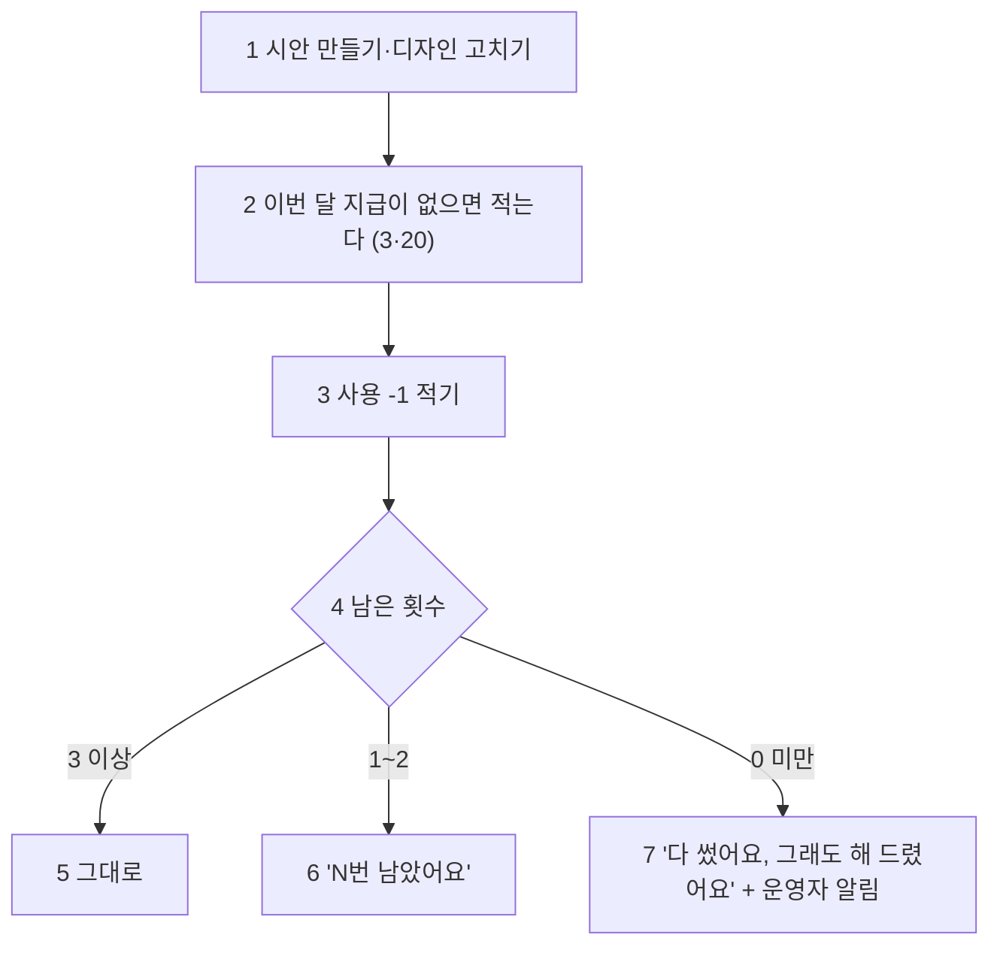

# 계약서: 무료 사용 한도 장부 (USAGE_QUOTA_CONTRACT)

> 2026-10-01 (KST) / Claude 작성·구현·검토. 결정 D40(무료 한도만, 돈은 받지 않음), D59(베타 구분 없이 바로), 정식 오픈 전 필수 O-5.
> 재사용: 운영자 알림 `ops_alert`(사건 기록 `funnel.record` → 텔레그램), KST 날짜, 디자인 경로 `chat_flow._start_design`·`chat_flow._restyle`·`builder_agent.apply`(style).

## 0. 결론

- 단위는 **"AI 작업 1회"**: 가게(사이트 키)마다 한 달에 **시안 만들기 3회 + 디자인 고치기 20회**. 달은 KST 달력, 1일에 다시 채워진다.
- **세는 것**: 채팅에서 시안 만들기(다시 만들기 포함), 디자인 고치기(채팅 "더 고급스럽게"·빌더 말로 고치기의 느낌 바꾸기).
- **안 세는 것**: 사실 고치기(직접 편집·칸·메뉴·공지·지도, D27 무제한), 보고 고치기, 템플릿으로 시작한 규칙 시안, 모양(1·2·3안) 고르기, 사진 올리기 뒤 다시 그리기.
- **넘어도 막지 않는다.** 그 답에 "이번 달 무료 ○○를 다 썼어요. 그래도 해 드렸어요 — 다음 달 1일에 다시 채워져요. 더 필요하면 말씀해 주세요"를 붙이고, 운영자 텔레그램으로 알린다(지불 의사 신호, `quota_exceeded` 사건). 2번 이하 남으면 "이번 달 무료 ○○ N번 남았어요".
- 장부 표 하나(`usage_ledger`)에 **지급(grant)·사용(use)·충전(topup)**을 적는다. 나중에 유료 충전을 붙일 수 있게. 충전은 이번에 만들지 않는다.
- 화면 말은 "토큰"이 아니라 **"무료 디자인 남은 횟수"**.

| 번호 | 단계 | 설명 |
|---|---|---|
| 1 | 일 | 실제로 시안을 만들었거나 느낌을 바꿨을 때만(못 알아들은 말은 안 셈) |
| 2 | 지급 | (가게, 달, 종류)마다 한 줄. 부분 고유 색인으로 두 번 안 생긴다 |
| 3 | 사용 | 한 번에 -1 |
| 4 | 계산 | 이번 달 합(지급 + 충전 - 사용) |
| 5 | 넉넉 | 안내 없음 |
| 6 | 조금 | 답 끝에 한 줄 |
| 7 | 넘음 | 막지 않음. 안내 + `funnel.record("quota_exceeded")` → 텔레그램(10분에 한 번) |

## 1. 데이터 (마이그레이션 0020)

| 열 | 뜻 |
|---|---|
| `id` | 번호 |
| `site_key` | 가게(사이트 키 = requirement_id). 공개 전에도 있으므로 shops에 묶지 않는다 |
| `month` | KST `YYYY-MM` |
| `action` | `design`(시안 만들기)·`restyle`(디자인 고치기) |
| `kind` | `grant`·`use`·`topup` |
| `amount` | 지급·충전은 +, 사용은 -1 |
| `created_at` | 시각 |

- 색인 (site_key, month, action), 부분 고유 색인 (site_key, month, action) WHERE kind='grant'.

## 2. 서버

| 번호 | 무엇 | 파일 |
|---|---|---|
| 1 | `usage.left(site)` → `{design: {left, total}, restyle: {left, total}, resets: "11월 1일"}`(읽기만, 지급이 없으면 기본값으로 계산) | `app/services/usage.py`(신규) |
| 2 | `usage.use(site, action)` → 지급 보장 + 사용 적기 → `{left, total, over}`. 넘으면 `quota_exceeded` 사건 | 같은 파일 |
| 3 | `usage.note(info, action)` → 답에 붙일 한 줄(넉넉하면 빈 글) | 같은 파일 |
| 4 | 시안 만들기: `_start_design`이 시안을 만든 뒤 `use(…, "design")`, 답에 안내 | `app/services/chat_flow.py` |
| 5 | 디자인 고치기: `_restyle`이 바꿨을 때, 빌더 `apply`의 style이 바꿨을 때 `use(…, "restyle")`, 답·notes에 안내 | `chat_flow.py`, `builder_agent.py` |
| 6 | 카드 보기(`GET /api/rooms/{id}/card`)에 `quota` | `app/api/card.py` |
| 7 | `quota_exceeded`를 서버 사건에, 텔레그램 글 `[한도] 가게 <키> · <종류> 무료 횟수 넘김 (지불 의사 신호)` | `funnel.py`, `ops_alert.py` |

## 3. 화면

- 빌더: 말로 고치기 줄 아래 작은 글 "무료 디자인 고치기 N번 남음 · ○월 1일에 다시 채워져요"(0이면 "이번 달 무료 횟수를 다 썼어요 · ○월 1일에 다시 채워져요"). 카드의 `quota`를 읽는다.

## 4. 합격 테스트

| 번호 | 테스트 |
|---|---|
| 1 | 기본 3·20, 쓰면 줄고, 지급 줄은 한 번만, KST 달이 바뀌면(UTC 10/31 15:30 = KST 11/1) 다시 가득 |
| 2 | 넘으면 막지 않고 over, 안내 문구, `quota_exceeded` 기록과 텔레그램 글 |
| 3 | 채팅 디자인 고치기는 셈, 못 알아들은 말은 안 셈. 빌더 style은 셈. 템플릿 시작·직접 편집은 안 셈 |
| 4 | 카드 보기에 quota |
| 5 | 빌더 화면에 남은 횟수 글 |

## 변경 이력

| 날짜 | 내용 |
|---|---|
| 2026-10-01 | 처음 작성 (D40·D59) |
