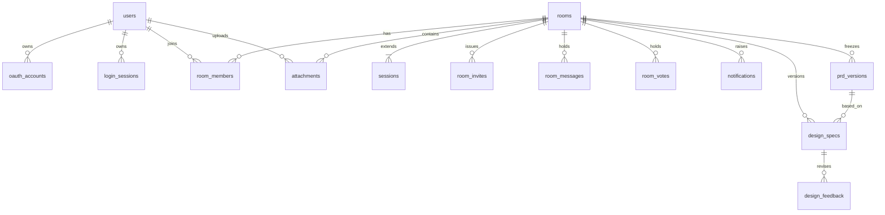
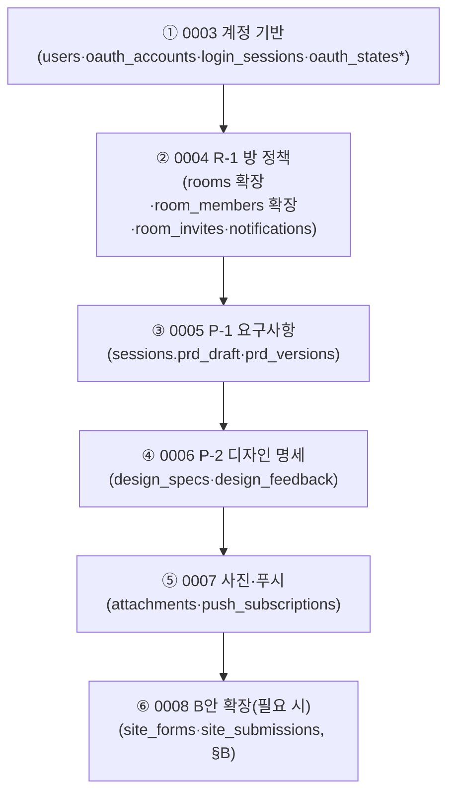
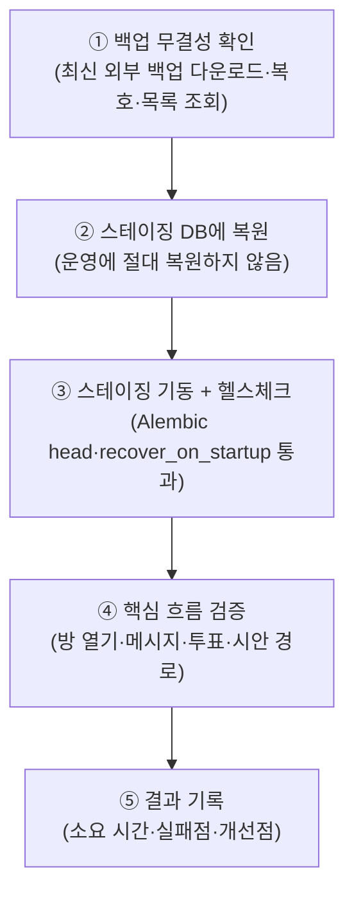
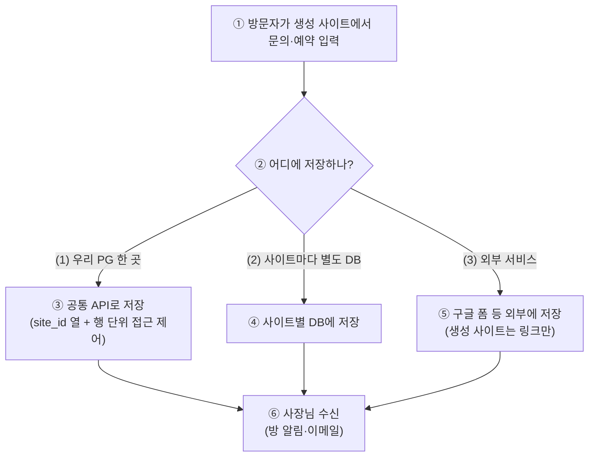

# 사용자 DB 배포·관리 계획 (USER_DB_PLAN)

> 작성일: 2026-09-25 / 검토자(L) / 성격: 설계 검토 문서. **코드는 수정하지 않는다.**
> 읽은 것: `app/db/models.py`, `alembic/versions/0001_initial.py`·`0002_funnel_events.py`, `app/store.py`, `app/main.py`(lifespan)·`app/db/migrate.py`·`app/db/session.py`·`app/config.py`, `docker-compose.yml`, `scripts/backup_db.sh`, `docs/product/DB_OPERATIONS.md`, `STAGE0_DESIGN.md` §6, `ROOM_POLICY.md` §6, `OAUTH_SETUP.md`, `DECISIONS.md`, `DESIGN_PIPELINE_PLAN.md` §9·§13, `REQUIREMENTS_ENGINE_PLAN.md` §5, `docs/hackathon/LANDING_AUTH_DB_UPLOAD_PLAN.md`(이하 LANDING_PLAN).
> 표기 규칙: 확인하지 못한 사실은 **확인 필요** + 출처 URL. 비용은 월 금액.

## 0. 전제 — 지금 상태와 "사용자 DB" 두 가지

| # | 항목 | 현재 값 | 출처 |
|---|---|---|---|
| 1 | 운영 DB | OCI 무료 인스턴스 1대(ARM 2 OCPU/12GB, 부트 볼륨 47GB) 위 compose `postgres:16-alpine` 1개. 외부 포트 없음, `mem_limit: 256m`, `shared_buffers=32MB`, `max_connections=30` | `docker-compose.yml` |
| 2 | 적용 완료 스키마 | 0001: `sessions`·`rooms`·`room_members`·`room_messages`·`room_votes` / 0002: `funnel_events` | `alembic/versions/` |
| 3 | 마이그레이션 | 기동 시 `alembic upgrade head` 자동 실행(`run_migrations_on_startup`, 기본 True) + 기동 복구(`recover_on_startup`) + 유입 이벤트 만료 삭제(`funnel.purge_expired`) | `app/main.py`, `app/db/migrate.py` |
| 4 | 백업 | 매일 03:30 KST `pg_dump --format=custom` → **같은 서버 디스크** `~/agt001-backups/`에 14개 보관 | `scripts/backup_db.sh`, `DB_OPERATIONS.md` |
| 5 | 연결 풀 | `pool_size=5, max_overflow=5` (DB `max_connections=30` 안에 맞춤) | `app/db/session.py` |
| 6 | "사용자 DB" 정의 | **A. 우리 서비스의 사용자 데이터** vs **B. 사장님이 만든 생성 사이트가 쓰는 데이터(방문자 문의·예약·방명록)**. 성격·책임이 다르므로 분리 설계 | 본 문서 |

---

## A. 우리 서비스의 사용자 데이터

### A-1. 스키마 전체 그림 (ERD) + 마이그레이션 순서

대상: 1단계 `users`·`oauth_accounts`·`room_members.user_id`, R-1 초대·알림(`ROOM_POLICY.md` §6), P-1 `prd_versions`(`REQUIREMENTS_ENGINE_PLAN.md` §5), P-2 `design_specs`(`DESIGN_PIPELINE_PLAN.md` §9), 4단계 `attachments`(LANDING_PLAN §3.1·§4).

| 번호 | 테이블 | 상태 | 주요 열 (신규는 ★) | 비고·출처 |
|---|---|---|---|---|
| ① | `users` | ★ 신규(0003) | `id`(uuid hex PK), `nickname`, `email`(NULL 허용), `kakao_talk_id`(선택), `created_at`, `deleted_at`(탈퇴 시각, NULL=정상) | 비밀번호 열 없음(OAUTH_SETUP §3·LANDING_PLAN §8). LANDING_PLAN §3.1의 `(provider, provider_user_id)` 단일 테이블 대신 **②로 분리** — 카카오·구글 두 계정을 한 사람에 묶으려면 분리형이 필요. D14 "로그인이 곧 가입"과 정합 |
| ② | `oauth_accounts` | ★ 신규(0003) | `provider`(kakao/google), `provider_user_id`(카카오 id/구글 sub), `user_id` FK→①, `UNIQUE(provider, provider_user_id)` | 식별자는 `sub`/회원번호. **email을 식별자로 쓰지 않음**(OAUTH_SETUP §2.4). 공급자 토큰(access/refresh)은 저장하지 않음(§A-2) |
| ③ | `login_sessions` | ★ 신규(0003) | `session_id` PK, `user_id` FK→①, `created_at`, `expires_at` | 이름 주의: LANDING_PLAN §3.1이 제안한 `sessions`는 **이미 채팅 상태 테이블이 쓰고 있어 충돌** → `login_sessions`로 명명. 서버 세션 쿠키는 ID만 보관(OAUTH_SETUP §3) |
| ④ | `rooms` | 0001 + R-1 확장 | 기존(`id`, `session_id` FK UNIQUE, `ai_status`) + ★`title`, `status`(ACTIVE/CLOSED/DELETED), `last_activity_at`, `closed_at`, `deleted_at`, `purge_after`, `template_id`(D15) | ROOM_POLICY §6 + DECISIONS "DB 필요 여부 판정". `last_activity_at`·`state_changed_at`(sessions)은 T1~T7 타이머 기준 |
| ⑤ | `room_members` | 0001 + R-1·1단계 확장 | 기존(`room_id`, `member_id`, `nickname`, `joined_at`, `last_seen`, `position`) + ★`member_handle`(공개 식별자), `member_token_hash`(비밀, 해시만), `role`(owner/member), `last_read_seq`, `left_at`, `removed_at`, `user_id` FK→① NULL 허용(게스트), `guest_member_id`(claim 매핑) | R-0 비밀/공개 분리 + 1-3 게스트 귀속. 기존 행 호환: 첫 접속 때 `member_id`→`member_token` 교환(ROOM_POLICY §1) |
| ⑥ | `room_invites` | ★ 신규(R-1) | `id`, `room_id` FK, `token_hash`(원문 미저장), `created_by`, `created_at`, `expires_at`(기본 7일), `max_uses`, `use_count`, `revoked_at` | 토큰 128비트 무작위, 링크 `/join/<토큰>` |
| ⑦ | `room_messages` | 0001 유지 | `id` BIGSERIAL PK, `room_id` FK, `seq`, `member_id`, `nickname`, `text`, `kind`, `ts`, `UNIQUE(room_id, seq)` | 대형 테이블 예고 — §A-3 마이그레이션 잠금 주의. 3단계 이후 `pg_trgm` 검색(ROOM_POLICY §3.1) |
| ⑧ | `room_votes` | 0001 유지 | `room_id`, `member_id`, `vote` | 변경 없음 |
| ⑨ | `notifications` | ★ 신규(R-1) | `id`, `room_id`, `recipient_member`, `kind`, `payload`, `dedup_key`(UNIQUE), `created_at`, `sent_at`, `channels`, `read_at` | 방해 금지(22–08)·중복 방지 키는 여기서 강제 |
| ⑩ | `push_subscriptions` | ★ 신규(R-5) | `id`, `member`/`user_id`, `endpoint`, `keys`, `created_at` | 웹 푸시 1차 채널(D6 알림톡 보류) |
| ⑪ | `prd_versions` | ★ 신규(P-1) | `id`, `room_id` FK, `version_no`, `card`(JSONB), `decided_by`(단독/투표), `decided_at` | 작업 초안은 `sessions.prd_draft`(JSONB: 칸·상태·근거 순번·질문 횟수) ★ 열 추가로 둠 |
| ⑫ | `design_specs` | ★ 신규(P-2) | `id`, `room_id` FK, `version_no`, `based_on_prd_version` FK→⑪, `spec`(JSONB), `status`(후보/선택/확정) | 토큰·섹션·`locked` 포함. 시안 이미지는 디스크(`generated/<id>/design/v<N>/`), DB는 경로만(§9) |
| ⑬ | `design_feedback` | ★ 신규(P-2) | `id`, `design_spec_id` FK→⑫, `section_id`, `raw_text`, `ops`(수정 목록 JSON), `result_version` | 원문(글·음성 전사)은 개인정보 아님. 음성 파일 자체는 저장하지 않음(권장, §A-2) |
| ⑭ | `attachments` | ★ 신규(4단계) | `id`(uuid PK), `room_id` FK, `uploader_member_id`, `uploader_user_id` FK→①(SET NULL), `original_name`, `stored_path`(상대경로), `mime`(jpeg/png/webp만), `size_bytes`, `sha256`, `caption`, `used_in_codegen`, `created_at` + `INDEX(room_id)` | 바이너리는 파일시스템(`generated/uploads/<room_id>/`), EXIF 제거·SVG 거부(LANDING_PLAN §4.2, DESIGN_PLAN §13.5 S-6) |
| ⑮ | `funnel_events` | 0002 운영 중 | `event`, `visitor_id`(무작위, 비식별), `session_id`, `source`, `campaign`, `template_id` | 개인정보 없음·**90일 보관**(D16). P-1·P-7 이벤트(`prd_*`, `design_*`)는 행 추가로 수용, 스키마 변경 불필요 |

`sessions` 본체(채팅 상태)는 0001 그대로 + ★`state_changed_at`(T1·T2 기준) + ★`prd_draft`(JSONB) 열만 추가한다.

#### 마이그레이션 순서 제안

| 번호 | 리비전 | 내용 | 왜 이 순서인지 |
|---|---|---|---|
| ① | 0003 계정 기반 | `users`, `oauth_accounts`, `login_sessions`, (`oauth_states`: state를 쿠키 대신 DB에 두는 경우만) | `room_members.user_id` FK의 부모. OAuth 구현(1-2)보다 먼저. `oauth_states`는 쿠키 방식이면 생략(OAUTH_SETUP §3) |
| ② | 0004 R-1 방 정책 | `rooms` 열 추가, `room_members` 열 추가(`member_token_hash` 등), `room_invites`, `notifications`, `rooms.template_id` | R-0 보안 수정이 최우선(ROOM_POLICY §1). 기존 행 백필(`member_handle` 생성·`last_activity_at` 초기화) 포함 |
| ③ | 0005 P-1 | `sessions.prd_draft`, `prd_versions` | 방 정책 뒤. 화면 없이 서버·테스트만(P-1a~P-1e) |
| ④ | 0006 P-2 | `design_specs`, `design_feedback` | P-1 뒤(기준 PRD 버전 참조). S-1 호스트 분리 뒤 P-5와 연결 |
| ⑤ | 0007 사진·푸시 | `attachments`, `push_subscriptions` | 4단계·R-5. 파일시스템 경로 규약과 함께 |
| ⑥ | 0008 B안 | `site_forms`, `site_submissions` | 베타 뒤 수요 확인 후에만(§B). A 스키마와 독립이라 언제든 추가 가능 |

### A-2. 개인정보

#### 무엇이 개인정보인지

| # | 데이터 | 어디에 | 개인정보 여부 | 근거·비고 |
|---|---|---|---|---|
| 1 | 닉네임 | `users.nickname`, `room_members.nickname` | **준-식별자(관리 대상)** | 단독 식별은 약하나 방 맥락과 결합 시 특정 가능. 최소 수집·표시 범위 제한 |
| 2 | 이메일 | `users.email` | **개인정보** | 구글은 제공, 카카오는 동의 시만. D14 "연락처 수집 안 함"과 충돌하지 않게 **로그인 제공 범위 내만** 저장 |
| 3 | 프로필 사진(URL) | `users` (추가 시) | **개인정보(얼굴 포함 가능)** | 저장은 URL만, 원본 미러링 금지 권장. 카카오 동의항목 최소(닉네임만)로 시작(OAUTH_SETUP §1.2) |
| 4 | 공급자 회원번호(`provider_user_id`) | `oauth_accounts` | **식별자(관리 대상)** | 카카오 id/구글 sub. 변경·재사용 없음. 외부 노출 금지 |
| 5 | `kakao_talk_id`(직접 입력) | `users` | **개인정보** | 선택 입력. 로그인 식별자로 사용 금지(LANDING_PLAN §2.1) |
| 6 | 전화·주소·영업시간(가게 정보) | `prd_versions.card`, `design_specs.spec` | **개인정보(자영업자 본인 정보)** | 사장님이 말한 것만 저장, 지어내기 금지(엔진 규칙 §3⑤). 사업장 정보라도 보호 대상 |
| 7 | `member_token_hash`, 초대 `token_hash` | `room_members`, `room_invites` | 개인정보 아님(인증 비밀) | **해시만 저장**(평문·원문 저장 금지). 로그 기록 금지 |
| 8 | 푸시 구독 `endpoint`·`keys` | `push_subscriptions` | **준-식별자(기기 연결)** | 탈퇴·구독 해지 시 즉시 삭제 |
| 9 | 사진 바이너리(EXIF GPS) | 파일시스템 + `attachments` 메타 | **개인정보 포함 가능** | EXIF 제거 필수(S-6). 원본 미보관 |
| 10 | `visitor_id`(무작위)·퍼널 이벤트 | `funnel_events` | **개인정보 아님**(설계상) | IP·UA를 저장하지 않는 한. 저장하면 즉시 개인정보로 격상 → 저장 금지 |
| 11 | 서버 로그(IP·접근 기록) | 컨테이너·Caddy 로그 | **개인정보 해당 가능** | Quiet: 로그 보존 기간을 정하고(예: 30일) 순환. **확인 필요** — https://www.pipc.go.kr (개인정보보호위) |
| 12 | OAuth access/refresh 토큰 | — (저장 안 함) | 저장 시 고위험 비밀 | **저장하지 않는다**(OAUTH_SETUP §3). 나중에 필요(알림 등)해지면 별도 WP에서 암호화(Fernet 등) 설계 |

#### 최소 수집·암호화·탈퇴·보관

| 영역 | 결정 |
|---|---|
| 최소 수집 | 닉네임만 필수(카카오). 이메일·프로필 사진은 제공된 것만, `kakao_talk_id`는 입력한 사람만. 퍼널에 IP/UA 저장 금지. 음성 파일 저장 금지(전사 텍스트만). D14 유지 |
| 암호화가 필요한 열 | ① 저장하지 않음으로 해결: OAuth 토큰·세션 쿠키 값(쿠키엔 ID만). ② 해시로 해결: `member_token_hash`, 초대 `token_hash`(bcrypt/argon2 아님 — 무작위 토큰이므로 SHA-256 + DB 유출 시 재발급 절차로 대응. **확인 필요** — OWASP 비밀번호 저장 지침 https://cheatsheetseries.owasp.org/cheatsheets/Password_Storage_Cheat_Sheet.html ). ③ 전송 암호화: 전 구간 HTTPS(Caddy). ④ 디스크 암호화: OCI 부트 볼륨 기본 암호화 의존(**확인 필요** — https://docs.oracle.com/en-us/iaas/Content/Block/Concepts/overview.htm ). DB 열 단위 암호화(pgcrypto 등)는 **도입하지 않음**(키 관리 부담 > 이득, 이 규모) |
| 회원 탈퇴 시 | 즉시 삭제: `oauth_accounts` 행, `login_sessions` 행, `push_subscriptions`, 미확정 `sessions.prd_draft`. 익명화 후 보관: `room_messages.nickname`→"탈퇴한 회원", `room_members.nickname` 동일, `attachments.original_name`은 유지(표시용이나 식별 약함) vs 삭제 — **UQ-3에서 결정**. `prd_versions`·`design_specs`는 만든 사이트 운영을 위해 **익명화 보관**(삭제하면 배포물 재현 불가). `users` 행은 `deleted_at` 찍고 30일 뒤 하드 삭제(복구 창구) |
| 보관 기간 | `funnel_events` 90일(자동 purge, D16) / 서버·접근 로그 30일 / 탈퇴 유예 30일 / 방 삭제 후 영구 삭제 30일(T7) / 초대 토큰 만료 7일 / OAuth `state` 10분. `room_messages`는 방 삭제 전까지 보관(ROOM_POLICY §3.1) |

#### 개인정보보호법 관점 필수 조치 (**확인 필요** — 법률 자문 아님)

| # | 조치 | 상태·다음 행동 |
|---|---|---|
| 1 | 개인정보처리방침 페이지 공개(수집 항목·목적·보관·파기·연락처) | 미작성. 로그인(특히 구글 브랜드 검수) 전 필수. OAUTH_SETUP §2.3·D14 |
| 2 | 동의 획득(카카오 동의항목·구글 scope 화면 + 방침 링크) | 콘솔 설정(K4·G3)과 함께 확인 |
| 3 | 수집 목적 외 이용·제3자 제공 금지, 위탁 고지(OCI가 보관 위탁에 해당하는지 확인) | **확인 필요** — https://www.law.go.kr (개인정보 보호법) |
| 4 | 안전성 확보조치(접근 통제·접속 기록 보관·암호화) | 접근 통제(멤버 확인)·해시 저장은 설계 완료. 접속 기록 보관 기간(1년 이상 규정 존재)은 **확인 필요** |
| 5 | 유출 통지·신고 절차 문서화 | 미작성. §A-3 복구 절차와 별도 1쪽 문서 권장 |
| 6 | 14세 미만·대리인 등 해당 시 추가 조치 | 소상공인 대상이라 저위험이나 방치 금지. **확인 필요** |

### A-3. 운영

#### 백업 — 같은 서버만 두는 위험과 무료 외부화

| # | 같은 서버(`~/agt001-backups/`, 14개)만의 위험 | 왜 치명적인지 |
|---|---|---|
| 1 | 디스크·부트 볼륨 손상 시 백업도 함께 소실 | 복원 원본 자체가 없음. 부트 볼륨 47GB는 스냅샷·볼륨 분리도 안 된 단일 지점 |
| 2 | 인스턴스 회수·정지·과금 상태 변경 시 접근 불가 | Always Free도 약관·리전 용량 리스크 존재. **확인 필요** — https://docs.oracle.com/en-us/iaas/Content/FreeTier/freetier_topic-Always_Free_Resources.htm |
| 3 | 사람 실수·침해(`rm -rf`, 악성 컨테이너의 호스트 마운트) | `backend`가 `docker.sock`을 물고 있어 탈취 시 호스트 전체 영향(STAGE0는 아니나 compose 주석 경고). 백업 디렉터리가 같은 신뢰 경계 안 |
| 4 | 무결함 맹신(복원 테스트 없음) | 0바이트 가드(`backup_db.sh`)는 있으나 복원 성공을 확인한 기록 없음 |
| 5 | 디스크 압박(백업 14개 + DB + 생성물 + 이미지가 한 볼륨) | 47GB 부트 볼륨 공유. 이미지(방당 약 16.5MB, LANDING_PLAN §6)가 늘면 백업과 경합 |

무료 외부화안 비교(월 금액):

| 안 | 방법 | 월 비용 | 용량 한도 | 비고 |
|---|---|---|---|---|
| E-1 (추천) | `pg_dump` custom 파일을 **age(또는 gpg) 대칭 암호화** 후 **OCI Object Storage**(Always Free: 표준+저빈도+아카이브 합산 20GB, 월 API 50,000건) 업로드. 패스프레이즈는 서버 `.env`에만, 복호 키 사본 1부는 사용자 PC 금고에 | **$0/월** | 덤프 수십 MB × 14개로 충분. 20GB 중 1GB 미만 사용 예상 | 출처: https://docs.oracle.com/en-us/iaas/Content/FreeTier/freetier_topic-Always_Free_Resources.htm . 아웃바운드 10TB/월 무료는 커뮤니티 정리 기준 — **확인 필요** https://www.reddit.com/r/oraclecloud/comments/1jwek92/ . PAYG 계정에서 한도 초과 시 과금 가능하므로 Budget 알림 유지(LANDING_PLAN §4.1) |
| E-2 (보조) | 암호화 덤프를 사용자 로컬 PC에 주 1회 `scp` (수동) | **$0/월** | PC 디스크 | E-1이 막힐 때(키 분실·버킷 잠김)의 최후 보험. 자동화 금지(사용자 PC 전제 불가) |
| E-3 (비추천) | 유료 백업 서비스·관리형 DB | **>$5/월이 되기 쉬움** | — | 본 문서의 $5 상한을 넘기 쉬워 채택 안 함. 규모가 커지면 재검토 |

#### 복구 연습 절차 (분기 1회, 스테이징에서)

| 번호 | 설명 |
|---|---|
| ① | 외부(Object Storage) 최신 덤프를 내려받아 복호하고 `pg_restore --list`로 읽힘을 확인. 복호 키 분실 시 E-2 사본 사용 |
| ② | 스테이징 compose(0-4b)의 별도 DB·볼륨에만 복원. 운영 볼륨·운영 DB에 닿지 않게 compose 파일명으로 격리 |
| ③ | 스테이징 backend 기동. 자동 마이그레이션·기동 복구가 덤프 버전에서 정상 동작하는지 확인 |
| ④ | 방 열기→메시지→투표, 시안·배포 경로 200 확인. 통과 기준을 체크리스트로 고정 |
| ⑤ | `docs/product/evals/`에 해당 복구 기록 1쪽(날짜·덤프 시각·소요 시간·실패점). 실패하면 백업 방식을 고치고 다음 분기에 재시도 |

#### 마이그레이션 안전 규칙

| # | 규칙 | 이유·방법 |
|---|---|---|
| 1 | 기동 자동 마이그레이션 유지 + **배포 전 스냅샷**(0-4a `deploy.sh` 스냅샷) | 자동 적용이 전제이므로 실패 시 되돌릴 스냅샷이 필수 |
| 2 | 확장→이전→축소(expand/migrate/contract): 열 추가와 코드 대응을 **별도 배포**로 나눔 | 구 코드가 새 열 없이도 돌고, 신 코드가 구 행을 읽을 수 있게. 같은 배포에 DROP/NOT NULL을 넣지 않음 |
| 3 | 되돌릴 수 있는 변경만: `downgrade()`를 스테이징에서 매번 실측 | Alembic downgrade 미검증 상태에서 운영 적용 금지 |
| 4 | 대형 테이블(`room_messages`) 주의: `ADD COLUMN ... DEFAULT`·일반 `CREATE INDEX`는 잠금 유발 → 기본값 없는 추가 후 백필, 인덱스는 `CONCURRENTLY`(Alembic `postgresql_concurrently=True`, 트랜잭션 밖 실행) | 메시지 테이블이 커진 뒤 무중단 유지의 핵심 |
| 5 | 백필 포함 마이그레이션은 배치(예: 1,000행씩) + 스테이징 실측 시간 기록 | R-1의 `member_handle`·`last_activity_at` 백필이 해당 |
| 6 | 스테이징 선적용(0-4b) 후 운영. 운영 적용은 트래픽 적은 시간 + `recover_on_startup` 로그 확인 | STAGE0_DESIGN §6.6 완료 기준과 동일 |

#### 스테이징 DB

| 항목 | 결정 |
|---|---|
| 위치 | 같은 OCI 인스턴스의 **별도 compose(`docker-compose.staging.yml`)·별도 포트·별도 볼륨·별도 DB명** (0-4b, PRODUCT_ROADMAP 0단계). 인스턴스 추가 $0 |
| 용도 | 마이그레이션 선적용, 복구 연습(§A-3), downgrade 실측, 카톡 인앱 실기 QA |
| 데이터 | 운영 복사 금지(개인정보). 시드(아래)로 생성한 가짜 데이터만. 복구 연습 시에만 외부 백업을 스테이징에 복원하고 연습 후 파기 |
| 비용 | **$0/월** (인스턴스 내 분리) |

#### 모니터링 (256MB·30연결 안에서)

| # | 대상 | 방법(무료) | 기준·대응 |
|---|---|---|---|
| 1 | 용량 | 주 1회 cron: `pg_database_size` + 테이블별 크기 + `df -h`(DB_OPERATIONS.md §5) → 로그 1줄 | DB+백업+생성물 합계가 47GB의 70% 넘으면 이미지 쿼터 강화·오래된 `design` 캡처 정리 검토 |
| 2 | 연결 수 | `pg_stat_activity` 카운트 + 풀 대기(`pool_timeout=30` 초과 로그) 감시 | `max_connections=30` 대비 풀 5+5 유지. 대기 발생 시 폴링 간격·풀 순서로 대응, 연결 수 상향은 메모리(256MB) 실측 후 |
| 3 | 느린 쿼리 | `log_min_duration_statement`(예: 500ms) + 주간 `pg_stat_statements` 상위 5건 확인 | 인덱스 추가는 `CONCURRENTLY` 규칙(§A-3 #4). 방 폴링·`before` 페이지네이션 쿼리 우선 |
| 4 | 백업·기동 | 백업 cron 성공 로그 + 기동 시 마이그레이션·복구 로그 확인 | 실패 시 텔레그램 알림(DEV_DECISION_CALL 체계가 있으면 그쪽으로, 없으면 로그) |
| 5 | 비용 | NIM 호출량·비용 기록(6단계, COST_MONITORING 있으면 그 문서) | 인프라 $0 + NIM 변수 구조 유지 |

#### 로컬 개발 DB 시드 (가짜 데이터)

| 항목 | 결정 |
|---|---|
| 방식 | `scripts/seed_dev.py`(신규, 반나절 WP): 가짜 사용자 3명(카카오1·구글1·게스트1)·방 2개·메시지 100개·prd/design 버전 각 2개를 팩토리로 생성. **실명·실연락처·실토큰 사용 금지**, `FIXED` 접두어 |
| 분리 | 시드 스크립트는 `DATABASE_URL`이 `localhost`·`staging`일 때만 실행(운영 접두어면 거부). 운영 복제 금지 |
| 비용 | **$0/월** |

---

## B. 생성 사이트(사장님 사이트)가 쓰는 데이터

### B-0. 지금 상태

| 항목 | 값 |
|---|---|
| 생성 사이트 | 정적 파일(`/site/<id>/` 서빙). DB 없음, 폼 없음 |
| 예약·문의 부품 계획 | "전화·문자·외부 예약 링크" 버튼(DESIGN_PIPELINE §6). 결제는 없음(D13) |
| CSP sandbox 격리 | 적용 완료(§13.3). 생성물이 앱 출처의 저장소·쿠키에 닿지 않음 |

### B-1. 세 가지 안 비교

| 번호 | 설명 |
|---|---|
| ① | 방문자가 정적 생성 사이트의 폼에 이름·연락처·내용을 입력. **생성 코드(JS)는 DB에 직접 접속하지 않고 공통 API만 호출**(보안 전제) |
| ② | 저장 위치 결정 분기. 아래 비교표로 판정 |
| ③ | 안 (1): `site_forms`·`site_submissions(site_id, ...)` + RLS. API는 사이트 공개키(추측 불가 문자열) + 레이트리밋으로만 식별 — 비밀키를 정적 JS에 둘 수 없으므로 |
| ④ | 안 (2): 사이트마다 스키마·DB 분리 |
| ⑤ | 안 (3): 생성 사이트에 외부 폼 링크·임베드만 둠. 우리 DB에 방문자 연락처가 남지 않음 |
| ⑥ | 사장님이 받는 경로(방 안 알림 + 이메일). 스팸함이 곧 사장님 방이 되므로 스팸 방지가 수신 품질과 직결 |

| 기준 | (1) 우리 PG 한 곳(site_id + RLS) | (2) 사이트마다 별도 DB | (3) 외부 서비스 연결 |
|---|---|---|---|
| 구현량 | 중간(테이블 2개 + 공통 API + 사장님 열람 화면) | 큼(프로비저닝·마이그레이션 × 사이트 수, 1대 인스턴스에서 관리 불가) | 작음(링크 버튼만) |
| 월 비용 | **$0** (기존 PG 안) | **$0이나 운영 파탄**(연결·메모리·백업이 사이트 수에 비례. 256MB 인스턴스에서 불가) | **$0** (외부 무료 한도 의존 — **확인 필요** https://www.google.com/forms/about/ ) |
| 보안 | 공통 API만 노출, 생성물 CSP sandbox 유지. 사이트별 공개키는 유출돼도 해당 사이트 쓰기만 가능(읽기 불가) + 레이트리밋 + 허니팟 | 격리는 좋으나 패치·백업 책임이 N배 | 우리 책임 최소. 대신 외부 임베드의 추적기·광고bound — **확인 필요** |
| 스팸 방지 | 레이트리밋(IP+사이트) + 허니팟 + 사장님 "차단어·차단 IP" + 필요 시 Turnstile(무료 — **확인 필요** https://www.cloudflare.com/turnstile/ ). CAPTCHA는 전환율과 저울질 | 동일 + N개 지점 관리 | 외부 서비스의 스팸 필터에 의존 |
| 사장님 수신 | 방 안 시스템 메시지 + 미읽음 배지(⑨ `notifications` 재사용) + 이메일(로그인 사용자). "내 가게 문의"가 방에 바로 뜸 | 동일하나 사이트-방 매핑 관리 필요 | 외부 서비스 알림으로 분산(방과 단절). 전환 추적(D16) 불가 |
| 개인정보(방문자 연락처) 책임 | 우리가 수탁·보관 → 방침·보관·파기·열람·삭제 의무 발생. 보관 기간(예: 1년)·사장님 전달 후 파기 규칙 필요. **확인 필요** — https://www.pipc.go.kr | (1) × N배 | 외부 서비스 약관에 귀속. 우리는 미보관 |
| 확장(방명록·예약 중복 방지 등) | 같은 테이블 패턴으로 확장 가능 | 스키마 변경이 사이트 수만큼 | 외부 기능 한계에 종속 |

### B-2. 추천안과 출시 시점

**추천: 베타 무료 기간에는 폼 백엔드를 만들지 않는다.** 생성 사이트의 문의·예약은 **전화 버튼·카카오톡 채널 링크·외부 예약 링크** 부품(DESIGN_PIPELINE §6 그대로)으로만 제공한다. 이유 3가지: (a) 수요 미확인 상태(어떤 업종이 폼을 쓰는지 모름)에 개인정보 보관 책임을 떠안는 것은 비용 대비 손해, (b) 스팸함이 사장님 방 알림을 오염시키면 핵심 가치("말한 그대로 나온다")가 아니라 알림 신뢰가 깨짐, (c) 베타(D13 무료·참고 견적) 단계의 전환 측정은 D16 퍼널 + 전화 탭 이벤트 추가로 충분.

베타 뒤 실제 요청이 나오면 **안 (1)로 최소 구현**: `site_forms(id, room_id, site_key_공개, fields_json, created_at)` + `site_submissions(id, site_id, body_json, ip_hash(솔트+일별 회전, 원문 미저장), created_at, read_at)`. 읽기 API는 로그인 + 방 멤버만. 방문자 연락처 보관 기간 1년·읽음 후 사장님 삭제 가능 — **UQ-4에서 확정**.

---

## C. 추천안 1개·작업 패키지·사용자 결정 질문

### C-1. 추천안 1개

**A는 0003→0004 순서로 계정 기반부터 쌓고, 백업 외부화(E-1)를 같은 반기에 끝낸다. B는 베타에서 만들지 않는다.**

| 순서 | 할 일 | 이유 한 줄 |
|---|---|---|
| 1 | 0003 `users`·`oauth_accounts` 분리형 + `login_sessions`(OAuth 토큰 저장 없음) | 이후 모든 스키마(R-1·P-1·P-2·첨부)의 FK 부모. 단일 테이블로 가면 카카오·구글 묶기가 나중에 깨짐 |
| 2 | 백업 외부화 E-1(암호화 → OCI Object Storage, $0/월) + 분기 복구 연습 | 같은 서버 14개는 단일 지점 장애에 무방비. 데이터가 쌓이기 전에(지금이 가장 쌈) 외부화 |
| 3 | 0004 R-1(초대·알림·보안 백필) → 0005 P-1 → 0006 P-2 → 0007 첨부·푸시 | ROOM_POLICY·P-1·P-2 문서 순서 그대로. B(0008)는 베타 뒤 |

### C-2. 작업 패키지 (반나절 단위)

| WP | 내용 | 담당 | 의존 | 크기 |
|---|---|---|---|---|
| U-1 | 0003 계정 스키마 + ERD 정합(Alembic upgrade/downgrade, `login_sessions` 명명 확정) | Claude | — | 반나절 |
| U-2 | 게스트 claim·`member_token_hash` 백필 규칙 포함 0004 R-1 스키마 | Claude | U-1 | 반나절 ×2 |
| U-3 | 0005 P-1(`prd_draft`·`prd_versions`) + 퍼널 이벤트 추가 | Claude | U-2 | 반나절 |
| U-4 | 0006 P-2(`design_specs`·`design_feedback`) + 디스크 경로 규약 | Claude | U-3 | 반나절 |
| U-5 | 0007 `attachments`(쿼터·EXIF·MIME 규칙) + `push_subscriptions` | Claude | U-4 | 반나절 |
| U-6 | 백업 외부화 E-1(암호화 업로드 스크립트 + 복호 절차서 + Budget 알림 확인) | Claude | — (U-1과 병렬) | 반나절 ×2 |
| U-7 | 분기 복구 연습 1회(스테이징 복원 + 체크리스트 + 기록 1쪽) | Claude | U-6, 0-4b | 반나절 |
| U-8 | 시드 스크립트 + 모니터링 4종(용량·연결·느린 쿼리·백업 로그) cron | OpenCode | U-1 | 반나절 |
| U-9 | 방침 초안 + 탈퇴 익명화 범위 구현 + 유출 대응 1쪽 문서 | Claude + OpenCode(화면) | U-1 | 반나절 ×2 |
| U-10 | B안 (1) 최소 구현(베타 뒤, 수요 확인 후) | Claude | U-5, 베타 데이터 | 반나절 ×3 |

### C-3. 사용자 결정이 필요한 질문 (추천 답 포함)

| # | 질문 | 추천 답 | 미결정 시 |
|---|---|---|---|
| UQ-1 | OAuth 토큰을 저장하지 않는 방침 유지? (알림 고도화 시 필요해질 수 있음) | **유지(저장 안 함)**. 필요해지면 암호화 저장 별도 WP | 저장하면 암호화·회전·유출 대응 설계가 U-1을 블로킹 |
| UQ-2 | `users` 단일 테이블(LANDING_PLAN §3.1) vs `users`+`oauth_accounts` 분리(본 문서)? | **분리형**. 카카오·구글 묶기, D9(둘 다 공개)와 정합 | 단일형이면 후일 묶기 계정 이전 마이그레이션 발생 |
| UQ-3 | 탈퇴 시 `room_messages`·`attachments.original_name` 처리 범위? | **닉네임→"탈퇴한 회원" 익명화, 원본명은 삭제**. PRD·명세는 익명 보관 | 미결정 시 U-9 착수 불가 |
| UQ-4 | B안 폼 백엔드를 베타에 포함? 포함 시 방문자 연락처 보관 기간? | **베타 미포함**(전화·카톡 채널·외부 링크만). 포함 시 보관 1년 | 포함하면 U-10이 베타 크리티컬 패스로 들어오고 방침·스팸 대응이 선행 필수 |
| UQ-5 | 백업 외부화 버킷을 유료(PAYG) 한도 초과 위험 감수 + Budget 알림으로 운용? | **감수(E-1)**. 전부 $0/월, 초과분은 알림 후 판단 | 거부하면 E-2(수동 scp)만 남고 자동성 상실 |
| UQ-6 | 개인정보처리방침 초안을 AI가 써도 되는지(변호사 검토 전 임시 공개용)? | **초안은 AI 작성 + 공개 전 사용자 확인**. 구글 검수용으로 선행 필요 | 미작성 시 구글 로그인 게시(검수) 단계에서 막힘 |
