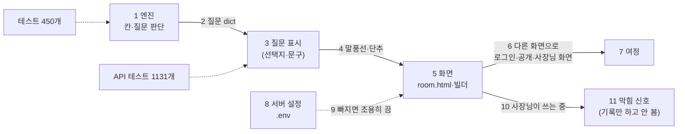

# 사소한 불편이 왜 대표 눈에서야 잡히나 — 원인과 대책 (UX_GAP_PLAN)

> 2026-10-05 (KST). 대표 질문: "이런 사소한 것들이 왜 엔진에 반영이 안 되는지, 엔진이 정교화되어야 할 부분인지, 어떻게 개선할 수 있을지 대책 세워봐."
> 작성 Claude. 근거: 10/5 하루에 대표가 찾았거나 운영에서 드러난 5건과 코드.

## 0. 결론

1. **엔진(칸 채우기 판단)의 문제는 아니다.** 엔진은 테스트 450개로 촘촘히 검증되어 있고, 10/5의 5건 중 엔진 판단이 틀린 것은 없다.
2. 새는 곳은 엔진과 사람 **사이**다. ① 엔진이 낸 질문이 **화면에 어떻게 보이고 단추가 무엇을 하는지**를 정한 약속(계약)이 없다. ② 화면 여러 개를 건너는 **여정**을 아무 테스트도 따라가지 않는다. ③ 설정이 빠지면 **조용히** 기능을 끈다. ④ 사장님이 어디서 막히는지 **숫자로 보지 않는다**.
3. 그래서 테스트는 "엔진 속 상태"를 확인하고, 대표는 "화면"을 본다. 둘 사이의 틈에서 생긴 문제는 대표가 써 볼 때만 보인다.
4. 대책은 네 가지다(§3). **질문·단추 계약 한 곳**, **핵심 여정 5개 자동 점검**, **시작할 때 설정 점검 + 시끄러운 실패**, **막힘 지표**. 엔진에서 정교화할 곳은 **제어 말(알아서·모르겠어요·나중에·시안 먼저)의 뜻을 표 하나로 모으는 것**뿐이다.

## 1. 10/5에 나온 5건

| 번호 | 무엇 | 실제 원인 | 어느 층 | 테스트가 못 잡은 이유 |
|---|---|---|---|---|
| 1 | 빌더에서 로그인하고 와도 공개하기가 계속 로그인 화면 (#41) | "방을 계정에 붙이기(claim)"를 서버가 아니라 **화면마다** 했다. 채팅방·내 프로젝트는 했고, 나중에 만든 빌더(D57)는 빠뜨렸다 | 화면 사이 여정 | 공개 API 테스트는 X-Member-Id 헤더만 보냈다. "로그인 → 돌아와서 → 공개"를 이어서 하는 테스트가 없었다 |
| 2 | 가게 이름 질문에 "1) 알아서 해주세요"만 (#42) | 선택지가 없는 질문에 `options + [알아서]`를 **기계적으로** 붙였다. 같은 규칙이 4곳(`prd_engine` 1곳, `compose` 2곳, `situation` 1곳)에 흩어져 있다 | 질문 표시 | 엔진 테스트는 "어느 칸을 물었나"만 보고 "사장님 화면에 무엇이 보이나"는 보지 않았다 |
| 3 | "알아서 해주세요"를 누르면 다음 질문이 또 나옴 (#42) | 엔진은 "알아서 = 이 칸만 맡김", "시안 먼저 = 다 맡김"으로 설계했다(B-6). 사장님 머릿속 뜻과 달랐다 | 말의 뜻 | 설계대로 동작했으니 테스트는 통과했다. 사람이 그 말을 어떻게 받아들이는지는 재지 않았다 |
| 4 | 요약 아래 "주소 검색" 단추만 있고 설명이 없음 (#42) | 화면이 AI 답장 **글자**에 "주소·위치"와 "요약" 낱말이 있으면 단추를 붙였다(`maybeAddAddrBtn` 정규식). 단추가 왜 나오는지 화면은 모른다 | 화면 추측 | 화면 테스트 없음 |
| 5 | 10/1부터 공개 사이트 "채팅하기"·주문·전화 인증·알림 링크가 모두 비어 있었음 | 서버 `.env`에 `PUBLIC_BASE_URL`이 없으면 404를 막으려고 링크를 **조용히 뺀다**. 아무도 알림을 받지 않았다 | 설정·운영 | 로컬에는 PREVIEW_HOST가 없어 이 갈래가 안 탄다. 운영 점검도 "링크 없음"을 정보(ℹ️)로만 보였다 |

같은 기간 git 기록에서 "고치기·버그"가 들어간 커밋이 9/25 이후 40개다. 대부분 이 다섯 갈래 중 하나다.

## 2. 문제가 어디서 새나

| 번호 | 단계 | 지금 지키는 것 | 비어 있는 것 |
|---|---|---|---|
| 1 | 엔진 판단 | 엔진 테스트 450개, 평가 63개, 실제 모델 시뮬레이션 | 거의 없음 |
| 2 | 질문 dict | `slot`·`kind`·`options`·`text` | 단추마다 **무슨 일을 하는지**(보내기·입력칸·건너뛰기·시트 열기)가 없다. 화면이 단추 **이름**으로 짐작한다 |
| 3 | 질문 표시 | — | 선택지 규칙이 4곳에 흩어져 있다(1건 2) |
| 4 | 말풍선·단추 | — | 단추가 AI 글자를 정규식으로 보고 붙는다(1건 4) |
| 5 | 화면 | room.html 브라우저 테스트 5개(CI 밖) | 빌더·사장님 화면·공개 사이트를 브라우저로 따라가는 테스트가 없다 |
| 6~7 | 여정 | — | 로그인처럼 화면을 넘나드는 흐름을 아무도 끝까지 따라가지 않는다(1건 1) |
| 8~9 | 설정 | 운영 점검 `smoke_prod.py` | 빠진 설정을 알리지 않고 기능을 끈다(1건 5) |
| 10~11 | 막힘 신호 | `chat_turns`(턴마다 물은 칸·건너뜀·되풀이), `funnel` 사건 | 모으기만 하고 "어디서 몇 명이 멈췄나"를 보지 않는다 |

## 3. 대책

### 3.1 질문·단추 계약 한 곳 (Q1)

- 질문을 화면용으로 바꾸는 함수를 하나로 모은다: `present(card, q) -> {text, actions[]}`. 4곳의 `options + [LET_AI]`가 모두 이것을 부른다.
- 단추마다 **이름 + 하는 일**을 같이 보낸다.

| 하는 일(action) | 예 | 화면 |
|---|---|---|
| `send` | "카페", "2~3명" | 그 글을 보낸다 |
| `type` | "직접 입력" | 입력칸으로, 보내지 않음 |
| `skip_to_design` | "알아서 해주세요" | 바로 시안 |
| `open_sheet` | "📍 정확한 주소 검색하기" | 주소 시트(안내 글 필수) |
| `later` | "나중에 넣을게요" | 그 칸만 자리 표시 |

- 화면은 단추 **이름이 아니라 action**으로 동작한다. 오늘 #42에서 `opt === '직접 입력'`으로 비교한 것은 임시이고, Q1에서 없앤다.
- 주소 검색처럼 **화면이 글자를 보고 추측해 붙이는 단추는 없앤다.** 서버가 요약 메시지에 `actions: [open_sheet:address]`를 실어 보낸다. 주소가 이미 정확하면 보내지 않는다.
- 규칙: `open_sheet` 단추는 안내 글(`hint`)이 비면 테스트가 실패한다.
- 테스트: 질문 종류마다 `present()` 결과를 표로 고정한다(골든). 사장님이 보는 글과 단추가 바뀌면 PR에서 바로 보인다.

### 3.2 핵심 여정 5개 자동 점검 (Q2)

이미 있는 playwright 테스트(`tests/e2e`)를 넓혀, 가짜 LLM으로 로컬 서버를 띄우고 **화면을 눌러** 끝까지 간다. CI에서 PR마다 돈다.

| 번호 | 여정 | 끝에서 확인 |
|---|---|---|
| J1 | 템플릿 → 빌더 → 공개하기 → 로그인 → 돌아와 공개하기 | 공개 사이트 주소가 나온다(#41) |
| J2 | 채팅으로 업종 말하기 → 질문 → "알아서 해주세요" | 시안이 나온다(#42) |
| J3 | 채팅 → 요약 → 주소 검색 → 저장 | 지도 좌표가 카드에 들어간다 |
| J4 | 공개 사이트 → "채팅하기" → 손님 메시지 | 사장님 채팅 탭에 보이고 알림 호출이 1번 |
| J5 | 사장님 화면 → 알림 켜기 → 시험 알림 | 구독 1개 |

로그인은 테스트 전용 로그인 경로(로컬·테스트 설정에서만 켜짐)로 대신한다. 화면 크기는 390px(휴대폰) 하나로 시작한다.

### 3.3 시작할 때 설정 점검 + 시끄러운 실패 (Q3)

- 서버가 뜰 때 `config_check()`: 아래가 어긋나면 **텔레그램 알림 1건 + 관리자 화면 위 빨간 띠**.

| 점검 | 어긋나면 꺼지는 것 |
|---|---|
| `PREVIEW_HOST`가 있는데 `PUBLIC_BASE_URL`이 https가 아님 | 채팅하기·주문·전화 인증·알림 링크 |
| `NIM_CHAT_MODEL`이 404·410 (하루 한 번 가볍게 확인) | AI 대화 (10/3 super 종료) |
| VAPID·텔레그램·카카오 JS 키 없음 | 휴대폰 알림·운영 알림·지도 (정보로만) |

- "조용히 끄기"를 쓰는 곳(`app_link`처럼 빈 글 돌려주기)은 끌 때 `log.warning` 한 번 + 위 점검에 이름을 올린다.
- (뺌) `smoke_prod.py`에서 "채팅하기 전부 없음 = 실패"는 하지 않는다. 사장님이 채팅을 끈 가게와 구분할 수 없고, 원인(설정 빠짐)은 위 시작 점검이 먼저 잡는다.

### 3.4 막힘 지표 (Q4)

`chat_turns`에 이미 있는 값으로 매일 아침 텔레그램 한 줄 + 관리자 화면 표.

| 지표 | 뜻 | 10/5 사례와 연결 |
|---|---|---|
| 같은 질문 2번 이상 | 질문이 이해 안 됨 | — |
| 칸별 "알아서·모르겠어요" 비율 | 묻지 않아도 되는 질문 | 가게 이름 질문 |
| 질문 n번째에서 대화를 떠난 방 | 지쳐서 나감 | "알아서"를 눌러도 또 물음 |
| 공개 버튼 → 공개 성공까지 걸린 횟수 | 공개 흐름 막힘 | #41이면 "로그인 필요"가 같은 방에 2번 이상 |
| 시안까지 걸린 시간·턴 수 | 전체 피로도 | — |

숫자가 튀면 대표가 써 보기 전에 Claude가 먼저 원인을 찾는다.

### 3.5 엔진에서 정교화할 곳: 제어 말 표 하나 (E1)

지금 제어 말의 뜻이 `prd_engine.py` 안 집합 7개(`_CONTROL_NORMS`, `SKIP_NORMS`, `LET_AI_SKIP_NORMS`, `LATER_NORMS`, `NONE_NORMS`, `REPEAT_NORMS`, 모름 판정)에 흩어져 있다. #42도 집합 하나를 더 만들었다.

| 말 | 뜻(10/5 기준) |
|---|---|
| "알아서 해주세요"(단독) | 남은 질문 건너뛰고 바로 시안 |
| 문장 속 "알아서", "잘 모르겠어요" | 그 칸만 AI가 채움 |
| "나중에 넣을게요" | 그 칸 자리 표시 |
| "없음" | 그 칸 해당 없음 |
| "시안 먼저", "그만 물어" | 바로 시안 |
| "다시요", "뭐라고요" | 같은 질문 다시(예산 안 씀) |
| "직접 입력" | 같은 질문 다시(값 아님) |

이것을 `app/data/control_words.json` 표 하나로 옮기고, 엔진·화면 단추(Q1 action)·음성 안내가 같은 표를 읽는다. 표 한 줄 = 테스트 한 줄(표 기반 테스트). 뜻을 바꾸려면 표 한 줄만 고치면 되고, 그 변화가 PR에 그대로 보인다.

## 4. 순서와 크기

| 순서 | 무엇 | 크기 | 먼저 하는 이유 |
|---|---|---|---|
| 1 | Q3 설정 점검 + 시끄러운 실패 | 반나절 | 10/5의 가장 큰 사고(링크 5일 공백)를 막는다. 작다 |
| 2 | E1 제어 말 표 + Q1 질문·단추 계약 | 1~2일 | 2·3·4번 종류를 구조로 없앤다. #42의 임시 비교를 걷어낸다 |
| 3 | Q2 여정 J1·J2 먼저 CI에 | 1일 | 10/5에 실제로 깨진 두 여정부터 |
| 4 | Q4 막힘 지표 | 1일 | 베타(10/17)에서 사장님이 들어오면 바로 쓸 수 있게 |
| 5 | Q2 나머지 J3~J5 | 1일 | |

모두 10/15 동결 전에 들어갈 수 있다. 사이트 모양·엔진 판단은 바뀌지 않는다(사장님이 보는 단추의 동작만 같거나 나아진다).

## 5. 이렇게 하면 무엇이 달라지나

| 10/5 사례 | 대책 뒤 |
|---|---|
| 1 공개 로그인 반복 | J1이 PR에서 실패한다 |
| 2 직접 입력 없음 | `present()` 골든 표에 "1) 알아서 해주세요"만 보이는 줄이 PR에 드러난다 |
| 3 "알아서" 뜻 차이 | 제어 말 표 한 줄로 보이고, Q4 "알아서 뒤 같은 방에서 다시 질문" 지표가 튄다 |
| 4 설명 없는 단추 | `open_sheet` 단추에 안내 글이 없으면 테스트가 실패한다 |
| 5 링크 공백 | 서버가 뜨는 순간 텔레그램으로 "PUBLIC_BASE_URL 없음"이 온다 |

## 6. 결정 (2026-10-05 대표)

- 순서: Q3 → E1+Q1 → Q2(J1·J2) → Q4 → Q2 나머지(J3~J5). 진행 승인.
- Q2는 처음 1주(10/12까지) CI 경고만, 그 뒤 필수(실패하면 merge 막기).
