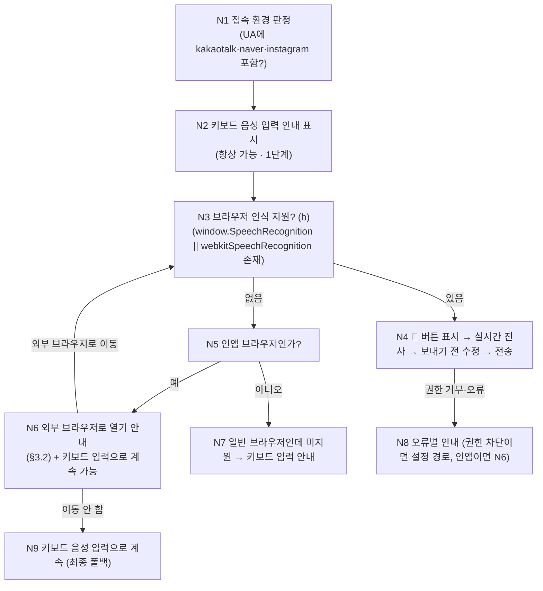

# 음성 요구사항 입력 계획 (VOICE_INPUT_PLAN) — agt001 사장님용

> 작성일: 2026-09-26 / 작성자: agt001 음성 입력 조사자(Q) / 코드 수정 없음·문서 1개만
> 읽은 것: `DEV_DECISION_VOICE.md`(전화용 STT/TTS 조사 — 수치 재사용), `REQUIREMENTS_ENGINE_PLAN.md` §7(질문 8회·선택지 4개 이하·확정은 시안과 함께),
> `DECISIONS.md`(D20~D28), `DESIGN_PREVIEW_R2_SECURITY.md`(보안 원칙), `frontend/src/Landing.tsx`(히어로 입력창 `textarea` + Enter 전송),
> `static/room.html`(채팅 입력 `#input` + 4초 폴링). 연결 문서: `PRIVACY_NOTES.md`(방침), `DELIVERY_PIPELINE.md` 1-0g(방침 초안 WP), `deploy/Caddyfile`(HTTPS).
> 조사 방법: 가입·결제·API 호출 없이 **공식 문서 열람만**. 2026년 현재 기준. 공식 문서에서 확인 못한 항목은 **"확인 필요"** + 출처 URL 표기.

## 0. 결론 먼저 (추천안 1개)

| 단계 | 내용 | 작업량 | 월 비용 |
|---|---|---|---|
| **1단계 (즉시)** | **휴대폰 키보드 음성 입력 안내** — 만들 것 없음. 입력창에 "🎤 키보드의 마이크를 눌러 말하세요" 한 줄 안내 + `inputmode`·`enterkeyhint` 정리 | 반나절 1개 | **0원** |
| **2단계 (다음)** | **Web Speech API 버튼** (브라우저 내장 인식, 무료) — 말하는 동안 글자 실시간 표시, 보내기 전 수정. 인앱이면 외부 브라우저 안내 | 반나절 2개 | **0원** |
| **3단계 (나중·조건부)** | **녹음 후 서버 STT** (MediaRecorder → 업로드 → STT) — 인앱에서도 안 될 때의 최후 수단. 상한·폴백용으로만 | 반나절 3개 | 상한 내 (기본 0원, 켜면 초과 — §2.3) |
| TTS(읽어주기) | **1~2단계에서는 넣지 않는다.** 필요해지면 브라우저 `speechSynthesis`(무료)부터 | — | 0원 |

**왜 이렇게 자르는가:** 월 사용량 가정(사장님 100명 × 하루 3분 = **월 9,000분**)에서 서버 STT는 가장 싼 조합(RTZR Basic 시간당 1,000원)으로도 **월 약 15만원**이라 $5 상한을 무조건 초과한다(§2.3). 무료 경로(키보드·브라우저 인식)를 기본으로 하고, 서버 STT는 선택·상한 장치와 함께만 쓴다.

## 1. 방법 3가지 비교

### 1.0 한눈 표

| # | 방법 | 우리가 만들 것 | 실시간 글자 | 서버 비용 | 인앱(카톡·네이버·인스타) | 권장 |
|---|---|---|---|---|---|---|
| (a) | 휴대폰 키보드 음성 입력 | 안내 문구뿐 | 키보드 앱이 처리 | 0원 | **됨 (OS 기능이라 WebView 무관)** | **1단계** |
| (b) | Web Speech API (`SpeechRecognition`) | 버튼 + 결과 넣기 (반나절) | 됨 (`interimResults`) | 0원 (구글·애플 서버가 처리) | **미지원이 통설 — 확인 필요** | **2단계** |
| (c) | 녹음 후 서버 STT | 녹음·업로드·STT 연동 (반나절 3개) | 안 됨 (녹음 끝나고 전사) | 월 $5 초과 (§2.3) | 조건부 (HTTPS 필수 + 호스트 앱 허용 — 확인 필요) | 3단계·조건부 |

### 1.1 (a) 휴대폰 키보드 음성 입력 — 안내만 하면 된다

- Gboard(마이크 아이콘)·삼성 키보드(말하기)·iOS 받아쓰기(키보드 🎤)는 **OS 키보드 기능**이라 어떤 브라우저·인앱 브라우저에서도 입력창에 그대로 들어간다. 별도 권한·코드 불필요.
- 단, iOS 받아쓰기는 받아쓰기 언어에 한국어가 켜져 있어야 하고(설정 → 일반 → 키보드), Gboard 음성 입력은 구글 앱 권한에 의존한다. 이 두 줄이 안내문의 전부다.
- 현재 입력 요소가 `textarea`(랜딩)·`input`(room.html)이라 키보드 음성 입력과 100% 호환된다. 손댈 것은 **안내 문구 + 전송 버튼 라벨**뿐이다.
- 한계: 매장 소음·사투리 depend on 키보드 앱 품질(우리 통제 밖). 그래도 (b)(c)가 막힐 때의 **최종 폴백**으로 항상 살아남는다.

### 1.2 (b) 브라우저 Web Speech API (`SpeechRecognition`)

**지원 현황 (공식 문서 기준):**

| 환경 | 인식 지원 | 근거·비고 |
|---|---|---|
| Android Chrome | 됨 (`webkitSpeechRecognition` 접두사) | MDN "prefixed properties" — https://developer.mozilla.org/en-US/docs/Web/API/Web_Speech_API/Using_the_Web_Speech_API |
| iOS·macOS Safari | 됨 (Safari 14.1+, `webkitSpeechRecognition`, Siri 엔진, 50+ 언어) — 단 **기기에 Siri가 켜져 있어야** 함 | WebKit 블로그 — https://webkit.org/blog/11648/new-webkit-features-in-safari-14-1/ |
| Edge | 됨 (로컬 인식, `ko-KR` 포함) | MS Learn — https://learn.microsoft.com/en-us/microsoft-edge/web-platform/speech-recognition-api |
| 삼성 인터넷 | Chromium 기반이나 SpeechRecognition 지원 공식 문서 **확인 필요** | https://developer.samsung.com/internet (지원표 위치 확인 필요) |
| 카카오톡·네이버·인스타그램 인앱 브라우저(WebView) | **미지원이 통설이나 공식 문서 확인 필요.** WebView 호스트 앱이 음성 인식 서비스를 물려주지 않는 것이 일반적 | 확인 필요 (카카오·네이버·Meta의 WebView 스펙 공개 문서 없음) |
| 한국어(ko-KR) | `recognition.lang = 'ko-KR'` 로 지정. Chrome·Safari(Siri)·Edge 모두 한국어 포함 | 위 각 출처 |

**음성이 어디로 가는가 (반드시 방침에 고지):**

| 브라우저 | 전송처 |
|---|---|
| Chrome 계열 | 기본 **서버 기반 인식 — 오디오가 웹 서비스(구글 서버)로 전송**된다. 오프라인 불가 (MDN 명시) — https://developer.mozilla.org/en-US/docs/Web/API/Web_Speech_API/Using_the_Web_Speech_API |
| Safari | Siri 음성 엔진(애플 서버). 단, 최신 스펙의 `processLocally=true` + 언어팩이면 기기 내 처리 가능 (Edge 문서에 옵션 설명, Safari 적용 여부는 **확인 필요**) |
| Edge 로컬 모드 | 기기 내 모델 (처음 언어팩 다운로드) |

- 권한 팝업: 첫 `start()` 호출 시 브라우저가 마이크 권한 팝업을 띄운다. **페이지 로드가 아니라 🎤 버튼을 누른 시점에만 호출**할 것 (web.dev 권고 — https://web.dev/articles/media-recording-audio?hl=ko).
- 알려진 함정: iOS Safari에서 오디오 재생 후 인식 재시작이 멈추는 하드웨어 세션 잠금 버그 보고 있음 (서드파티, 2026-09 — 공식 아님, TTS 병행 시 주의).
- `SpeechGrammar`/`SpeechGrammarList`는 Safari 미지원 (caniuse — https://caniuse.com/speech-api). 요구사항 엔진의 선택지 단어는 인식 후 텍스트 매칭으로 처리하고 문법 고정은 기대하지 않는다.

### 1.3 (c) 녹음 후 서버 STT

**브라우저 녹음 지원:**

| 항목 | 내용 | 출처 |
|---|---|---|
| `getUserMedia` + `MediaRecorder` (일반 브라우저) | 전 브라우저 지원. 단 **반드시 HTTPS(secure context)** — 평문 HTTP에서는 `navigator.mediaDevices` 자체가 `undefined` | MDN — https://developer.mozilla.org/en-US/docs/Web/API/MediaDevices/getUserMedia |
| 우리 서비스 해당 사항 | **`deploy/Caddyfile`에 `144.24.91.250.sslip.io` HTTPS가 이미 있다.** sslip.io 주소로 들어오면 녹음 가능. **평문 `http://IP:8643` 직접 접속에서는 마이크 불가** — 음성 버튼을 조건부로 숨기거나 HTTPS로 유도해야 한다 | `deploy/Caddyfile:3-5`, `static/room.html` (현재 평문 접속 언급 주석 있음) |
| 녹음 파일 형식 | Android Chrome: `audio/webm;codecs=opus`. iOS Safari: 14.3+ `audio/mp4`(AAC), 18.4+ webm/opus 추가. **서버는 webm/opus와 mp4/AAC 둘 다 받는 설계** + `isTypeSupported()`로 분기 | WebKit — https://webkit.org/blog/11353/mediarecorder-api, 정리 — https://github.com/addpipe/Media-Recorder-API-Demo |
| 인앱 브라우저 | 호스트 앱이 WebView에 마이크 권한을 안 주면 실패가 통설. 카톡 인앱 `getUserMedia` 동작 공식 문서 **확인 필요** | 확인 필요 |

**서버 STT 후보 (DEV_DECISION_VOICE.md §1 수치 재사용 + 2026 요금표):**

| # | STT | 한국어 특성 | 1분 기준 지연·비용 | 출처 |
|---|---|---|---|---|
| S4 | 네이버 CLOVA Speech | 한국어·전화망 특화 주장. 단문 REST 최대 60초(1분 발화에 적합), 15초 단위 올림, 장문 Free **월 20분 무료**. 예시 단가 약 0.5원/초(≒30원/분) — 최종 요금표 확인 필요 | 지연 공식 미공개(확인 필요). 비용 약 30원/분 가정 | DEV_DECISION_VOICE §1.1 S4, https://www.ncloud.com/api-cms/service-product/static/clovaSpeech |
| S5 | 리턴제로 RTZR/VITO (`sommers_ko`) | 한국어 통화 특화, 8kHz 예제. Basic **시간당 1,000원**, 가입 시 10시간 무료 | 지연 공식 미공개(확인 필요). 비용 약 16.7원/분 | https://www.rtzr.ai/en/pricing |
| S1 | OpenAI 전사 (`gpt-4o-transcribe` $0.006/분, mini $0.003/분, Whisper-1 $0.36/시간) | 다국어, 국외 전송 | 수 초(배치). mini 기준 1분 ≒ $0.003 | DEV_DECISION_VOICE §1.1 S1, https://developers.openai.com/api/docs/models/gpt-4o-transcribe (토큰 과금 표기) + 서드파티 분당 환산 https://costgoat.com/pricing/openai-transcription |
| S7 | NVIDIA Riva/Speech NIM (Parakeet ko-KR 포함) | **우리 ARM 서버에서 불가 (GPU 필수)** — 제외 | — | DEV_DECISION_VOICE §1.2 |
| S8 | whisper.cpp / faster-whisper (우리 서버) | 라이선스 0원. `tiny`/`base` + int8 + VAD부터 실측 (DEV 문서). **1분 음성 기준 지연은 A1 2 OCPU 실측 확인 필요** | 비용 0원(기존 서버 내) | DEV_DECISION_VOICE §1.1 S8·§1.2, https://github.com/SYSTRAN/faster-whisper |

## 2. 비용 — 1분 기준과 월 9,000분 기준

가정: 사장님 100명 × 하루 3분 × 30일 = **월 9,000분 (150시간)**. 새 유료 서비스 월 합계 **$5 이하** 상한.

### 2.1 1분 음성 기준

| 방식 | 지연 | 비용/1분 |
|---|---|---|
| (a) 키보드 입력 | 키보드 앱 수준 (무시) | 0원 |
| (b) Web Speech API | 실시간 중간 결과 (`interimResults`) | 0원 (구글·애플 부담) |
| (c) CLOVA | 확인 필요 + 업로드·변환 시간 | 약 30원 (15초 올림 유의) |
| (c) RTZR | 확인 필요 + 업로드 시간 | 약 16.7원 |
| (c) OpenAI mini | 수 초 | 약 $0.003 (약 4원) |
| (c) faster-whisper 로컬 | **A1 실측 확인 필요** (짧은 발화+tiny/base면 수 초대 가능 추정 — 실측 전 확정 금지) | 0원 + 서버 부하 |

### 2.2 녹음 파일 업로드 부하 (참고)

64kbps 오디오 기준 1분 ≒ 0.5MB. 9,000분/월이면 월 약 4.5GB 업로드 트래픽 — OCI 무료 티어 내이나 단일 인스턴스 디스크·동시 변환 부하 고려. **원칙: 전사 후 즉시 삭제** (§4).

### 2.3 월 9,000분 기준 — 판정

| 방식 | 월 비용 | $5 상한 |
|---|---|---|
| (a)(b) | 0원 | 통과 |
| (c) RTZR Basic | 150시간 × 1,000원 = **약 15만원** (10시간 무료 차감 후에도 약 14만원) | **초과** |
| (c) CLOVA | 9,000분 × 약 30원 = **약 27만원** (월 20분 무료는 무시 수준) | **초과** |
| (c) OpenAI mini | 9,000 × $0.003 = **$27** | **초과** |
| (c) faster-whisper 로컬 | 추가 0원 (속도 실측이 관건) | 통과 (품질·부하 검증 후) |

**판정:** 서버 STT를 기본 동선으로 켜면 어떤 벤더로도 $5를 넘는다. (c)는 **① 사용량 상한(예: 월 N분/방) + ② 초과 시 (a)(b) 폴백 + ③ 로컬 whisper 우선 실측** 조건으로만 도입한다.

## 3. 인앱 브라우저에서 마이크가 막힐 때의 대처

### 3.1 폴백 순서 — flowchart

**노드별 설명:**

| 노드 | 설명 | 실패 시 |
|---|---|---|
| N1 | UA 판정(대략): `kakaotalk`·`NAVER`·`Instagram` 포함 여부. 카톡 공유로 들어오는 게 기본 동선이므로 1순위 분기 | UA 위조·변경 시 N3 기능 탐지로 자동 교정 (UA는 힌트일 뿐, 차단 근거로 쓰지 않음) |
| N2 | OS 키보드 음성 입력 안내 (Gboard 마이크·삼성 키보드 말하기·iOS 받아쓰기 한국어). 인앱 포함 전부 동작 | 없음 (항상 표시) |
| N3 | 기능 탐지(`SpeechRecognition` 존재). UA가 아니라 실제 지원으로 버튼 노출 결정 | N5로 |
| N4 | 2단계 본체. `lang='ko-KR'`·`interimResults=true`. 결과는 전송 전 입력창에 (수정 가능, §4) | N8로 |
| N5·N6 | 인앱이면 외부 브라우저 유도 (§3.2). 그래도 안 열면 N9 | N9로 |
| N7 | 데스크톱 구형 브라우저 등. 키보드(PC는 OS 받아쓰기) 안내 | — |
| N8 | `not-allowed`(차단)·`no-speech`(무음)·`network`(인앱 WebView 무지원 의심)별 문구 | N6 또는 N9 |
| N9 | 최종 폴백 = 키보드 입력. **어떤 환경에서도 요구사항 입력이 막히지 않음**을 보장 | — |

### 3.2 외부 브라우저로 열기 안내 (카카오톡 인앱 →)

- Android 카톡 인앱: 우하단(또는 우상단) **"⋯ → 다른 브라우저로 열기"**. iOS: **"⋯ → Safari로 열기"** (앱 버전별 메뉴 위치 상이 — 문구는 "점 세 개 메뉴에서 다른 브라우저/Safari로 열기"로).
- `kakaotalk://web/openExternal?url=…` 스킴 호출법이 블로그들에 공유되나 **카카오 공식 문서 확인 필요** — 공식 안내(메뉴 유도)를 1순위, 스킴 자동 이동은 예비로만 둔다.
- 네이버 앱·인스타그램 인앱도 동일 패턴(메뉴 → 외부 브라우저 열기). 각 앱 메뉴명은 버전별로 바뀌므로 안내에 버전 고정을 피한다.

## 4. UX

| 주제 | 권장 | 이유 |
|---|---|---|
| 시작/정지 방식 | **눌러서 시작 → 눌러서 정지(토글)**. "누르고 말하기(홀드)"는 미지원 | 홀드 방식은 손가락 부담·실수 종료·접근성 문제. 요구사항 발화는 수십 초라 토글이 적합 |
| 실시간 글자 | (b)만 가능: `interimResults` 중간 결과를 입력창에 회색으로, 최종 결과를 검정으로. (a)는 키보드 앱이, (c)는 전사 완료 후 일괄 표시 | 말하는 동안 뜨면 중단·수정이 쉬움 |
| **보내기 전 수정 (필수)** | 전사 결과는 **전송되지 않은 입력창 텍스트**로만 들어간다. 사장님이 고친 뒤 보내기. 전화번호·가격 포함 시 "번호·가격이 맞는지 확인해 주세요" 한 줄 주의 | DEV_DECISION_VOICE §4 복창 원칙의 이용자판. 오인식 확정 방지 + REQUIREMENTS_ENGINE §5 지어내기 차단 규칙과 정합 (서버는 근거 없는 번호를 버리므로, 오인식이 확정 칸을 오염시키지 않음) |
| 선택지 버튼과 함께 쓰기 | 음성은 **입력 보조**일 뿐 질문·선택지 UI는 그대로. 음성 전사가 선택지 번호("2번")와 일치하면 해당 버튼을 하이라이트(자동 전송 금지) | REQUIREMENTS_ENGINE_PLAN §7: 선택지 합계 4개 이하 + 자유 입력 항상. 음성이 버튼을 대체하지 않음 |
| 시끄러운 매장 | 조용한 곳 안내 1회성 팁 + (c) 도입 시 VAD·잡음 강건 모델(RTZR·CLOVA 통화 특화) 선정 근거 | 결정 통화(짧은 숫자)가 아니라 자유 발화라 잡음 영향 큼 |
| 사투리 | (b)는 OS·벤더 품질에 의존. 방언 오인식은 "보내기 전 수정"으로 흡수. 확정 카드(시안 옆, D22)에서 최종 확인 | D20 "이미 말한 것 다시 묻지 않기" — 오인식 재질문은 엔진 질문 횟수(8회)를 갉아먹으므로, 수정은 입력 단계에서 끝냄 |
| 질문 횟수 연동 | 음성 입력 실패·오인식으로 인한 재질문도 엔진의 8회 상한 안에 카운트. 음성 오류 안내는 엔진 질문과 별도 문구로 구분 | D20 이탈 방지 (진행 표시·"나머지는 알아서") |

## 5. 보안·개인정보

`DESIGN_PREVIEW_R2_SECURITY.md` 원칙 + `PRIVACY_NOTES.md`·`DELIVERY_PIPELINE.md` 1-0g(방침 초안 WP)와 연결.

| # | 항목 | 권장 |
|---|---|---|
| S1 | 녹음 파일 보관 | **전사 후 즉시 삭제가 기본.** (c) 도입 시: 업로드 → 전사 → 텍스트만 세션에 저장 → 오디오·변환 부산물은 같은 요청 안에서 삭제. 보관 필요 시 별도 동의 + 기간 명시 (DEV_DECISION_VOICE §4.6 C4의 개발자용 90일보다 짧게 — 이용자 음성은 개인정보 비중 높음) |
| S2 | 국외 전송 고지 | (b) Chrome=구글 서버, Safari=애플 서버, (c) OpenAI=미국 서버는 **국외 이전**에 해당할 수 있다. 방침 초안(1-0g)에 "음성 입력 방식별 전송처" 행을 추가: 키보드 입력(단말 내·해당 키보드 앱 정책 따름) / 브라우저 인식(구글·애플) / 서버 전사(벤더명·보관 국가). CLOVA·RTZR(국내)은 국내 처리로 구분 표기 |
| S3 | 권한 요청 시점 | **🎤 버튼을 누른 순간에만** `start()`/`getUserMedia()` 호출. 페이지 로드·방 입장 시 요청 금지 (web.dev 권고). 거부당한 뒤에는 재요청 대신 설정 경로 안내 ("주소창 자물쇠 → 마이크 허용") |
| S4 | 로그·퍼널 | 음성 원문 오디오·바이너리를 `funnel_events`·서버 로그에 넣지 않음. 전사 텍스트는 채팅 메시지와 동일 취급(기존 보관 정책 따름). 거부·오류율은 익명 카운터만 |
| S5 | HTTPS 전제 | 평문 HTTP 접속에서 마이크 버튼 노출 금지 (어차피 동작 안 함 + 혼란). `Caddyfile` HTTPS 도메인을 정식 주소로 안내 |
| S6 | 미리보기 OG·공유 | 음성과 무관하나 동일 방침: 전사 텍스트가 시안 공유 링크·OG 태그에 섞이지 않게 (R2 §4.2 #6·#7) |

## 6. AI 답변 읽어주기 (TTS) — 판단

**판단: 1~2단계에서는 넣지 않는다.** 이유:

1. 사용 상황상 사장님은 **말하는 쪽(입력)** 이 불편한 것이지, 읽는 쪽이 불편한 게 아니다. AI 답변(질문 1개 + 선택지 4개 이하)은 눈으로 보는 게 빠르고, 버튼을 눌러야 해서 어차피 화면을 본다.
2. 요구사항 엔진은 텍스트·버튼 중심(D22 시안 옆 카드 확정). 음성 출력이 확정 흐름에 기여하지 않는다.
3. TTS를 켜면 인앱 소음·자동재생 정책·iOS 오디오 세션 잠금(§1.2 함정) 같은 문제가 새로 생긴다.

**넣는다면 (3단계 이후, 필요 확인 후):**

| 방식 | 비용 | 비고 |
|---|---|---|
| 브라우저 `speechSynthesis` (무료, `lang='ko-KR'`) | 0원 | 1순위. OS 한국어 보이스 사용. Chrome·Safari 모두 지원 (caniuse speech-api) |
| 서버 TTS (CLOVA Voice — 월 100만 글자 무료 구간, DEV 문서 T1) | 무료 구간 내 | AI 답변 낭독 빈도가 낮아 무료 구간으로 충분할 가능성. 단 통화용 8kHz가 아니라 웹용 고품질로 합성. **확인 필요(요금표)** |

## 7. 추천안 — 단계적 도입

### 7.1 단계·작업 패키지 (반나절 단위)

| 단계 | WP | 내용 | 담당 | 의존 |
|---|---|---|---|---|
| 1 | V-1a | 입력창 음성 안내 문구 (랜딩 히어로 + room 입력행, 반나절) | OpenCode(화면) | 없음 — 즉시 가능 |
| 1 | V-1b | 평문 HTTP 접속 시 음성 버튼 숨김 + HTTPS 주소 안내 (반나절, S5) | Claude | 없음 |
| 2 | V-2a | 🎤 토글 버튼 + Web Speech 인식 → 입력창 삽입 (중간 결과 표시·ko-KR·에러별 문구, 반나절) | Claude + OpenCode(화면) | V-1a |
| 2 | V-2b | 인앱 판정 + 외부 브라우저 안내 + 폴백 순서(N1~N9) (반나절) | OpenCode(화면) → Claude 검토 | V-2a |
| 2 | V-2c | 방침 초안(1-0g)에 음성 전송처 행 추가 (S2, 반나절) | Claude | V-2a 방식 확정 후 |
| 3 | V-3a | MediaRecorder 녹음 → 업로드 → (로컬 whisper 실측 우선) 전사 → 입력창 삽입 (반나절 ×2) | Claude | A1 faster-whisper 실측 |
| 3 | V-3b | 서버 STT 벤더 어댑터(CLOVA↔RTZR, DEV 문서 §1 STT 어댑터 재사용) + 월 상한·초과 시 폴백 (반나절) | Claude | V-3a |
| — | V-T | TTS는 보류. 요청이 생기면 `speechSynthesis`부터 (반나절) | — | 사용 상황 확인 후 |

총합: 1단계 반나절 1개, 2단계 반나절 3개, 3단계 반나절 3개.

### 7.2 월 비용 (단계별)

| 단계 | 월 비용 |
|---|---|
| 1단계 | 0원 |
| 1+2단계 | 0원 (브라우저 인식은 구글·애플 부담, 우리 서버 무부하) |
| 1+2+3단계 | 기본 0원. 서버 STT를 켠 분량만큼: 로컬 whisper만이면 0원, CLOVA/RTZR/OpenAI 사용분은 §2.3 단가 × 사용량에 월 상한 캡 (상한 초과분은 (a)(b)로 폴백이라 $5 상한 준수 가능) |

### 7.3 사용자 결정 질문 (추천 답 포함)

| # | 질문 | 추천 답 | 이유 |
|---|---|---|---|
| Q1 | 1단계(키보드 안내)부터 바로 하나요? | **예** | 만들 것 없이 반나절, 효과 즉시 |
| Q2 | Web Speech의 국외 전송(구글·애플 서버)을 방침에 고지하고 2단계를 하나요? | **예 (고지 후 진행)** | 비용 0원, 실시간 글자의 체감 효과가 큼. 거부하는 사용자는 1단계로 폴백 |
| Q3 | 서버 STT(3단계)의 월 상한을 얼마로 하나요? | **$5 안에서, 로컬 whisper 실측 후 결정. 외부 벤더는 월 N분 캡 + 초과 폴백** | §2.3 — 캡 없이는 어떤 벤더도 상한 초과 |
| Q4 | TTS 읽어주기를 넣나요? | **아니요 (보류)** | §6 — 입력 불편이 본질, 화면을 어차피 봄 |
| Q5 | 인앱 사용자에게 외부 브라우저 이동을 적극 권하나요, 키보드 입력 유지만 하나요? | **키보드 유지가 기본, 🎤 버튼이 안 보일 때만 외부 브라우저 안내** | 이동 유도는 이탈 유발. 막힌 사람에게만 권함 (N6→N9) |

## 8. 출처

- Web Speech API 사용법·서버 전송 명시: https://developer.mozilla.org/en-US/docs/Web/API/Web_Speech_API/Using_the_Web_Speech_API
- Web Speech API 개요: https://developer.mozilla.org/en-US/docs/Web/API/Web_Speech_API
- Safari 14.1 음성 인식(Siri 엔진): https://webkit.org/blog/11648/new-webkit-features-in-safari-14-1/
- Edge 로컬 인식(ko-KR 포함)·`processLocally`: https://learn.microsoft.com/en-us/microsoft-edge/web-platform/speech-recognition-api
- caniuse speech-api (Safari Grammar 미지원 등): https://caniuse.com/speech-api
- getUserMedia secure context(HTTPS 필수): https://developer.mozilla.org/en-US/docs/Web/API/MediaDevices/getUserMedia
- 마이크 권한은 필요할 때만 요청: https://web.dev/articles/media-recording-audio?hl=ko
- MediaRecorder Safari 형식(MP4/AAC, 18.4+ webm): https://webkit.org/blog/11353/mediarecorder-api · https://github.com/addpipe/Media-Recorder-API-Demo
- CLOVA Speech: https://www.ncloud.com/api-cms/service-product/static/clovaSpeech · https://guide.ncloud-docs.com/docs/clovaspeech-spec.md
- RTZR 요금(Basic 시간당 1,000원·10시간 무료): https://www.rtzr.ai/en/pricing · https://www.rtzr.ai/en/stt
- OpenAI 전사 모델·요금: https://developers.openai.com/api/docs/models/gpt-4o-transcribe · https://developers.openai.com/api/docs/models/gpt-4o-mini-transcribe · https://developers.openai.com/api/docs/pricing · 분당 환산 https://costgoat.com/pricing/openai-transcription
- faster-whisper: https://github.com/SYSTRAN/faster-whisper
- 카톡 외부 브라우저 스킴(비공식, 확인 필요): https://devtalk.kakao.com/t/topic/150815 · https://ej-developer.tistory.com/107 · https://guiyomi.tistory.com/159
- iOS 오디오 재생 후 인식 잠금(서드파티 보고, 공식 아님): https://www.technetexperts.com/ios-safari-web-speech-api-bug-fix/
- 삼성 인터넷 지원표 위치 확인 필요: https://developer.samsung.com/internet
- 인앱 WebView 마이크·인식 지원 공식 문서 확인 필요: 카카오·네이버·Meta 공개 스펙 없음

---

## 부록: NVIDIA 음성 모델 실측 (2026-09-26, Claude)

지금 쓰는 NVIDIA API 키로 **NVIDIA 호스팅 음성 API**(grpc.nvcf.nvidia.com, `nvidia-riva-client`)를 직접 호출해 확인했다. 우리 서버에 GPU가 없어도 된다.

| 항목 | 모델 (호스팅 함수 ID) | 결과 |
|---|---|---|
| 음성 → 글자 | Parakeet 1.1B RNNT 다국어 (`71203149-d3b7-4460-8231-1be2543a1fca`) | 한국어 문장 약 9초 분량을 **2.5초**에 전사. "객실 세 개" → "객실세계" 1곳 오인식, 전화번호는 "공일공 공공공공…"처럼 한글 숫자로 나옴 |
| 글자 → 음성 | Magpie TTS 다국어 (`877104f7-e885-42b9-8de8-f6e4c6303969`) | 한국어 목소리 6개(`Magpie-Multilingual.KO-KR.Aria` 등). 7.4초 분량을 **1.4초**에 합성 |
| 왕복 확인 | 합성 음성을 다시 전사 | 원문과 거의 같음(띄어쓰기만 차이) |

**계획 변경:** 3단계(녹음 후 서버 전사)의 기본 엔진을 NVIDIA Parakeet로 한다. 외부 벤더(월 $5 초과)보다 먼저 쓴다.
- 브라우저 녹음(MediaRecorder) → 우리 서버 업로드 → 16kHz 모노로 변환(ffmpeg, iOS는 mp4/aac로 녹음됨) → Parakeet → 글자를 **입력창에 넣고 사장님이 고친 뒤 보낸다**(자동 전송 금지).
- 전사 뒤처리: 한글 숫자("공일공 …")를 숫자로 바꾸고, 전화번호·가격이 들어가면 "번호가 맞나요?" 확인을 붙인다.
- 녹음 파일은 전사 직후 삭제. 국외 전송(NVIDIA) 고지를 개인정보처리방침에 추가.
- TTS(읽어주기)는 선택 버튼으로만: 질문을 읽어 주는 "듣기" 버튼. 자동 재생하지 않는다.

**확인 필요:** 호스팅 API는 개발·시험용 무료 크레딧으로 제공된다. 운영 규모에서의 이용 조건·요금·호출 한도는 NVIDIA 약관 확인이 필요하다(https://build.nvidia.com). 한도에 걸리면 1단계(키보드 음성 입력)로 폴백한다.

출처: [NVIDIA ASR NIM 지원표](https://docs.nvidia.com/nim/speech/latest/reference/support-matrix/asr.html), [Parakeet RNNT 다국어 배포 문서](https://docs.nvidia.com/nim/speech/26.02.0/asr/deploy-asr-models/parakeet-rnnt.html), [Magpie TTS 다국어(Hugging Face)](https://huggingface.co/nvidia/magpie_tts_multilingual_357m), [NVIDIA TTS NIM 지원표](https://docs.nvidia.com/nim/speech/latest/reference/support-matrix/tts.html), [Speech NIM 릴리스 노트](https://docs.nvidia.com/nim/speech/26.07.0/about/release-notes.html)
