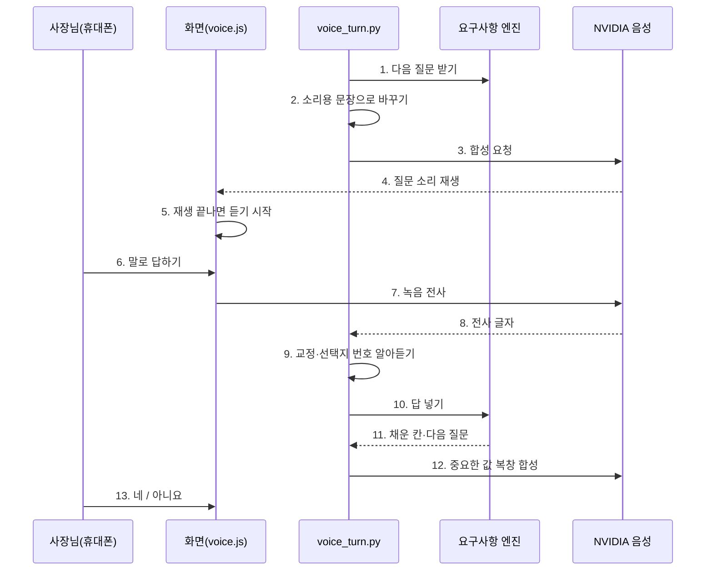
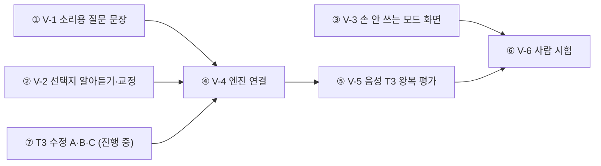

# 음성 요구사항 대화 요구사항 (VOICE_QA_REQUIREMENTS)

> 작성 2026-09-27, Claude(PM). 목적: 요구사항 엔진이 **질문을 소리로 읽어 주고, 사장님이 말로 답하면 칸이 채워지는** 흐름을 지금 있는 것 위에 얹기 위한 요구사항과 병행 작업 나누기.
> 바탕: [VOICE_INPUT_PLAN](VOICE_INPUT_PLAN.md)(부록 NVIDIA 실측), [FLOWDOC](FLOWDOC.md) §1 음성 행, `static/voice.js`, `app/services/stt.py`·`tts.py`, `app/services/prd_engine.py`, T3 평가 r5(21/36).

## 0. 결론 먼저

- **새로 만들 것은 "음성용 질문 문장 + 말로 한 답 알아듣기 + 중요한 값 복창 확인" 3가지가 핵심이다.** 녹음·전사·합성·무전기 모드(누르고 말하기·자동 전송·답장 자동 읽기)는 이미 운영 중이다.
- 엔진(`prd_engine.py`)은 지금 T3 수정 작업(OpenCode)이 쓰고 있으므로, 음성 쪽은 **새 파일 `app/services/voice_turn.py`** 에 모아 엔진을 감싸는 방식으로 병행한다. 엔진 안쪽 수정은 T3 작업이 끝난 뒤 1건(V-4)만 한다.
- 합격선: 음성 전용 T3(같은 36개 시나리오를 합성→전사 잡음을 넣어 돌림)에서 **텍스트 T3 대비 통과율 하락 5%p 이내, 전화·가격 지어냄 0건, 턴당 응답 4초 이내**.

## 1. 지금 있는 것 / 없는 것

| 구분 | 있음 (운영 중) | 없음 (이번 요구사항) |
|---|---|---|
| 말 → 글 | Parakeet 전사(`stt.py`, 9초 말을 2.5초), 녹음 즉시 삭제, IP당 분당 12회 | 전사 뒤 **도메인 교정**("객실세계"→"객실 세 개"), 한글 숫자 선택지("이 번", "두 번째") 인식 |
| 글 → 말 | Magpie 합성(`tts.py`, 300자 상한), 듣기 버튼, 무전기 모드 자동 읽기 | **소리용 질문 문장**. 지금은 화면용 `format_question`을 그대로 읽어 "(질문 3/8 · '시안 먼저'라고…)" 같은 안내까지 읽힌다 |
| 주고받기 | 무전기 모드: 누르고 말하기 → 자동 전송 → 답장 자동 읽기 | 읽기 끝나면 **자동으로 듣기 시작**(손 안 쓰는 모드), 말 끝 자동 감지 |
| 확인 | 화면에서 "번호·가격이 맞는지 확인" 한 줄 | 전화·가격·시간을 **소리로 복창하고 "네/아니요"로 확정** |
| 평가 | 텍스트 T3 36개(r5 21/36) | **음성 T3**: 합성→전사 왕복 잡음을 넣은 같은 36개 |

## 2. 흐름 — sequenceDiagram

| 번호 | 누가 | 설명 |
|---|---|---|
| 1 | voice_turn | 엔진의 `next_question`/`turn` 결과를 그대로 받는다. 엔진 규칙(질문 8회 상한 등)은 음성에서도 같다 |
| 2 | voice_turn | 화면용 괄호 안내·기호를 빼고 "1번, 예약 문의 늘리기. 2번, …" 식으로 바꾼다 (FR-1) |
| 3~4 | NVIDIA → 화면 | Magpie 합성. 300자 넘으면 나눠 읽는다 |
| 5 | 화면 | 손 안 쓰는 모드일 때만 자동 듣기. 기본은 지금처럼 누르고 말하기 (FR-4) |
| 6~8 | 사장님 → NVIDIA | Parakeet 전사. 녹음은 전사 직후 삭제(기존 원칙 유지) |
| 9 | voice_turn | "이 번"·"두 번째 거"→2번, "공일공…"→숫자, "객실세계"→"객실 세 개" 교정 (FR-2·3) |
| 10~11 | 엔진 | 교정된 글자를 텍스트 답과 똑같이 넣는다. 엔진은 음성인지 모른다 |
| 12~13 | voice_turn → 사장님 | 전화·가격·시간이 새로 채워진 턴에만 "공일공 공공공공 일이삼사, 맞나요?" 복창. "아니요"면 그 칸만 다시 묻는다 (FR-5) |

## 3. 기능 요구사항 (FR)

| # | 요구사항 | 합격 기준 | 우선 |
|---|---|---|---|
| FR-1 | **소리용 질문 문장**: 괄호 안내·진행 표시(질문 n/8)·기호(`·`, `)`)를 빼고, 선택지는 "1번, ○○" 형식. 여러 개 고르기는 "해당되는 것을 말씀해 주세요: ○○, ○○, 없으면 없음" | 36개 시나리오의 모든 질문에서 괄호·기호가 소리 문장에 0개. 300자 이내 | 필수 |
| FR-2 | **말로 고른 선택지 알아듣기**: "일 번/이 번/두 번째/첫 번째 거/마지막 거", 선택지 이름 일부("예약이요")를 선택지로 매핑. 번호는 선택지 개수 안에서만 | 선택지 답 발화 40개 표본에서 정확도 95% 이상, 범위 밖 번호는 선택으로 안 봄 | 필수 |
| FR-3 | **전사 뒤 교정**: 한글 숫자 → 숫자(`numbers.py`, 전화는 `_spoken_phone` 재사용), 업종 용어 사전("객실세계→객실 세 개" 같은 흔한 오인식 목록, 닫힌 목록으로 시작). 교정 전 원문은 근거 판단용으로 함께 넘김 | Parakeet 왕복 표본 50문장에서 칸 값 오류 절반 이하로 감소. 교정이 없는 말을 만들어 내지 않음(지어냄 0) | 필수 |
| FR-4 | **손 안 쓰는 모드**: 질문 재생이 끝나면 자동 듣기, 말 끝 1.2초 무음이면 자동 종료, 최대 60초(기존 상한). 켜고 끄기는 무전기 모드 스위치 옆. 기본은 꺼짐 | iOS Safari·안드로이드 Chrome에서 5턴 연속 손 안 대고 진행. 자동 재생 차단 시 "눌러서 듣기"로 폴백 | 필수 |
| FR-5 | **중요 값 복창 확인**: 전화·가격·영업시간이 이번 턴에 채워지면 소리로 읽고 "네/아니요". "아니요"면 그 칸을 비우고 다시 묻기. 복창은 질문 8회 상한에 세지 않되, 한 칸당 1회 | 전화·가격 지어냄 0건 유지. 복창 때문에 늘어난 턴이 시나리오당 평균 1.5회 이하 | 필수 |
| FR-6 | **다시 말해 주세요**: "다시", "뭐라고요", "못 들었어요"면 같은 질문을 예산 없이 다시 읽음. 전사가 비었거나 1글자면 "잘 못 들었어요" 후 다시 듣기 | 예산 미소모 확인 테스트 | 필수 |
| FR-7 | **음성 실패 시 글자로 폴백**: 전사·합성 실패, NIM 한도 초과(9/26 실제 발생), 마이크 거부 → 화면 입력으로 전환 안내 1줄, 대화는 끊기지 않음 | 한도 초과 흉내 테스트에서 대화 계속 | 필수 |
| FR-8 | **끝날 때 요약 읽기**: 확정 카드 요약을 30초 이내로 읽고, 고칠 건 화면 카드(D22)에서 | 요약 문장 300자 이내 나눠 읽기 | 권장 |
| FR-9 | 공유방: 말한 사람은 지금처럼 참여자 ID로 구분. 방장 확인(D24)은 음성에서도 같은 규칙 | 기존 group 시나리오 규칙 그대로 통과 | 권장 |
| FR-10 | 말 빠르기 조절(느리게/보통), 어르신 사장님 대상 | 설정 1개 | 선택 |

## 4. 비기능 요구사항 (NFR)

| # | 항목 | 요구 | 근거 |
|---|---|---|---|
| NFR-1 | 응답 시간 | 말 끝 → 다음 질문 소리 시작까지 **4초 이내**(중앙값). 전사 2.5초 + 추출 + 합성 1.4초 | VOICE_INPUT_PLAN 부록 실측 |
| NFR-2 | 개인정보 | 녹음 전사 직후 삭제, 오디오를 로그·funnel에 안 남김, 국외 전송(NVIDIA) 방침 고지 | VOICE_INPUT_PLAN §5 S1·S2·S4 |
| NFR-3 | 비용·한도 | NVIDIA 무료 크레딧 안. 사장님당 하루 음성 턴 상한(예: 60턴), 넘으면 글자 폴백 | 월 $5 원칙, 9/26 한도 소진 사고 |
| NFR-4 | 남용 방지 | 기존 IP당 분당 12회(`/api/stt`) 유지, `/api/tts`도 같은 수준 | `app/api/stt.py` |
| NFR-5 | 접근성 | 화면 글자는 소리와 늘 같이 보임, 소리만으로 진행되는 단계 없음 | 확정은 화면 카드(D22) |
| NFR-6 | 엔진 불변 | 음성은 엔진 입력 앞뒤만 감싼다. 엔진은 음성인지 몰라야 하고 텍스트 T3 점수가 떨어지면 안 됨 | 병행 작업 충돌 방지 |

## 5. 평가 — 음성 T3

| 단계 | 방법 | 합격선 |
|---|---|---|
| E-1 오프라인 | 선택지 답·전화·가격·시간 발화 표본 문장(각 10~20개)을 FR-2·FR-3 함수에 넣는 단위 테스트. LLM·NVIDIA 없이 | 표본 정확도 95% |
| E-2 왕복 잡음 | 가상 사장님 답을 Magpie로 합성 → Parakeet로 전사 → 엔진에 넣어 36개 시나리오 실행 (`run_simulation.py --live --voice`, 새 옵션) | 텍스트 T3 대비 하락 5%p 이내, 전화·가격 지어냄 0 |
| E-3 사람 | 실제 휴대폰으로 사장님 역할 3명 × 2업종, 매장 소음 1회 포함 | 5턴 연속 손 안 대고 진행, 불편 사항 기록 |

E-2는 NVIDIA 한도를 많이 쓰므로(36개 × 턴 8 × 합성+전사) 하루 1회만, 텍스트 T3와 같은 날 돌리지 않는다.
**잘못된 입력 테스트와의 연결:** 오인식("객실세계", 자리수 틀린 전화)은 `wrong_input` 시나리오(T3_R4_OPENCODE_ANALYSIS §3)의 음성판이다. E-2에서 나온 실제 오인식을 `wrong_input` 사례로 옮겨 쌓는다.

## 6. 병행 작업 나누기

지금 진행 중인 것: OpenCode가 `prd_engine.py`·`run_simulation.py`를 고치는 중(T3 수정 A·B·C). 아래는 **그 두 파일을 건드리지 않고** 바로 시작할 수 있는 것과, 끝난 뒤 할 것을 나눈 것이다.

| 번호 | 작업 | 담당 | 소유 파일 | 바로 시작? | 크기 |
|---|---|---|---|---|---|
| ① | V-1 소리용 질문 문장 (FR-1, FR-6 문구) | Claude | `app/services/voice_turn.py`(새), `tests/unit/test_voice_turn.py`(새) | 예 | 반나절 |
| ② | V-2 선택지 알아듣기·전사 교정 (FR-2, FR-3) | Claude(설계·핵심) + OpenCode(표본 문장·테스트) | `voice_turn.py`, `app/services/voice_lexicon.py`(새, 오인식 닫힌 목록) | 예 | 반나절 ×2 |
| ③ | V-3 손 안 쓰는 모드 (FR-4, FR-7 폴백 안내) | OpenCode → Claude 검토 | `static/voice.js`, `static/room.html` | 예 | 반나절 ×2 |
| ④ | V-4 엔진 연결: 채팅 API에서 음성 턴이면 voice_turn을 거치고, 복창 확인(FR-5) 상태를 카드에 둠 | Claude | `app/api/rooms.py`의 메시지 처리, `prd_engine.py` 복창 대기 1곳 | **⑦ 끝난 뒤** | 반나절 |
| ⑤ | V-5 음성 T3: `run_simulation.py --voice` (합성→전사 왕복) | Claude(실행) + OpenCode(옵션 코드) | `evals/run_simulation.py` | **⑦ 끝난 뒤** | 반나절 |
| ⑥ | V-6 사람 시험 (E-3) | 사용자 | — | ⑤ 뒤 | 1시간 |
| ⑦ | T3 수정 A·B·C | OpenCode (진행 중) | `prd_engine.py`, `run_simulation.py` | 진행 중 | — |

충돌 규칙: ①②③은 서로 다른 파일이라 동시에 돌려도 된다. ④⑤는 ⑦과 같은 파일이라 ⑦ 커밋 뒤에만 시작한다.

## 7. 사용자 결정 질문 (추천 답 포함)

| # | 질문 | 추천 답 | 이유 |
|---|---|---|---|
| Q1 | 손 안 쓰는 모드(자동 듣기)를 기본으로 켤까요? | **아니요, 기본은 누르고 말하기. 스위치로 켜기** | 매장 소음·옆 사람 말이 답으로 들어갈 위험. 켠 사람만 |
| Q2 | 복창 확인 대상은? | **전화·가격·영업시간 3칸만** | 지어내면 불합격인 칸(PLAN §4.1). 다 복창하면 질문이 늘어 이탈 |
| Q3 | 음성 T3 합격선을 "텍스트 대비 −5%p"로 할까요? | **예** | 음성은 잡음이 더해지는 만큼 약간의 하락은 허용, 지어냄은 0 유지 |
| Q4 | 사장님당 하루 음성 턴 상한은? | **60턴(요구사항 대화 7~8번 분량)** | NVIDIA 무료 크레딧 보호, 넘으면 글자로 |
| Q5 | 오인식 교정 사전을 누가 늘리나요? | **E-2에서 나온 실제 오인식만 OpenCode가 추가, Claude 검토** | 닫힌 목록 원칙. 추측으로 늘리면 멀쩡한 말을 바꿈 |

## 8. 범위 밖

- 전화 통화로 요구사항 받기(PSTN). 개발자 결정 전화는 [DEV_DECISION_CALL](DEV_DECISION_CALL.md)의 별도 흐름.
- 실시간 일체형 음성 모델(OpenAI Realtime 등): 전사·확신도·복창을 서버가 제어할 수 없고 분당 비용이 커서 제외([DEV_DECISION_VOICE](DEV_DECISION_VOICE.md) §3 판단 유지).
- 방문 손님용 홈페이지 채팅 음성(CHATBOT_AGENT_DESIGN): 이 문서의 V-1·V-2를 나중에 재사용.
