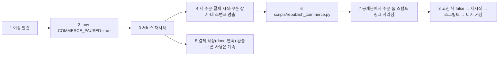

# 물결 5 계약서: W5-A 통합 테스트·비상 스위치, W5-B 운영 신호·문서 초안 (WAVE5_CONTRACT)

> 2026-09-30 (KST) / Claude 작성, OpenCode 구현. 상위 계획 [COMMERCE_WAVE5_PLAN](COMMERCE_WAVE5_PLAN.md) §2 5-1·5-3·5-4·5-5·5-6, §5. 물결 3·4 계약([PAY_WAVE3_CONTRACT](PAY_WAVE3_CONTRACT.md), [STAMP_WAVE4_CONTRACT](STAMP_WAVE4_CONTRACT.md))의 함수 이름을 그대로 쓴다.
> **실행 조건**: W4-C·W4-D가 검토·커밋된 뒤. 이 문서는 그 전에 써 두지만, W4 결과가 계약과 다르면 실행 전에 Claude가 고친다.

## 0. 결론

- **비상 스위치는 `.env`의 `COMMERCE_PAUSED`(기본 false) + `docker compose up -d backend`(restart는 env_file을 다시 읽지 않음)**. 재배포는 필요 없다. 계획서(5-3)의 "재시작 없이"는 버린다 — 재시작 없이 읽는 설정 저장소(keystore)는 API 키 전용이라 켜고 끄는 값을 섞지 않는다. 재시작은 수 초.
- 스위치가 켜지면(멈춤) **돈이 이미 오간 결제를 확정하는 길(`/pay/{id}/done`, 웹훅)과 사장님 환불·사용 처리는 그대로** 둔다. 새 주문·결제 시작·쿠폰 잡기·내 스탬프만 멈춘다.
- 이미 공개된 페이지의 주문 폼·스탬프 링크를 없애는 건 **다시 공개 스크립트** `scripts/republish_commerce.py`가 한다(스위치를 바꾼 뒤 한 번 실행). 페이지에 폼이 남아 있어도 누르면 "잠시 멈췄어요" 화면이라 안전하다.
- 운영 신호는 기존 익명 사건 기록(`funnel.record`)에 **두 사건을 더하는 것**까지. 보는 건 `scripts/commerce_signals.py`(최근 24시간 숫자). `funnel.report()`는 코드에 없고(에이전트 문서의 서술과 다름), 관리자 사이트 문제 신호(D49)·텔레그램 보내기도 아직 없으므로 만들지 않는다.
- 개인정보처리방침은 **초안을 문서로만**(`docs/product/PRIVACY_COMMERCE_DRAFT.md`). `static/privacy.html`은 대표 승인 뒤 Claude가 옮긴다 — 저장소에 들어가면 다음 배포에 그대로 나가기 때문이다(계획서 §5의 `static/privacy.html` 줄을 이렇게 바꾼다).

## 1. 비상 스위치 흐름



| 번호 | 단계 | 설명 |
|---|---|---|
| 1 | 이상 발견 | 운영 신호(§3), 사장님 연락, 포트원 콘솔 대조 |
| 2 | 스위치 | 서버 `.env` 한 줄 |
| 3 | 재시작 | 운영 절차 그대로(스냅샷 불필요, 코드 안 바뀜) |
| 4 | 멈춤 | §2.2 표의 "멈춤" 줄 |
| 5 | 계속 | 이미 돈이 오간 결제는 확정·환불할 수 있어야 한다 |
| 6 | 다시 공개 | 주문을 켠 가게·스탬프 규칙이 켜진 가게의 공개본만 |
| 7 | 결과 | 공개본은 "전화로 주문" 시트로 돌아감(물결 3 이전 모양) |
| 8 | 되돌리기 | 같은 절차의 반대 |

## 2. W5-A 계약

### 2.1 설정

- `app/config.py`: `commerce_paused: bool = False` (환경변수 `COMMERCE_PAUSED`).
- 판단 함수는 한 곳: `app/services/orders.py`에 `def paused() -> bool: return bool(settings.commerce_paused)`. 다른 파일은 이 함수만 부른다(W5-A가 orders.py에 이 한 함수만 더한다).

### 2.2 멈췄을 때 경로별 동작

| 경로 | 동작 |
|---|---|
| `POST /api/orders/{site_key}` (주문 폼) | 멈춤: 200 화면 "지금은 온라인 주문을 잠시 멈췄어요. 전화로 주문해 주세요" + 가게 전화(카드에 있으면 `tel:`) + 가게로 돌아가기 |
| 주문 인증 `GET·POST …/verify/{token}`, `…/resend` | 멈춤: 같은 화면(인증 성공이어도 주문을 만들지 않음) |
| `GET /pay/{pay_id}` | `ready`면 멈춤 화면(결제창 버튼 없음). `paid`면 지금처럼 done으로 |
| `POST /pay/{pay_id}/coupon`, `POST /pay/{pay_id}/free` | 멈춤 화면 |
| `GET /pay/{pay_id}/done` | **계속**(결제 확정) |
| `POST /api/payments/webhook` | **계속** |
| `GET·POST /api/orders/{site_key}/my` (내 스탬프) | 멈춤: "지금은 스탬프 화면을 잠시 멈췄어요" |
| 사장님 `/api/owner/…` 주문·환불·다시 확인·쿠폰 사용·수동 적립 | **계속**(현장 처리는 막지 않는다) |
| 렌더 `design.render_variants`·`publish_choice` | `order_form`·`stamps`를 넣지 않는다(물결 3·4 이전과 같은 HTML) |

- 멈춤 화면은 기존 주문 화면들과 같은 모양(16px 글자, 48px 버튼), 응답 헤더도 같게.
- 가게 설정(`order_on`, 스탬프 규칙 `active`)은 **바꾸지 않는다**. 스위치를 풀면 원래대로.

### 2.3 `scripts/republish_commerce.py` (신규)

```
.venv/bin/python scripts/republish_commerce.py [--dry-run]
```

- 대상: 공개본이 있는 세션(`card.published`) 중 `shop_settings.order_on` 이거나 스탬프 규칙 `active`인 가게.
- 각각 `design.publish_choice(requirement_id, card, card["published"])`. 실패한 가게는 이름 없이 site_key와 사유만 출력하고 계속.
- 출력 마지막 줄: `다시 공개 N곳, 실패 M곳` (`--dry-run`이면 대상 site_key 목록만).
- 여러 번 실행해도 같다(멱등). 운영 DB에 쓰는 건 공개 파일뿐, DB 행은 바꾸지 않는다.

### 2.4 `tests/unit/test_commerce_flow.py` (신규, 계획서 5-1)

한 테스트 함수로 끝까지. 포트원은 `payments._TRANSPORT`(가짜 응답), 문자는 기존 테스트의 가짜.

| 번호 | 단계 | 확인 |
|---|---|---|
| 1 | 포장 주문 카페 공개 + `order_on` + 스탬프 규칙(목표 2, 주문당 1, 무료 음료) | 공개본에 `qty_0`·`/api/orders/`·"스탬프" 링크 |
| 2 | 주문 폼 POST → 인증 → `/pay` | 303 흐름, 기기 쿠키 경로 `/api/orders/{site_key}` |
| 3 | done (포트원 PAID, 금액 같음) | 결제 `paid`, 도장 1 |
| 4 | 두 번째 주문 결제 | 도장 0, 쿠폰 1장 `issued` |
| 5 | 세 번째 주문 `/pay`에서 쿠폰 잡기 | 할인 = 가장 비싼 한 개, 합계가 0이면 `/free`로 완료 |
| 6 | 사장님 매장 사용으로 같은 쿠폰 번호 입력 | 400 "이미 쓴 쿠폰" |
| 7 | 두 번째 주문 전액 환불 | 도장 회수(합계 −1 가능, 화면엔 0), 결제 `canceled` |
| 8 | 웹훅으로 같은 결제 한 번 더 | 변화 없음, 알림 수 그대로 |

### 2.5 `tests/unit/test_commerce_switch.py` (신규)

- `settings.commerce_paused = True`(monkeypatch)면 §2.2 "멈춤" 경로 전부 200 멈춤 화면이고 주문·결제 행이 새로 생기지 않음.
- 같은 상태에서 `ready` 결제의 done·웹훅은 `paid`로 확정됨, 사장님 환불 200.
- 멈춤 상태로 `publish_choice` → 공개본에 `/api/orders/` 없음. 풀고 다시 → 있음.
- `republish_commerce.py --dry-run`이 켠 가게만 고름(함수로 불러 테스트: 스크립트의 본문을 `def main(argv)`로 두고 테스트가 부른다).

### 2.6 W5-A 담당 파일

`app/config.py`(한 줄), `app/services/orders.py`(`paused()` 한 함수만), `app/api/orders.py`(§2.2 검사만), `app/services/design.py`(§2.2 마지막 줄만), `scripts/republish_commerce.py`(신규), `tests/unit/test_commerce_flow.py`(신규), `tests/unit/test_commerce_switch.py`(신규), `.env.example`(한 줄 + 주석 "비상 스위치: true면 새 주문·결제 시작을 멈춤, 재시작 필요"). **`app/services/payments.py`는 만지지 않는다**(W5-B 담당).

## 3. W5-B 계약

### 3.1 운영 신호

- `app/services/funnel.py`: `SERVER_EVENTS`에 `"payment_mismatch"`, `"webhook_bad_signature"` 추가. `PROP_KEYS`는 이미 있는 `site`·`reason`만 쓴다(금액·결제 번호·전화는 넣지 않는다).
- `app/services/payments.py`:
  - `complete()`에서 포트원이 PAID인데 금액·통화가 달라 `failed`로 둘 때 `funnel.record("payment_mismatch", props={"site": site_key, "reason": "amount"|"currency"})`.
  - `verify_webhook()`에서 서명 확인 실패로 `ValueError`를 낼 때(서명 없음·시각 초과·불일치·비밀값 없음) `funnel.record("webhook_bad_signature", props={"reason": "missing"|"stale"|"mismatch"|"no_secret"})`. 기록 실패가 검증 결과를 바꾸면 안 된다(try/except).
- `scripts/commerce_signals.py`(신규): 최근 24시간(KST 기준 표시) 두 사건 수와 사유별 수를 출력. 사건 1개라도 있으면 종료 코드 1(나중에 cron·알림에 붙이기 쉽게).

### 3.2 문서 초안 (쉬운 말, 존댓말, 사장님·손님이 읽는 글)

| 파일 | 내용 |
|---|---|
| `docs/product/PRIVACY_COMMERCE_DRAFT.md` (신규) | 개인정보처리방침에 **덧붙일 문단 초안**: ① 결제 처리 위탁(포트원·토스페이먼츠, 카드 정보는 우리 서버에 오지 않음) ② 온라인 주문(전화번호·이름·주문 내용, 가게에 전달) ③ 스탬프·쿠폰(전화번호·도장 기록·쿠폰 번호, 보관 기간은 **"[대표 결정 Q2]"** 자리 표시로 비워 둠) ④ 기기 기억(서명한 쿠키 90일, 번호 확인용). 맨 위에 "초안 — 법률 검토(L1~L6) 전, 대표 승인 전 게시 금지". 기존 `static/privacy.html`의 말투·항목 번호 체계를 읽고 맞춘다 |
| `docs/product/BETA_OWNER_GUIDE.md` (신규) | 베타 사장님 1쪽(휴대폰으로 읽기): 보며 고치기, 앱형 시안, 공지 띠·팝업, 온라인 주문 켜기(테스트 결제라 돈이 안 나감, 포장 주문 가게만), 스탬프 규칙, 쿠폰 사용(번호 입력·카메라, 아이폰 사파리는 번호 입력), 주문 목록·환불. 항목마다 "어디서 → 무엇을 누르면 → 무엇이 보여요" 세 줄. 전문 용어 금지(API·웹훅·CSP 등) |
| `docs/product/COMMERCE_RUNBOOK.md` (신규, 운영자용) | 비상 스위치 절차(§1 표 그대로), 환불이 포트원엔 됐는데 우리 기록이 없을 때 대조 절차(포트원 콘솔 결제 내역 ↔ `refunds` 표), 운영 신호 보는 법(`scripts/commerce_signals.py`), 웹훅이 안 올 때 사장님 "다시 확인" 버튼 |

### 3.3 W5-B 담당 파일

`app/services/funnel.py`(두 사건 이름만), `app/services/payments.py`(§3.1 두 곳 기록만, 로직 변경 금지), `scripts/commerce_signals.py`(신규), `tests/unit/test_commerce_signals.py`(신규: 금액 불일치 → 사건 1, 서명 틀림 → 사건 1 + 사유, 기록 실패해도 검증 결과 같음, 스크립트 종료 코드), 위 문서 3개.

## 4. 공통 가드레일

- W5-A와 W5-B는 **파일이 겹치지 않는다**(payments.py는 B만, orders.py·api/orders.py·design.py는 A만). 같이 돌려도 된다.
- 돈 규칙(서버 가격만, 포트원 조회 대조, `FOR UPDATE`, 행 삭제·금액 수정 금지)을 건드리는 변경 금지. 스위치는 **막기만** 하고 확정·환불 경로는 막지 않는다.
- 새 pip·npm 의존성 금지. 실제 포트원·문자 호출 금지. 커밋은 pytest 종료 코드 0 뒤에만, 묶음마다 따로 테스트 DB.
- 문서는 사람이 읽는 글: 짧은 문장, 존댓말, 영어 약어 없이. 사실(보관 기간·법적 문구)은 지어내지 말고 자리 표시로 남긴다.

## 5. 합격 기준

| 번호 | 기준 | 묶음 |
|---|---|---|
| 1 | `test_commerce_flow.py` 8단계 한 번에 통과 | A |
| 2 | `test_commerce_switch.py` 통과, 멈춤 중 새 주문·결제 행 0 | A |
| 3 | 멈춤 중에도 done·웹훅·환불 정상 | A |
| 4 | `republish_commerce.py --dry-run`이 켠 가게만, 실제 실행은 멱등 | A |
| 5 | 운영 신호 두 사건 기록·스크립트 출력·종료 코드 | B |
| 6 | 문서 3개: 대표가 읽고 막힘 없음(안내문), 법적 사실은 자리 표시 | B → Claude 검토 → 대표 |
| 7 | 단위·엔진·프론트 전체 통과, 품질 점검 36쪽 전후 같음 | Claude |

## 변경 이력

| 날짜 | 내용 |
|---|---|
| 2026-09-30 | 처음 작성. 계획서 대비: 스위치를 `.env`+재시작으로(keystore는 키 전용), 운영 신호는 사건 기록+스크립트로(`funnel.report`·D49 문제 신호 없음), 방침은 문서 초안으로(`static/privacy.html`은 승인 뒤) |
