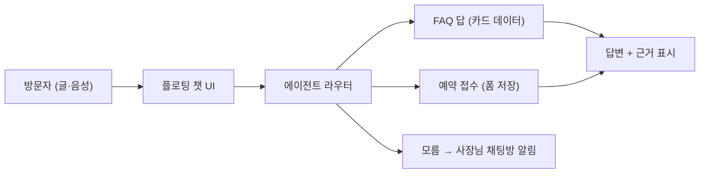

# 홈페이지 채팅 에이전트 설계 (공통 모듈)

> 작성: 2026-09-27 / 목적: 우리가 만들어 주는 홈페이지마다 붙는 "가게 전용 챗봇".
> 범위: 예약 문의·취소·조회, 자연어 가능 여부 ("월요일 예약돼요?"), 음성 입력, 플로팅 UI, 사장님 맞춤 설정.
> 원칙: 지어내지 않는다. 모르는 건 "사장님께 확인 중"으로 남기고 채팅방에 알린다.

## 1. 요구사항 (사용자 문장 → 기능)

| # | 사용자 문장 예 | 기능 | 필요 데이터 |
|---|---|---|---|
| 1 | "월요일 예약돼요?" | 가능 여부 답변 | 영업시간·휴무·예약 수단(외부 URL or 전화) |
| 2 | "컷트 얼마예요?" | 메뉴·가격 답변 | offerings + price (V2 심화로 수집) |
| 3 | "예약 취소하고 싶어요" | 취소 접수 | 예약자명·날짜 (폼 or 외부 링크 안내) |
| 4 | "내 예약 확인해줘" | 예약 조회 | **베타 밖** (예약 DB 없음). 전화·카톡 확인 안내로 대체 |
| 5 | "어디에 있어요?" | 위치 답변 | location + 지도 링크 |
| 6 | 음성으로 1~5 | 음성 입력→텍스트 | Parakeet STT (현행 T1 재활용) |

## 2. 아키텍처 (공통 모듈 1개)

- 라우터: 규칙 우선 (가격·시간·위치·예약 키워드 → 카드 슬롯 조회). 규칙에 없으면 "사장님께 물어볼게요" + 채팅방 알림 (지어냄 방지).
- 답변 근거: 카드에 있는 값만. 없는 값은 절대 만들지 않음 (N-3과 같은 규칙).
- 예약 접수: 이름·전화·날짜 3칸 폼 → inquiries와 같은 저장 (30일) → 사장님 카톡 알림 (현행 경로 재활용).
- 조회·취소 확정: 베타는 "접수"까지만. 확정 처리는 사장님이 채팅방에서 (버튼 1개: "확인했어요").

## 3. 플로팅 UI (공통)

- 위치: 우하단 플로팅 버튼 (모바일 56px, 44px 이상). 푸터에도 "채팅 상담" 링크.
- 상태: 닫힘(뱃지) → 열림(대화창 360×520, 모바일 전체) → 음성 버튼 (T1 듣기·말하기 재활용).
- 스타일 선택지 3종 (시안 3안과 연동): ① 둥근 말풍선형 ② 각진 정보형 ③ 미니멀 점형.
- 첫 마디: "안녕하세요! {가게}입니다. 예약·메뉴·위치를 물어보세요." (가게명 자동 치환)

## 4. 사장님 맞춤 설정 (데이터 넣는 법)

| 설정 | 방법 | 저장 |
|---|---|---|
| 영업시간·휴무 | 요구사항 대화에서 수집 (현행) | 카드 slots |
| 메뉴·가격 | V2 심화로 수집 | 카드 slots |
| 예약 수단·URL | V2-3 질문 or 직접 편집 | 카드 + bookings |
| 자주 묻는 답 5개 | 시안 확정 전 "손님이 자주 묻는 것" 1회 질문 | faqs (신규, 카드 안) |
| 못 답할 때 행동 | 고정: 채팅방 알림 (선택지: 전화 연결 or 카톡 채널) | 카드 1키 |
| 말투 | 3종 (친절·간결·정중) | 카드 1키 |

직접 편집 화면(`/editor`)에 "챗봇" 탭 1개 추가: FAQ 5개 + 말투 + 못 답할 때 행동만. 나머지는 카드에서 자동.

## 5. 음성

- 입력: Parakeet STT (현행 T1, 채팅방에서 실측됨) → 텍스트로 라우터에 전달.
- 출력(읽어주기): Magpie TTS (현행). 기본 끔, 버튼 누를 때만 (자동재생 금지 유지).
- 소음·긴 문장: STT 신뢰도 낮으면 "다시 한 번 말씀해 주세요" (지어내지 않음).

## 6. 단계 (베타 내·외)

- 베타 내: 플로팅 UI + 규칙 답변(가격·시간·위치·예약 안내) + 예약 접수폼 + 모름 알림 + 음성 입력.
- 베타 뒤: 예약 조회·취소 확정 (bookings DB), 결제 연동 안내, 다국어.

## 7. 검증

- 유닛: 질문 1개 = 답 1개 (`tests/engine` 패턴). "월요일 예약돼요?" → 휴무면 "월요일은 휴무예요" + 근거.
- 시나리오: 업종별 FAQ 10문장 → 정답률. 지어냄 0건이 합격선.
- 실측: 공개 사이트에서 손으로 5문장.
