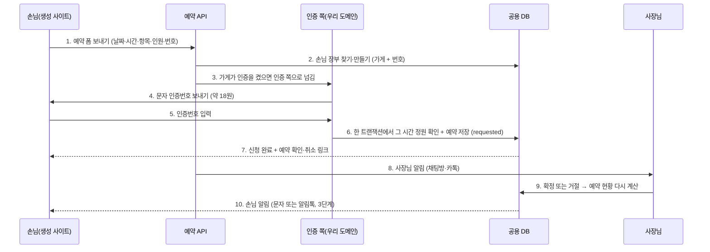

# 손님 묶기·예약 DB·본인인증 리서치

> 작성일: 2026-09-28 (KST) / Claude
> 질문(대표): ① 카카오톡 문의 같은 것에서 로그인한 사용자와 익명 사용자를 어떻게 묶나 ② 예약을 실제 DB와 연동해 묶을 수 있나 ③ 회원가입처럼 예약에도 본인인증이 필요하지 않나
> 먼저 읽은 것: `research/RESEARCH_LOGIN_NOTIFY.md`, `BOOKING_PLAN.md`, `USER_DB_PLAN.md`, `app/db/models.py`, `app/services/kakao_talk.py`, `app/services/site_render.py`
> 규칙: 외부 사실은 출처 URL + 확인 날짜. 공식 문서로 확인 못 한 것은 **확인 필요**. 법률 자문 아님.

## 0. 결론 먼저

| 질문 | 답 | 추천 |
|---|---|---|
| ① 익명 손님과 로그인 손님 묶기 | 생성 사이트에는 스크립트·쿠키 추적이 없어(CSP sandbox) 폼을 보내기 전의 방문자는 누구인지 모른다. 묶을 수 있는 공통 열쇠는 **손님이 적은 전화번호**다. 카카오 채널 1:1 채팅은 우리 서버로 내용·신원이 오지 않아 묶을 수 없다 | 가게별 **손님 장부**(`customers`: 가게 + 전화번호)를 만들어 문의·예약을 여기에 붙인다 |
| ② 예약을 실제 DB와 연동 | **이미 된다.** `bookings` 표에 저장하고, 사장님이 확정·거절하고, 확정 예약으로 예약 현황(여유·마감)을 계산한다(J7). 빠진 것은 손님 장부 연결, 겹치는 예약 막기, 손님 알림 | `bookings.customer_id` + 같은 칸 정원 검사를 DB 안에서(트랜잭션) |
| ③ 예약에 본인인증 | 동네 가게 예약에 법으로 필요한 경우는 드물다(**확인 필요**). 노쇼를 줄이는 데 필요한 것은 "이 번호가 진짜 이 사람 것인가"라서 **문자 인증번호(1건 약 18원)**로 충분하다. 휴대폰 본인인증(PASS 등, 1건 약 40~50원)은 사업자 계약과 자바스크립트 창이 필요하고, 성인 확인·중복 가입 막기처럼 이름·생년월일·CI가 꼭 필요할 때만 쓴다 | 손님 회원가입은 만들지 않는다. 예약 때 문자 인증번호(가게가 켜고 끔) + 예약 확인·취소 링크 |

## 1. 지금 상태 (코드 확인 2026-09-28)

| 있음 | 없음 |
|---|---|
| 사장님 로그인(구글·카카오), `users`·`oauth_accounts` | 손님(가게 방문자) 계정·장부 |
| 문의 `inquiries`, 예약 `bookings`(가게 = `site_key`), 방문일 + 30일 뒤 삭제 | 문의·예약을 같은 손님으로 묶는 열쇠 |
| 사장님에게 카톡 "나에게 보내기"(`kakao_talk.py`), 채널 1:1 채팅 링크 부품 | 손님에게 가는 알림(문자·알림톡) |
| 예약 현황 계산(`availability.py`), 확정·취소 때 공개본 다시 그리기 | 같은 시간 정원 넘는 예약 막기(지금은 신청은 다 받고 사장님이 거절) |
| 생성 사이트는 스크립트 없는 HTML(`site_render.py`, CSP sandbox) | 본인인증 |

## 2. ① 손님 묶기

### 2.1 무엇으로 묶을 수 있나

| 열쇠 | 어디서 생기나 | 우리가 받을 수 있나 | 판단 |
|---|---|---|---|
| 쿠키·방문자 id | 방문자 브라우저 | **못 받음.** 생성 사이트는 스크립트가 없고 sandbox라 추적 쿠키를 두지 않는다(개인정보 최소 수집에도 맞다) | 쓰지 않음 |
| 전화번호 | 문의·예약 폼 | 받음(지금도 저장) | **공통 열쇠.** 같은 가게 안에서 같은 번호 = 같은 손님 |
| 카카오 채널 1:1 채팅 | 손님이 가게 채널에서 채팅 | **못 받음.** 채팅은 가게 채널 관리자센터 안에만 있다. 받으려면 가게마다 챗봇(i 오픈빌더)을 붙이거나 상담톡(딜러 경유)을 써야 한다 | 가게마다 설정이 무거워 1단계 밖 |
| 챗봇 사용자 키 | 가게 채널에 챗봇을 붙이면 요청마다 `botUserKey`·`plusfriendUserKey`(비식별), 앱 키를 등록하면 `appUserId`(= 카카오 로그인 회원번호) | 챗봇을 붙인 경우만 | 나중 후보: 카카오 로그인한 손님과 채널 대화를 묶는 유일한 공식 길 |
| 카카오 로그인 회원번호 | 손님이 카카오로 로그인 | 받음(로그인 붙이면) | 손님 로그인은 만들지 않는 쪽 추천(§4) |

출처(확인 2026-09-28): 챗봇 사용자 키 필드 https://kakaobusiness.gitbook.io/main/tool/chatbot/skill_guide/answer_json_format , 채널 채팅 링크 https://developers.kakao.com/docs/ko/kakaotalk-channel/common

### 2.2 손님 장부 (제안 계약 — 구현 전 대표 확인)

`customers` (가게별, 사장님 사이 공유 안 함)

| 칸 | 형 | 설명 |
|---|---|---|
| id | bigint PK | |
| site_key | text | 가게. (site_key, phone_hash) 유일 |
| phone_hash | text | 정규화한 번호의 HMAC. 찾기·묶기용 |
| phone_enc | text | 암호화한 번호. 사장님 화면에 보일 때만 푼다 |
| name | text null | 마지막으로 적은 이름 |
| phone_verified_at | timestamptz null | 문자 인증번호를 통과한 때 |
| first_seen / last_seen | timestamptz | |

`inquiries.customer_id`, `bookings.customer_id`를 붙인다. 폼이 들어오면 번호를 정규화(`010-1234-5678` → `01012345678`)해 찾거나 만든다. 사장님 채팅방에는 "처음 오신 손님 / 3번째 예약"처럼 보인다.

**삭제**: 마지막 문의·예약이 지워지고(방문일 + 30일) 더 남은 기록이 없으면 손님 행도 지운다. 보관 기간이 늘면 동의 문구도 바꿔야 한다(**확인 필요**: 개인정보 처리방침 L1~L6 검토와 함께).

## 3. ② 예약을 DB와 제대로 묶기

| 번호 | 설명 |
|---|---|
| 1 | 지금처럼 스크립트 없는 폼. 바뀌는 것 없음 |
| 2 | §2.2 손님 장부. 인증을 안 켠 가게도 번호로 묶인다 |
| 3 | 생성 사이트는 스크립트를 못 쓰므로 인증 화면은 **우리 도메인의 일반 페이지**로 넘긴다(303). 인증을 끈 가게는 3~5를 건너뛴다 |
| 4 | 문자 발송 대행(솔라피 단문 18원, 월 기본료 없음). 같은 번호·같은 IP 재발송 제한 |
| 5 | 인증번호 6자리, 3분, 5회 틀리면 잠금 |
| 6 | 지금은 신청을 다 받고 사장님이 거절한다. 정원이 있는 가게(펜션·클래스)는 같은 날짜·시간·항목의 `requested + confirmed` 합이 정원을 넘으면 받지 않는다. 행 잠금 또는 조건부 INSERT로 동시에 두 명이 마지막 자리를 잡는 일을 막는다 |
| 7 | 예약 확인·취소 링크는 추측할 수 없는 토큰. 손님 계정 없이 자기 예약을 보고 취소한다 |
| 8 | 지금 코드(`notify.owner_kakao`) 그대로 |
| 9 | 지금 코드(J7) 그대로 |
| 10 | 3단계. 알림톡은 비즈니스 채널 + 공식 딜러 필요, 1건 약 7~13원. 처음에는 **플랫폼 채널 하나**로 보내고("OO가게 예약이 확정됐어요"), 가게별 채널 발송은 사장님 사업자 인증이 필요해 나중 |

외부 예약 서비스: 네이버 예약은 공개 API가 없다(BOOKING_PLAN 1단계 결정 유지). 예약 주소가 있으면 링크만 둔다.

출처(확인 2026-09-28): 알림톡 조건·딜러 15개사·단가 https://blog.bizgo.io/howto/alimtalk-guide/ , https://blog.bizgo.io/inside/alimtalk-provider-selection-guide/ , https://kakaobusiness.gitbook.io/main/channel/run/message / 문자·알림톡 단가 https://solapi.com/pricing

## 4. ③ 본인인증이 필요한가

### 4.1 세 가지 확인 방법 비교

| | 문자 인증번호 | 휴대폰 본인인증 (PASS·통신사) | 카카오 로그인 |
|---|---|---|---|
| 확인하는 것 | 이 번호를 지금 이 사람이 쓴다 | 명의자 이름·생년월일·성별·번호 + CI·DI | 카카오계정 주인 |
| 노쇼·장난 예약 막기 | 충분 | 충분 | 번호를 받으려면 권한 심사 필요 |
| 비용 | 1건 약 18원(솔라피 단문) | 1건 약 40~50원 또는 월 정액(다날 5만 원/1,200건 등). 포트원 통해 신청하면 가입비 없음 | 무료 |
| 준비 | 문자 대행 가입, 발신번호 등록 | 사업자 + PG 계약(다날·KCP·KG이니시스 통합인증), **자바스크립트 창 필요** → 우리 도메인 페이지로 넘겨야 함 | 비즈 앱 + 전화번호 동의 항목 추가 기능 신청(심사) |
| 손님 부담 | 번호 입력 + 6자리 | 통신사·PASS 앱 인증 | 카카오 로그인 동의 |
| 쓸 때 | **기본 추천** | 성인 확인(술·숙박 미성년 제한 등), 중복 가입을 반드시 막아야 할 때, 분쟁 때 실명이 필요할 때 | 손님이 자주 오는 가게에서 다시 입력을 줄일 때(나중) |

주의:
- 카카오 로그인으로 받는 CI는 본인인증을 대신할 수 없다고 카카오가 밝힌다("카카오는 본인인증기관이 아니므로 …").
- 휴대폰 본인인증 결과(CI·이름·생년월일)는 민감도가 높은 개인정보다. 받으면 보관·파기 규칙과 처리방침이 늘어난다. 필요 없으면 받지 않는 것이 안전하다(**확인 필요**: 법률 검토 L1~L6).
- 주민등록번호는 어떤 경우에도 받지 않는다(**확인 필요**: 법령 근거는 법률 검토에서).

출처(확인 2026-09-28): 포트원 본인인증(반환 값·방식) https://developers.portone.io/opi/ko/extra/identity-verification/readme-v2?v=v2 , 가입비 https://blog.portone.io/authorization-payment/ , 건당 요금(다날 월 정액·KCP 50원·KG이니시스 40원) https://sir.kr/boards/free/904486 , https://danalpay.com/service_application/rate_information / 카카오 로그인 동의 항목·CI 주의 https://developers.kakao.com/docs/ko/kakaologin/utilize / 카카오싱크 https://developers.kakao.com/docs/ko/kakaosync/common

### 4.2 문자 인증을 매번 하지 않게 (대표 결정 2026-09-28: ①+② 같이)

| # | 방법 | 내용 |
|---|---|---|
| ① | 이 기기 기억 | 인증 화면은 우리 도메인 페이지라 쿠키를 둘 수 있다. 인증에 성공하면 "이 기기 = 이 가게의 이 번호" 표시를 HttpOnly·Secure 쿠키로 90일 둔다(값은 서명한 토큰, 번호 원문 없음). 같은 기기·같은 번호로 다시 예약하면 문자 없이 접수. 문자는 손님당 처음 한 번(약 18원). 번호가 다르거나 쿠키가 없으면 다시 인증 |
| ② | 인증번호 자동 입력 | 아이폰 Safari: 입력 칸에 `autocomplete="one-time-code"`만 두면 키보드 위에 번호가 뜬다. 안드로이드 Chrome: 문자 마지막 줄을 `@<우리 도메인> #<번호>` 형식으로 보내고 인증 페이지에서 Web OTP API(`navigator.credentials.get({otp})`)를 부르면 자동으로 채운다. 인증 페이지는 생성 사이트가 아니라서 스크립트를 쓸 수 있다 |

확인 필요: 생성 사이트 → 우리 API로 폼을 보낸 뒤 303으로 인증 페이지에 올 때 쿠키가 실리는지(SameSite=Lax, 사이트 도메인 구성에 따라 다름). 구현 때 실제 휴대폰(iOS Safari·Android Chrome)으로 확인한다.

### 4.3 손님 회원가입은 만들지 않는다 (추천)

| 이유 | 설명 |
|---|---|
| 손님 이탈 | 동네 가게 예약에서 가입을 먼저 시키면 전화로 돌아간다 |
| 가게마다 따로인 손님 | 손님은 "이 가게" 손님이지 "우리 플랫폼" 회원이 아니다. 플랫폼 계정은 사장님에게만 |
| 대신 | 번호 + 문자 인증 = 손님 식별, 예약 확인·취소 링크 = 손님 계정 역할 |

## 5. 단계 추천

| 단계 | 할 일 | 비용 | 대표 결정 필요 |
|---|---|---|---|
| 1 | 손님 장부(`customers`) + 문의·예약 연결 + 사장님 채팅방에 "몇 번째 손님" 표시 | 0원 | 보관 기간(지금 방문일 + 30일 유지?) |
| 2 | 정원 있는 가게의 겹치는 예약 막기(DB 트랜잭션) + 예약 확인·취소 링크 | 0원 | — |
| 3 | 문자 인증번호(가게가 켜고 끔) + 이 기기 기억 90일 + 인증번호 자동 입력(§4.2) | 손님당 처음 1건 약 18원 | 문자 대행사·발신번호(플랫폼 대표 번호) |
| 4 | 손님 알림(확정·거절·전날 안내): 알림톡(플랫폼 채널) → 실패하면 문자 | 1건 약 8~18원 | 플랫폼 카카오 비즈니스 채널 개설·딜러 선택 |
| 5 | 필요한 업종만 휴대폰 본인인증(포트원 경유) | 1건 약 40~50원 | 어떤 업종에 켤지 |
| 나중 | 가게 채널 챗봇으로 카카오 채팅과 손님 장부 묶기, 손님 카카오 로그인 | 가게마다 설정 | 10/17 검증 뒤 |

## 6. 대표 결정 질문

| # | 질문 | 추천 답 |
|---|---|---|
| R1 | 손님 회원가입을 만들까 | 아니오. 번호 + 문자 인증 + 확인 링크 |
| R2 | 본인인증을 기본으로 켤까 | 아니오. 문자 인증번호를 가게 선택으로, 본인인증은 필요한 업종만 |
| R3 | 손님 알림은 누구 이름으로 보낼까 | 처음엔 플랫폼 채널 하나(가게 이름은 본문에). 가게별 채널은 사장님 사업자 인증 뒤 |
| R4 | 카카오 채널 채팅까지 손님 장부에 묶을까 | 10/17 뒤. 가게마다 챗봇 설정이 필요하다 |
| R5 | 손님 장부 보관 기간 | 마지막 기록 + 30일(지금 규칙과 같게). 단골 관리가 필요하면 동의를 따로 받고 늘린다 |

## 변경 이력

| 날짜 | 내용 |
|---|---|
| 2026-09-28 | 처음 작성 |
| 2026-09-28 | §4.2 문자 인증 매번 안 하기: 기기 기억 + 자동 입력 (대표 결정) |
