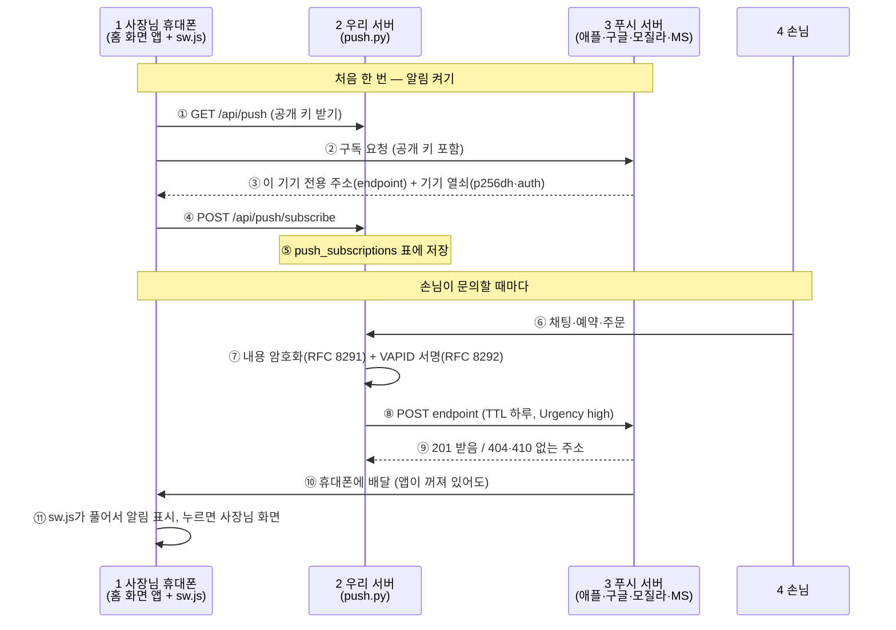
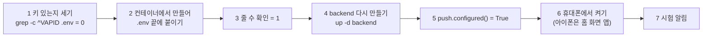

# 휴대폰 알림(웹 푸시)은 어떻게 오고, 왜 이렇게 정했나 (RESEARCH_WEB_PUSH)

> 2026-10-05 (KST). 대표 질문: "이 푸시는 어떤 메커니즘으로 오는 거야? 무료야, 유료야?"
> 조사·작성 Claude. 계획·구현 상태는 [OWNER_NOTIFY_PLAN](../OWNER_NOTIFY_PLAN.md) §3·§4.1, 코드는 `app/services/push.py`·`static/sw.js`·`static/push.js`.
> 운영 켜짐: 2026-10-05 (VAPID 키 서버 .env, 대표 아이폰 1대 수신 확인).

## 0. 결론

1. **무료다.** 배달은 휴대폰·브라우저 회사(애플·구글·모질라·MS)가 자기 플랫폼 기능으로 운영하는 **푸시 서버**가 한다. 웹 표준(Web Push)이라 가입·계약·건당 요금이 없다. 우리 비용은 서버가 암호화·서명하는 계산뿐이다.
2. 우리는 외부 푸시 업체(OneSignal 등)나 Firebase SDK를 쓰지 않고, 표준 3개(RFC 8030·8291·8292)를 `cryptography`+`httpx`로 **직접** 구현했다.
3. 내용은 **끝에서 끝까지 암호화**되어 푸시 서버도 읽지 못한다. 우리 서버임은 **VAPID 키 서명**으로 밝힌다.
4. 사장님 알림의 **기본 채널**로 정했다(카톡 나에게 보내기는 보조, 알림톡은 유료 요금제용). 이유는 §4.

## 1. 어떻게 오나

| 번호 | 단계 | 설명 |
|---|---|---|
| ① | 공개 키 받기 | 서버가 VAPID 비밀 키에서 공개 키를 계산해 준다. 키가 없으면 카드에 "준비 중"만 보인다 |
| ② | 구독 요청 | 사장님이 "📱 휴대폰 알림 켜기"를 누를 때만(브라우저 규칙: 사용자 동작 필요). 우리 공개 키를 같이 보내, 이 구독은 우리 서버만 쓸 수 있게 묶인다 |
| ③ | 주소·열쇠 | 푸시 서버가 이 기기만의 **주소**와, 내용을 잠글 **기기 열쇠**를 준다. 열쇠의 짝(비밀)은 휴대폰에만 있다 |
| ④ | 서버에 등록 | 휴대폰이 주소·열쇠를 우리 서버에 보낸다. 바꾸는 요청은 Origin 확인 |
| ⑤ | 저장 | `push_subscriptions`(마이그레이션 0022). 같은 주소는 1줄, 한 사람 기기 10대까지 |
| ⑥ | 사건 | 손님 채팅·문의·예약·결제. `notify.owner`가 웹 푸시와 카톡을 따로 부른다(하나가 실패해도 다른 것은 감) |
| ⑦ | 잠그고 서명 | 내용은 기기 열쇠로 암호화(aes128gcm)해 **푸시 서버도 못 읽는다**. 머리에는 VAPID(ES256) 서명을 붙여 "우리 서버가 보냄"을 증명한다 |
| ⑧ | 배달 부탁 | 허용한 푸시 회사 주소로만 보낸다. TTL 하루(휴대폰이 꺼져 있으면 하루 기다림), Urgency high |
| ⑨ | 결과 | 201이면 성공(`last_ok_at` 갱신). 404·410은 사장님이 알림을 끈 것이라 바로 지운다. 다른 실패는 세다가 10번이면 지운다 |
| ⑩ | 배달 | 푸시 서버가 휴대폰 OS의 상시 연결로 밀어 넣는다. 우리 앱이 꺼져 있어도 온다 |
| ⑪ | 표시 | `sw.js`가 풀어서 알림을 띄운다. 같은 가게는 tag로 모으되 다시 울린다. 누르면 우리 사이트 안 주소만 연다. 알림을 누르면 OS가 읽음 처리해 알림 센터에서 사라진다(10/5 대표 확인, 정상) |

잠금 화면 글: 가게 이름 + 알림 첫 줄의 ':' 앞까지만("사이트로 새 문의가 왔어요."). 손님 이름·연락처·글 원문은 보내지 않는다(`push.lock_screen_line`).

## 2. 무료인가 — 조사 결과

| 확인한 것 | 결과 | 근거 |
|---|---|---|
| 애플 푸시 서버(웹 푸시) | 무료. 애플 개발자 계정·인증서 없이 표준 Web Push로 보낸다. iOS·iPadOS **16.4 이상**, **홈 화면에 추가한 웹 앱**에서만, 권한 요청은 버튼 누름 같은 사용자 동작에 대해서만 | [WWDC23 10120](https://developer.apple.com/wwdc23/10120), [OneSignal iOS 웹 푸시 문서](https://documentation.onesignal.com/docs/en/web-push-for-ios) |
| 구글(FCM, 크롬·안드로이드가 쓰는 푸시 서버) | 메시지 요금 없음, 건수 제한 없음, 상업 이용 포함 | [Firebase Cloud Messaging](https://firebase.google.com/products/cloud-messaging/), [Firebase 요금제](https://firebase.google.com/docs/projects/billing/firebase-pricing-plans) |
| 표준 한도 | 푸시 서버는 본문 4096바이트까지만 보장 → 암호화 머리를 빼면 평문 약 3993바이트. 우리는 3000바이트로 넉넉히 자른다(`MAX_PAYLOAD`) | [RFC 8030](https://tools.ietf.org/html/rfc8030) §7.2, [RFC 8291](https://www.rfc-editor.org/rfc/rfc8291.html) §4 |
| TTL·Urgency | TTL 0이면 기기가 꺼져 있을 때 버려진다. Urgency는 very-low·low·normal·high | [RFC 8030](https://tools.ietf.org/html/rfc8030) §5.2·§5.3 |

돈이 드는 곳은 "배달"이 아니라 그 위에 얹는 **마케팅 업체 기능**(분석·세그먼트·자동화)이다. 우리는 그 층을 쓰지 않는다.

## 3. 다른 알림과 비교

| | 웹 푸시 | 카톡 나에게 보내기 | 알림톡 | 문자(SMS) | 텔레그램 |
|---|---|---|---|---|---|
| 비용 | **무료** | 무료 | 건당 약 7~13원 | 알림톡보다 비쌈 | 무료 |
| 만료 | 사장님이 끄기 전까지 | **리프레시 토큰 2개월** (OWNER_NOTIFY_PLAN §8) | 없음 | 없음 | 없음 |
| 사장님 준비 | 아이폰은 홈 화면 추가 + 켜기 | 카카오 로그인 + 동의 | 없음 | 없음 | 앱 설치·봇 연결 |
| 우리 준비 | VAPID 키 1개 | 카카오 앱 설정 | 비즈니스 채널·템플릿 심사 | 솔라피 | 봇 토큰 |
| 쓰임 | **사장님 기본** | 사장님 보조 | 유료 요금제·손님 알림 | 알림톡 실패 대체 | **운영자(우리) 전용** |

## 4. 어떻게 결정했나

| 번호 | 결정 | 다른 안 | 왜 |
|---|---|---|---|
| W1 | 사장님 알림 기본 채널 = 웹 푸시 | 알림톡을 기본으로 | 무료·만료 없음·앱 설치 없음. 알림톡은 건당 요금과 채널 심사가 있어 유료 요금제에 둔다(OWNER_NOTIFY_PLAN §3, D6 "알림톡 보류, 웹 푸시로 시작") |
| W2 | 외부 푸시 업체·Firebase SDK 안 씀 | OneSignal, FCM SDK | 손님·사장님 데이터가 제3자에게 가지 않는다(개인정보 처리 위탁이 늘지 않음). 표준 Web Push만으로 애플·구글·모질라·MS 모두에 보낼 수 있다 |
| W3 | `pywebpush` 라이브러리 안 쓰고 직접 구현 | `pywebpush` 설치 | 설치하면 `cryptography`를 50으로 올려 다른 의존성과 충돌. 이미 있는 `cryptography`+`httpx`로 RFC 3개를 직접 구현하고, RFC 8291 부록 A 시험 벡터와 바이트까지 일치·`http_ece`로 풀림을 테스트로 확인했다 |
| W4 | 푸시 회사 주소만 허용 | 아무 주소나 | 구독 주소는 브라우저가 주지만 결국 클라이언트가 보낸 값이다. 우리 서버가 임의 주소로 요청을 보내는 통로(SSRF)가 되지 않게 구글·모질라·애플·MS 도메인만 받는다(`ALLOWED_HOSTS`) |
| W5 | 잠금 화면엔 종류만, 원문 없음 | 손님 글 미리보기 | 잠금 화면은 옆 사람도 본다. 손님 이름·연락처·글은 사장님 화면에서만(GUEST_CHAT_CONTRACT §0) |
| W6 | TTL 하루, Urgency high | TTL 0 / 일주일 | 문의는 늦어도 알아야 하지만 일주일 지난 알림은 의미가 적다. high는 배터리 절약 모드에서도 바로 배달되게 |
| W7 | 404·410 바로 지움, 그 밖은 10번 실패 뒤 지움, 기기 10대 | 지우지 않음 | 끈 기기에 계속 보내면 푸시 서버가 우리를 느리게 받을 수 있다. 일시 장애로 멀쩡한 기기를 지우지 않게 연속 실패만 센다 |
| W8 | VAPID 비밀 키는 **서버 안에서 만들어 바로 .env에** | 노트북에서 만들어 복사 | 비밀 키가 화면·채팅·클립보드에 남지 않는다. 키는 keystore로 읽어 관리자 화면에서도 바꿀 수 있다(D50) |
| W9 | VAPID 키는 **한 번 만들면 바꾸지 않는다** | 정기 교체 | 바꾸면 모든 기기의 구독이 무효가 되어 사장님이 다시 켜야 한다. 유출이 확인될 때만 바꾼다 |
| W10 | `VAPID_SUBJECT`는 비워 앱 주소(https) 사용 | 운영자 메일 | 표준은 mailto 또는 https 연락처면 된다. 개인 메일을 푸시 회사에 보내지 않아도 된다. 대표 메일을 쓰고 싶으면 `.env`에 넣으면 된다 |
| W11 | 웹 푸시와 카톡을 둘 다, 따로 보냄 | 하나만 | 이행 기간에 하나가 끊겨도 다른 것이 닿게. 요금제·조용한 시간·알림톡 순서는 N4(OWNER_NOTIFY_PLAN §4) |

## 5. 키 만들기·켜기 (2026-10-05 운영에서 한 순서)

| 번호 | 단계 | 명령·설명 |
|---|---|---|
| 1 | 세기 | `grep -c "^VAPID" .env` → 0이어야 한다. 1 이상이면 멈춘다(W9) |
| 2 | 만들기 | `sudo docker compose exec -T backend python scripts/gen_vapid.py \| grep '^VAPID_PRIVATE_KEY=' >> .env` — 출력 없음이 정상(W8) |
| 3 | 확인 | `grep -c "^VAPID_PRIVATE_KEY=." .env` → 1 |
| 4 | 반영 | `sudo docker compose up -d backend` — `.env`는 `restart`로 다시 읽히지 않는다 |
| 5 | 켜짐 확인 | `push.configured()` → True |
| 6 | 기기 | 안드로이드는 크롬에서 사장님 화면 → 켜기. 아이폰은 사파리 → 공유 → 홈 화면에 추가 → 그 아이콘으로 열고 켜기 |
| 7 | 시험 | 텔레그램 `ops_alert.send(..., wait=True)` + `push.send_to_user` → `push devices ok: 1` |

**10/5 실수와 정리:** 2번을 두 번 실행해 키가 2줄이 됐다. 같은 이름이 두 번이면 다음 재시작 때 뒤의 값이 이길 수 있어 그 사이 켠 기기가 무효가 된다. 실행 중인 키(첫 줄)만 남겼다:
`cp .env .env.bak-vapid && sed -i '0,/^VAPID_PRIVATE_KEY=/b; /^VAPID_PRIVATE_KEY=/d' .env` → 남은 값과 `printenv VAPID_PRIVATE_KEY`의 sha256이 같음을 확인(키 값은 화면에 내지 않음). 백업 `.env.bak-vapid`에는 쓰지 않는 두 번째 키가 있으니 지워도 된다.

## 6. 한계

- **배달 보장 없음.** TTL(하루)이 지나도록 휴대폰이 꺼져 있으면 버려진다. 글은 채팅방에 남으므로 잃지는 않는다.
- **아이폰:** 16.4 미만, 또는 사파리 탭에서 연 경우는 알림이 없다. 홈 화면 아이콘으로 열어야 한다. 설정 → 알림 → "사장님"에서 "예약된 요약"이면 늦게 보이므로 "즉시 전달"을 안내한다.
- **사장님이 알림 권한을 끄면** 다음 발송에서 404·410을 받고 그 기기를 지운다. 다시 켜야 한다.
- 브라우저 데이터를 지우거나 홈 화면 앱을 지우면 구독도 사라진다.
- 소리·진동 세기는 OS 설정을 따른다(우리가 정할 수 없음).

## 출처

- [WWDC23 — What's new in web apps (10120)](https://developer.apple.com/wwdc23/10120)
- [OneSignal — iOS web push setup](https://documentation.onesignal.com/docs/en/web-push-for-ios)
- [Firebase Cloud Messaging](https://firebase.google.com/products/cloud-messaging/), [Firebase pricing plans](https://firebase.google.com/docs/projects/billing/firebase-pricing-plans)
- [RFC 8030 — Generic Event Delivery Using HTTP Push](https://tools.ietf.org/html/rfc8030)
- [RFC 8291 — Message Encryption for Web Push](https://www.rfc-editor.org/rfc/rfc8291.html)
- RFC 8292 — Voluntary Application Server Identification (VAPID) for Web Push
