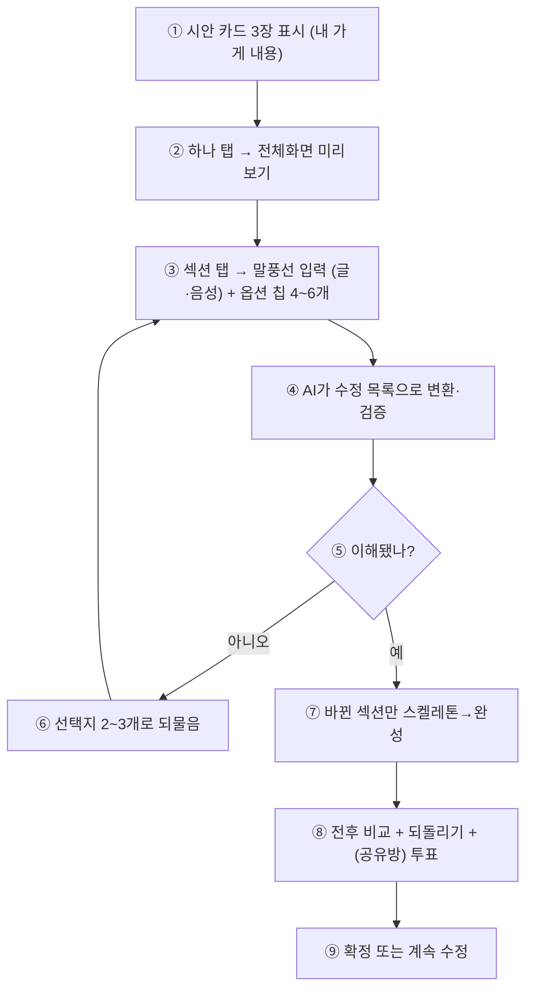
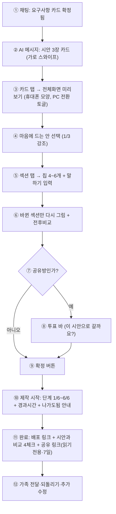

# DESIGN 시안·진행 UX 검토 (R1: UX·제품설계 관점)

> 검토자: R1 (UX) / 일자: 2026-09-25 / 대상: `docs/product/DESIGN_PIPELINE_PLAN.md`, `docs/product/DECISIONS.md`, `docs/product/ROOM_POLICY.md`, `app/api/public.py`, `app/services/codegen.py`, `deploy/Caddyfile`
> 사용자 질문 취지: "시안을 Paper 데스크톱(paper.design) 같은 링크 형식으로 보내서 거기서 템플릿을 고르게 해야 하나? 아니면 더 좋고 보안에도 취약하지 않은 방식은? Paper처럼 뭔가 만들어지는 게 보이게 할 수 있나? 실시간이 아니면 진행 표시줄과 어떤 식으로 개발되고 있는지를 보여 주고, 옵션으로 잘 선택할 수 있게."

## 0. 한 줄 결론

| # | 결론 |
|---|---|
| 1 | Paper식 "별도 링크 + 데스크톱 캔버스"를 그대로 쓰지 마라. 소상공인·휴대폰·카톡 인앱브라우저 조건과 정면 충돌한다 |
| 2 | 기본은 **(b) 채팅 안 카드 + 전체화면 미리보기**, 공유·가족 전달용으로만 **(a) 별도 링크를 보조**로 = **(c) 둘 다(역할 분리)** 를 추천 |
| 3 | "만들어지는 게 보이는 느낌"은 실시간 코드 스트리밍이 아니라 **섹션 단위 스켈레톤→완성 + 단계 문구 + 버전 비교**로 구현한다 (계획 P-4~P-6 방향에 동의) |
| 4 | 진행률은 거짓 % 금지. **단계 카운트(2/6 등) + 경과시간 + 취소·되돌리기**가 체감 대기를 가장 줄인다 |

---

## 1. 경쟁 제품이 "AI가 만드는 과정"을 어떻게 보여주는지

### 1.1 방식 분류표

| # | 제품 | 만드는 과정을 보여주는 방식 | 소상공인(비전문가·휴대폰) 적합성 | 출처 |
|---|---|---|---|---|
| 1 | Paper (paper.design + Desktop) | HTML/CSS 캔버스 자체가 매체. 에이전트(MCP)가 캔버스 읽기·쓰기, 양방향 동기화(캔버스↔코드). "공간적 사고 = 여러 안을 나란히" 철학 | ❌ 낮음. 데스크톱 설치·MCP·npm·localhost 전제 튜토리얼. 휴대폰·카톡 사용자와 거리 멈 | https://paper.design/, https://paper.design/blog/a-real-space-to-design-in-the-age-of-agents, https://paper.design/docs/mcp |
| 2 | v0 (Vercel) | 채팅(좌) + 실시간 미리보기(우) + Code/Console 탭. 스트리밍 중 코드 조작(LLM Suspense)·자동 수정, 버전별 체크포인트·롤백. iOS 앱도 미리보기 지원 | △ 중간. 좌우 분할은 데스크톱 전제. 모바일은 채팅+미리보기 단일 컬럼으로 바꿔야 함. 버전 롤백·"thinking/file읽기" trace 개념은 차용 가치 큼 | https://v0.app/docs, https://vercel.com/blog/how-we-made-v0-an-effective-coding-agent, https://vercel.com/academy/vercel-foundations/v0-way |
| 3 | Lovable | 채팅 중심 + 우측 라이브 프리뷰 iframe. Visual Edit(요소 클릭→"파랗게")로 비전문가 수정. 계획→생성→프리뷰 순환 | ○ 높음. "클릭해서 말하기"가 계획의 "탭해서 말하기"(P-6)와 동일 패턴. 단, 결과물 획일화(보라색 편향) 지적 있음 | https://lovable.dev (확인 필요 — 직접 접속 미확인, 비교 리뷰 기반), https://www.banani.co/blog/lovable-vs-bolt-comparison |
| 4 | Bolt (bolt.new) | 브라우저 내 Node 실행(WebContainers) + 파일트리·터미널 IDE + 즉시 프리뷰. diff 기반 빠른 반복 | ❌ 낮음(비전문가). 터미널·파일트리·토큰 과금·의존성 에러 루프가 소상공인에게 공포 요소. 속도는 빠름(약 30초) | https://bolt.new/, https://www.banani.co/blog/lovable-vs-bolt-comparison, https://automationatlas.io/guides/lovable-vs-bolt-new-2026-comparison/ |
| 5 | Wix AI (Harmony·Aria) | 챗봇 4~5문답 → 사이트 프로필 → "Design Site"에서 테마·레이아웃·구조 재생성/섞기(Shuffle) → 에디터. "라이브 진행 표시(live progress)" + 최근 5개 디자인 버전 전환 | ○ 높음. 질문 최소화+재생성/섞기+5개 히스토리는 본 계획(D18=3안, §8 버전관리)과 가장 유사. 소상공인 대상 검증된 패턴 | https://support.wix.com/en/article/wix-harmony-editor-creating-a-site-with-ai, https://support.wix.com/en/article/wix-editor-creating-an-ai-generated-site, https://www.wix.com/blog/how-does-an-ai-website-builder-work |
| 6 | Framer AI | 프롬프트→페이지 생성→캔버스에서 직접 드래그 편집 (확인 필요 — 공식 문서 직접 미확인) | △ 중간. 편집 자유도는 좋으나 초기 학습 곡선 존재 | 확인 필요 — https://www.framer.com/ai (미접속) |
| 7 | Canva (Magic Design·Websites) | 템플릿 그리드 + 원클릭 변형 + 프레젠테이션식 공유 링크. "만드는 과정"보다 "고르는 과정" 최적화 | ○ 높음(고르기 UX). 단 사이트 빌더로서 깊이는 얕음. 옵션 피로 대책(3안·셔플)의 참고용 | 확인 필요 — https://www.canva.com/magic-design/ (미접속) |

### 1.2 시사점 (표)

| # | 가져올 것 | 버릴 것 | 이유 |
|---|---|---|---|
| 1 | Lovable식 Visual Edit = 계획의 "탭해서 말하기" 유지 | Bolt식 터미널·파일트리·코드 스트리밍 노출 | 소상공인은 코드를 보고 싶어하지 않는다. "여기 사진 더 크게"가 전부다 |
| 2 | v0식 버전 체크포인트·전후비교·롤백 | v0식 좌우 분할 데스크톱 레이아웃 | 모바일은 단일 컬럼 + 전체화면 미리보기 |
| 3 | Wix식 재생성/섞기 + 최근 N개 보관 | Wix식 계정·대시보드 강제 진입 | 우리는 카톡 링크 한 탭 진입이 핵심. 가입 장벽 금지(DECISIONS D14 취지) |
| 4 | Paper의 "여러 안을 나란히" 철학만 | Paper Desktop·MCP·설치형 | 철학은 맞고 매체는 틀렸다. 웹 채팅 안에서 3안 나란히로 구현 |

---

## 2. 시안 전달 방식 비교: (a) 별도 링크 vs (b) 채팅 안 카드 vs (c) 둘 다

### 2.1 비교표

| 기준 | (a) 별도 링크(웹 캔버스 페이지) | (b) 채팅 안 카드 + 전체화면 미리보기 | 비고·출처 |
|---|---|---|---|
| 첫 진입 장벽 | △ 링크 탭→새 페이지 로드. 카톡 인앱브라우저는 느리다는 불만 다수 | ○ 채팅 흐름 안 끊김. 카드 탭→바텀시트/전체화면 | 카톡 인앱 성능 이슈: https://devtalk.kakao.com/t/topic/124209 |
| 카톡 인앱 호환 | △ iframe 중첩·popup(`window.open`) 차단 사례 다수. iframe 미리보기는 iOS에서 닫힘·미동작 보고 | ○ 동일 문서 내 `<section>` 렌더·바텀시트 방식이면 회피 가능. 새 창 열기 금지 | https://devtalk.kakao.com/t/topic/140429 (iframe 내 카카오계정 차단), https://github.com/daumPostcode/QnA/issues/161 (인앱 popup 차단→iframe/레이어 권장), https://devtalk.kakao.com/t/iframe-submit/147424 (iOS 이중iframe 닫힘) |
| 공유방 다인 투표 | △ 링크 밖에서 보면 투표 맥락(누가 뭘 골랐는지) 분리됨 | ○ 투표 바·안읽음·시스템 메시지와 같은 화면 (ROOM_POLICY §3·§5와 정합) | ROOM_POLICY: 방 안 시스템 메시지가 알림 원본 |
| 가족에게 카톡 전달 | ○ 링크가 유일한 강점. "이거 어때?" 전달 용이 | △ 채팅방 초대 없이 카드만 전달 불가 | (a)는 전달용으로만 필요 |
| 보안 | ❌ 가장 취약. 현재 `/design/{id}`·`/site/{id}`는 토큰 없이 ID만 알면 열람 가능(`public.py` 23~36행). 링크 유출=무한 열람. ROOM_POLICY R-0이 지적한 "ID가 곧 초대수단" 문제와 동일 패턴 | ○ 방 참여자 토큰(`member_token`) 확인 후 렌더. 유출 범위=방 안 | `app/api/public.py:23-36` — 인증 없음 확인. ROOM_POLICY §1 문제 #2·#3 참조 |
| 구현·비용 | △ 별도 캔버스 페이지 빌드·유지보수. OCI 1대·월 $5 제약에 부담 | ○ React 채팅방(D5) 안에 컴포넌트로 포함. 추가 infra 0 | DECISIONS D5, 인프라 전제(ARM 1대·Caddy) |
| SEO·외부 공유 | ○ 공개 링크는 SEO·OG 공유 가능 | ❌ 방 안 전용이라 외부 노출 불가 | 예시 사이트(D15)는 정적 공개, 개인 시안은 비공개로 분리 필요 |

### 2.2 상황별 판정표

| 상황 | 추천 | 이유 |
|---|---|---|
| 사장 본인이 휴대폰·카톡으로 처음 시안 확인 | (b) | 로드 1회·탭 1회로 3안 확인. 이탈 최소 |
| 공유방 3~10명 과반 투표 | (b) | 투표 바와 시안 선택을 같은 화면에. 링크 이탈 시 투표율 하락 |
| 가족·지인에게 "이거 어때?" 물어보기 | (a) 보조 | 읽기전용·만료 있는 공유 링크 발급. 투표권 없음 명시 |
| PC에서 자세히 보기 | (b) 내 반응형 전환 | 별도 데스크톱 앱 불필요. 미리보기 내 휴대폰/PC 토글(계획 §4 방식) |

### 2.3 보안 요건표 (a를 쓸 경우 필수)

| # | 요건 | 현재 상태 | 제안 |
|---|---|---|---|
| 1 | 시안 URL 추측 불가 | ❌ 순차·짧은 ID면 열람 가능. 인증 없음 | 128비트 무작위 토큰 별도 발급, DB는 해시 저장 (ROOM_POLICY 초대링크 §2.1과 동일) |
| 2 | 만료·폐기 | ❌ 없음 | 기본 7일 만료 + "공유 끄기" 버튼. 투표 확정 시 자동 만료 |
| 3 | 권한 분리 | ❌ 없음 | 공유 링크=읽기전용. 투표·수정은 방 안에서만. `member_token` 필수 |
| 4 | 로그·유출 대응 | ❌ 없음 | 접근 기록 + 방장에게 "공유 링크가 N회 열람됨" 표시 (확인 필요 — funnel_events 확장 여부) |
| 5 | /site 원본 보호 | ❌ `/site/{id}/{filename}` 경로 순회 방어는 있으나 인증 없음 | 확정 전 결과물은 공유 링크로 노출 금지. 시안 캡처(이미지)만 공유 |

> Paper 데스크톱 질문에 대한 답: Paper는 "설치된 에이전트 작업대"이고 agt001은 "카톡으로 들어오는 손님 응대"다. Paper 링크를 보내는 순간 (1) 설치·가입 장벽, (2) 인증 없는 공개 URL, (3) 투표 맥락 분리의 3중 손해를 본다. Paper에서 배울 것은 링크 형식이 아니라 "여러 안 나란히 + 버전 비교" 상호작용이다.

---

## 3. 템플릿·옵션 선택 UX

### 3.1 원칙표 (선택지 피로 방지)

| # | 원칙 | 구체 기준 | 근거 |
|---|---|---|---|
| 1 | 첫 선택은 3안 | D18(3개) 유지. 4개 이상 금지 | 계획 D18, Wix "최근 5개"도 실제 노출은 1개+히스토리 |
| 2 | 한 화면 한 질문 | 요구사항 빈칸 되물음도 "하나만"(계획 §3-③). 시안 수정도 섹션당 1개 액션 | Miller·Hick 법칙의 실무 절충 (확인 필요 — 학술 인용이 아닌 경험칙) |
| 3 | 말로 묻지 말고 보여주고 고르게 | "모던 미니멀?" 대신 가게 이름·사진 들어간 3장 | 계획 원칙 §2-1. 비전문가는 추상어휘 해석 불가 |
| 4 | 옵션 칩은 4~6개 | 더 밝게 / 차분하게 / 글씨 크게 / 사진 크게 / 순서 바꾸기 / 되돌리기 | 계획 §4 P-6 칩 목록 그대로. 7개 넘으면 가로 스크롤 1줄로 접기 |
| 5 | 전문용어 금지 | "여백(comfortable)"→"시원하게/꼼꼼하게", "radius soft"→"둥글게/네모나게" | 토큰값과 표시라벨 분리 필요 (계획 §5 tokens는 내부값, 화면은 일상어) |
| 6 | 되돌리기 항상 보장 | 모든 수정에 전후비교 + "원래대로" | v0 체크포인트·Wix 5개 히스토리와 동일 |
| 7 | 잠긴 값은 확인 후 변경 | "직접 정하신 값이에요. 바꿀까요?" (계획 §8-⑥) 유지 | 공유방 분쟁 방지 |

### 3.2 옵션 칩 설계표

| 칩 | 내부 동작 (design_spec patch) | 확인 방식 |
|---|---|---|
| 더 밝게 / 차분하게 | `tokens.palette` 프리셋 교체 | 즉시 부분 리렌더 (계획 §8-⑦ 바뀐 섹션만) |
| 글씨 크게 | `tokens.density` + 폰트 스케일 | 본문 1줄 미리보기 문구 포함 |
| 사진 크게 / 작게 | 섹션 `variant` 교체 (photo-overlay↔photo-grid 등) | 해당 섹션만 스켈레톤→완성 |
| 순서 바꾸기 | `sections[]` 순서 변경 | 위/아래 화살표 미니맵 제공 |
| 이 문구 짧게/친절하게 | `content.subtitle` 재생성 | 수정 전후 나란히 |
| 원래대로 | 버전 롤백 | 버전 번호+시각 표시 ("3분 전으로") |

### 3.3 탭해서 말하기 흐름도

| 번호 | 설명 |
|---|---|
| ① | 요구사항 확정 후 수 초 내 3안 카드. 가게명·사진·전화번호가 실제 값이어야 함 (더미 금지) |
| ② | 카드 탭 시 방 안에서 전체화면 미리보기. 새 창·외부 링크 금지 (카톡 인앱 popup 차단 회피) |
| ③ | 섹션 경계 탭 시 해당 섹션 하이라이트 + 입력창. 음성은 전사 후 원문 표시 (`design_feedback` 저장) |
| ④ | 계획 §8-②③: 정해진 수정목록 형식 + 서버 검증. 범위 밖은 거부 대신 되물음 |
| ⑤ | 검증·잠금(`locked`) 확인 분기 |
| ⑥ | "이 중 어느 것?" 2~3개 칩으로 되물음. 자유입력 강요 금지 |
| ⑦ | 전체 스피너 금지. 바뀐 섹션만 스켈레톤→실물. 나머지는 그대로 두어 "만들어지는 느낌" 제공 |
| ⑧ | 스와이프 전후비교 + 버전시각 + 공유방 과반투표 (ROOM_POLICY 투표 24h·T1과 연결, 시안 투표는 더 짧게 권장 — §5 참조) |
| ⑨ | 확정 시 제작(Hermes) 진입. 확정 전 코드생성 실행 금지 (90초 낭비 방지) |

---

## 4. 진행 표시 (실시간이 아닐 때)

### 4.1 시간 기준표

| 단계 | 목표 소요 | 표시 전략 |
|---|---|---|
| 시안 3안 첫 렌더 | 수 초 (계획 §2-4) | 스켈레톤 + "가게 사진 넣는 중…" 단계 문구. % 표시 금지 |
| 섹션 부분 수정 | 수 초 | 해당 섹션만 스켈레톤. 전체 프로그레스 바 사용 금지 |
| 제작(Hermes, 확정 후) | 최대 90초+ (codegen 타임아웃, `codegen.py:89`) | 단계형 진행 표시 + 경과시간 + "나가도 돼요, 끝나면 알려드려요" |

### 4.2 거짓 진행률 금지 원칙표

| 금지 | 대신 할 것 | 이유 |
|---|---|---|
| 시간 기반 가짜 % (0→99% 애니메이션) | 완료된 단계 수 / 전체 단계 (예: 2/6) | 가짜 %는 completion 시점에 들통나 신뢰 붕괴. 계획 §7 "본 것이 곧 받는 것" 신뢰와 직결 |
| 멈춘 스피너만 | "지금 무엇을 하는 중" 문구 1줄 + 경과 초 | 침묵이 가장 큰 이탈 요인 |
| 완료 예측 시각 거짓 표시 | "보통 1분쯤 걸려요" 범위 표현 + 나가도 됨 안내 | 백그라운드+폴링 구조(`codegen.py:105-110`)상 정확한 ETA 불가 |
| 실패 숨김 | 실패 시 시안 그대로 배포 (계획 §7 폴백) + 이유 1줄 | "적어도 확정한 시안은 받는다"가 대기 보상의 핵심 |

### 4.3 제작 중 단계 문구표 (Hermes 실제 동작에 맞춤)

| 순서 | 화면 문구 (일상어) | 내부 상태 (참고) | 비고 |
|---|---|---|---|
| 1/6 | 요구사항 정리 확인 중… | prd lock 확인 | 수 초. 실패 시 "요구사항부터 다시 확인" 분기 |
| 2/6 | 시안 뼈대 준비 중… | 렌더러 골격 주입 (계획 §7) | "백지에서 시작하지 않아요" 1줄 설명 포함 |
| 3/6 | 페이지 만드는 중… (가장 김) | Hermes Docker 실행 중 (`codegen.py:76-89`) | 경과시간 표시. 60초 초과 시 "조금 더 걸려요" 추가 |
| 4/6 | 시안과 같은지 비교 중… | 화면 캡처 비교 (계획 §7) | 섹션별 체크 4개 (전화번호 보임·영업시간 보임·가로스크롤 없음·색/글꼴 유지) |
| 5/6 | 다르면 고치는 중… (최대 2회) | 재시도 루프 | 2회 초과 시 폴백(시안 그대로)으로 전환 명시 |
| 6/6 | 배포 링크 준비 중… | `/site` 서빙 | 완료 시 전원 알림 (ROOM_POLICY §5) |

### 4.4 체감 대기 단축표

| # | 수법 | 적용 위치 | 비용 |
|---|---|---|---|
| 1 | 섹션별 완성 표시 (다 된 곳부터 보여주기) | 시안·제작 모두 | 추가 infra 0 (렌더러 분할) |
| 2 | 스켈레톤 + 실제 문구 (가게명) 즉시 노출 | 첫 렌더 | 0 |
| 3 | "나가도 돼요 + 끝나면 알림" (웹푸시·방 배지) | 제작 시작 시 | ROOM_POLICY R-5 웹푸시와 공유. 알림톡 불필요 |
| 4 | 확정 전 90초 작업 실행 금지 | 게이트 (계획 P-7) | 오히려 비용 절감 (Hermes·Docker 낭비 방지) |
| 5 | 실패 시 시안 폴백 선배포 | 계획 §7 | 신뢰 유지. "빈손 대기" 최악 시나리오 제거 |
| 6 | 투표 대기 24h를 시안 결정에 그대로 쓰지 않기 | 공유방 시안 투표 | 시안 투표는 24h→짧은 만료(예: 12h) 별도 검토 — §6 수정제안 참조 |

---

## 5. 추천 UX 1안과 화면 흐름 (모바일 기준)

> 선택: **(c) 둘 다 — 기본 (b) + 전달용 (a) 읽기전용 공유**. 아래 흐름은 React+TS+Vite(D5) 채팅방 기준.

| 번호 | 설명 |
|---|---|
| ① | 요구사항 카드 확정 메시지가 시안 흐름의 진입점. 확정 전 시안 생성 금지 |
| ② | AI 메시지 안에 3장 카드. 각 카드=실제 가게 내용 렌더 캡처(이미지)+이름(따뜻한/깔끔한/고급). 외부 링크 아님 |
| ③ | 방 안에서 전체화면. `window.open` 사용 금지 (카톡 인앱 차단 회피). 휴대폰 우선, PC 토글 |
| ④ | 선택 시 나머지 2안은 접힘(히스토리 보관). "둘 다 좋다→섞기" 칩 제공 (계획 §4) |
| ⑤ | 섹션 탭→하이라이트+칩+입력. 음성 입력은 전사 확인 포함 |
| ⑥ | 전체 리로드 금지. 전후 스와이프 비교 + "원래대로" |
| ⑦ | 단독/공유방 분기. 투표 정족수는 ROOM_POLICY(현재 참여자 과반) 따름 |
| ⑧ | 투표 바는 방 시스템 메시지. 시안 썸네일 포함. 만료는 T1(24h)보다 짧게 별도 설정 권장 |
| ⑨ | 확정=제작 게이트(P-7). 확정 전 Hermes 실행 금지 |
| ⑩ | 6단계 문구+경과초+나가도됨. 가짜 % 없음. 실패 시 시안 폴백 명시 |
| ⑪ | 완료 메시지에 배포 링크 + 4체크 결과 + 읽기전용 공유 링크(토큰·7일·폐기 가능). 투표권 없음 문구 포함 |
| ⑫ | 공유 링크 열람수 방장 표시. 추가 수정은 새 버전으로 순환 |

### 화면별 상태표

| 화면 | 빈 상태 | 로딩 | 에러 | 완료 |
|---|---|---|---|---|
| 3안 카드 | "시안 준비 중…" 스켈레톤 3장 | 섹션 스켈레톤 | "사진이 없어 기본 이미지로 보여줘요" 1줄 | 3장 + 선택 버튼 |
| 전체화면 미리보기 | — | 탭한 섹션만 스켈레톤 | 이미지 실패 시 색상 블록 대체 | PC/모바일 토글 |
| 제작 중 | — | 1/6~6/6 + 경과초 | 2회 실패→"시안 그대로 먼저 드려요" | 배포 링크 + 4체크 |
| 공유 링크 | 만료 시 "방장에게 새 링크 요청" (ROOM_POLICY §2.2-⑧ 문구 재사용) | — | 토큰 오류는 404로 위장 (방 존재 노출 금지, R-0 정책) | 읽기전용 + 열람수 집계 |

---

## 6. 계획(DESIGN_PIPELINE_PLAN.md)에 대한 수정 제안

### 6.1 동의

| # | 계획 내용 | 동의 이유 |
|---|---|---|
| 1 | §2-1 "묻지 말고 보여주고 고르게" + §4 휴대폰 우선 | 경쟁사 검증 패턴(Lovable·Wix)과 일치. 비전문가 최적해 |
| 2 | §2-2 "시안과 결과물 같은 엔진" + §7 골격 주입·화면비교·폴백 | "본 것이 곧 받는 것"이 신뢰 핵심. v0 autofix·Wix 재생성과 같은 방향 |
| 3 | D18 첫 후보 3개 | 선택 피로·모바일 스와이프 한계상 3이 상한 |
| 4 | §8 수정→검증→버전→비교→투표 흐름 | v0 체크포인트·Wix 히스토리와 정합. `locked` 확인(⑥)은 공유방 분쟁 방지용으로 꼭 유지 |
| 5 | P-7 확정 게이트 (확정 전 제작 금지) | 90초+ Hermes 낭비 방지 + 대기 체감 개선 |

### 6.2 반대·보완 (계획에 없는 보안·인앱 전제 추가)

| # | 계획 내용 | 의견 | 대안 |
|---|---|---|---|
| 1 | §3-⑦ "시안 3개 나란히(수 초)" — 전달 수단이 모호함. §9 `generated/<id>/design/` + `public.py /design/{id}`는 인증 없음 | **반대(현 방식 유지 불가)**. ID 추측→시안·사진 유출. ROOM_POLICY R-0과 충돌 | 시안은 방 안에서만(`member_token` 확인 후 렌더·API). 외부 공유는 토큰형 읽기전용 링크 별도. `/design·/site` 인증 미적용 상태로 시안 공유 금지 |
| 2 | §4 "전체화면 미리보기에서 휴대폰/PC 전환" — 구현 방식 미지정 | **보완**. iframe·새 창 방식이면 카톡 인앱에서 깨짐 | 동일 문서 내 섹션 렌더 + 바텀시트/전체화면. `window.open`·이중 iframe 금지. 카톡 인앱 실기 테스트를 P-5 수락조건에 추가 |
| 3 | §10 `design_shown` "요구사항 확정 후 30초 안" | **보완**. 30초는 체감상 김. 스켈레톤 첫 페인트와 3안 완성 분리 필요 | `design_first_paint`(스켈레톤+1안, 수 초) / `design_shown`(3안) 분리 측정 |
| 4 | §4 참고사이트(P-9) "분위기만 반영" | **조건부 반대(현 단계 포함 유지 반대는 아님)**. 저작권 고지·이미지 hotlink 금지 명문화 없음 | P-9 착수 전 "색·배치 경향만, 텍스트·이미지 복사 금지"를 수락조건에 명시. 출처 저장 |

### 6.3 추가

| # | 제안 | 내용 | 연결 |
|---|---|---|---|
| 1 | 공유 링크 정책 신설 | 읽기전용·토큰형·7일 만료·폐기·열람수 표시·투표권 없음. 만료 문구는 ROOM_POLICY §2.2 재사용 | ROOM_POLICY §2, DECISIONS D7·D8 |
| 2 | 진행 표시 문구집 고정 | §4.3의 6단계 일상어 문구 + 경과초 + "나가도 돼요"를 계획에 병합. 가짜 % 금지 원칙 명문화 | codegen 실측(90초+)·폴링 구조 |
| 3 | 표시라벨↔토큰 분리표 | `tokens` 내부값과 화면 문구 매핑표 신설 (예: comfortable→"시원하게") | §5 tokens |
| 4 | 시안 투표 만료 단축 검토 | ROOM_POLICY T1(24h)을 시안에 그대로 쓰면 흐름 끊김. 시안 투표는 짧게(예: 12h) 별도값 검토 | ROOM_POLICY §4.2 |
| 5 | 실패·빈손 방지 수락조건 | 제작 2회 실패→시안 폴백 자동배포를 P-8 수락조건에 명시. 완료 메시지에 4체크 결과 포함 | §7 |
| 6 | 카톡 인앱 QA 게이트 | P-5 완료 조건에 "카톡 인앱(iOS·Android) 실기: 새 창 없이 미리보기·투표·공유 가능" 추가 | §2.2 |

---

## 7. 추천안 요약

사용자 질문("Paper 링크로 템플릿을 고르게 해야 하나? Paper처럼 만들어지는 게 보이게 할 수 있나?")에 대한 답은 **아니오(링크 중심 불가) + 예(보이는 느낌은 채팅 안에서 가능)** 다. Paper Desktop은 설치·MCP·코드가 전제라 소상공인·휴대폰·카톡 조건과 맞지 않고, 현재 `/design·/site` 무인증 공개 방식 그대로 링크를 뿌리면 사진·전화번호 유출로 이어진다. 그래서 기본 동선은 **채팅 안 3안 카드 → 전체화면 미리보기(새 창 없음) → 탭해서 말하기·칩 4~6개 → 바뀐 섹션만 다시 그림 → 전후비교·되돌리기 → (공유방) 투표 → 확정 후 제작 6단계 표시** 로 하고, 가족 전달용으로만 **읽기전용·만료·폐기 가능한 공유 링크**를 보조로 둔다. "만들어지는 느낌"은 코드 스트리밍이 아니라 **스켈레톤→섹션 완성 + "지금 무엇을 하는 중" 6단계 문구 + 경과시간 + 나가도 됨 안내**로 만들며, 진행률 % 거짓 표시를 금지하고 실패 시 **확정 시안 그대로 먼저 배포**해 빈손 대기를 없앤다. 계획의 큰 방향(보여주고 고르게·같은 엔진·3안·버전·게이트)에는 동의하며, 수정 제안 §6.2~6.3(시안 인증·인앱 구현 제약·문구집·공유정책·QA 게이트)만 반영하면 된다.
