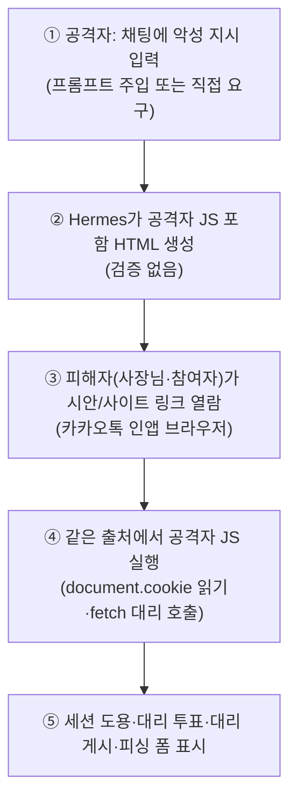
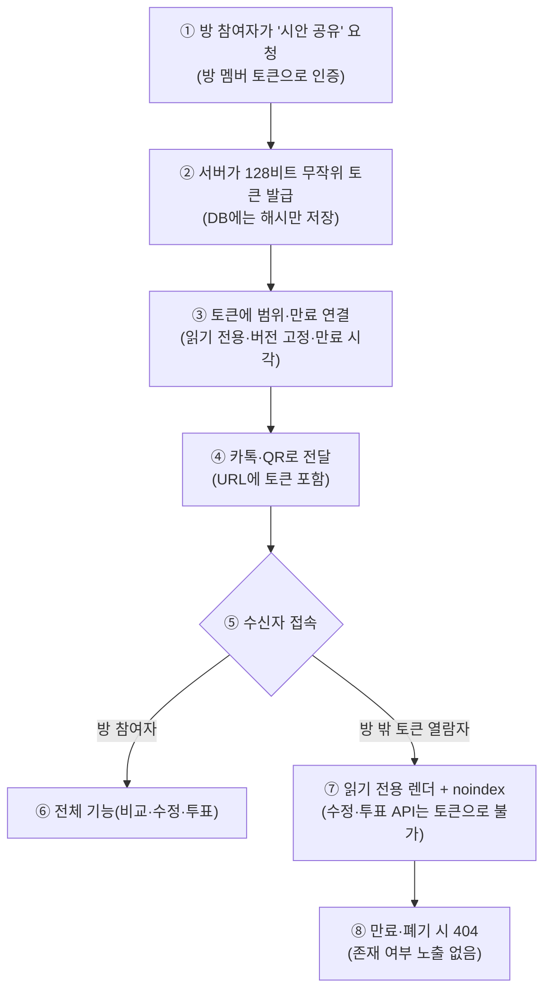

# 시안 미리보기·생성 코드 보안 검토 (R2)

> 관점: 미리보기 링크와 생성된 코드의 보안 / 대상: `docs/product/DESIGN_PIPELINE_PLAN.md`(이하 "계획"), `docs/product/DECISIONS.md`, `docs/product/ROOM_POLICY.md`, `app/api/public.py`, `app/services/codegen.py`, `deploy/Caddyfile`
> 작성일: 2026-09-25 / 금지 준수: 코드 수정 없음, `.env` 미열람, git·SSH·배포 스크립트 미실행
> 사용자 질문 취지: "Paper 데스크톱(paper.design) 같은 외부 링크로 시안을 보여야 하나, 아니면 더 좋고 보안상 안전한 방식은? 실시간 진행 표시 또는 진행 표시줄."

## 0. 결론 한 줄

| # | 결론 |
|---|---|
| 1 | Paper류 **외부 서비스로 시안을 보내지 마라.** 사용자 가게 정보·사진이 외부로 나가고, 계정·비용·피싱 표면이 늘어난다. 계획의 **채팅 안 비교(P-5) + 자사 미리보기 호스트**가 더 좋고 더 안전하다 |
| 2 | 현재 `/design/{id}`·`/site/{id}/`가 **앱과 같은 출처**에서 서빙되는 것은 로그인 쿠키(D9·로드맵 1단계)가 생기는 순간 **출시 차단급 취약점**이 된다. 미리보기용 **별도 호스트 분리가 출시 전 필수**다 |
| 3 | 실시간 진행 표시는 **SSE보다 단계형 진행 표시줄 + 폴링**으로 시작하라. SSE/WebSocket은 인증·연결 제한·비밀값 필터가 갖춰진 뒤에 도입한다 |
| 4 | 시안 공유는 **추측 불가 토큰 + 만료 + 폐기 + 읽기 전용** 링크로 설계하고, 방 밖 유출을 전제로 noindex·썸네일 정책을 둔다 |

## 1. 현재 구조의 위험 평가 (같은 출처 서빙)

### 1.1 사실 확인 (코드 실측)

| # | 사실 | 출처 |
|---|---|---|
| 1 | `/design/{id}`가 `generated/<id>/design/index.html` 원문을 `HTMLResponse`로 그대로 반환. **CSP·`X-Content-Type-Options`·`X-Frame-Options`·`X-Robots-Tag` 없음** | `app/api/public.py:23-28` |
| 2 | `/site/{id}/{filename}`이 Hermes 생성 파일을 그대로 서빙. 경로 순회 방어는 있음(`is_relative_to`). **Content-Type 스니핑 방지·스크립트 제한 없음**. `.html`뿐 아니라 생성된 임의 파일(`.svg` 포함)이 실행 가능 형태로 서빙될 수 있음 | `app/api/public.py:44-59` |
| 3 | `app/main.py`에 CORS·CSP·TrustedHost 미들웨어 없음. 정적 마운트가 API 뒤에 와서 `/` 이하 전부가 같은 출처 | `app/main.py:27-35` |
| 4 | 코드생성은 Hermes 샌드박스(Docker, 요청별 `/workspace`만 마운트·`--rm`)에서 돌지만, **생성된 HTML/JS 내용에 대한 검증·살균이 전혀 없음**. 프롬프트 지시("외부 네트워크 불필요, 단일 정적 파일 권장")는 강제되지 않음 | `app/services/codegen.py:27-35, 98-102` |
| 5 | 로그인 후 서버 세션 쿠키(`HttpOnly, Secure, SameSite=Lax`) 예정. 현재는 쿠키 없음 | `docs/product/PRODUCT_ROADMAP.md` 1단계 표 |
| 6 | 시안 렌더러(`design.py`)는 현재 서버 템플릿 + `html.escape`로 안전. 그러나 계획 P-8 이후 **Hermes가 시안 골격에 JS를 추가**하면 이 안전성이 사라짐 | `app/services/design.py:24-40`, 계획 §7 |

### 1.2 공격 흐름 (같은 출처일 때)

| 번호 | 설명 |
|---|---|
| ① | 공격자는 방 참여자이거나(공유방 초대 링크 유출 시, `ROOM_POLICY.md` §1 문제 #2·#3과 동일 구조) 프롬프트 주입 문구를 채팅에 넣는 외부인이다. 사용자 입력이 스펙으로 들어가므로(`codegen.py`의 `sanitize_spec`은 제어문자·길이만 제한, JS 지시 차단 불가) 주입 표면이 항상 열려 있다 |
| ② | 생성물 검사가 "파일 존재 여부"뿐이라 악성 `<script>`·`<form>`·외부 `<iframe>`이 그대로 저장된다 |
| ③ | 카톡 공유·QR로 퍼진 링크를 휴대폰 인앱 브라우저로 연다. 인앱 브라우저도 출처 정책은 동일하게 적용되므로 격리가 없으면 그대로 노출된다 |
| ④ | 앱(`/*`, `/room/*`)과 시안(`/design/*`, `/site/*`)이 **같은 스킴·호스트·포트 = 같은 출처**이므로 SOP가 아무것도 막지 않는다. `HttpOnly`가 있어도 쿠키 탈취가 아니라 **쿠키를 단 채 대리 요청**이면 충분하다 |
| ⑤ | 아래 표 1.3의 피해로 이어진다 |

### 1.3 위협별 평가

| # | 위협 | 메커니즘 | 영향 | 발생 가능성 | 비고 |
|---|---|---|---|---|---|
| T1 | 세션 대리 사용(쿠키 탈취 불필요) | 같은 출처 JS가 로그인 쿠키를 자동으로 달고 `/room/{id}/chat`(투표)·게시 API를 `fetch`로 호출 | 투표 조작, 방 설정 변경, 무단 게시 | 로그인 도입 후 **높음** | `HttpOnly`는 JS 직접 읽기만 막고 대리 호출은 못 막는다 |
| T2 | CSRF(생성 페이지 → 앱) | 생성 페이지의 `<form>`·`fetch`가 같은 출처로 상태 변경 요청. 쿠키 자동 첨부 | T1과 동일 결과, 클릭 한 번으로 발동 | 로그인 도입 후 **높음** | Origin 검사가 현재 없음(§3 표 참조) |
| T3 | 피싱 페이지 | `/site/{id}/`에 가게 사이트와 똑같이 생긴 "카카오 로그인" 가짜 폼. 주소창 도메인은 진짜라 사용자가 속음 | 계정 자격 증명·연락처 탈취 | 링크가 카톡으로 퍼질수록 **중간** | 같은 도메인이어서 주소 확인 습관이 무력화됨 |
| T4 | 저장형 XSS의 영속화 | 악성 생성물이 디스크에 남아 링크 아는 사람 모두에게 반복 실행 | T1~T3의 반복 전달 수단 | **중간** (방 초대 통제 전까지 높음) | `ROOM_POLICY.md` R-0 해결 전까지 방 ID만으로 입장 가능 |
| T5 | 외부 전송·추적 스크립트 | 생성물에 분석·채굴·리다이렉트 스크립트 포함. 강제 수단 없음 | 개인정보 유출, 브랜드 훼손, 악성코드 경유지 오명 | **중간** | 프롬프트 지시는 강제력이 아님(`codegen.py:29-35`) |
| T6 | MIME 스니핑 | `/site/`가 업로드된 파일을 원 Content-Type으로 서빙 + `nosniff` 없음. 구형/인앱 브라우저에서 비HTML이 HTML로 해석될 여지 | T4 우회 경로 | **낮음~중간** | 인앱 브라우저 스니핑 동작은 기기별로 상이 — 확인 필요, https://developers.kakaobrain.com/ (확인 필요: 카톡 인앱 MIME 처리 문서 위치) |
| T7 | 현재(로그인 전) 피해 | 쿠키가 없으므로 T1·T2는 해당 없음. 그러나 T3(피싱)·T5(외부 전송)는 **지금도** 가능 | 브랜드 신뢰 훼손 | **중간** | 로그인이 없어도 시급성이 0이 아님 |

## 2. sslip.io + 하위 주소 분리의 한계

전제(실측 근거): `sslip.io`의 PSL 등록 요청(PR #2206)은 **거부·종결**됐다. 즉 `sslip.io`는 Public Suffix List에 없다 — https://github.com/publicsuffix/list/pull/2206. 같은 맥락의 쿠키 누출 실측 보고도 있다 — https://github.com/rpuls/my-own-suite/issues/192.

### 2.1 왜 하위 주소 분리만으로 부족한가

| # | 사실/효과 | 결과 |
|---|---|---|
| 1 | PSL에 없으면 `144.24.91.250.sslip.io`와 `preview.144.24.91.250.sslip.io`의 eTLD+1은 모두 `sslip.io`다. 두 호스트는 **same-site**다 | `SameSite=Lax/Strict` 쿠키가 **하위 주소 간 요청에도 그대로 첨부**된다. Lax가 막는 것은 cross-site뿐이다 |
| 2 | `SameSite=Lax`는 top-level GET 탐색에만 예외를 둔다. 미리보기 페이지 안의 `fetch`·`form POST`·`iframe` 요청은 cross-site일 때만 차단되고, same-site면 **전부 허용**된다 | 분리한 미리보기 호스트에서의 대리 호출(T1)·CSRF(T2)가 Lax로 **하나도 막히지 않는다** |
| 3 | `Domain=.sslip.io`로 쿠키를 심을 수 있는 제3자(같은 PSL 접미를 공유하는 타인)가 이론상 존재한다. 우리 쿠키에 `Domain` 속성을 안 써도, **상대방이 심은 슈퍼쿠키를 우리 하위 주소가 읽게 되는** 방향의 오염이 가능하다 | 세션 고정·추적 오염 표면. 우리 힘으로 완전히 제거 불가 |
| 4 | `document.domain` 완화는 최신 브라우저에서 기본 비활성화 추세이나, 같은 출처가 아니면 어차피 DOM 접근은 SOP가 차단한다 | 진짜 문제는 DOM이 아니라 **쿠키 자동 첨부 + CORS 미설정 시 단순 요청**이다 |
| 5 | Let's Encrypt rate limit도 PSL 등록 도메인 기준으로 묶인다. 하위 주소를 계속 늘리면 인증서 발급 한계에 걸릴 수 있다 — 확인 필요, https://letsencrypt.org/docs/rate-limits/ | 와일드카드 인증서는 자가 도메인에서만 발급 가능. 현 Caddy 단일 호스트 구조(`deploy/Caddyfile`)로는 하위 주소 추가 시 인증서 블록 추가 필요 |

**판정:** 하위 주소 분리는 **방어층 하나**로는 유효하지만(아래 §3의 표), sslip.io 위에서는 단독 대책이 될 수 없다. 반드시 **iframe sandbox(allow-same-origin 제외) + CSP sandbox + Origin/CSRF 토큰 + 읽기 전용 토큰 링크**와 함께 가야 한다. 근본 해결은 **자가 도메인 구매 후 등록 도메인이 다른 전용 미리보기 도메인 사용**(예: `agt001-preview.kr` 같은 별도 도메인)이다. 이는 로드맵 5단계(D2) 결정과 연결된다.

## 3. 격리 방안 비교

### 3.1 비교표 (비용 상한 월 $5·단일 OCI 전제 유지)

| # | 방안 | 막는 것 | 못 막는 것 (sslip.io 한계) | 비용·공수 | 권장 |
|---|---|---|---|---|---|
| A | 별도 하위 주소 + Caddy 분리 서빙 (예: `preview.<host>`) + 앱 호스트에서는 생성물 서빙 금지 | 같은 **출처** 공격(T1 직접 DOM 접근, §1.2 흐름 ④). 쿠키 스코프 분리(`__Host-`+`Domain` 없음이면 하위 주소가 앱 쿠키를 못 읽음) | same-site라 SameSite 쿠키가 하위 주소 간 요청에 첨부됨(T1 대리 호출·T2 잔존). 슈퍼쿠키 오염 | 0원. Caddy 블록 1개 + FastAPI 라우트 분리. **출시 전 필수** | **채택** |
| B | iframe `sandbox` 속성으로 채팅방 안에 미리보기 임베드 | sandbox가 `allow-same-origin`을 **빼면** 프레임 안 JS가 opaque origin이 되어 앱 쿠키·DOM·스토리지에 접근 불가. 팝업·폼·플러그인도 차단 가능 | sandbox 토큰을 잘못 주면(`allow-same-origin` + `allow-scripts` 동시) 격리 전체 무력화. 단독 사용 시 새 탭 직접 열람은 보호 못함 | 0원. 프론트(D5 React) 작업에 포함 | **A와 함께 채택**. 아래 조합표 준수 |
| C | CSP — 생성 페이지용 | `sandbox allow-scripts` 지시문(서버 헤더)으로 **직접 접속에도** opaque origin 강제. `frame-ancestors`로 임베드 허용처를 앱 출처로 한정. `connect-src`·`form-action` 제한으로 외부 전송·피싱 POST 억제 | CSP는 브라우저 강제라 구형 인앱에서 일부 미지원 가능. 인라인 스크립트를 쓰는 생성물과 충돌 가능(§3.3) | 0원. 헤더 추가 | **채택** (생성물 규격과 함께 정의) |
| D | CSP — 앱용 | `frame-ancestors 'self'`로 클릭재킹 방지. `default-src`·`script-src` 제한으로 앱 자체 XSS 표면 축소 | 생성물 격리와 직접 관계없음 | 0원 | **채택** |
| E | 쿠키 `__Host-` 접두사 + `Secure` + `HttpOnly` + `SameSite=Lax` + `Path=/` + **`Domain` 속성 없음** | 하위 주소·상위 접미로의 쿠키 누출 차단. 접두사가 브라우저에 강제됨 | same-site 간 첨부는 막지 못함(§2.1 #1·#2). 구형 브라우저의 접두사 미지원 — 확인 필요, https://developer.mozilla.org/en-US/docs/Web/HTTP/Cookies (Set-Cookie `__Host-` 항목) | 0원 | **채택** (로그인 구현 시) |
| F | Origin/Referer 검사 + CSRF 토큰 (상태 변경 API 전부) | T1·T2의 대리 호출을 출처·토큰으로 차단. A·B가 뚫려도 마지막 방어선 | GET 읽기 API에는 적용 불가. 카톡 인앱의 Referer 누락 케이스 대응 필요(읽기는 토큰 링크 방식이라 무관) | 0원 | **채택** (상태 변경 전부) |
| G | 자가 도메인 구매 후 **별도 등록 도메인**을 미리보기·사용자 사이트 전용으로 사용 | §2.1의 same-site 문제 자체가 소멸. PSL 경계가 생김. 인증서·쿠키 완전 분리 | 도메인 비용(연 수천~수만 원, D2). 구매 전까지는 A~F로 버팀 | 연 수천~수만 원(D2에서 이미 예상). 월 $5 상한 안 | **D2와 함께 채택**. 구매 전에는 A~F |

### 3.2 iframe sandbox 조합표 (허용/금지)

| # | 조합 | 효과 | 판정 |
|---|---|---|---|
| 1 | `sandbox=""` (토큰 없음) | 스크립트 전부 차단. 가장 안전. 정적 시안 표시에 충분 | 정적 시안 기본값으로 **권장** |
| 2 | `sandbox="allow-scripts"` | 스크립트 실행은 되나 opaque origin이라 쿠키·DOM·스토리지 접근 불가. 폼·팝업 차단 | 인터랙션 시안용 **허용**. `allow-same-origin`과 **절대 병용 금지** |
| 3 | `sandbox="allow-scripts allow-same-origin"` | 샌드박스 무력화. 같은 출처 취급으로 복귀 | **금지** (리뷰 게이트에서 자동 검사) |
| 4 | `allow-forms`·`allow-popups`·`allow-top-navigation` | 피싱 폼·리다이렉트·상위 프레임 탈출을 허용 | 미리보기에는 **전부 금지**. 외부 링크는 새 탭 + `rel=noopener`로만 |

### 3.3 생성물 규격 (CSP와 충돌하지 않게)

| # | 규칙 | 이유 |
|---|---|---|
| 1 | 외부 스크립트·외부 폼·외부 iframe 금지. 허용 리소스는 동일 미리보기 호스트의 상대경로 + 이미지·폰트만 | CSP `script-src 'self'`·`form-action 'none'`·`frame-src 'none'`을 깨지 않기 위해. 계획 §6 "외부 스크립트 없음" 원칙과 일치 — 계획에는 **동의**하되 강제 수단(빌드 검사)을 추가하라(§8) |
| 2 | 인라인 `<script>` 허용 여부는 미리보기 CSP와 한 번에 결정. 권장: 인라인 허용 + `sandbox allow-scripts`(헤더) 병행 | 인라인 금지는 Hermes 품질에 큰 제약이 되므로, 격리는 출처 분리+opaque origin에 맡긴다 |
| 3 | 게시(공개) 전 REVIEW 게이트에서 금지 패턴(외부 `<script src=http>`·`<form action=http>`·`<meta http-equiv=refresh>`) 자동 검사 | 계획 §7 "화면 비교"만 있고 코드 검사가 없음 — **추가** 제안(§8) |

## 4. 시안 공유 링크 설계

### 4.1 설계 흐름

| 번호 | 설명 |
|---|---|
| ① | 발급은 방 참여자만. `ROOM_POLICY.md` §2 초대 흐름과 동일한 인증(= 멤버 토큰) 사용 |
| ② | 토큰은 128비트 CSPRNG, DB에는 SHA-256 해시만. 원문은 URL에만 존재. 방 ID·요구사항 ID 순차값과 무관하게 추측 불가 |
| ③ | 토큰 하나 = (프로젝트, 디자인 버전, 읽기 전용, 만료) 고정. 수정·투표·게시 권한은 절대 포함하지 않음 |
| ④ | 카톡 전달을 전제로 §4.3의 유출 대책 적용 |
| ⑤·⑥·⑦ | 방 참여자(쿠키/멤버 토큰 있음)와 토큰 열람자를 서버가 구분. 같은 URL이라도 권한이 다름 |
| ⑧ | 만료·폐기·방 삭제 후에는 404로 통일해 "링크는 있는데 권한이 없다"와 "링크가 없다"를 구분하지 않음(열거 공격 방지) |

### 4.2 링크 정책표

| # | 항목 | 정책 | 근거 |
|---|---|---|---|
| 1 | 토큰 형식 | `/p/<128비트 base64url>` — 요구사항 ID·버전은 토큰과 매핑 테이블로만 연결(URL에 평문 ID 노출 금지) | 현재 `/design/{id}`는 순차 추측 가능. 열거 방지 |
| 2 | 만료 | 기본 7일(방 초대와 동일). 방장이 1일·7일·30일·무기한 중 선택 | `ROOM_POLICY.md` §2.1과 일관 |
| 3 | 폐기 | 방장이 언제든 폐기·재발급. 방 닫힘(T4·T5)·삭제(T6·T7) 시 연결된 미리보기 토큰도 함께 무효화 | 방 정책과 수명 연동 |
| 4 | 읽기 전용 vs 수정 | 미리보기 토큰은 **읽기 전용**. 수정·투표·게시 API는 멤버 토큰/로그인 세션만 수락하고 미리보기 토큰을 거부(서버에서 토큰 종류 구분) | 토큰 탈취 시 blast radius를 "보기"로 한정 |
| 5 | 버전 고정 | 토큰은 특정 디자인 버전에 귀속. 수정 후 새 버전은 새 링크(또는 같은 토큰의 새 버전 별칭 — 재발급 권장) | "확정한 시안과 다른 화면" 분쟁 방지. 계획 §8 버전 비교와 연결 |
| 6 | 검색엔진 차단 | 미리보기 호스트 전체에 `X-Robots-Tag: noindex, noarchive, nosnippet` + 개별 페이지 `<meta name=robots content=noindex>` + 사이트맵·디렉터리 목록 미제공 | 토큰 URL이 외부에 인용돼도 색인 방지 |
| 7 | 방 밖 열람자의 방 정보 노출 | 읽기 전용 렌더에는 방 이름·참여자·채팅을 포함하지 않음. 가게 시안 내용만 표시 | 비공개 방의 시안이 방 밖에서 열릴 때 메타정보 유출 방지 |
| 8 | 접근 로그 | 토큰 해시·IP·시각만 기록. 토큰 원문·사진 내용은 로그에 남기지 않음 | 로그 유출 시 토큰 재사용 방지 |

### 4.3 카톡으로 퍼질 때의 위험과 대책

| # | 위험 | 대책 |
|---|---|---|
| 1 | 링크 포워딩 무한 확산(방 밖 사람이 방 밖 사람에게 전달) | 만료 단축 기본값 + 열람 수·재전파 의심 시 방장이 폐기. 중요 방은 1회용/단기 링크 |
| 2 | 카톡 링크 미리보기(언퍼러)가 서버에 토큰 URL로 접속해 페이지·썸네일을 가져감. 미리보기 캐시가 카톡 서버에 남을 수 있음 | 미리보기 호스트의 token URL에는 OG 태그(og:image 등) 미포함 또는 범용 썸네일로만 응답. `preview.png` 원본은 인증된 참여자에게만. 카톡 크롤러의 토큰 URL 접근 시 거동은 **확인 필요**, https://developers.kakao.com/docs/latest/ko/message/message-template (확인 필요: 링크 스크랩·캐시 정책 공식 문서 위치) |
| 3 | 가게 전화번호·주소·영업시간이 시안에 포함돼 퍼짐 | 읽기 전용 렌더에서도 연락처 표시는 유지(시안 목적상 필요)하되, 방 참여자만 보는 "수정 중 메모·투표 현황"은 제외(§4.2 #7). 개인정보처리방침(D14 관련) 고지 |
| 4 | 비공개 방의 시안이 방 밖에서 열람됨 | 토큰 발급 자체를 방장 권한으로 제한 + 발급 시 "방 밖 사람이 볼 수 있게 됩니다" 경고 문구. 방 초대 정책(§2)과 동일한 mental model |

## 5. 실시간 진행 표시(SSE/WebSocket)의 보안

### 5.1 권장: 단계형 진행 표시줄 + 폴링 우선

| # | 항목 | 권장 | 이유 |
|---|---|---|---|
| 1 | 1차 구현 | 계획 §3 흐름(요구사항→시안 3개→수정→확정→제작→비교→배포)의 **단계형 진행 표시줄** + 기존 폴링(`since`) 확장 | Paper처럼 "만들어지는 게 보이는" 느낌은 단계별 산출물(명세 버전·시안 이미지·비교 결과)을 보여주는 것으로 충분. 연결 유지 부담 없음 |
| 2 | SSE 도입 조건 | 인증(§5.2)·연결 제한(§5.3)·비밀값 필터(§5.4)가 갖춰진 뒤. FastAPI 동기 핸들러(현재 인프라 전제)에서는 장시간 SSE가 워커 스레드를 점유하므로 비동기 전환 또는 별도 경량 엔드포인트가 필요 | 단일 OCI(2 OCPU) + 동기 핸들러에서 무제한 SSE는 DoS와 사실상 동일 |
| 3 | WebSocket | 현 단계 **도입 반대**. 양방향 채널·ping 관리·프록시(Caddy) 설정이 추가되고, 얻는 이득(클라이언트→서버 스트리밍)이 진행 표시 목적에 불필요 | 필요해지는 시점(협업 편집 등)까지 보류 |

### 5.2 인증·방 참여자 확인

| # | 규칙 |
|---|---|
| 1 | 진행 스트림 구독 시 방 멤버 토큰(헤더) 또는 로그인 세션 쿠키 + CSRF 토큰 중 하나를 필수로 요구. 토큰 없는 연결은 404(방 존재 노출 없음, `ROOM_POLICY.md` §1 #2와 동일) |
| 2 | `EventSource`는 커스텀 헤더를 못 붙이므로, 헤더 방식을 고수하면 폴링을 유지하거나 "POST로 단기 구독 티켓 발급 → 티켓을 쿼리로 SSE 접속" 패턴 사용. 티켓은 1회·수십 초 만료. 쿼리 상시 토큰은 접근 로그 잔류 이유로 금지 |
| 3 | 매 이벤트 전송 전이 아니라 **구독 시점 + 방 멤버십 변경(내보내기·방 닫힘) 시점에 권한 재확인**. 내보낸 참여자의 열린 스트림은 서버에서 끊음 |
| 4 | 미리보기 토큰(읽기 전용)으로 진행 스트림 구독 불가. 진행 스트림에는 프롬프트·내부 상태가 섞일 수 있어 방 참여자만 허용 |

### 5.3 연결 수 제한 (DoS)

| # | 규칙 | 값(초안) |
|---|---|---|
| 1 | 방당 동시 스트림 수 상한 | 방 인원 상한(10명, D8)의 2배 = 20. 초과분은 폴백(폴링)으로 안내 |
| 2 | 전역 동시 스트림 상한 | 단일 인스턴스 기준 수십 단위에서 시작해 실측으로 조정 (구체 수치는 부하 실측 후 확정 — 확인 필요) |
| 3 | 유휴·최대 수명 | 유휴 60초·최대 10분 후 서버가 끊음, 클라이언트는 재구독. 좀비 연결 방지 |
| 4 | 재연결 폭증 방지 | 클라이언트 재연결에 지터 포함 백오프. 서버는 방별 구독 카운터로 폴링 폴백 유도 |

### 5.4 로그·코드생성 출력의 비밀값 유출 방지

| # | 위험 | 현 상태 | 요구 |
|---|---|---|---|
| 1 | Hermes stdout/stderr에 API 키·경로·env가 섞여 방 스트림·DB에 저장 | 현재 `capture_output=True` 후 결과를 버리고 상태만 저장 — **현재는 안전** (`codegen.py:89-102`) | 진행 표시용으로 출력을 흘리기 시작하면 **반드시 필터 후**. 필터 전 원문 저장 금지 |
| 2 | 생성된 파일 안에 키·내부 경로·주석으로 남은 프롬프트 | 검사 없음 | 게시 전 게이트에서 비밀값 패턴(`sk-`·`nvapi-`·`AKIA`·`-----BEGIN`·`xox`·내부 IP·`.env` 내용) 스캔. 적중 시 게시 차단 + 방에 일반 안내만(패턴 상세 미노출) |
| 3 | 진행 이벤트에 사용자 사진·개인정보가 그대로 실림 | 미구현 | 스트림 payload는 "단계·진행률·산출물 링크"만. 원문·이미지 바이트는 스트림에 넣지 않음 |
| 4 | 에러 스택의 경로·env 노출 | `log.exception`은 서버 로그로만 — 적절 | 클라이언트 응답의 에러 메시지는 일반 문구로 치환. 상세는 서버 로그에만 |

## 6. 사진 업로드가 시안에 들어갈 때

로드맵 4단계 선행 정의(`PRODUCT_ROADMAP.md` §4단계: jpeg/png/webp·매직바이트·EXIF 제거·썸네일·`assets/` 복사·Object Storage 이전)와 정합한다.

| # | 항목 | 요구 | 이유 |
|---|---|---|---|
| 1 | 형식 검증 | 확장자가 아니라 **매직바이트**로 판정. 허용: JPEG·PNG·WebP. **SVG·GIF(움직이는 이미지)·HEIC는 거부** — SVG는 스크립트 실행 가능, GIF는 용량·검증 부담, HEIC는 브라우저 호환·파서 취약점 표면 | T6·T4 우회 차단 |
| 2 | EXIF 제거 | Pillow 등으로 **재압축 저장하고 EXIF를 통째로 버림. 원본은 보관하지 않음**(섬네일 포함 전부). GPS·기기·시각 정보 제거 확인을 업로드 테스트에 포함 | 펜션 사진 GPS 노출 방지(로드맵 명시). 원본 보관은 유출 시 되돌릴 수 없는 개인정보 |
| 3 | 크기·수량 제한 | 파일당 상한(예: 10MB)·방당/프로젝트당 개수 상한·일일 업로드 횟수 상한. 초과분 거부 + 안내 | 단일 인스턴스 디스크·메모리 보호, 남용 방지(6단계 정책과 연결) |
| 4 | 서빙 경로 | 업로드는 **미리보기 호스트**에서만 서빙(`/assets/`). 앱 호스트에서 직접 서빙 금지. `X-Content-Type-Options: nosniff` + `Content-Disposition: inline` + 파일명은 난수화(원 파일명 미사용·응답 헤더에 미포함) | §1 T6 대책. 원 파일명의 헤더 인젝션·한글 깨짐도 함께 방지 |
| 5 | 시안·제작물 복사 | 확정 PRD의 이미지만 산출물 `assets/`로 복사(계획 §7·로드맵 4단계와 동일). 파일명·용도 목록만 프롬프트에 전달, 바이너리는 전달 안 함 | 모델 입력 오염·용량 폭증 방지 |
| 6 | 카톡 인앱 업로드 | `<input accept=image/jpeg,image/png,image/webp>` + 카메라 호출. 인앱에서 파일 선택기 동작이 기기별로 다름 — 실측 테스트를 출시 조건에 포함(확인 필요: 구형 안드로이드 인앱 `accept` 무시 케이스) | 소상공인 주 기기가 휴대폰·인앱이므로 기능 실패 = 핵심 동선 실패 |

## 7. 우선순위가 붙은 보안 요구사항 목록

### 7.1 출시 전 필수 (P0 — 하나라도 빠지면 시안·사이트 공개 금지)

| # | 요구 | 대응 절 | 검증 방법 |
|---|---|---|---|
| P0-1 | 미리보기 전용 호스트 분리(Caddy) + 앱 호스트에서 `/design`·`/site`·`/assets` 서빙 금지 | §3 #A | 앱 호스트로 생성물 URL 요청 시 404, 헤더에 미리보기 CSP 존재 확인 |
| P0-2 | 채팅방 iframe은 `sandbox` (`allow-same-origin`·`allow-forms`·`allow-popups`·`allow-top-navigation` 금지). 직접 접속도 CSP `sandbox` 헤더로 opaque origin | §3 #B·#C, §3.2 | 조합표 금지 항목 자동 테스트 |
| P0-3 | 생성 페이지용 CSP(`sandbox allow-scripts; frame-ancestors <앱출처>; form-action 'none'; connect-src 'self'`) + 앱용 CSP(`frame-ancestors 'self'`) + `nosniff` + 미리보기 `X-Robots-Tag: noindex` | §3 #C·#D, §4.2 #6 | 응답 헤더 테스트 |
| P0-4 | 로그인 쿠키 `__Host-` + `Secure` + `HttpOnly` + `SameSite=Lax` + `Path=/` + `Domain` 없음 | §3 #E | 쿠키 속성 테스트. Strict는 카톡 유입 세션 단절 우려로 Lax + P0-5 병행 |
| P0-5 | 상태 변경 API 전부 Origin/Referer 검사 + CSRF 토큰. 미리보기 토큰으로는 상태 변경 불가 | §3 #F, §4.2 #4 | 외부 Origin POST·토큰 종류 혼용 테스트 |
| P0-6 | 시안 공유 토큰(128비트·해시 저장·만료 기본 7일·폐기·읽기 전용·버전 고정·무효 시 404 통일) | §4 | 추측·열거·권한 상승·폐기 후 접근 테스트 |
| P0-7 | 사진 매직바이트 검증 + SVG 거부 + EXIF 제거(원본 미보관) + 난수 파일명 + 미리보기 호스트 서빙 | §6 | 악성 파일·EXIF 잔류·원본 접근 테스트 |
| P0-8 | 진행 표시는 단계형 + 폴링으로 출시. Hermes 원문 출력의 스트림·DB 저장 금지(상태·링크만) | §5 | 스트림 payload에 원문·키 패턴이 없는지 테스트 |
| P0-9 | 게시 전 게이트: 외부 스크립트·외부 폼·자동 리다이렉트·비밀값 패턴 검사. 적중 시 게시 차단 | §3.3, §5.4 | 악성 생성물 게시 시도 테스트 |

### 7.2 이후 (P1 — 도메인 구매·사용자 증가와 함께)

| # | 요구 | 대응 절 |
|---|---|---|
| P1-1 | 자가 도메인 구매(D2) + 미리보기·사용자 사이트용 별도 등록 도메인 + 와일드카드 인증서 | §2·§3 #G |
| P1-2 | SSE 도입(단기 티켓·방/전역 상한·수명 관리) — 실측 후 | §5.2·§5.3 |
| P1-3 | 참고 사이트 분석(P-9)의 SSRF 대책(허용 스킴·내부망 차단·크기·시간 상한·렌더 격리) — 계획에 명시 없음, §8 반대/추가 참조 | §8 |
| P1-4 | 업로드 Object Storage 이전 시 서명 URL·버킷 비공개 + EXIF 제거 파이프라인 유지 | §6 |
| P1-5 | 보안 헤더·의존성 정기 점검(6단계 보안 점검과 통합), 쿠키 접두사 미지원 구형 브라우저 실측 | §3 #E |

## 8. 계획(DESIGN_PIPELINE_PLAN.md)에 대한 수정 제안

### 8.1 동의 (유지·강화)

| # | 계획 내용 | 의견 |
|---|---|---|
| 1 | §2 원칙 2 "시안과 결과물은 같은 엔진으로" + P-3 부품·P-4 렌더러 | **동의.** 부품 기반은 보안에도 유리 — 허용된 부품·토큰(선택지 안 값)만 쓰면 생성물 검증이 화이트리스트 방식이 된다. 단 "같은 엔진"이 "같은 출처 서빙"을 의미하지 않음을 명시하라 |
| 2 | §2 원칙 4 "빠르게(시안 수 초)" + P-5 채팅 안 비교 | **동의.** 외부 Paper류 링크가 불필요한 근거. 시안은 서버 렌더(이미지·정적 HTML) 우선, Hermes는 확정 후에만 — 현재 §7 순서와 일치 |
| 3 | §5 명세 수정 목록(JSON 스키마) + 서버 검증 + §8 수정 흐름의 형식·범위·잠금 검사 | **동의.** 프롬프트 주입이 명세로 번지는 것을 막는 핵심. 검증 실패 시 선택지로 되묻는 흐름(④)도 주입 내성에 도움 |
| 4 | §6 "외부 스크립트 없음" 기본 | **동의.** §3.3의 생성물 규격으로 격상(권고→강제+자동 검사)하라 |
| 5 | §9 파일은 디스크·DB는 경로만 | **동의.** 단 업로드 원본 미보관(§6 #2)과 미리보기 호스트 서빙(§6 #4)을 추가하라 |

### 8.2 반대·조건부 반대 (수정 필요)

| # | 계획 내용 | 의견 |
|---|---|---|
| 1 | §3·§7: 시안·제작물 링크를 채팅에 그대로 전달(URL 체계 언급 없음). 현 `/design/{id}`·`/site/{id}/` 전제 | **조건부 반대.** 같은 출처 + 순차 ID 전제로는 로그인 이후 출시 불가. P0-1·P0-6(별도 호스트+토큰 링크)을 P-4·P-5의 선행 조건으로 넣어라 |
| 2 | §7 "실패 시 시안 그대로의 페이지(렌더러 결과)를 먼저 배포" | **조건부 반대.** 폴백 배포도 P0-9 게이트(비밀값·외부 스크립트 검사)를 통과한 것만. "기준 미달이면 시안 배포"가 검사 우회가 되면 안 됨 |
| 3 | §4 참고 사이트(P-9) "주소를 붙이면 분위기만 분석" | **조건부 반대(현 형태).** 사용자 제공 URL을 서버가 가져오는 것은 SSRF(내부망·메타데이터 접근)·저작권·악성 페이지 렌더링 표면. P-9 착수 조건으로 허용 스킴·내부 IP 차단·가져오기 크기/시간 상한·렌더 샌드박스·"분위기 값만 명세 토큰으로 환원(HTML·이미지·문구 저장 금지)"을 명시하라 |
| 4 | §10 `design_shown` 등 퍼널 + D16 자체 DB 기록 | **조건부 동의.** 토큰 원문·사진·요구사항 원문을 퍼널에 넣지 말 것(§5.4 #3). 익명·90일 보관(D16) 원칙 유지 |

### 8.3 추가 (계획에 없는 보안 작업)

| # | 추가 제안 | 넣을 위치 | 우선순위 |
|---|---|---|---|
| 1 | 미리보기 호스트 분리 + Caddy 설정 + 앱 호스트 생성물 서빙 금지 | P-4 선행(또는 P-0 보안 전제) | P0 |
| 2 | 토큰 링크(발급·만료·폐기·읽기 전용·버전 고정) + noindex + OG/썸네일 정책 | P-5 | P0 |
| 3 | CSP(생성 페이지용·앱용)·`nosniff`·iframe sandbox 조합 + 리뷰 게이트 자동 검사 | P-4·P-5·P-7 | P0 |
| 4 | 쿠키 속성(`__Host-`·Lax·Domain 없음) + 상태 변경 Origin/CSRF 검사 | P-7 확정 게이트 전 | P0 |
| 5 | 사진 검증·EXIF 제거·서빙 경로(4단계 계획과 연결 명시 — 현재 계획 §9는 `attachments` 한 줄뿐) | P-5(사진 대표색 추출과 함께) | P0 |
| 6 | 게시 전 코드 검사(외부 스크립트·폼·리다이렉트·비밀값 패턴) | P-8(화면 비교 옆) | P0 |
| 7 | 실시간은 단계형 진행 표시줄+폴링으로 명시. SSE는 §5 조건 충족 후 | P-6·P-7 주변 | P0(범위 축소) |
| 8 | Hermes 출력 필터(비밀값 패턴) + 스트림 payload 제한(단계·진행률·링크만) | P-8 | P0 |

## 9. 필수 요구사항 요약

출시 전에 반드시 갖춰야 할 것은 여덟 가지다. 첫째, 시안·사이트·업로드를 앱과 다른 미리보기 호스트에서 서빙하고 앱 호스트에서는 생성물을 내리지 않는다. 둘째, 채팅방 임베드는 `allow-same-origin` 없는 sandbox로, 직접 접속은 CSP sandbox 헤더로 opaque origin을 강제한다. 셋째, 생성 페이지·앱·업로드에 CSP·`nosniff`·`noindex` 헤더를 둔다. 넷째, 로그인 쿠키는 `__Host-`·`Secure`·`HttpOnly`·`SameSite=Lax`·`Domain` 없음으로 하고, 상태 변경 API는 Origin/CSRF 검사를 둔다. 다섯째, 시안 공유는 128비트 토큰·해시 저장·7일 기본 만료·폐기·읽기 전용·버전 고정·무효 시 404로 한다. 여섯째, 사진은 매직바이트 검사·SVG 거부·EXIF 제거 후 원본 폐기·난수 파일명으로 미리보기 호스트에서만 서빙한다. 일곱째, 진행 표시는 단계형 표시줄과 폴링으로 출시하고 Hermes 원문은 스트림·DB에 넣지 않는다. 여덟째, 게시 전 게이트에서 외부 스크립트·외부 폼·리다이렉트·비밀값 패턴을 검사하고 적중 시 게시를 막는다. 이후에 자가 도메인 구매(D2)와 함께 미리보기·사용자 사이트 전용 등록 도메인으로 옮기면 same-site 한계가 근본적으로 해소된다.
