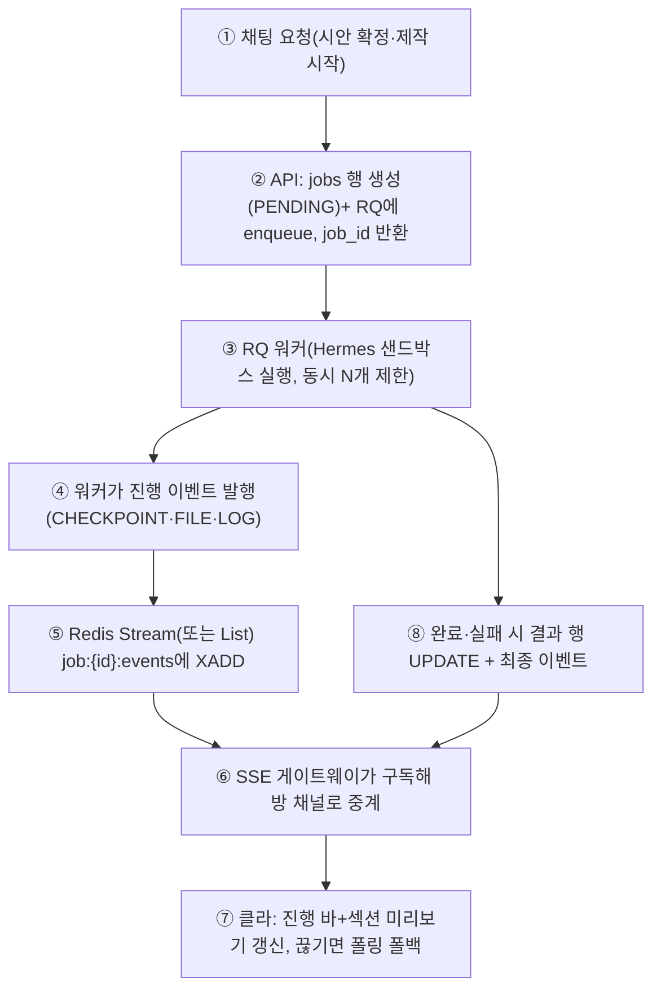
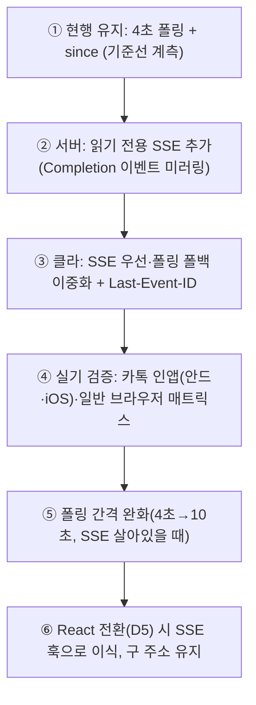
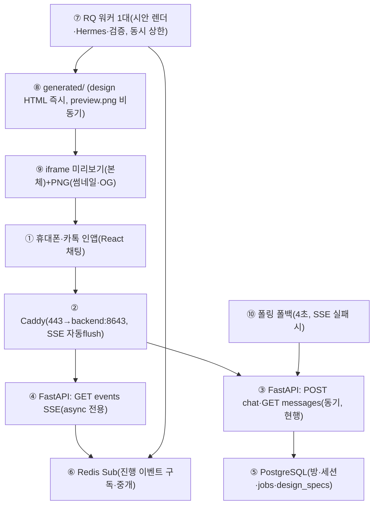

# 시안 미리보기 기술 검토 (R3: 구현 가능성·성능)

> 관점: 구현 가능성과 성능 / 검토 대상: `docs/product/DESIGN_PIPELINE_PLAN.md` (이하 "계획"), `docs/product/DECISIONS.md`, `docs/product/ROOM_POLICY.md`, `app/api/public.py`, `app/services/codegen.py`, `deploy/Caddyfile`
> 작성일: 2026-09-25 / 금지 준수: 코드 수정 없음, 본 문서 1개만 작성
> 사용자 질문 취지: "Paper 데스크톱(paper.design) 같은 외부 링크로 템플릿을 고르게 해야 하나? 아니면 더 좋고 보안에도 안전한 방식은? 만들어지는 게 보이게 할 수 있나? 실시간이 아니면 진행 표시줄 + 개발 과정 표시 + 옵션 선택."

## 0. 전제 (실측·확인된 현재 상태)

| # | 항목 | 현재 상태 | 출처 |
|---|---|---|---|
| 1 | 서빙 | FastAPI 동기 핸들러(`def`), `GET /design/{id}`, `/design/{id}/preview.png`, `/site/{id}/...` (경로 순회 방어 `is_relative_to` 있음) | `app/api/public.py:23-59` |
| 2 | 워커 | uvicorn 단일 프로세스, `--workers` 없음 (기본 1워커). 동기 핸들러는 스레드풀에서 실행 | `docs/hackathon/deployment/templates/Dockerfile.backend:29` |
| 3 | 폴링 | 방 메시지 4초 `setInterval` + 전송 직후 수동 폴링 (`pollInFlight` 가드) | `static/room.html:237-328`, `app/services/rooms.py:136-142` |
| 4 | 시안 생성 | 정적 템플릿 1종 치환 + Playwright 스크린샷, 실패 시 placehold.co 폴백 | `app/services/design.py:24-55` |
| 5 | 스크린샷 타임아웃 | 15,000ms 설정값 (실측 캡처 시간은 기록 없음) | `app/config.py:29` |
| 6 | 코드생성 | 요청별 Docker 컨테이너(Hermes), `threading.Thread(daemon)` + `after_commit` 시작, 타임아웃 90초, 결과는 `sessions.codegen` JSONB | `app/services/codegen.py:54-110`, `app/store.py:156-164` |
| 7 | 작업 큐 | 0-3a Redis+RQ는 미구현(계획만). 재시작 시 GENERATING→QUOTED 복구 | `docs/product/DELIVERY_PIPELINE.md:54-55`, `app/store.py:268-278` |
| 8 | 리버스 프록시 | `reverse_proxy backend:8643` 한 줄. 버퍼링·flush 설정 없음 | `deploy/Caddyfile:1-5` |
| 9 | DB | `max_connections=30`, db 컨테이너 `mem_limit 256m` | `docker-compose.yml:22-30` |
| 10 | 방 상한 | 10명, 투표 과반 | `docs/product/ROOM_POLICY.md`, `docs/product/DECISIONS.md:D8` |
| 11 | 프론트 | React+TS+Vite 전환 예정, 기존 주소 유지 | `docs/product/DECISIONS.md:D5` |
| 12 | 비용 상한 | 새 유료 서비스 월 합계 $5 이하 | 본 요청 배경 |

## 1. 외부 링크(Paper식) vs 자체 미리보기 — 보안·구현 비교

사용자 질문의 "paper.design 같은 링크"를 그대로 쓰자는 안과, 자체 렌더+채팅 내 미리보기 안을 비교한다.

| # | 기준 | (A) 외부 목업 서비스 링크 발송 | (B) 자체 렌더 + 채팅 내 미리보기 (권장) |
|---|---|---|---|
| 1 | 구현 비용 | 외부 서비스 연동·계정·API 조사 필요. 템플릿을 외부 형식에 맞춰 변환해야 함 | 이미 있는 `/design`, `/site` 서빙 확장으로 가능. 추가 유료 서비스 0원 |
| 2 | WYSIWYG 보장 | 외부 목업과 Hermes 결과물은 다른 엔진 → 계획 §1-#3 문제("본 것과 받는 게 다름")가 그대로 남음 | 계획 원칙 §2-2(같은 섹션 부품·같은 렌더러) 충족. 시안 골격을 제작 출발점으로 재사용 가능 |
| 3 | 보안: 링크 추측 | 외부 서비스 URL 규칙에 종속. 추측 가능하면 누구나 열람 | 추측 불가 128비트 토큰(`/p/<preview_token>`, DB 해시 저장, ROOM_POLICY 초대 링크와 동일 패턴) + `member_token` 참여자 확인 + 비참여자 404 |
| 4 | 보안: 비밀 노출 | 외부 업로드 시 가게 정보·사진이 제3자 서버로 나감 (약관·보관 확인 필요) | 사진·문구가 OCI 1대 안에만 머무름. URL에 비밀값·개인정보를 넣지 않음 |
| 5 | 보안: 스크립트 | 외부 페이지에 우리 CSP·sandbox를 강제할 수 없음 | `iframe sandbox="allow-scripts"` + 외부 스크립트 없는 부품 원칙(계획 §6)으로 XSS·추적기 차단. 시안 HTML은 서버 렌더(escape)만 허용 |
| 6 | 카톡 인앱 공유 | 외부 링크는 카톡 미리보기(OG 이미지)에 유리할 수 있음 | OG 이미지는 우리도 `preview.png`로 동일하게 제공 가능 (`/design/.../preview.png` + `og:image`). 카톡 공유 기능 유지 |
| 7 | 오프라인·비용 | 외부 서비스 요금·한도·차단 리스크 (월 $5 상한과 충돌 가능) | 추가 비용 0원 (기존 PG·디스크만 사용) |
| 8 | 결론 | 반대. 목업 링크는 "고르는 맛"은 있으나 본-받 다름 + 외부 유출 + 비용 리스크 | 채택. "채팅 안에서 내 가게 내용 3안을 나란히 → 탭해서 말하기 → 확정"이 질문 취지(진행 표시+옵션 선택)를 메움 |

보안 체크리스트 (B안 전제):

| # | 위협 | 대책 | 상태 |
|---|---|---|---|
| 1 | 미리보기 URL 추측·공유 확산 | 추측 불가 토큰, 만료(시안 확정 후 또는 7일), 방장 폐기·재발급 | 신규 구현 필요 |
| 2 | 비참여자 열람 | `member_token` 확인, 실패 시 404(존재 노출 금지). ROOM_POLICY §1-#2와 동일 | R-0 절반 완료, R-2에서 완성 예정 |
| 3 | 경로 순회 | `resolve()` + `is_relative_to` (이미 있음) + 토큰→디렉터리 매핑은 DB 조회로만 | `public.py:46-53` 충족 |
| 4 | 시안 HTML 인젝션 | 서버 렌더 시 `html.escape`, AI는 JSON 수정 목록만 출력(계획 §5·§8) | 계획대로 구현 시 충족 |
| 5 | iframe 탈옥 | `sandbox` + 별도 서브경로 서빙, 시안 내 폼·외부 fetch 금지 | 신규 구현 필요 |
| 6 | 사진 EXIF/GPS | 업로드 시 EXIF 제거(4단계 계획과 공유) | 신규 구현 필요 |

## 2. "만들어지는 게 보이게" 4방식 비교

### 2.1 총괄표

| 방식 | 한 줄 | 권장 | 이유 한 줄 |
|---|---|---|---|
| (a) SSE 단계 이벤트 | 서버가 "무엇을 하는 중"을 밀어줌 | 채택 (폴링 폴백과 함께) | 진행 표시줄의 본체. 비용 0원, 구현 반나절~1일 |
| (b) 섹션 단위 점진 렌더 | LLM이 섹션 확정할 때마다 해당 섹션 HTML을 바로 그림 | 채택 (시안 단계에 한함) | 렌더러가 결정론적이라 가능. "만들어지는 맛"의 핵심 |
| (c) Hermes 파일 감시 → 미리보기 반영 | 생성 중 파일을 그대로 노출 | 반대 (완성 후 1회 공개) | 중간 파일은 깨진 상태가 정상. 오히려 불신 유발 + 샌드박스 감시 비용 |
| (d) LLM 토큰 스트리밍 | 답변 문구가 타이핑되듯 표시 | 조건부 (짧은 문구·요약에만) | 체감 속도↑, 그러나 시안·코드 품질과 무관. NIM 프록시+타임아웃 관리 필요 |

### 2.2 상세 비교

| # | 항목 | (a) SSE 단계 이벤트 | (b) 섹션 점진 렌더 | (c) Hermes 파일 감시 | (d) LLM 토큰 스트리밍 |
|---|---|---|---|---|---|
| 1 | 사용자에게 보이는 것 | "요구사항 정리 중 → 시안 3개 그리는 중(2/3) → 제작 중(파일 2개 생김)" + 진행률 바 | 시안 영역에 Hero→소개→메뉴… 섹션이 하나씩 나타남 | 공사 중 깨진 페이지 (CSS 없음·빈 섹션) | AI 답변 타이핑 효과 |
| 2 | FastAPI 동기 핸들러 난이도 | 중. `def`로 SSE를 잡으면 연결당 스레드 1개 점유 → 반드시 `async def` + 비동기 큐로 구현해야 함 (표 2.3-#1) | 하. 기존 `GET /design` 확장 + 섹션 HTML 조각 API. SSE(a) 없이 폴링으로도 동작 | 중상. 컨테이너 밖에서 폴링 감시 + 부분 HTML 서빙. 깨진 상태 판정 로직이 새로 필요 | 중상. NIM upstream 청크를 그대로 흘려야 하며 동기 `requests` 구조와 충돌. 타임아웃·취소·재시도 설계 필요 |
| 3 | uvicorn 1워커 영향 | `async def`면 수백 idle 연결도 감당. `def`면 스레드 고갈(표 2.3) | 영향 없음 (짧은 GET) | 감시 루프가 워커 스레드 추가 점유 | 장시간(수십 초) 연결이 스레드 점유. async 필수 |
| 4 | Caddy 설정 | `text/event-stream`이면 Caddy가 자동 즉시 flush (설정 불필요). 명시적 `flush_interval -1`은 선택. 첫 바이트 전 `:` 코멘트로 헤더 강제 flush 권장 | 불필요 (일반 GET) | 불필요 | SSE와 동일 |
| 5 | 카톡 인앱 지원 | EventSource 자체는 Android WebView(4.4+)·iOS WKWebView(5+)에서 지원. 단, 카카오톡 인앱 브라우저의 장시간 연결 유지·백그라운드 절전 동작은 **확인 필요** | 일반 HTTPS GET이라 문제없음 | 일반 GET이나 내용이 깨져 보임 | (a)와 동일, **확인 필요** |
| 6 | 폴백 | 필수: SSE 실패·차단 시 기존 4초 폴링(`since`)으로 자동 전환. 이벤트 ID(`Last-Event-ID`)로 재동기화 | 폴백 불필요 (폴링과 동일 경로) | 사실상 폴백이 본체 | 필수: 스트리밍 실패 시 완성 문장 1회 표시 |
| 7 | OCI 1대 자원 (추정, 실측 아님) | async 기준: 연결당 수십 KB. 100 동시 SSE도 메모리 <50MB. `def`로 오구현 시 스레드 40개 고갈 (표 2.3-#1) | 섹션 조각 수 KB. 3안 동시 렌더가 CPU 피크 (표 4) | inotify/폴링 + docker 볼륨 I/O 추가. 효과 대비 비용 과다 | NIM 토큰 대기 시간 동안 연결 점유. 동시 10명 이상이면 스레드·소켓 압박 |
| 8 | 보안 추가면 | 이벤트 스트림도 `member_token` 인증 필요 (URL 토큰 대신 헤더). 방별 채널 분리 | 조각 API도 동일 인증 | 생성 중 파일에 프롬프트 잔재·키 유출 가능 → 노출 전 검사가 필수인데 그 검사가 곧 완성 검사와 동일 | 스트리밍 중단은 상태 불일치 유발 (보냈다/못 받았다). 멱등 이벤트 ID 필요 |
| 9 | "보이는 맛" 기여도 | ★★★ (진행률 바의 재료) | ★★★★ (실제로 지어지는 느낌) | ★ (역효과 가능) | ★★ (분위기용) |
| 10 | 구현 순서 | 1순위 (T-1) | 1순위 (P-4와 함께) | 구현하지 않음 | 2순위 (여유 시) |

출처 URL: SSE/WebView 지원 — https://caniuse.com/eventsource , https://caniwebview.com/features/web-feature-server-sent-events/ ; Caddy 스트리밍·flush — https://caddyserver.com/docs/caddyfile/directives/reverse_proxy (석션 streaming: `Content-Type: text/event-stream`이면 즉시 flush, `flush_interval -1` 저지연 모드). 카카오톡 인앱 브라우저의 SSE 장시간 연결·절전·프록시 간섭 여부는 **확인 필요** (카카오 개발자 문서 https://developers.kakao.com/docs/en/javascript/hybrid 는 WebView 팝업·인텐트만 다루고 SSE를 명시하지 않음).

### 2.3 FastAPI 동기 핸들러·스레드 고갈 (핵심 위험)

| # | 사실·판정 | 내용 |
|---|---|---|
| 1 | 스레드 고갈 위험 (확정) | 현재 모든 핸들러가 `def`(동기)라 FastAPI가 스레드풀(기본 상한 약 40 — **확인 필요**, anyio 기본값 기준 https://anyio.readthedocs.io )에서 돌린다. SSE를 `def` + `time.sleep` 루프로 구현하면 접속자 1명당 스레드 1개가 수 분간 묶이고, 약 40명을 넘기면 전체 API(채팅 전송 포함)가 멈춘다. 방 상한 10명 × 방 4개면 도달 가능한 수치다 |
| 2 | 대책 (확정) | SSE 엔드포인트만 `async def` + `asyncio.Queue` (또는 Redis pub/sub)로 구현한다. 같은 앱 안에서 `def`(기존)와 `async def`(SSE) 혼용 가능. 긴 NIM 호출도 SSE 스레드를 잡지 않게 워커(0-3a)가 이벤트를 발행하는 구조로 분리한다 |
| 3 | 메모리 추정 (확인 필요) | async SSE idle 연결 1개당 수십 KB 수준 (CPython 코루틴+소켓 버퍼 기준 추정치). 100명 동시 ≈ 수십 MB로 12GB의 <1%. 실측 후 확정. Python 스레드 1개 스택(약 8MB 가상)은 `def` 오구현 시에만 문제 |
| 4 | Caddy 버퍼링 (확정, 출처 §2.2) | `text/event-stream` 응답은 Caddy가 기본 즉시 flush하므로 현 `Caddyfile` 그대로 SSE가 흐른다. 다만 헤더 도착 전 무음 구간이 길면 구형 프록시 이슈( caddyserver/caddy#4247 )가 있어 첫 이벤트로 `: ping` 코멘트를 즉시 보낸다. `flush_interval -1` 명시는 SSE 경로에만 선택 적용 |
| 5 | 카톡 폴백 (확인 필요) | 카톡 인앱에서 SSE가 끊기면 클라이언트가 3초 내 4초 폴링으로 복귀 + `Last-Event-ID`로 이어받기. 카톡 인앱 실기 테스트(안드·iOS 각 1대) 전까지 폴링을 기본값으로 둔다 |

## 3. 진행률 계산

### 3.1 시안 vs 코드생성

| # | 구분 | 시안 (정확한 % 가능) | 코드생성 (정확한 % 불가) |
|---|---|---|---|
| 1 | 성격 | 결정론적 파이프라인 (단계 수 고정) | 비결정론적 LLM 작업 (토큰 수·반복 횟수 예측 불가) |
| 2 | 분자/분모 | 완료 섹션 수 / 전체 섹션 수 (+ 후보 3안 × 섹션) | 단계 가중치의 합이 100이 되는 체크포인트 방식 (아래 표 3.2) |
| 3 | 표시 | 진짜 진행률 바 (0→100 단조 증가) | "단계 + 경과 시간 + 파일 이벤트" 혼합 표시. %는 체크포인트 사이에서 멈춤→점프가 정상임을 문구로 안내 |
| 4 | 거짓 정밀 금지 | — | 시간 기반 가짜 % (경과/90초)는 쓰지 않는다. 89초에 99%로 속이는 바보다 "3단계 검증 중(41초)"이 신뢰가 높음 |
| 5 | 예시 이벤트 | `spec_draft.done → render.section{hero} → render.section{menu} → compare.ready` | `build.start → scaffold.done → files{index.html} → verify.screenshot → verify.diff{pass} → deploy.done` |

### 3.2 코드생성 체크포인트 가중치 (90초 타임아웃 기준 설계, 합 100)

| 순서 | 체크포인트 | 가중치 | 근거 |
|---|---|---|---|
| 1 | 작업 접수·큐 대기 | 5 | 즉시 |
| 2 | 샌드박스 기동·프롬프트 전달 | 10 | 수 초 |
| 3 | Hermes 실행 중 (파일 0개) | 25 (경과 시간 표시 병행) | 최장 구간. %는 고정하고 "N초 경과"가 움직임 담당 |
| 4 | 첫 파일 생성 | 20 | `files` 이벤트 (표 3.3) |
| 5 | 필수 파일 완비·검증 시작 | 15 | 자동 검사 진입 |
| 6 | 시안-결과 화면 비교 통과 | 15 | 계획 §7 |
| 7 | 배포 링크 발급 | 10 | 완료 |

### 3.3 0-3 작업 큐(Redis+RQ)와 진행 이벤트 연결

| 번호 | 설명 |
|---|---|
| ① | 사용자가 시안 확정(공유방은 투표 통과) 후 제작 시작. 기존 `codegen.start` 자리 |
| ② | API는 무거운 일을 하지 않고 `jobs`(상태·진행률·현재 단계·경과) 행 1개 + RQ enqueue만 하고 즉시 반환. 현재 `threading.Thread` 대체 지점 |
| ③ | 워커는 별도 프로세스(uvicorn 스레드와 분리). `concurrency`/동시 실행 상한으로 OCI 1대 보호. Hermes Docker 실행·타임아웃·`docker stop`은 0-3b 그대로 |
| ④ | 워커가 체크포인트(표 3.2)·파일 생성·로그 요약을 발행. Hermes 내부 토큰은 발행하지 않음 |
| ⑤ | 이벤트 저장소는 Redis Stream 권장 (월 $5 상한 안: 기존 인스턴스 내 Redis 컨테이너, 메모리 상한 128~256MB). Redis 없이 가려면 PG `LISTEN/NOTIFY` + `job_events` 테이블 폴링도 가능하나 지연·부하가 큼 |
| ⑥ | SSE 엔드포인트(`async def`)는 Redis를 구독해 방 참여자에게만 중계. 인증은 헤더 `member_token` |
| ⑦ | 클라는 SSE 우선, 실패 시 `GET /room/{id}/messages?since=` 4초 폴링(현행 유지) |
| ⑧ | 결과(`done`·`timeout`·`error`)는 `sessions.codegen` + `jobs`에 기록. 기존 `set_codegen`·기동 복구(`recover_on_startup`)는 job 기준으로 이관 |

## 4. 시안 렌더러 성능

### 4.1 Playwright 캡처·3안 동시 생성·캐시

| # | 항목 | 분석 | 판정 |
|---|---|---|---|
| 1 | 캡처 시간 | 현 저장소에 실측 기록 없음. `design_screenshot_timeout_ms=15000`만 존재. Chromium 콜드스타트+`set_content`+스크린샷이 수 초급일 것으로 보나 **확인 필요** (스테이징 실측: 1안·3안 연속 캡처 시간 측정 후 확정) | 실측 필요 |
| 2 | 3안 동시 생성 비용 | 브라우저 3개 병렬 기동은 ARM 2 OCPU·12GB에서 CPU·메모리 피크 유발. 순차 처리 + 브라우저 1개 재사용(page만 교체)이 안전. "몇 초 안에"(계획 §2-4) 목표와 충돌 시 캡처를 후순위(아래 #4)로 미룸 | 순차 + 브라우저 재사용 |
| 3 | 캐시 | 명세 JSON 해시(`spec_hash`)를 키로 `generated/<id>/design/v<N>/` + `preview.png` 캐시. 동일 명세 재요청·투표 재조회는 렌더 없이 파일 서빙. DB에는 경로만 (계획 §9와 일치) | 채택 |
| 4 | 캡처 대신 실제 HTML을 iframe으로 | 시안 본체는 캡처를 기다리지 않고 HTML을 바로 iframe에 표시. `preview.png`는 카톡 OG·목록 썸네일용으로만 비동기 생성 | 채택 (체감 수 초 달성의 핵심) |
| 5 | 프로젝트 1,000개 용량 | 계획 §9 추정 150MB는 명세 JSON 기준. HTML+PNG 3안×버전을 더하면 행당 수십~수백 KB 추가이나 200GB 한도 내. 단 부트볼륨 47GB 사용 중이므로 주기 정리(확정되지 않은 후보 vN 삭제) 규칙 필요 | 후보 정리 규칙 추가 |

### 4.2 HTML iframe 직접 표시 vs 캡처 이미지

| # | 기준 | (A) 실제 HTML iframe | (B) 캡처 PNG |
|---|---|---|---|
| 1 | 속도 | 렌더 즉시 표시 (수 초 목표 충족) | 브라우저 기동+캡처 대기 (수 초~십 초) |
| 2 | 상호작용 | 탭해서 말하기(섹션 탭→`section_id` 특정)·빠른 조절 버튼 가능 (계획 §4·§8의 전제) | 이미지라 탭 위치→섹션 매핑이 별도 작업 |
| 3 | 정확도 | 그 자체가 결과물(같은 부품·같은 CSS). "본 것이 곧 받는 것" | 폰트·해상도 차이로 미세한 차이 가능 |
| 4 | 카톡 공유·목록 | OG 이미지가 필요하면 PNG가 있어야 함 | `og:image=preview.png`에 적합 |
| 5 | 보안 | `sandbox` + 동일 출처 분리 + 외부 스크립트 금지로 통제 가능 | 이미지는 스크립트 없음. 가장 안전 |
| 6 | 결론 | 본체로 채택 (상호작용·속도) | 썸네일·공유용으로 병행 (비동기 생성) |

## 5. 폴링(4초) → SSE 단계적 이행 + 호환성

| 번호 | 설명 |
|---|---|
| ① | 현행 `GET /room/{id}/messages?since=` 유지. 이행 전 기준선(4초 폴링 요청량·DB 부하)을 1일 계측. 롤백 지점 |
| ② | 새 `GET /room/{id}/events`(SSE, `async def`)를 읽기 전용으로 추가. 기존 메시지·투표·시안 이벤트를 그대로 흘려보냄. 쓰는 경로(POST chat)는 변경하지 않으므로 기존 클라와 충돌 없음 |
| ③ | 클라는 `EventSource` 접속, `onerror` 시 4초 폴링으로 복귀. 재접속은 `Last-Event-ID`로 이어받기. 폴링 코드는 삭제하지 않고 폴백으로 영구 유지 (카톡 인앱 **확인 필요** 구간 대응) |
| ④ | 카톡 인앱(안드·iOS)·사파리·크롬·삼성인터넷에서 5분 유지·백그라운드 복귀·재접속 테스트. 실패 조건이면 해당 환경은 폴링 고정 (서버가 `User-Agent`/실패율로 폴백 권장 플래그 반환) |
| ⑤ | SSE가 안정적인 방만 폴링을 10초로 늦춰 DB·소켓 부하 절감. SSE 죽으면 즉시 4초 복귀 |
| ⑥ | React+Vite(D5) 이식 시 `useRoomEvents` 훅으로 감싸고, `?room=` 주소·`since` 파라미터는 유지해 구 클라·북마크 호환 |

호환성 표:

| # | 대상 | 대응 |
|---|---|---|
| 1 | 구 클라(폴링만) | 서버가 폴링 API를 그대로 둠. SSE 추가는 무해 |
| 2 | 방 ID 북마크·공유 링크 | 주소 체계는 바꾸지 않는다. 미리보기 토큰은 별도 `/p/` 경로라 기존 `?room=`와 충돌 없음 |
| 3 | DB 스키마 | SSE 자체는 스키마 변경 없음. 진행 이벤트 영속화는 0-3a(`jobs`·`job_events`)와 함께 Alembic으로 |
| 4 | Caddy | 현행 그대로 동작. SSE 경로에만 필요 시 `flush_interval -1` 추가 (Caddyfile 1줄) |

## 6. 추천 아키텍처 1안

원칙: 유료 추가 0원. SSE는 `async` 격리, 무거운 일은 전부 RQ 워커, 시안은 HTML 즉시+PNG 비동기, Hermes 중간물은 비공개.

| 번호 | 설명 |
|---|---|
| ① | 휴대폰·카톡 인앱이 주 클라. SSE 실패를 전제로 폴링 폴백을 항상 탑재 |
| ② | Caddy는 현행 1줄 유지. `text/event-stream`은 자동 flush되므로 SSE 추가 설정 불필요 (선택: SSE 경로 `flush_interval -1`, 첫 바이트 `:` 코멘트) |
| ③ | 기존 동기 POST/GET은 손대지 않음. 같은 방 직렬화(advisory lock)·참여자 확인 유지 |
| ④ | SSE만 `async def`+`asyncio`+Redis 구독으로 격리. 스레드풀 고갈(표 2.3-#1) 회피의 핵심 |
| ⑤ | 상태·투표·시안 명세·jobs를 PG에. 이벤트 본문은 Redis(휘발), 결과만 PG(영속) |
| ⑥ | Redis는 같은 OCI 인스턴스 내 컨테이너(128~256MB 상한). 월 $5 상한 안 |
| ⑦ | RQ 워커 1 프로세스, 동시 실행 1~2로 ARM 2 OCPU 보호. 시안 렌더(P-4)·Hermes(0-3b)·화면 비교(계획 §7)를 순서대로 처리 |
| ⑧ | 시안 HTML은 즉시 저장·서빙, PNG는 백그라운드 캡처. 명세 해시 캐시로 3안·수정 재생성 절감 |
| ⑨ | 채팅 내 3안 나란히(모바일 카드 스와이프) → 탭해서 말하기·빠른 버튼 → 확정 투표. 외부 Paper 링크 없음 |
| ⑩ | SSE `onerror` 3초 내 폴링 복귀. 서버는 양 경로에 같은 `since`·이벤트 ID를 줘 중복·누락 없이 합류 |

작업 패키지 (반나절 단위):

| WP | 내용 | 소유 파일 | 의존 | 크기 |
|---|---|---|---|---|
| T-0 | 기준선 계측: 4초 폴링 요청량·PG 부하·시안 렌더 시간(현 템플릿) 기록 | `docs/product/reviews/*` (기록만) | — | 반나절 |
| T-1 | SSE 읽기 전용 추가(`async def`, `:` 첫 flush, `member_token` 인증, Last-Event-ID) | `app/api/room_events.py` (신규), `deploy/Caddyfile` (1줄 선택) | T-0 | 반나절~1일 |
| T-2 | 클라 이중화(SSE 우선·폴링 폴백, 재접속) | `static/room.html` (이후 React 훅) | T-1 | 반나절 |
| T-3 | 카톡 인앱 실기 매트릭스(표 2.2-#5) + 폴백 규칙 확정 | 기록 문서 | T-2 | 반나절 |
| T-4 | Redis+RQ 최소 도입(jobs enqueue·워커 1개·동시 상한) = 0-3a 축소판 | `app/services/codegen.py`, `app/worker.py` (신규) | T-0 | 1일 (반나절×2) |
| T-5 | 진행 이벤트 발행·중계(표 3.2 체크포인트+파일 이벤트) | `app/services/codegen.py`, `app/api/room_events.py` | T-1, T-4 | 반나절 |
| T-6 | 시안 HTML 즉시 서빙 + PNG 비동기 + spec_hash 캐시 + 후보 정리 | `app/services/design.py`, `app/api/public.py` | P-3·P-4와 병행 | 반나절 |
| T-7 | 미리보기 토큰(`/p/<token>`, 만료·폐기, iframe sandbox, OG) | `app/api/preview.py` (신규), Alembic | T-6 | 반나절 |
| T-8 | 부하·복구 테스트(동시 40 SSE, 워커 kill, 재시작 복구) + $5 비용 확인 | `tests/**` | T-5, T-7 | 반나절 |

의존 체인: `T-0 → T-1 → T-2 → T-3` 과 `T-0 → T-4 → T-5` 는 병렬 가능. `T-6 → T-7`. `T-8`은 마지막.

## 7. 계획(DESIGN_PIPELINE_PLAN.md)에 대한 수정 제안

### 동의

| # | 계획 내용 | 이유 |
|---|---|---|
| 1 | §2 원칙 전체(보여주고 고르게·같은 엔진·명세 계약·수 초·투표) | 본 검토의 B안·(b) 점진 렌더·체크포인트 설계와 일치. 유지 |
| 2 | §5 명세 JSON·토큰 선택지 제한·locked·수정 목록 검증 | (b) 점진 렌더와 iframe 탭-수정(§8)의 전제. 서버 검증이 있어야 SSE로 흘려도 안전 |
| 3 | §7 실패 시 렌더러 결과 먼저 배포 | (c) Hermes 중간물 비공개 방침과 정합. "깨진 것 보이기"를 계획이 이미 거부하고 있음 |
| 4 | §9 PG+디스크, 추가 비용 0원 | Redis도 인스턴스 내 컨테이너라 월 $5 상한 유지. 유지 |

### 반대·조정

| # | 계획 내용 | 문제 | 제안 |
|---|---|---|---|
| 1 | §3-⑭ "결과물을 시안과 화면 비교"를 제작 완료 후 1회로 읽히는 구조 | 비교 실패 시 재수정이 또 90초. 사용자는 멈춘 바만 봄 | 비교를 체크포인트(표 3.2-#6)로 쪼개 SSE로 중계하고, 1회 실패 시 후보 정리된 렌더러본을 즉시 보여준 뒤 재시작은 뒤에서 진행. "멈춤 없는 바" 보장 |
| 2 | §4 참고 사이트(P-9) "분위기만 반영" | 분위기 추출 모델·저작권 판단이 모호한 채로 로드맵에 있음 | P-9 착수 조건을 "색·배치 경향 3값(팔레트·밀도·섹션 순서)만 취한다"로 명세에 고정. 그 외(폰트·카피·이미지)는 취하지 않음을 §5 검증기에 넣음 |
| 3 | §10 `design_shown` "30초 안" | 본 검토안은 HTML 즉시 표시라 수 초 목표가 가능. 30초는 캡처 대기 전제라 느슨 | 목표를 "시안 HTML 첫 paint 수 초, PNG 썸네일 30초 안"으로 분리 계측 |

### 추가

| # | 제안 | 이유 | 넣을 곳 |
|---|---|---|---|
| 1 | 진행 이벤트 스키마(`event_id`·`job_id`·`kind`·`progress`·`label`·`ts`)와 거짓-% 금지 문구 고정 | SSE·폴링이 같은 막대를 그리게 하고, 시간 기반 가짜 %를 원천 차단 | §7 앞 또는 §10 계측 옆 |
| 2 | SSE 구현 제약 명시: SSE는 `async def`만, `def` 금지 + 첫 바이트 `:` 코멘트 + 폴링 폴백 영구 유지 | 스레드 고갈(표 2.3-#1)이 단일 최대 장애 요인. 계획에 없으면 누군가 `def`로 구현할 위험 | §11 WP 앞 "구현 제약" 항 |
| 3 | 미리보기 토큰·만료·폐기·iframe sandbox·OG 정책을 §5 데이터/§9에 추가 | Paper식 외부 링크를 거부한 대신의 보안 계약. ROOM_POLICY 초대 패턴 재사용 | §9 |
| 4 | 후보 정리 규칙(미선택 vN·오래된 preview.png 삭제 주기) | 3안×버전이 디스크를 잠식. 47GB 사용 중 볼륨과 충돌 가능 | §9 |
| 5 | P-4에 "브라우저 재사용·순차 캡처·HTML 우선" 성능 조건 추가 | 3안 병렬이 ARM 1대에서 피크를 냄. 수 초 목표와 직결 | §11 P-4 |
| 6 | 0-3a 연계 문구 추가: jobs·Redis Stream·워커 동시 상한(1~2) | 진행 이벤트(표 3.3)가 큐 없이는 스레드에 묶임. 본 검토 §3.3·§6과 연결 | §11 P-8 |

## 8. 추천 아키텍처 요약

채팅 안에 내 가게 내용 3안을 HTML iframe으로 즉시 나란히 보여주고, PNG는 썸네일·카톡 공유용으로 뒤따라 만든다. 섹션이 확정될 때마다 해당 섹션부터 그려 넣어 "지어지는 모습"을 주고, 진행 바는 시안에서는 실제 분율로, 코드생성에서는 체크포인트+경과 시간+파일 이벤트로 그린다(가짜 % 금지). 서버 푸시(SSE)는 `async` 격리 엔드포인트 1개로만 밀어주고 끊기면 4초 폴링으로 복귀한다. Hermes 공사 현장은 공개하지 않고 완성·검증 통과본만 낸다. 외부 Paper 링크는 쓰지 않는다. 전부 기존 OCI 1대·월 $5 상한 안에서 된다.
