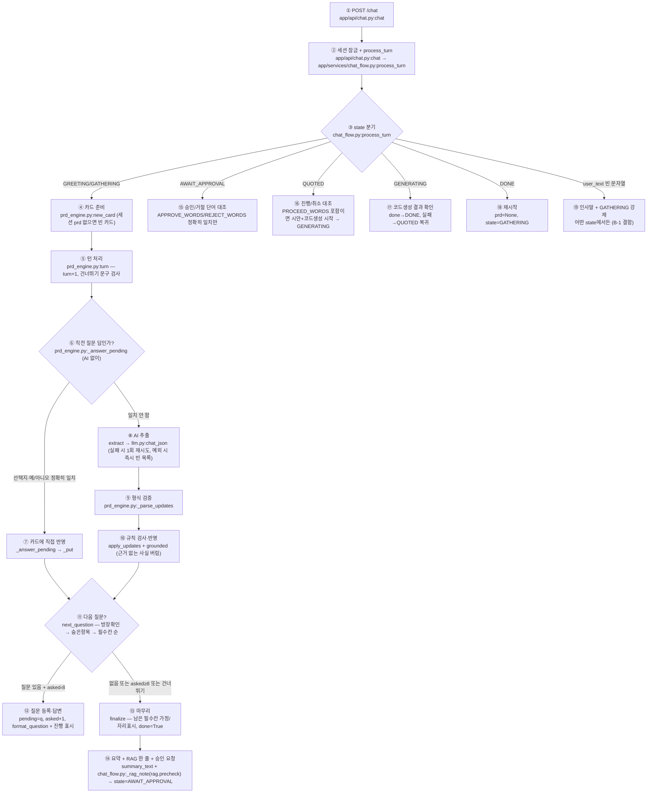
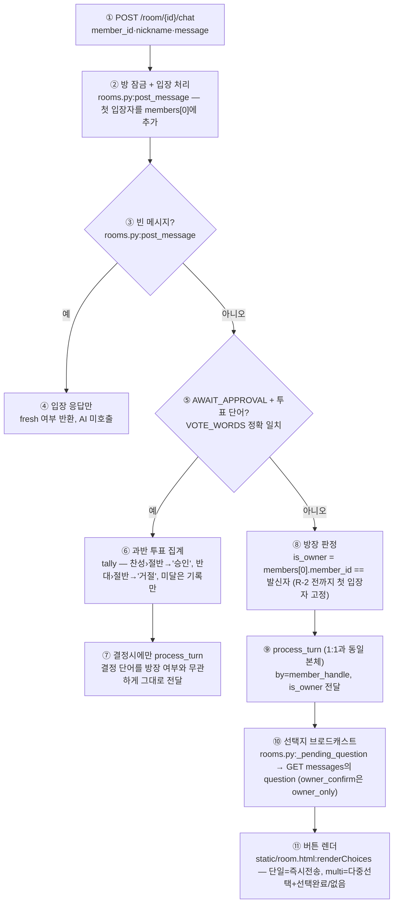
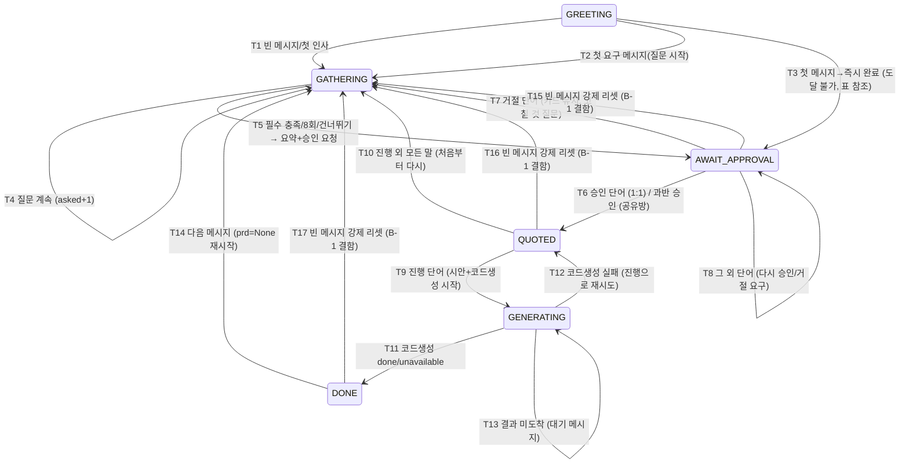

# 요구사항 엔진 독립 검증 (V) — REQUIREMENTS_ENGINE_VERIFICATION

> 검증일: 2026-09-26 / 기준 커밋: `7fe94c8` / 검증자: V (독립 검증, 엔진 코드 수정 없음)
> 기준은 **실제 코드**다. 계획과 다르면 코드가 맞고 계획이 틀린 것이 아니라, "대조표에 기록하고 결함으로 판단"한다.
> 실행: `NIM_API_KEY=x .../agent_project/.venv/bin/python -m pytest -q tests/engine -p no:cacheprovider` → **31개 중 15 통과 / 16 실패** (실패는 기대와 다른 동작을 그대로 남긴 것, xfail 아님)

읽은 코드: `app/services/prd_engine.py` (346줄), `app/services/prd_schema.py` (166줄),
`app/services/chat_flow.py` (164줄), `app/services/rooms.py` (186줄), `app/api/chat.py` (37줄),
`app/llm.py` (`chat_json`, 43줄), `app/services/rag.py` (77줄), `static/room.html` (`renderChoices`),
`tests/unit/test_prd_engine.py`. 계획: `docs/product/REQUIREMENTS_ENGINE_PLAN.md` (§7 v2 우선),
`docs/product/DECISIONS.md` (D20~D28), `docs/product/research/REQUIREMENTS_ENGINE_RESEARCH.md` (§1, §5).

---

## 1. 실제 과정 문서화

### 1.1 사장님 메시지 1개가 답이 될 때까지 (1:1 `/chat` 경로)



| 번호 | 설명 (함수·파일:줄) |
|---|---|
| ① | `POST /chat`이 `{session_id, message}`를 받는다. 메시지는 `strip()`만 한다 (길이 상한 없음). `app/api/chat.py:20-24` |
| ② | `store.session_tx` 잠금 안에서 `chat_flow.process_turn(session_id, session, user_text, base_url)` 호출. 1:1은 `by=None, is_owner=True` 고정. `app/api/chat.py:23-24` |
| ③ | `session["state"]`로 분기. `GENERATING`이 최우선, 그 다음이 빈 문자열 검사다. `chat_flow.py:62-90` |
| ④ | `session.get("prd") or prd_engine.new_card()` — **템플릿 인자 없이** 항상 빈 카드. `chat_flow.py:97` |
| ⑤ | `turn()`은 `card["turn"] += 1` 후 `SKIP_PHRASES` 부분일치 검사. 건너뛰기면 추출·답변을 통째로 건너뛴다. `prd_engine.py:289-295` |
| ⑥ | `_answer_pending`: `pending.kind`가 `owner_confirm`/`multi`/`single`인지 보고 oferuje. **선택지·예/아니오는 정확 일치**(strip만)다. `prd_engine.py:194-241` |
| ⑦ | 일치하면 AI를 부르지 않고 `_put`으로 카드에 쓴다. `single`은 사실 칸도 근거 검사 없이 그대로 쓴다. `prd_engine.py:223-237` |
| ⑧ | `extract(text, last_question)`: system 프롬프트+스키마를 넣고 `llm.chat_json` 호출. 형식 오류면 1회 재시도, 예외면 즉시 `[]`. `prd_engine.py:101-113`, `app/llm.py:29-43` |
| ⑨ | `_parse_updates`: JSON 파싱+`updates` 목록 검증, 값은 `strip()[:200]`. 앞뒤 설명이 붙으면 바깥 `{...}` 1회 재파싱. `prd_engine.py:77-98` |
| ⑩ | `apply_updates`: `grounded()`로 사실(전화·주소·가격·영업시간) 근거 확인 → 없으면 버림. `exclude`는 부분일치로 섹션에서 제거. 비방장 사실은 `PENDING_OWNER`. `prd_engine.py:140-179` |
| ⑪ | `next_question` 우선순위: (a) `PENDING_OWNER` 방장 확인 → (b) 숨은 항목(필수 3칸 이상 찼을 때 1회) → (c) 업종 `required` 순서 첫 미충족 칸. **점수 계산 없음.** `prd_engine.py:244-263` |
| ⑫ | 질문을 `pending`에 등록하고 `asked+1`. `format_question`이 `(질문 n/8 · '시안 먼저' …)` 진행 표시를 붙인다. `prd_engine.py:305-308, 313-319` |
| ⑬ | `finalize`: 남은 필수칸을 비사실→`ASSUMED` 기본값, 사실·가게이름→`PLACEHOLDER`로 채우고 `done=True`. `prd_engine.py:266-286` |
| ⑭ | `summary_text`+`spec_text`로 정리본을 만들고 `rag.precheck(spec)` 한 줄을 덧붙인 뒤 `AWAIT_APPROVAL`로 승인 요청. `chat_flow.py:100-108` |
| ⑮ | 승인(`승인·네·yes·approve·예` 정확 일치)→`quote.build_quote`→`QUOTED`. 거절 단어→`GATHERING`(카드 유지). 그 외→"승인 또는 거절로 답해주세요." `chat_flow.py:115-127` |
| ⑯ | `진행·네·yes·proceed·예`→시안 렌더 후 `codegen.start`, `GENERATING`. 그 외 **어떤 말이든**→`GATHERING`+처음부터 다시. `chat_flow.py:129-149` |
| ⑰ | `codegen` 결과 폴링: `done`→배포 링크+`DONE`, `unavailable`→`DONE`(산출물 없음), 실패→`QUOTED` 복귀. `chat_flow.py:62-88` |
| ⑱ | `DONE`에서 다음 메시지는 `prd=None`+`GATHERING` (재시작). `chat_flow.py:151-154` |
| ⑲ | 빈 문자열이면 state와 무관하게 인사말+`GATHERING` (기존 승인·견적 진행을 덮어쓴다). `chat_flow.py:90-92` |

### 1.2 공유방 `/room/{id}/chat` 경로 (방장 판정 포함)



| 번호 | 설명 (함수·파일:줄) |
|---|---|
| ① | 메시지는 `strip()[:2000]`(2000자 절단), 닉네임은 escape+40자. `rooms.py:83-87` |
| ② | `store.room_tx` 방 잠금. `member_id` 없으면 400. 기존 멤버면 `last_seen`·닉네임 갱신. **탈퇴 API 없음**(멤버는 추가만). `rooms.py:90-105` |
| ③ | 빈 메시지는 기록·AI 없이 `{ai_status, fresh}`만 (온보딩/폴링용). `rooms.py:107-108` |
| ④ | `fresh = next_seq == 0` (입장 전 기록 없음). 프론트는 새 방일 때만 온보딩 표시. `rooms.py:97` |
| ⑤ | `AWAIT_APPROVAL`에서 `승인·거절·네·아니오·yes·no` 정확 일치만 투표로 취급. "승인합니다"는 일반 채팅이 된다. `rooms.py:113` |
| ⑥ | `tally` 찬반 계산, 과반(›전체/2)일 때만 `process_turn`에 `"승인"`/`"거절"` 전달 후 투표 초기화. 동점·미달은 투표 기록만. `rooms.py:114-128` |
| ⑦ | 투표 결정은 `chat_flow`의 ⑮와 같은 단어 대조를 타므로 항상 통과한다. `chat_flow.py:116-125` |
| ⑧ | 방장 = `room["members"][0]` (가장 먼저 들어온 사람). 역할 기능 전까지 고정, 탈퇴·위임 없음. `rooms.py:130-132` |
| ⑨ | 사실 슬롯+비방장이면 `PENDING_OWNER`로 카드에 대기, 다음 턴 최우선 `owner_confirm` 질문. `prd_engine.py:160-164, 247-251` |
| ⑩ | `GET /room/{id}/messages`가 `question {kind, options, owner_only}`를 내려준다. 폴링이 `GENERATING` 완료 전이도 겸한다. `rooms.py:140-186` |
| ⑪ | `renderChoices`: 같은 질문은 다시 그리지 않음. multi는 `없음` 즉시전송, 선택들은 `join(', ')`로 전송, `선택 완료`(빈 선택이면 `없음`). `static/room.html:247-281` |

### 1.3 상태 전이 (stateDiagram)



| 전이 | 조건 (코드) | 비고 |
|---|---|---|
| T1 | `not user_text` → 인사말+`GATHERING`. `chat_flow.py:90-92` | 1:1에서만 도달 (공유방 빈 메시지는 AI 미호출) |
| T2 | `GREETING`+일반 메시지 → `turn()` 결과 질문 → `GATHERING`. `chat_flow.py:94-113` | 템플릿 없이 빈 카드 시작 |
| T3 | `GREETING`→`AWAIT_APPROVAL` 이벤트 등록만 있음. `chat_flow.py:36` | 실제 도달 불가: 첫 턴에 숨은 항목 질문이 항상 끼므로. 죽은 전이 |
| T4 | 질문 반환 시 `asked+1`, `pending` 갱신. `prd_engine.py:305-308` | 잡담·빈 메시지도 `asked` 소모 (B-4) |
| T5 | `turn().done` → RAG 한 줄+요약+승인 요청. `chat_flow.py:100-108` | `funnel.request_submitted` 기록 |
| T6 | 1:1 정확 일치 / 공유방 과반. `chat_flow.py:116-122`, `rooms.py:124-128` | `funnel.requirement_approved` 기록 |
| T7 | 거절 → `GATHERING` "무엇을 고칠까요?". 카드·`pending` 유지라 다음 메시지에서 수정이 바로 반영·재요약된다 (검증 통과). `chat_flow.py:123-125` | 재현: `test_reject_then_correct_after_finalize` 통과 |
| T8 | 그 외 → 상태 유지. `chat_flow.py:126-127` | "네, 좋아요" 같은 변형도 여기 걸림 (B-6) |
| T9 | 시안 렌더+`codegen.start` 후 `GENERATING`. `chat_flow.py:130-146` | `funnel.generate_start` 기록 |
| T10 | `else` → `GATHERING` "처음부터 다시 요청해 주세요." `chat_flow.py:147-149` | "취소"도 동일. 카드는 남지만 필수 충족 상태라 다음 턴에 즉시 재요약됨 |
| T11 | `done`→배포 링크+`DONE` / `unavailable`→산출물 없음+`DONE`. `chat_flow.py:66-85` | `funnel.generate_done` 기록 |
| T12 | 실패 상태 → `QUOTED` 복귀. `chat_flow.py:86-88` + `rooms.py:161-162` | 공유방은 `ai_status`도 `IDLE`로 |
| T13 | `codegen is None` → "생성 중" 대기. `chat_flow.py:63-65` | 공유방 폴링이 완료 전이를 겸함. `rooms.py:154-160` |
| T14 | `DONE`+메시지 → `prd=None`, `GATHERING`. `chat_flow.py:151-154` | 재시작 정상 |
| T15–T17 | `not user_text` 분기가 `GENERATING` 검사 다음이므로 모든 비-GENERATING 상태에서 발동. `chat_flow.py:90-92` | **B-1**: 1:1 빈 메시지가 승인 대기·견적을 날림. 공유방은 영향 없음 |

---

## 2. 계획 대비 대조표

범례: ✅ 구현됨 / ⚠️ 부분 / ❌ 없음. 근거 줄번호는 기준 커밋 기준.

| # | 계획·결정 항목 | 판정 | 근거 (파일:줄) |
|---|---|---|---|
| P1 | 질문 8회 상한 (D20, PLAN §7) | ✅ | `prd_schema.py:16` `MAX_QUESTIONS=8`, `prd_engine.py:301-304` 도달 시 `finalize`, `test_question_cap_is_eight` |
| P2 | 진행 표시 `질문 n/8` (D20) | ✅ | `prd_engine.py:319`, 재현 테스트 `test_progress_indicator_format` 통과 |
| P3 | 건너뛰기 문구 "나머지는 알아서, 시안 먼저" (D20) | ⚠️ | `SKIP_PHRASES` 6종 부분일치 (`prd_engine.py:16, 294`). "건너뛰기"·"이제 보여줘" 변형·"시안 보여줘"(먼저 없음)는 미인식 → `test_skip_word_not_recognized` 실패 |
| P4 | 숨은 항목 여러 개 고르기 1회 (D21) | ⚠️ | `next_question` multi 1회 (`prd_engine.py:256-259`), `asked` 1회 한정 아님(별도 `hidden.asked` 플래그). 단, 선택지 6개로 4개 상한 위반(P7), 부정·혼합 처리 결함(B-2·B-3) |
| P5 | 첫 메시지 점수·매 턴 재계산 (조사 #3, PLAN §7) | ❌ | 점수 코드 없음. `next_question`은 `required` 고정 순서 첫 미충족 칸 (`prd_engine.py:253-262`) |
| P6 | "필요 없어요" 영역 제외/가지치기 (조사 #3) | ❌ | `REJECTED`를 쓰는 곳이 `_SATISFIED` 포함·요약 제외뿐, 설정하는 코드 없음 (`prd_engine.py:21, 337` + grep). "필요 없어요"는 상한까지 같은 질문 반복 → `test_needless_area_can_be_rejected` 실패 |
| P7 | 확인형/구체화형 질문 두 벌 (조사 #4) | ❌ | `Question.confirm`은 goal 1곳 정의만 있고 사용처 없음 (`prd_schema.py:53, 73` + grep). 항상 `ask`만. → `test_confirm_shape_never_used`로 부재 기록(통과) |
| P8 | 선택지 4개 이하+자유 입력 (조사 #9) | ⚠️ | 단일 질문은 4개 이하+마지막 `LET_AI` (`prd_engine.py:262`, `test_single_choice_option_count_within_four` 통과). 숨은 항목은 5~6개 (`prd_engine.py:257-258`) → `test_hidden_multi_option_count_within_four` 실패 |
| P9 | 첫 메시지 점수 반영 질문 순서 | ❌ | P5와 동일. 언급 많은 칸이 먼저 묻지 않는다 |
| P10 | 추출 스키마 강제+서버 검증 (조사 #10→§5 채택안) | ✅ | `enable_thinking=false`+프롬프트 내 스키마+`_parse_updates` 검증+형식오류 1회 재시도 (`app/llm.py:36-43`, `prd_engine.py:101-113`). `guided_json` 미사용은 §5 실측대로 |
| P11 | 확정 1회: 시안과 함께 (D22) | ⚠️ | 엔진은 질문 종료 후 요약+참고견적 승인 1회 (`chat_flow.py:104-108`). 시안 옆 카드·시안 확정 게이트는 `QUOTED→GENERATING` 진행 흐름에 없음 (P-7 미연결, 범위 밖 참고) |
| P12 | 모르는 사실 자리 표시, 공개 전 필수 (D23) | ⚠️ | `PLACEHOLDER`+`[.. 입력 필요]`+`spec_text` 자리 유지 (`prd_engine.py:270-282, 322-346`). "공개 전 필수" 강제 코드는 엔진·플로우에 없음 (게시 단계 범위 밖) |
| P13 | 공유방 사실은 방장 확인 (D24 전반) | ✅ | 비방장 사실→`PENDING_OWNER`+`owner_confirm` 최우선 질문 (`prd_engine.py:160-164, 247-251`), 방장=`members[0]` (`rooms.py:132`), `test_group_facts_need_owner_confirmation` 통과 |
| P14 | 의견 엇갈림 두 답 나란히+투표 (D24 후반) | ❌ | 같은 칸 재발언은 마지막 값으로 덮어씀 (`apply_updates` `_put` 덮어쓰기, `prd_engine.py:165-175`). 투표는 `AWAIT_APPROVAL` 승인 게이트에만 (`rooms.py:113-128`) |
| P15 | 참고 견적: 완성 후 한 줄, 규칙 계산 (D25) | ❌ | `app/services/quote.py:1-62`는 NIM 3안(A/B/C) AI 생성+정적 폴백. 규칙 계산(섹션 수·기능) 아님. 승인 후(`QUOTED`)에 3안 표시라 "확정 조건에서 뺀다"와도 다름 (`chat_flow.py:117-121`) |
| P16 | 템플릿: 업종·구성만 가정, 사실 비움 (D26) | ⚠️ | `new_card(template_industry)` 자체는 정확 (`prd_engine.py:26-35`, `test_template_prefills_structure_not_facts` 통과). 그러나 호출부가 전부 무인자 (`chat_flow.py:97` 유일 호출)라 실서비스에서 미연결 |
| P17 | 완성 후 수정 직접 편집 (D27) | — | 엔진 범위 밖. 본 검증에서 미확인 |
| P18 | 시뮬레이션 평가 NIM 다른 모델 (D28) | — | 운영 절차. 본 검증에서 미확인 (대신 §5에 AI 필요 검증 목록) |
| P19 | 지어낸 사실 차단 (PLAN §1 원칙 4) | ⚠️ | `grounded()` 숫자 일치·2글자 낱말 검사+프롬프트 금지 (`prd_engine.py:122-131`). 숫자 없는 사실의 오탐(부정·추측 문장도 단어만 있으면 통과), 한글/전각 숫자 미정규화 (B-5) |
| P20 | 모양 질문 금지 (PLAN §1 원칙 3) | ✅ | 색·분위기 슬롯·질문 없음. `detail`은 특징 서술용. 코드 부재로 구현됨 |
| P21 | 한 번에 하나만 질문 (PLAN §1 원칙 2) | ✅ | `next_question`은 항상 1개 또는 `None`. `turn()`도 질문 1개만 등록 |
| P22 | 확정 칸 보호 (PLAN §3 ⑤) | ❌ | 재발언은 확인 없이 덮어쓴다 (`apply_updates`에 확정 개념 없음). `REJECTED` 포함이 `_SATISFIED`에 있어 한 번 거절(될 수 없는) 상태만 보호되는 구조 |
| P23 | 근거 순번 evidence (PLAN §2) | ✅ | `_put(..., turn)`이 `evidence=[turn]` 기록 (`prd_engine.py:38-39`). 표시는 미구현 |
| P24 | "알아서 해주세요" (LET_AI) | ⚠️ | 정확 일치만 (`prd_engine.py:223`). "알아서 해줘" 미인식 → `test_let_ai_paraphrase_not_recognized` 실패. 비사실→`ASSUMED`, 사실·가게이름→`PLACEHOLDER` 분기는 정상 |
| P25 | "나중에 넣을게요" (LATER) | ✅ | 정확 일치 시 `PLACEHOLDER` (`prd_engine.py:228-229`). 변형 미인식은 P24와 동일 구조 (별도 테스트 없음, B-6에 포함) |
| P26 | `phone` 조건부 자리 표시 | ✅ | 연락 방법이 전화 포함/미정이면 `phone` PLACEHOLDER (`prd_engine.py:278-280`) |

---

## 3. 결함 목록 (심각도순)

### 높음

| ID | 결함 | 재현 테스트 | 근거 | 고치는 방향 제안 |
|---|---|---|---|---|
| B-1 | 1:1 빈 메시지가 승인 대기·견적·완료 상태를 `GATHERING`으로 리셋 | (엔진 밖, 정적 확인) | `chat_flow.py:90-92` 분기가 `GENERATING` 다음이라 모든 state에서 발동. 공유방은 `rooms.py:107-108` 조기 반환이라 안전 | 빈 메시지 분기를 `GREETING`/`GATHERING`으로 한정하거나, 비어 있으면 상태 유지+현재 `pending` 질문 재송신 |
| B-2 | 숨은 항목 "없음" 혼합 시 선택 소실 ("주차는 되는데 나머지는 없음" → `[]`) | `test_hidden_none_mixed_with_selection` ❌ | `prd_engine.py:213` `any(w in t for w in NONE_WORDS)` 부분일치 우선 | `NONE` 판정을 "메시지 전체가 없음 계열"일 때로 한정, 혼합이면 선택 추출을 먼저 적용 |
| B-7 | `REJECTED` 도달 불가 → "필요 없어요"가 상한까지 같은 질문 반복 | `test_needless_area_can_be_rejected` ❌ | `REJECTED` 설정 코드 없음 (grep 0건). 조사 #3 가지치기 미구현 | 거절 표현 사전+추출 `exclude_area`로 취급: 해당 칸 `REJECTED`, `next_question` 제외 (이미 `_SATISFIED`·요약 제외는 준비됨) |

### 중간

| ID | 결함 | 재현 테스트 | 근거 | 고치는 방향 제안 |
|---|---|---|---|---|
| B-3 | 숨은 항목 부정 무시 ("주차는 안 돼요" → 주차 선택됨) | `test_hidden_negation_ignored` ❌ | `prd_engine.py:216` 라벨 부분일치만 보고 부정어 미검사 | 선택 전 부정 패턴(`안/못/없…`) 검사, 부정 항목은 `selected`에서 제외 |
| B-4 | 잡담·빈 메시지가 질문 예산(`asked`) 소모 | `test_chatter_consumes_question_budget` ❌, `test_empty_message_consumes_question_budget` ❌ | `turn()`은 추출 0건이어도 `next_question`+`asked+1` (`prd_engine.py:301-308`) | `applied` 없고 `_answer_pending`도 아니면 `pending` 유지+`asked` 미증가 (같은 질문 재송신) |
| B-5 | 한글 숫자·전각 숫자 미처리 (정규화 없음 / 근거 검사 탈락) | `test_korean_numeral_phone_normalized` ❌, `test_fullwidth_digits_fact_kept` ❌ | `_digits`는 ASCII 기준 비교, 한글 숫자는 그대로 저장 (`prd_engine.py:118-131`) | 저장 전 NFKC 정규화+한글 숫자→아라비아 숫자 변환을 `grounded`/`apply_updates` 앞에 추가 |
| B-6 | 선택지·승인·건너뛰기 전부 정확 일치 (조사·버튼 눌림 외 입력 취약) | `test_single_choice_fuzzy_answer_with_particle` ❌, `test_owner_confirm_uppercase_yes` ❌, `test_owner_confirm_polite_yes` ❌, `test_let_ai_paraphrase_not_recognized` ❌, `test_skip_word_not_recognized` ❌ | `_answer_pending`·`APPROVE/REJECT/PROCEED/VOTE_WORDS`·`SKIP_PHRASES` 모두 `in`/`==` 정확 대조 (`prd_engine.py:194-241`, `chat_flow.py:13-17`, `rooms.py:16-17`) | 포함(부분일치)·대소문자 무시·핵심어(전화/승인/건너뛰) 정규식으로 완화. 버튼은 그대로라 회귀 위험 낮음 |
| B-8 | 방장 확인 대기 중 자유 대답이 확인 질문을 조용히 교체 | `test_owner_free_answer_drops_pending_confirmation` ❌ | 추출 반영 시 `pending=None` 후 새 질문 등록 (`prd_engine.py:300`) | 같은 슬롯 자유 대답이면 대기값 갱신+`owner_confirm` 유지, 다른 슬롯이면 둘을 큐에 유지 |
| B-9 | 방장 `member_id` 분실 시 확인 영구 불가 (탈퇴·위임 없음) | (엔진 밖, 정적 확인) | `member_id`는 브라우저 비밀값, `members` 추가만 (`rooms.py:99-105`), 방장=`members[0]` 고정 (`rooms.py:132`) | 방장 재지정(남은 멤버 중 최장 체류 자동 승계) 또는 `owner_confirm` 타임아웃 후 과반 승인 폴백 |
| B-10 | 견적 D25 정면 배치 (AI 3안, 확정 게이트에 포함) | (엔진 밖, 정적 확인) | `quote.py:1-62`, `chat_flow.py:117-121` | 섹션 수·기능 기반 규칙 계산 1줄+베타 무료 문구로 교체, 기존 3안 제거 |

### 낮음

| ID | 결함 | 재현 테스트 | 근거 | 고치는 방향 제안 |
|---|---|---|---|---|
| B-11 | 숨은 항목 선택지 6개 (4개 이하 위반) | `test_hidden_multi_option_count_within_four` ❌ | `prd_engine.py:257-258` 라벨 5+없음 | 숨은 항목 상위 3개만+없음, 또는 2페이지 분할. 조사 #9 근거 |
| B-12 | 업종 변경 시 옛 가정 섹션 잔류 (펜션→카페도 객실 소개) | `test_industry_change_refreshes_assumed_sections` ❌ | `business_type` 반영은 `industry`만 갱신 (`prd_engine.py:176-177`) | `ASSUMED` 상태 섹션은 업종 변경 시 새 기본값으로 교체 (사장님 입력 `FILLED`는 유지) |
| B-13 | `exclude` 값 전처리 없음 ("바비큐는 빼주세요" verbatim 저장 시 제거 실패) | `test_exclude_value_with_particles_not_normalized` ❌ | 부분일치 `e in v` (`prd_engine.py:156`)가 AI 값 그대로에 의존 | 조사·"빼주세요" 제거+핵심어 추출을 엔진에서 정규화, 또는 추출 프롬프트에 핵심어만 지시 |
| B-14 | `T3` 죽은 전이 (`GREETING→AWAIT_APPROVAL` 이벤트) | (정적 확인) | `chat_flow.py:36` 등록, 도달 경로 없음 (§1.3 T3) | 제거 또는 첫 메시지 즉시완료 조건 명시 |
| B-15 | 템플릿 시작 미연결 (`new_card` 무인자 호출만) | (정적 확인) | `chat_flow.py:97` | 방 생성 시 `template_id`→업종 전달 배선 (P16) |
| B-16 | `exclude` 부분일치가 복합어까지 제거 ("바비큐"→"바비큐장") | `test_exclude_substring_removes_compound_section` ✅ (현재 동작 기록) | `prd_engine.py:156, 172` | 의도 확인 필요. 현 동작이 기획 의도면 그대로 두고 주석으로 명시 |

---

## 4. 검증 테스트 결과

`tests/engine/test_verification.py` (31개) + `tests/engine/conftest.py` (신규 폴더, 소유).
가짜 AI(`llm.chat_json` monkeypatch)만 사용, DB·실제 NIM 호출 없음.

```text
16 failed, 15 passed in 0.35s
```

| 결과 | 테스트 |
|---|---|
| ✅ 통과 (15) | `test_hidden_partial_display_name`, `test_hidden_none_exact`, `test_nonowner_confirm_does_not_apply`, `test_exclude_substring_removes_compound_section`, `test_reject_then_correct_after_finalize`, `test_confirm_shape_never_used`, `test_question_cap_placeholders_and_done`, `test_facts_on_last_allowed_turn_survive`, `test_extract_exception_keeps_conversation`, `test_very_long_message_no_crash`, `test_unrelated_chatter_keeps_pending`, `test_single_choice_option_count_within_four`, `test_progress_indicator_format`, `test_shop_name_let_ai_placeholder_not_assumed`, `test_pending_single_free_answer_applies_and_clears` |
| ❌ 실패 (16, 결함 기록용·수정 금지) | `test_single_choice_fuzzy_answer_with_particle` (B-6), `test_owner_confirm_uppercase_yes` (B-6), `test_owner_confirm_polite_yes` (B-6), `test_let_ai_paraphrase_not_recognized` (B-6), `test_hidden_none_mixed_with_selection` (B-2), `test_hidden_negation_ignored` (B-3), `test_hidden_multi_option_count_within_four` (B-11), `test_owner_free_answer_drops_pending_confirmation` (B-8), `test_exclude_value_with_particles_not_normalized` (B-13), `test_industry_change_refreshes_assumed_sections` (B-12), `test_needless_area_can_be_rejected` (B-7), `test_chatter_consumes_question_budget` (B-4), `test_empty_message_consumes_question_budget` (B-4), `test_korean_numeral_phone_normalized` (B-5), `test_fullwidth_digits_fact_kept` (B-5), `test_skip_word_not_recognized` (B-6) |

실패 테스트는 모두 실제 코드 동작과 1:1로 대조 확인함 (위 표의 근거 줄번호).
기존 `tests/unit/test_prd_engine.py`는 손대지 않았고, 엔진 코드 수정도 없음 (검증자 금지 준수).

---

## 5. 실제 AI가 필요한 검증 (Claude가 돌릴 것 — 가짜 AI로 불가)

| # | 검증 | 방법 | 합격선 (PLAN §4.1) |
|---|---|---|---|
| A1 | T2 추출 품질: 정해진 JSON·칸 오분류율 | 발화 60개 × 기대 칸 (RESEARCH §5 오분류 3건 포함: 공방 "도자기"→이름, 학원 "초등 영어"→목적, "바비큐는 빼주세요"→제외) 녹화 후 CI는 녹화본, 주 1회 실제 호출 | 형식 통과율, 칸 오분류 0에 수렴 |
| A2 | T3 대화 시뮬레이션 36개 (업종 6 × 유형 6) | 가상 사장님(NIM 다른 모델, 수동 응답 기본)+채점기. 엔진 변경·배포 전 필수 | 필수칸 채움률·정확도 95%↑, 지어낸 값 0, 평균 질문 3회 이하·최대 8회, 중복 질문 0, 규칙 위반 0 |
| A3 | IRE·TKQR 성적표 (RESEARCH §3) | A2 결과에 숨은 요구 발견률·턴 할인 핵심 질문률 추가, `docs/product/evals/<날짜>.md` 기록 | 이전 성적표 대비 하락 시 배포 금지 |
| A4 | B-5 실측: 한글/전각 숫자 발화의 실제 추출값 | "공일공…"·전각 숫자 발화를 실제 `chat_json`에 투입, `grounded` 통과율 측정 | B-5 수정 후 통과율 100% |
| A5 | B-6 실측: 선택지 변형 답의 실제 추출 폴백 | "전화요"·"네, 맞아요" 등을 실제 AI에 투입 시 올바른 칸으로 가는지 (현재는 규칙 실패 후 AI 추출에 의존) | 규칙 완화 또는 추출 폴백 확인 |
| A6 | RAG 한 줄 지연·실패율 | `rag.precheck` 임베딩 실측 지연과 신규 폴백 빈도 | 승인 응답 체감 지연 기준 이내 |
| A7 | 공유방 두 사람 충돌 시나리오 (PLAN T3 유형 6) | 연락 방법 의견 분기 시 현재 "마지막 말 덮어쓰기"가 사용자 체감에 미치는지 | D24 후반(나란히+투표) 구현 여부 결정 재료 |
| A8 | NIM 사용량 한도 (36 시나리오 × 약 12 호출 ≈ 430회) | 첫 T3 실행 때 측정 (PLAN §4.1) | 무료 한도 내 확인 |

---

## 부록: 소유·금지 준수 기록

- 수정 파일: `tests/engine/conftest.py`, `tests/engine/test_verification.py` (신규), 본 문서. 엔진·앱 코드 무수정.
- `.env` 미열람, 실제 NIM 호출 없음, `git add/commit/push` 없음, SSH·OCI·docker·배포 스크립트 미실행, 작업 폴더 밖 쓰기 없음.
