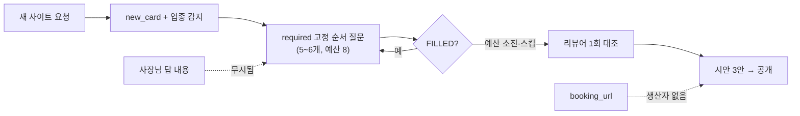
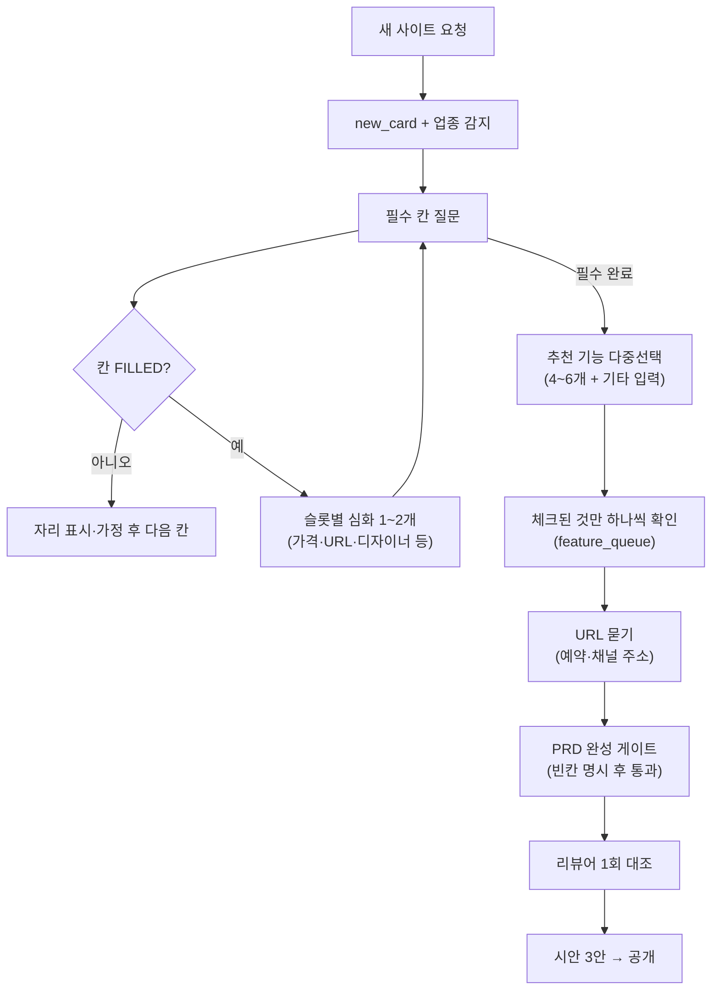
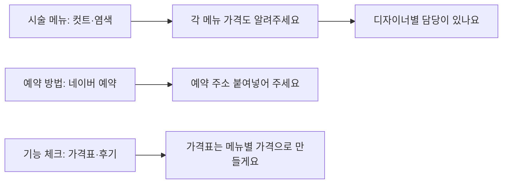

# 요구사항 파이프라인 V2 설계 (정적 질문 → 동적 심화)

> 작성: 2026-09-27 / 기준: 현 파이프라인(`app/services/prd_engine.py`, `prd_schema.py`, `intake.py`, `design_variants.py`, `site_render.py`), T3 분석(`reviews/T3_FAILURE_ANALYSIS.md`), 결정(D20·D23·D33·D34·D46)
> 문제 의식: 새 사이트를 만들어 달라고 해도 파이프라인은 고정된 required 5~6개만 묻고 끝난다. grill-me처럼 답을 파고들지 않아 코드 생성에 필요한 PRD가 안 나온다. 대표 증상: 예약 버튼이 더미처럼 보임.

## 1. 지금 파이프라인이 왜 틀렸나 (5가지)

| # | 결함 | 근거(파일·동작) | 겉 증상 |
|---|---|---|---|
| 1 | 물을 목록이 정적 | `prd_schema.py` 업종별 `required` 고정 + `prd_engine.py:next_question` 고정 순서. 답 내용과 무관하게 다음 칸으로 이동 | "컷트·염색해요" 뒤 각 가격·소요시간·디자이너를 안 물음 |
| 2 | 심화 없음 | 칸이 FILLED면 끝. 슬롯별 후속 질문 테이블이 없음 | PRD에 메뉴는 있고 가격·예약 수단이 빔 |
| 3 | 기능은 수동형 | `_judge_features`는 사장님이 말한 것만 판정. 목록 제시 질문이 없음 | 미용실에 추천 기능 목록이 안 나옴 |
| 4 | 예약 URL 단절 | `site_render.py`는 `booking_url` 있어야 버튼을 살림(`:556-584`, `:644-646`)인데, `booking_url`을 채우는 코드가 `app/` 어디에도 없음. 카탈로그(`external_booking_link`)는 "사장님이 주소 줘야 함"이라 해놓고 묻는 질문·칸·저장이 없음 | "예약 사이트 클릭하면 아무것도 안 뜸" = 미리보기에 껍데기 버튼만 남음 |
| 5 | 완성 게이트 없음 | 리뷰어는 요약 직전 대조 1회(D34)뿐. 코드 생성 전 빈칸 체크리스트가 없어 빈 채로 시안으로 넘어감 | 전화·주소·메뉴 가격 중 뭐가 비었는지 모른 채 생성 |

## 2. 결정 (V2)

| ID | 결정 | 근거 |
|---|---|---|
| V2-1 | 슬롯별 심화 질문: 칸 FILLED 뒤 칸 종류별 후속 1~2개 자동 생성. 답 없으면 자리 표시로 닫고 넘어감 (무한 질문 금지) | D20 이탈 방지(언제든 "시안 먼저") 유지 |
| V2-2 | 기능 먼저 제시: 필수 칸 끝난 뒤 업종별 추천 4~6개 다중선택 + 기타 직접 입력. 체크된 것만 카탈로그 `questions`로 하나씩 확인 (기존 `feature_queue` 재활용) | D33 예산(+1씩 최대 +4) 재활용 |
| V2-3 | 예약·채널 URL 묻기: `contact_method`가 외부 예약/카톡 채널이면 주소 1회 질문. "나중에"면 자리 표시 | 결함 4 직접 해소. `chat_flow.py:244` 긁어오기와 병행 |
| V2-4 | PRD 완성 게이트: 시안 전에 체크리스트(연락 수단·위치·메뉴+가격·예약 수단+주소·사진 유무). 빈 항목은 자리 표시·숨김 규칙 명시 후 통과 (막지는 않음) | D23 자리 표시 + D46 게이트 확장 |
| V2-5 | 예산 상한 유지: 심화는 칸당 1~2개, 전체는 기존 예산(8+보너스4) 안. "시안 먼저"는 전 큐를 닫음(방장 확인 제외, 기존 동작) | D20·D33·D46과 충돌 없음 |

## 3. 설계 다이어그램

### 3-1. 현 파이프라인 (문제)

### 3-2. V2 파이프라인 (동적 심화)

### 3-3. 심화 질문 예 (미용실)

## 4. 다음 행동 (구현 순서)

1. 슬롯별 심화 테이블 (미용실부터) — `prd_engine.py`에만 추가, 칸당 1~2개, 예산 안.
2. 추천 기능 다중선택 1종 — 기존 `feature_queue`·예산 재활용.
3. 예약·채널 URL 묻기 — `booking_url` 단절 해소, 편집 화면 주소 칸과 함께.
4. PRD 완성 게이트 — D46 게이트 확장, 막지 않고 명시 후 통과.
5. `tests/engine` 가짜 테스트로 각 분기 고정 → 로컬 채팅방 손 테스트 1회 → 실서버는 마지막.
