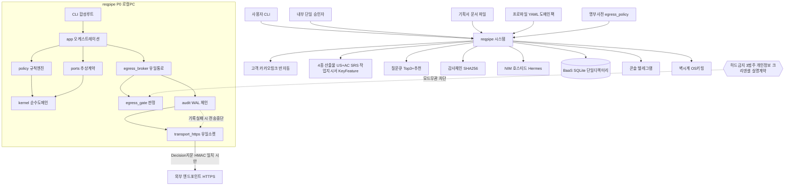

# 시스템 요구사항 정리 (시스템은 ~해야 한다)

> 기준: [01_OVERVIEW_AND_HISTORY.md](01_OVERVIEW_AND_HISTORY.md) 통합본 + `archive/AI_pipeline_confirmed_v1.1` + `archive/ARCH_S3_v1.2` / 작성일: 2026-09-21
> 성격: **이 프로젝트의 정본(SSOT) 요구사항 문서.** 개발 중에는 이 문서의 그룹(G01~G18)을 기준으로 삼는다. 버전 이력·결정 근거가 필요하면 [01_OVERVIEW_AND_HISTORY.md](01_OVERVIEW_AND_HISTORY.md)를 본다. 각 REQ 항목의 시퀀스 다이어그램·담당 레이어·Success Criteria까지 자세히 보려면 [04_REQUIREMENTS_DETAILED.md](04_REQUIREMENTS_DETAILED.md)를 본다.

## 개요 (이 문서를 1분 안에 이해하기)

기획서 하나를 넣으면 사람마다 다르게 해석하거나 AI가 사실을 지어내는 문제를 막기 위해, `reqpipe`가 지켜야 할 모든 동작을 `시스템은 ~해야 한다` 한 문장 한 행동으로 쪼개 18개 그룹(G01~G18)에 담았다. 문장마다 출처가 있어 "왜 이렇게 만들었나"를 거슬러 올라갈 수 있고, 실패 시 안전한 쪽(차단)으로 동작하도록 설계했다.

## 목차

- [0. 배경](#0-배경-처음-보는-사람을-위한-설명)
- [시스템 컨텍스트 (한눈보기)](#시스템-컨텍스트-한눈보기)
- [0.1 목표 (왜 `시스템은 ~해야 한다`로 썼는가)](#01-이렇게-요구사항을-정의한-목표-왜-시스템은-해야-한다로-썼는가)
- [0.2 용어집](#02-용어집-한자어영어-약어-첫-등장-풀어쓰기)
- [그룹 1~18 (G01~G18)](#그룹-1-목적범위산출물-g01) — 아래 그룹별 목차 표 참고
- [부록. 원본 233건 위치표](#부록-원본-233건-위치표-개별-문장-원본)

| 그룹 | 주제 |
|---|---|
| G01 | 목적·범위·산출물 |
| G02 | 요구 수집·슬롯·증거 |
| G03 | 가정·질문·인터뷰·승인 |
| G04 | 추적·결정·산출물 |
| G05 | 파이프라인·게이트·루프백 |
| G06 | 모델·능력협상·LLM 호출 |
| G07 | 기밀등급·분류 |
| G08 | 외부송신·게이트·전송 |
| G09 | 감사·보존·무결성 |
| G10 | 탐지·하드금지·명부 |
| G11 | 예외·정책파일 |
| G12 | 타이머·에스컬레이션·알림 |
| G13 | 데이터·저장·상태 |
| G14 | 실행호스트·배포·설정 |
| G15 | 아키텍처·레이어·검사 |
| G16 | 검증·수락·마일스톤 |
| G17 | 에이전트 (Agent, v1.2 진전) |
| G18 | RAG (검색 증강 생성, v1.2 진전) |

## 0. 배경 (처음 보는 사람을 위한 설명)

| 질문 | 쉬운 답 |
|---|---|
| 이 시스템이 왜 필요한가 | 기획서(企劃書, 만들ものを 적은 문서)가 있어도 개발자가 매번 다르게 해석하고, 인공지능(AI)이 없는 사실을 지어내며(환각, 幻覺), 외부로 보내면 안 되는 정보가 새는 사고가 생긴다. 이를 막기 위해 문서 넣기부터 질문·승인·감사(監査, 기록을 남겨 나중에 따지는 일)까지 한 흐름으로 묶은 도구가 `reqpipe`다. |
| `reqpipe`는 무엇을 하는가 | 기획서·문서를 넣으면 4가지 결과물(産出物, 만들어 내놓는 것)을 만든다. ① 사용자 이야기와 인수조건(引受條件, 다 만들었다고 인정하는 조건) ② 요구사항 명세서(明細書, 무엇을 만들지 적은 문서) ③ AI 개발용 작업 지시서 ④ 비개발자용 핵심 기능 정리. |
| 누가 쓰는가 | 사용자(명령줄 인터페이스, CLI, Command Line Interface 앞에서 조작하는 사람), 내부 승인자 1명(회사 안에서 `맞다`고 확정하는 사람), 고객(카카오톡 링크로 질문만 받고 답하는 외부 사람). 고객은 내부 질문 목록을 볼 수 없다. |
| 어떻게 안전하게 굴러가는가 | 모든 외부 보내기는 한 통로(유일 통로, only path)로만 나가고, 보내기 전에 등급 판정(秘密 등급 C0/C1/C2)과 금지 검사( absolute 금지 3가지)를 거치고, 보낸 뒤에는 기록(WAL, Write-Ahead Log, 먼저 적어두는 장부 + 해시 사슬, hash chain)로 남긴다. 기록에 실패하면 보내지 않는다. |
| 지금 상태는 | 요구사항 모으기(S0~S2)는 끝났고(시스템 요구 233건, 소프트웨어 요구 79건), 뼈대 설계(S3)도 끝났다(부품 89개). 다음은 실제 만들기(M1→M2→M3 순서)다. |

## 시스템 컨텍스트 (한눈보기)

## 0.1 이렇게 요구사항을 정의한 목표 (왜 `시스템은 ~해야 한다`로 썼는가)

| 목표 | 설명 (쉬운 말) |
|---|---|
| 해석 다툼 없애기 | `잘 처리한다` 같은 vague한 말을 금지하고, 누가 읽어도 같은 뜻이 되게 `시스템은 ... 해야 한다` 한 문장 한 행동으로 쪼갰다. 테스트할 때 `했는지 안 했는지` 바로 판정할 수 있다. |
| 빠짐없이 묶기 | 흩어진 결정(D20~D42), 숫자(파라미터 11종), 설계(ARCH 89개 부품)를 16개 그룹(G01~G16)으로 묶어, 같은 주제는 한곳에서 보이게 했다. |
| 증거 남기기 | 모든 문장에 출처(出處, 어디서 왔는지)를 달아, 나중에 `왜 이렇게 만들었나`를 거슬러 올라갈 수 있게 했다. 출처 없는 값은 산출물에 못 들어간다. |
| 실패해도 안전하게 | 모르면 멈추는 쪽(fail-closed, 실패 시 차단)으로 정했다. 감사 기록이 안 남으면 보내지 않고, 열쇠(암호 키)가 없으면 기동하지 않으며, 금지 3가지는 어떤 모드에서도 뒤집을 수 없다. |
| 다시 돌려도 같게 | 같은 입력이면 같은 결과가 나오게(재현성, 再現性) 했다. 난수(亂數, 무작위 수) 금지, 순서 고정, 결정적 규칙(정규식+사전) 우선이 그 장치다. |
| 단계적으로 만들기 | 한 번에 다 만들지 않고 M1(뼈대, 인터넷 없이 동작)→M2(외부·그림 붙이기)→M3(자동 판정·출시) 순서로 나눠, 앞 단계가 뒤 단계의 전제조건이 되게 했다. |

## 0.2 용어집 (한자어·영어 약어 첫 등장 풀어쓰기)

> 본문 규칙: 아래 표에 있는 말은 본문 첫 등장 때 `한글(漢字, 영어 풀어쓰기, 약어)` 형태로 풀어쓰고, 이후에는 약어만 쓴다.

| 약어/한자어 | 풀어쓰기 (첫 등장 형태) |
|---|---|
| SRS | 소프트웨어 요구사항 명세서 (Software Requirements Specification, SRS) |
| SYS / SWR | 시스템 요구사항 (System Requirements, SYS) / 소프트웨어 요구사항 (Software Requirements, SWR) |
| FR / NFR | 기능 요구사항 (Functional Requirements, FR) / 비기능 요구사항 (Non-Functional Requirements, NFR) |
| CLI | 명령줄 인터페이스 (Command Line Interface, CLI) |
| LLM | 거대 언어 모델 (Large Language Model, LLM) |
| RAG | 검색 증강 생성 (Retrieval-Augmented Generation, RAG) |
| NIM | 엔비디아 추론 마이크로서비스 (NVIDIA Inference Microservice, NIM) |
| BaaS | 서비스형 백엔드 (Backend as a Service, BaaS) |
| WAL | 선행 기록 장부 (Write-Ahead Log, WAL) |
| HMAC / SHA | 해시 기반 메시지 인증 코드 (Hash-based Message Authentication Code, HMAC) / 안전 해시 알고리즘 (Secure Hash Algorithm, SHA) |
| AC | 인수조건 (引受條件, Acceptance Criteria, AC) |
| BM25 / MMR | 문서 검색 순위 알고리즘 (Best Matching 25, BM25) / 다양성 재순위 기법 (Maximal Marginal Relevance, MMR) |
| GPU / OCI | 그래픽 처리 장치 (Graphics Processing Unit, GPU) / 오라클 클라우드 인프라 (Oracle Cloud Infrastructure, OCI) |
| NGC | 엔비디아 GPU 클라우드 (NVIDIA GPU Cloud, NGC) |
| YAML / JSON | 사람 읽기 쉬운 설정 형식 (YAML Ain't Markup Language, YAML) / 자바스크립트 객체 표기 (JavaScript Object Notation, JSON) |
| SDK / HTTPS | 소프트웨어 개발 키트 (Software Development Kit, SDK) / 보안 하이퍼텍스트 전송 규약 (HyperText Transfer Protocol Secure, HTTPS) |
| TTL | 유효 기간 (Time To Live, TTL) |
| TRC / ASK / PRV | 추적(追跡, Trace, TRC) / 질문(質問, Ask, ASK) / 잠정(暫定, Provisional, PRV) |
| SEC / EGR / AUD | 보안(保安, Security, SEC) / 외부 송신(外部 送信, Egress, EGR) / 감사(監査, Audit, AUD) |
| DNY / VEN / KEY | 금지(禁止, Deny, DNY) / 공급자(供給者, Vendor, VEN) / 열쇠(鍵, Key, KEY) |
| 산출물(産出物) | 만들어 내놓는 문서·파일 |
| 추적(追跡) | 어디서 와서 어디로 갔는지 연결선으로 따라가는 일 |
| 승인(承認) | `맞다`고 확정하는 일 |
| 가정(假定) | 아직 답이 없어 일단 `이렇다고 치고` 진행하는 것 |
| 증거(證據) | `왜 이렇게 적었나`를 받치는 출처 자료 |
| 무결성(無缺性) | 기록이 중간에 변조되지 않았음 |
| 재현성(再現性) | 같은 입력이면 언제 돌려도 같은 결과가 나옴 |
| 역류(逆流) | 아래 단계에서 발견된 것을 위 요구사항으로 되돌려 고치는 일 |

## 그룹 1. 목적·범위·산출물 (G01)

| ID | 요구사항 (시스템은 ~해야 한다) | 출처 |
|---|---|---|
| REQ-G01-001 | 시스템은 기획서(企劃書)·문서 파일 첨부와 AI 챗봇 수집을 통해 요구사항(要求事項)을 받아야 한다. | A01 |
| REQ-G01-002 | 시스템은 사용자 이야기(User Story)와 인수조건(引受條件, Acceptance Criteria, AC), 소프트웨어 요구사항 명세서(Software Requirements Specification, SRS) 명세서, AI 개발용 작업 지시서, 비개발자용 핵심 기능(Key Feature) 4종 산출물(産出物)을 만들어야 한다. | A02 |
| REQ-G01-003 | 시스템은 명령줄 인터페이스(Command Line Interface, CLI) 단독으로 동작해야 하며, OpenWebUI를 실행 전제로 해서는 안 된다. | A03 |
| REQ-G01-004 | 시스템은 공통 코어(core, 중심 뼈대)와 도메인 팩(domain pack, 분야별 묶음 3종 web_internal, android_aaos, mcu_firmware)을 분리해야 하며, 도메인은 CLI 인자(argument, 실행 때 넘기는 값)로 명시해야 한다. | A04 |
| REQ-G01-005 | 시스템은 도메인을 거대 언어 모델(Large Language Model, LLM)에 위임해서는 안 되며, 코어에 도메인 어휘를 하드코딩(hard-coding, 코드에 직접 박아넣기)해서는 안 된다. | A04, 관통원칙 |
| REQ-G01-006 | 시스템은 코드·설정 저장소와 승인(承認) 문서(SRS/기획서/ADR, Architecture Decision Record, 구조 결정 기록)를 검색 증강 생성(Retrieval-Augmented Generation, RAG) 인덱스 대상으로 해야 하며, 티켓(ticket, 할 일 표)·PR(Pull Request, 병합 요청)을 포함해서는 안 된다. | A05 |

## 그룹 2. 요구 수집·슬롯·증거 (G02)

> 이 그룹에 나오는 전문용어는 처음 등장할 때 `쉬운 말(전문용어, 원어)` 형태로 풀어썼다. 이후 같은 그룹 안에서는 쉬운 말만 반복한다.

| ID | 요구사항 | 출처 |
|---|---|---|
| REQ-G02-001 | 시스템은 문서에 있는 표를 한 줄짜리 값으로 펴서 정리(평탄화, flatten)하고, 여러 칸이 하나로 합쳐진 칸(병합셀)은 빈 칸을 바로 위 칸의 값으로 채워 넣는 방식(forward-fill)으로 메꾸며, 그림이 있던 자리에는 임시 이름표(이미지 ID 플레이스홀더)를 붙이고, 문장마다는 "이 요구사항이 원문 몇 번째 문장에서 왔는지" 나중에 되짚어볼 수 있는 고유 번호(문장 ID)를 매겨야 한다. | FR-A01~A08 |
| REQ-G02-002 | 시스템은 문장 끝맺음 표현을 모아둔 사전(어미 사전, 예: "~해야 한다"/"~할 수 있다" 같은 표현으로 문장 성격을 구분)으로 먼저 자동 분류하고, 이 사전만으로는 판단할 수 없어 남은 문장(미해결분)만 거대 언어 모델(Large Language Model, LLM, 사람처럼 문장을 이해하는 AI)에 맡겨야 한다. | FR-A05,A06 |
| REQ-G02-003 | 시스템은 요구사항 항목의 이름(슬롯명, 예: "로그인 방식"이라는 항목명)을 코드 안에 고정 문자열로 직접 박아 넣어서는(하드코딩, hard-coding) 안 되며, 항목을 자유롭게 추가·삭제할 수 있는 사전형 자료구조(dict 기반 SlotValue)를 쓰고, 항목마다 "꼭 채워야 하는지(required)", "위험도가 얼마나 높은지(risk)", "다른 어떤 항목에 의존하는지(depends_on)"라는 속성을 함께 관리해야 한다. | FR-C02~C06 |
| REQ-G02-004 | 시스템은 근거(Evidence, 이 요구사항이 어디서 왔는지 뒷받침하는 자료) 하나하나에 다음을 반드시 기록해야 한다: 원본이 있던 위치(source_uri), 그 순간의 문서 상태를 찍어둔 사본(snapshot), 코드 저장소의 변경 기록 번호(commit_sha), 이 근거가 "반드시 지켜야 할 규정"인지 "설명을 덧붙인 글"인지 구분하는 성격(nature: normative=규범적 / descriptive=서술적), 그리고 원문을 그대로 옮겼는지·요약해 옮겼는지·추론해서 만들었는지 구분하는 표시(derivation: verbatim=원문그대로 / derived=가공 / inferred=추론). | FR-D01~D03 |
| REQ-G02-005 | 시스템은 "설명을 덧붙인 글(descriptive 근거)" 하나만 보고 요구사항을 자동으로 확정(자동채택)해서는 안 되며, 정식으로 승인받은 문서(승인 문서)만 가장 믿을 수 있는 최고 등급(A밴드)으로 인정해야 한다. | 관통원칙 |
| REQ-G02-006 | 시스템은 출처가 없는 값을 최종 결과물(산출물)에 넣어서는 안 되며, 사람과 직접 나눈 대화(인터뷰)에서 나온 답변도 반드시 근거(evidence)로 남겨야 한다. | 관통원칙 |
| REQ-G02-007 | 시스템은 설정값의 이름(설정키)과 기능을 켜고 끄는 표시(플래그)를 원래 표기 그대로 보존한 채로, 같은 단어가 얼마나 자주 등장하는지로 찾는 검색(BM25, 단어 일치 기반 검색 순위 알고리즘)과 문장을 숫자로 바꿔 뜻이 비슷한 것을 찾는 검색(임베딩, embedding)을 함께 쓰는 혼합 검색(하이브리드 검색)을 제공하되, 검색할 때마다 결과 순서가 들쭉날쭉 바뀌지 않도록(결정적 순서) 만들어야 한다. | FR-D05 |

## 그룹 3. 가정·질문·인터뷰·승인 (G03)

| ID | 요구사항 | 출처 |
|---|---|---|
| REQ-G03-001 | 시스템은 Assumption에 safe/risky 등급과 Provisional 플래그·전파 표식을 관리해야 한다. | PRV-01~05 |
| REQ-G03-002 | 시스템은 고객 대기 항목을 임시 확정하고 파생 전파하되 릴리스를 차단해야 한다. | PRV-01~05 |
| REQ-G03-003 | 시스템은 질문을 Top-k 3개+추천으로 생성하고 score(영향·불확실·차단−비용)과 MMR 중복제거를 적용해야 한다. | 질문규칙 |
| REQ-G03-004 | 시스템은 depends_on 항목을 보류하고 동점은 선언 순서로 정렬해야 하며 질문 순서에 난수를 사용해서는 안 된다. | FR-E08, 관통 |
| REQ-G03-005 | 시스템은 인터뷰를 최대 5턴으로 진행하고 답변을 interview:// 근거로 기록해야 한다. | FR-E09 |
| REQ-G03-006 | 시스템은 무응답 시 추천안을 assumption으로 채택하되 보안·법규·정합성은 BLOCKED로 유지해야 한다. | 질문규칙 |
| REQ-G03-007 | 시스템은 고객 대상 질문을 카카오톡 링크로 전달하고 내부 단일 승인자로 승인해야 한다. | Q2, D26-A |
| REQ-G03-008 | 시스템은 customer 항목을 내부 CLI 큐에 노출해서는 안 된다. | ASK-16 |
| REQ-G03-009 | 시스템은 반자동 알림으로 메시지·링크 생성까지 수행하고 발송은 사람이 해야 한다. | D26-A |

## 그룹 4. 추적·결정·산출물 (G04)

| ID | 요구사항 | 출처 |
|---|---|---|
| REQ-G04-001 | 시스템은 TraceNode/TraceEdge와 LinkType(derives/verifies/implements/conflicts/assumes)으로 추적 그래프를 생성·질의·영향분석해야 한다. | TRC-01~09 |
| REQ-G04-002 | 시스템은 동일 입력 재호출 시 동일 ID를 반환하는 멱등 식별자(ReqId/EvId/RunId/NodeId)를 해시 기반으로 생성해야 하며 난수를 사용해서는 안 된다. | TRC-01, FR-E08 |
| REQ-G04-003 | 시스템은 DecisionRecord에 3안+추천+선택+근거+승인자+확정시각을 기록해야 한다. | DEC |
| REQ-G04-004 | 시스템은 동일 상위 파생 둘의 모순을 상위가 원인으로 판정해야 한다. | 루프백규칙 |
| REQ-G04-005 | 시스템은 단일 SpecModel 정본에서 4종 산출물을 파생시켜 렌더해야 한다. | FR-B01 |
| REQ-G04-006 | 시스템은 다이어그램을 .mmd 텍스트로 산출해야 하며 바이너리 의존을 두어서는 안 된다. | D40-A, VIZ |

## 그룹 5. 파이프라인·게이트·루프백 (G05)

| ID | 요구사항 | 출처 |
|---|---|---|
| REQ-G05-001 | 시스템은 S0 환경세팅부터 S11 릴리스까지 12단계를 순서대로 실행해야 한다. | 프로세스표 |
| REQ-G05-002 | 시스템은 G1 요구완결성, G2 미확정 0건, G3 계약완비, G4 TODO-테스트연결, G5 수락기준을 각각 만족해야 다음으로 진행해야 한다. | 게이트표 |
| REQ-G05-003 | 시스템은 루프백 계층 판정을 12케이스 규칙표로 수행해야 하며 LLM으로 판정해서는 안 된다. | LB-01~12 |
| REQ-G05-004 | 시스템은 동일 결함 2회 재발 시 한 계층 상위로 강제 승격해야 한다. | 루프백규칙 |
| REQ-G05-005 | 시스템은 진행률을 자기보고해서는 안 되며 테스트 없이 TODO를 완료해서는 안 된다. | 관통원칙 |
| REQ-G05-006 | 시스템은 수락 미달 시 릴리스를 생성해서는 안 되며 provisional 1건 잔류 시에도 릴리스해서는 안 된다. | 관통원칙, Q5 |

## 그룹 6. 모델·능력협상·LLM 호출 (G06)

| ID | 요구사항 | 출처 |
|---|---|---|
| REQ-G06-001 | 시스템은 Nemotron 계열 Hermes를 사용해야 하며 모델 ID는 하드코딩하고 서버 설정은 런타임에 해소해야 한다. | A06 |
| REQ-G06-002 | 시스템은 부팅 핸드셰이크로 능력을 협상해야 하며 프로브 실패 시 예외 없이 최악값(ctx 32K/S3/sanitize always)으로 고정해야 한다. | A07, FR-H01,H02 |
| REQ-G06-003 | 시스템은 추론 성공 여부로 준비 판정을 대체해서는 안 되며 ready/live를 분리 확인해야 한다. | SI-E-01 |
| REQ-G06-004 | 시스템은 구조화 출력을 S0~S3 사다리로 처리하고 새니타이저를 무조건 적용하며 추출 4콜로 분할해야 한다. | FR-G01~ |
| REQ-G06-005 | 시스템은 structured 실패를 예외로 던져서는 안 되며 unknown 슬롯으로 귀결시켜 정상 질문경로에 합류시켜야 한다. | 계약요약 |
| REQ-G06-006 | 시스템은 호스티드 엔드포인트를 유지해야 하며 self-host 전환은 정책파일 트리거 4건 충족 시에만 검토해야 한다. | D21-A |
| REQ-G06-007 | 시스템은 호스티드 키만 사용해야 하며 NGC pull 키는 self-host 시점까지 보류해야 한다. | D28-A |

## 그룹 7. 기밀등급·분류 (G07)

| ID | 요구사항 | 출처 |
|---|---|---|
| REQ-G07-001 | 시스템은 C0(비기밀)/C1(사내한정)/C2(기밀) 등급을 판정해야 하며 미지정 입력은 C1으로 처리해야 한다. | Q12, SF-SEC-01,02 |
| REQ-G07-002 | 시스템은 파생 산출물 등급을 입력 근거 등급 중 최댓값으로 상속해야 한다. | SF-SEC-06 |
| REQ-G07-003 | 시스템은 승인 레코드 없이 등급을 강등해서는 안 되며 거부로 반환해야 한다. | SF-SEC-05 |

## 그룹 8. 외부송신·게이트·전송 (G08)

| ID | 요구사항 | 출처 |
|---|---|---|
| REQ-G08-001 | 시스템은 P0 한정 전면 허용과 사후 감사를 적용해야 한다. | D20-C |
| REQ-G08-002 | 시스템은 하드금지 3범주(개인정보/크리덴셜/고객사 실명+계약조건)를 audit/enforce 모드와 무관하게 차단해야 하며 정책파일·P0허용으로 뒤집을 수 없어야 한다. | D20-C, D30-A |
| REQ-G08-003 | 시스템은 판정 우선순위를 deny_hard > allowlist > mode 순서의 코드 상수로 고정해야 한다. | D30-A |
| REQ-G08-004 | 시스템은 외부로 나가는 유일 통로로 egress_broker를 사용해야 하며 classify→gate→WAL→send→commit 순서를 강제해야 한다. | D29-A, D32-A |
| REQ-G08-005 | 시스템은 TransportPort.send(req, decision) 형태로 Decision을 필수 인자로 요구해야 하며 게이트 미경유 전송코드가 작성될 수 없도록 해야 한다. | D29-A |
| REQ-G08-006 | 시스템은 EgressDecision을 policy/egress_gate에서만 생성해야 한다. | 봉인생성자 |
| REQ-G08-007 | 시스템은 요청 바이트 지문(HMAC)을 Decision에 내장하고 어댑터에서 송신 직전 재계산 대조해야 하며 불일치 시 송신해서는 안 된다. | D36-A |
| REQ-G08-008 | 시스템은 소켓·HTTP 라이브러리 import를 adapters/transport_https.py에만 허용해야 한다. | SF-EGR-08 |
| REQ-G08-009 | 시스템은 픽스처 재생 시 소켓을 0건 생성해야 한다. | SF-EGR-08 |
| REQ-G08-010 | 시스템은 enforce 전환 전에 차단 건수·카테고리 분포를 사전 산출(SWR-EGR-013)해야 한다. | CR-09 대응 |

## 그룹 9. 감사·보존·무결성 (G09)

| ID | 요구사항 | 출처 |
|---|---|---|
| REQ-G09-001 | 시스템은 전송 본문 원문을 전량 보관해야 하며 저장 시 AES-256-GCM으로 암호화해야 한다. | D31-A |
| REQ-G09-002 | 시스템은 감사키 부재·복호 실패 시 신규 전송을 거부해야 한다. | SWR-AUD-012 |
| REQ-G09-003 | 시스템은 intent→send→outcome 2단으로 write-ahead 기록해야 하며 intent 기록 실패 시 send해서는 안 된다. | D32-A |
| REQ-G09-004 | 시스템은 SHA-256(prev_hash\|\|record) append-only 해시체인으로 무결성을 보장하고 변조를 탐지해야 한다. | D32-A |
| REQ-G09-005 | 시스템은 audit.begin 실패 시 송신을 중단해야 한다. | D32-A |
| REQ-G09-006 | 시스템은 보존기한(90일, 잠정) 경과 레코드를 벽시계 기준으로 파기하고 파기 사실 자체를 체인에 기록한 뒤에도 chain verify를 통과해야 한다. | SWR-AUD-011 |
| REQ-G09-007 | 시스템은 예외 부여·사용·만료 각각을 감사 체인에 별도 레코드로 남겨야 하며 예외 1건당 3종 레코드가 존재해야 한다. | SWR-EXC-005 |
| REQ-G09-008 | 시스템은 OS 키링을 우선 사용하고 부재 시 mode 600 파일로 키를 보관해야 한다. | D31 |

## 그룹 10. 탐지·하드금지·명부 (G10)

| ID | 요구사항 | 출처 |
|---|---|---|
| REQ-G10-001 | 시스템은 개인정보(주민·연락처·계좌·이메일)와 크리덴셜(키·토큰·PEM·커넥션스트링)을 결정적 규칙(정규식+엔트로피)으로 탐지해야 한다. | D34-A, SF-DNY-01 |
| REQ-G10-002 | 시스템은 NER·LLM 분류기를 탐지에 사용해서는 안 되며 재현성과 설명가능성을 유지해야 한다. | D34-A |
| REQ-G10-003 | 시스템은 고객사·인명 명부 사전으로 매칭해야 한다. | D34-A |
| REQ-G10-004 | 시스템은 명부 미로드 시 실명 범주를 미탐으로 표기하고 기동 배너에 경고해야 한다. | SWR-DET-011 |
| REQ-G10-005 | 시스템은 명부 부재를 이유로 해당 범주를 자동 통과시켜서는 안 된다. | SWR-DET-012 |
| REQ-G10-006 | 시스템은 단위·조사·불용어를 정규화하고 수치 토큰을 추출해야 한다. | S0 결함2,3 |

## 그룹 11. 예외·정책파일 (G11)

| ID | 요구사항 | 출처 |
|---|---|---|
| REQ-G11-001 | 시스템은 내부 단일 승인자 1인이 건별로만 예외를 부여해야 하며 전역·카테고리 해제를 해서는 안 된다. | D35-A |
| REQ-G11-002 | 시스템은 예외에 TTL 72h(잠정)와 갱신 1회(잠정)를 적용하고 벽시계로 만료를 계산해야 한다. | D35-A |
| REQ-G11-003 | 시스템은 예외 범위를 (item_id, category, payload_hash)로 한정해야 한다. | D35-A |
| REQ-G11-004 | 시스템은 재기동 시 TTL 만료를 캐치업 검사하여 즉시 회수해야 한다. | SWR-EXC-004 |
| REQ-G11-005 | 시스템은 기동 시 egress_policy.yaml 스키마와 reviewed_on 유효성을 검사해야 하며 미로드·만료 시 기동을 중단해야 한다. | D33-A |
| REQ-G11-006 | 시스템은 저장 스키마 정본을 마이그레이션 파일로 유지해야 하며 콘솔 수기 변경을 schema_version 불일치로 검출해야 한다. | D37-A, SF-DAT-04 |

## 그룹 12. 타이머·에스컬레이션·알림 (G12)

| ID | 요구사항 | 출처 |
|---|---|---|
| REQ-G12-001 | 시스템은 벽시계 시각만 제공해야 하며 monotonic을 노출해서는 안 된다. | SF-TMR-01 |
| REQ-G12-002 | 시스템은 에스컬레이션을 L0→L1→L2→L3 = 4h/24h/48h로 진행하고 업무시간 정지를 적용하며 재기동 캐치업과 알림 병합을 수행해야 한다. | SF-TMR-01,02, ASK-27,28 |
| REQ-G12-003 | 시스템은 가동시간 기준으로 타이머를 만들 수 없어야 한다. | SF-TMR-01 |
| REQ-G12-004 | 시스템은 로컬 콘솔 알림을 기본으로 제공하고 내부 담당자 텔레그램 알림을 제공해야 한다. | ASK-05,06 |

## 그룹 13. 데이터·저장·상태 (G13)

| ID | 요구사항 | 출처 |
|---|---|---|
| REQ-G13-001 | 시스템은 BaaS와 SQLite 공통 StorePort 계약으로 영속화해야 하며 코어에 벤더 심볼을 노출해서는 안 된다. | SF-DAT-01~06 |
| REQ-G13-002 | 시스템은 동일 입력 저장 시 동일 ID를 반환해야 하며 읽기는 None 허용, 조회는 선언 순서 고정, requires 순환은 거부해야 한다. | StorePort 계약 |
| REQ-G13-003 | 시스템은 SqliteSaver 체크포인터와 단일 작업디렉터리(DB·WAL·픽스처·산출물)에 상태를 모아야 한다. | D38-A |
| REQ-G13-004 | 시스템은 단일 프로세스+스레드풀로 동작해야 하며 병렬은 추출 4콜에만 허용하고 전면 async를 사용해서는 안 된다. | D39-A |
| REQ-G13-005 | 시스템은 마이그레이션 버전을 노출하여 콘솔 수기 변경을 기동 시 검출해야 한다. | D37-A |

## 그룹 14. 실행호스트·배포·설정 (G14)

| ID | 요구사항 | 출처 |
|---|---|---|
| REQ-G14-001 | 시스템은 P0에서 로컬 PC 단독으로 실행되어야 한다. | D25-A |
| REQ-G14-002 | 시스템은 단일 파이썬 패키지+venv 형태로 배포되어야 하며 P0에서 도커를 요구해서는 안 된다. | D42-A |
| REQ-G14-003 | 시스템은 deploy.yaml 프로파일로 어댑터를 선택해야 하며 코어가 클라우드 SDK를 알아서는 안 된다. | SF-HOST-01 |
| REQ-G14-004 | 시스템은 DI 합성 루트를 cli/wiring에만 두어야 한다. | ARCH |
| REQ-G14-005 | 시스템은 run/ask/audit/conformance 서브커맨드를 제공해야 한다. | cli |

## 그룹 15. 아키텍처·레이어·검사 (G15)

| ID | 요구사항 | 출처 |
|---|---|---|
| REQ-G15-001 | 시스템은 L0 kernel→L1 policy→L2 ports→L3 app→L4 adapters→L5 cli 6층 단방향을 지켜야 한다. | ARCH |
| REQ-G15-002 | 시스템은 adapters가 policy를 참조하지 못하도록 해야 하며 판정은 EgressDecision 값으로만 전달해야 한다. | ARCH 핵심 |
| REQ-G15-003 | 시스템은 app이 adapters를 참조하지 못하도록 해야 한다. | import-linter |
| REQ-G15-004 | 시스템은 transport_port를 egress_broker以外가 직접 참조하지 못하도록 해야 한다. | import-linter |
| REQ-G15-005 | 시스템은 레이어 위반 1건이면 정적검사를 실패시켜야 한다. | test_layering |
| REQ-G15-006 | 시스템은 코어에 도메인 어휘(web/aaos/mcu) 누출을 단어경계 검사로 실패시켜야 한다. | test_leakage |
| REQ-G15-007 | 시스템은 스캐폴딩 시 생성영역 마커 밖 사람 수정을 보존해야 하며 덮어써서는 안 된다. | D41-A, SCF-02 |
| REQ-G15-008 | 시스템은 스캐폴딩 적용 전 사람 확인이 가능한 계획(plan/apply)을 제공해야 한다. | ScaffoldPort |

## 그룹 16. 검증·수락·마일스톤 (G16)

| ID | 요구사항 | 출처 |
|---|---|---|
| REQ-G16-001 | 시스템은 AC 100%와 신규코드 라인 70%를 만족해야 하며 측정 실패 시 불통과해야 한다. | Q5, G5 |
| REQ-G16-002 | 시스템은 구조 규칙 13종(근거실재·스냅샷일치·수치일치·순환·충돌대칭 등)으로 G1을 검사해야 한다. | GATE-L1 |
| REQ-G16-003 | 시스템은 루브릭 5축×3점 계약으로 G2 이후를 채점해야 하며 프롬프트에 의존해서는 안 된다. | GATE-L2 |
| REQ-G16-004 | 시스템은 M1에서 네트워크 차단 상태로 전량 테스트되어야 한다. | NF-AVL-02 |
| REQ-G16-005 | 시스템은 M1 50모듈(뼈대)→M2 36모듈(외부·렌더)→M3 3모듈(판정·릴리스) 순서로 배치되어야 한다. | 마일스톤 |
| REQ-G16-006 | 시스템은 채움률·자동채택률·질문턴수·citation_miss를 집계하고 임계 초과 시 경고해야 한다. | MET-01~04 |

## 그룹 17. 에이전트 (Agent, v1.2 진전·제안)

> 에이전트(Agent, 사용자를 대신해 단계별로 일하는 실행자)는 S1~S12 각 단계 노드로 돌고, 매번 게이트·감사를 거친다. 아래는 v1.2 델타 제안으로, 내부 단일 승인자 확정이 필요하다. 다이어그램은 [03_SPEC.md](03_SPEC.md) UC-5 참조.

| ID | 요구사항 (시스템은 ~해야 한다) | 출처 |
|---|---|---|
| REQ-G17-001 | 시스템은 단계마다 계획→검색→실행→새니타이저→게이트→기록→검증 순서의 에이전트 루프를 돌아야 한다. | v1.2 제안 (D43) |
| REQ-G17-002 | 시스템은 계획자·검색자·실행자·검증자·질문자 5역할을 분리해야 하며 한 역할이 다른 역할의 검사를 대신해서는 안 된다. | v1.2 제안 (D43) |
| REQ-G17-003 | 시스템은 실행자가 새니타이저를 건너뛰지 못하도록 해야 한다. | FR-G01~ 연장 |
| REQ-G17-004 | 시스템은 검증자가 루프백 12케이스로만 층을 판정해야 하며 LLM으로 판정해서는 안 된다. | LB-01~12 연장 |
| REQ-G17-005 | 시스템은 에이전트 반복에 상한(예: 단계당 5회)을 둬야 하며 초과 시 사람 대기로 멈춰야 한다. | v1.2 제안 (D44) |
| REQ-G17-006 | 시스템은 에이전트의 모든 행동을 Evidence·Trace·WAL에 남겨야 하며 출처 없는 행동을 산출물에 반영해서는 안 된다. | 관통원칙 연장 |

## 그룹 18. RAG (검색 증강 생성, v1.2 진전·제안)

> RAG(Retrieval-Augmented Generation, 필요한 문서를 찾아 AI에게 먹이는 방식)는 승인된 것만 찾아 출처를 붙인다. 다이어그램은 [03_SPEC.md](03_SPEC.md) UC-6 참조.

| ID | 요구사항 (시스템은 ~해야 한다) | 출처 |
|---|---|---|
| REQ-G18-001 | 시스템은 코드·설정 저장소와 승인 문서만을 RAG 대상으로 해야 하며 티켓·PR·미승인 글을 포함해서는 안 된다. | A05 연장 (D45) |
| REQ-G18-002 | 시스템은 표 평탄화·병합셀 forward-fill·문장ID·이미지ID로 자른 뒤 BM25+임베딩 색인을 만들어야 하며 설정키·플래그 원형을 보존해야 한다. | FR-A01~A08, FR-D05 연장 (D46) |
| REQ-G18-003 | 시스템은 검색 시 등급 필터(C0/C1/C2)와 k건을 적용하고 결과 순서를 결정적으로 유지해야 한다. | IndexPort 연장 |
| REQ-G18-004 | 시스템은 답마다 출처(uri·sha·snapshot)를 붙여야 하며 근거가 실재하지 않으면 자동채택해서는 안 된다. | FR-D01~D03 연장 (D47) |
| REQ-G18-005 | 시스템은 LLM 출력 실패를 unknown 슬롯으로 돌려 정상 질문 경로에 합류시켜야 하며 빈 출처로 우회해서는 안 된다. | 계약요약 연장 |
| REQ-G18-006 | 시스템은 RAG 조회 자체가 외부 송신 게이트를 우회해서는 안 되며, 외부 문서 가져오기는 egress_broker 순서를 따라야 한다. | D29-A 연장 (D48) |

### v1.2 델타 결정 제안표 (D43~D48, 확정 전)

| ID | 주제 | A안 (추천) | B안 | C안 | 상태 |
|---|---|---|---|---|---|
| D43 | 에이전트 역할 분리 | 5역할 분리 (계획·검색·실행·검증·질문) | 단일 만능 에이전트 | 단계별 별도 엔진 | 제안, 승인 필요 |
| D44 | 반복 상한 | 단계당 5회, 초과 시 사람 대기 | 무제한 재시도 | 1회만 시도 | 제안, 승인 필요 |
| D45 | RAG 대상 | 승인문서+코드만 | 티켓·PR 포함 | 전체 파일 포함 | 제안 (A05 연장) |
| D46 | 자르기 규칙 | 표 평탄화+문장ID+원형보존 | 통째 임베딩 | LLM 자동 분할 | 제안 (현행 유지) |
| D47 | 출처 강제 | 근거 없으면 자동채택 금지 | LLM 확신 시 허용 | 사람 확인 생략 | 제안 (관통 유지) |
| D48 | RAG 송신 경로 | 외부 가져오기도 broker 순서 | 조회는 게이트 면제 | 캐시 우회 허용 | 제안 (D29 연장) |

## 부록. 원본 233건 위치표 (개별 문장 원본)

| # | 원본 파일 | 건수 | 대화첨부에서 내려받아 보관할 경로 권장 |
|---|---|---:|---|
| 1 | FR_spec v0.1 | 71 | `archive/AI_pipeline_confirmed_v1.1` 옆 원본보관/ |
| 2 | SRS v0.2 | 132 | 〃 |
| 3 | SRS v0.3 델타 | +25 →157 | 〃 |
| 4 | SYS v0.4 | 138 | 〃 |
| 5 | SYS v0.5 델타 | +33 →171 | 〃 |
| 6 | SYS v0.6 델타 | +37 →208 | 〃 |
| 7 | SYS v0.7 델타 | +25 →233 | 〃 |
| 8 | SWR v1.0 | 73 | 〃 (v1.1이 정본이므로 참고용) |

> 본 파일 100여 개 `시스템은` 문장은 위 원본의 확정 취지를 한 문장씩으로 옮긴 것이며, 수치·모드·차단·fail-closed 조건은 원본 CSV와 1:1로 대조 가능하다. G17·G18 12건과 D43~D48은 v1.2 제안으로 승인 전이다. D19/D22/D27 제목 3건은 원본에만 있어 `원본참조 필요`로 남겼다.
