# reqpipe 요구사항 상세 카탈로그 (REQ 전항목 · 시퀀스 다이어그램 포함)

> 작성일: 2026-09-21
> 기준: [02_REQUIREMENTS.md](02_REQUIREMENTS.md)의 REQ-G01~G18 전체(114건)를 항목별로 상세화한 문서
> 성격: 02_REQUIREMENTS.md가 "한 문장짜리 정본"이라면, 이 문서는 각 문장마다 **요약/상세/담당/시퀀스 다이어그램/Success Criteria**를 덧붙인 실행용 상세판이다. 두 문서는 같은 ID(`REQ-G0X-0NN`)를 공유하며 서로를 대체하지 않는다.
> 담당(역할) 표기 기준: reqpipe는 [ARCH_S3_v1.2](archive/ARCH_S3_v1.2/ARCH_S3_v1.2.md)의 6층 구조(L0 kernel~L5 cli)를 따르는 1인 개발 프로젝트로, 고정된 "팀원 A/B/C" 같은 조직이 없다. 따라서 담당은 사람 이름이 아니라 **책임 레이어/모듈**로 표기한다(여러 명이 참여하는 프로젝트로 확장 시 이 레이어 단위가 곧 역할 분담 기준이 된다).

## 표기 규칙

각 REQ 항목은 아래 형식을 따른다.

```
#### REQ-G0X-0NN — <한 줄 제목>
- 요약: 한 줄
- 상세: 2~3문장
- 담당(레이어/모듈): 예) policy/egress_gate.py (L1)
- Success Criteria:
  - [ ] ...
- Description: (시퀀스 다이어그램 + 번호별 설명 표)
```

시퀀스 다이어그램의 참여자(participant)는 그룹 내에서 동일 모듈을 가리킬 때 약어를 재사용한다: U=사용자(CLI), I=내부승인자, C=고객, SYS=해당 REQ의 주체 모듈.

## 목차

- [그룹 1. 목적·범위·산출물 (G01)](#그룹-1-목적범위산출물-g01)
- [그룹 2. 요구 수집·슬롯·증거 (G02)](#그룹-2-요구-수집슬롯증거-g02)
- [그룹 3. 가정·질문·인터뷰·승인 (G03)](#그룹-3-가정질문인터뷰승인-g03)
- [그룹 4. 추적·결정·산출물 (G04)](#그룹-4-추적결정산출물-g04)
- [그룹 5. 파이프라인·게이트·루프백 (G05)](#그룹-5-파이프라인게이트루프백-g05)
- [그룹 6. 모델·능력협상·LLM 호출 (G06)](#그룹-6-모델능력협상llm-호출-g06)
- [그룹 7. 기밀등급·분류 (G07)](#그룹-7-기밀등급분류-g07)
- [그룹 8. 외부송신·게이트·전송 (G08)](#그룹-8-외부송신게이트전송-g08)
- [그룹 9. 감사·보존·무결성 (G09)](#그룹-9-감사보존무결성-g09)
- [그룹 10. 탐지·하드금지·명부 (G10)](#그룹-10-탐지하드금지명부-g10)
- [그룹 11. 예외·정책파일 (G11)](#그룹-11-예외정책파일-g11)
- [그룹 12. 타이머·에스컬레이션·알림 (G12)](#그룹-12-타이머에스컬레이션알림-g12)
- [그룹 13. 데이터·저장·상태 (G13)](#그룹-13-데이터저장상태-g13)
- [그룹 14. 실행호스트·배포·설정 (G14)](#그룹-14-실행호스트배포설정-g14)
- [그룹 15. 아키텍처·레이어·검사 (G15)](#그룹-15-아키텍처레이어검사-g15)
- [그룹 16. 검증·수락·마일스톤 (G16)](#그룹-16-검증수락마일스톤-g16)
- [그룹 17. 에이전트 (G17)](#그룹-17-에이전트-g17)
- [그룹 18. RAG (G18)](#그룹-18-rag-g18)

## 그룹 1. 목적·범위·산출물 (G01)

> 담당(레이어/모듈, 공통): cli/__main__.py + app 오케스트레이션 (L5/L3) — 이 그룹은 시스템 전체의 입출력 계약을 정의하므로 진입점(cli)과 오케스트레이션(app)이 함께 책임진다.

#### REQ-G01-001 — 입력 접수 경로

- 요약: 기획서 파일 첨부와 AI 챗봇 수집, 두 경로로 요구사항을 받는다.
- 상세: 사용자는 문서 파일을 CLI에 첨부하거나, 문서가 부족할 때 챗봇 인터뷰로 보완할 수 있다. 두 경로 모두 최종적으로 같은 요구사항 모델로 합쳐진다.
- 담당(레이어/모듈): cli/commands_run.py + adapters/doc_loader.py (L5/L4)
- Success Criteria:
  - [ ] 문서 파일만으로도 정상 실행된다
  - [ ] 문서 없이 챗봇 인터뷰만으로도 정상 실행된다
  - [ ] 두 경로의 결과가 동일한 Requirement 모델 스키마로 합쳐진다

**Description**

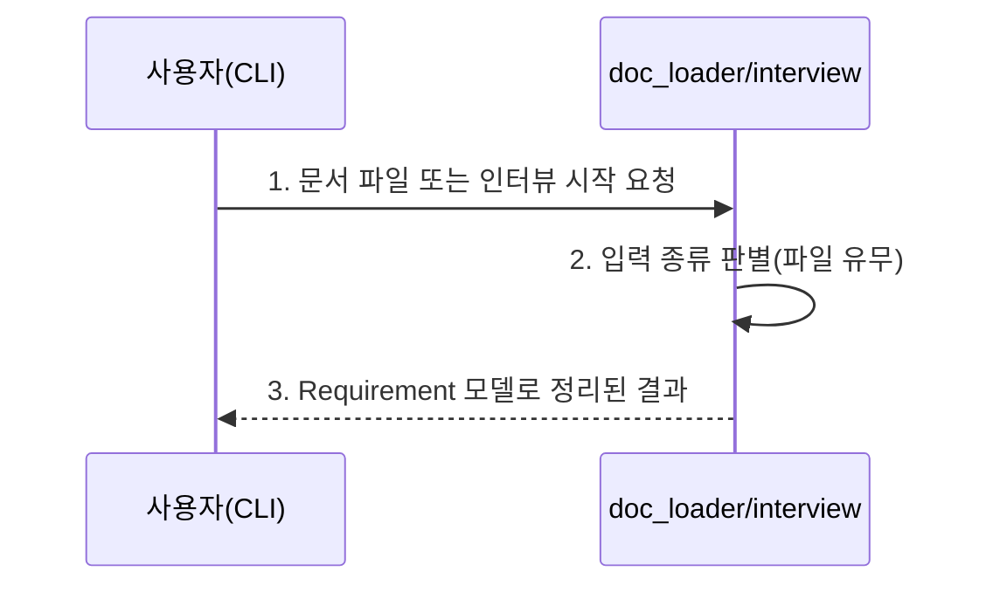
```mermaid
sequenceDiagram
    participant U as 사용자(CLI)
    participant SYS as doc_loader/interview
    U->>SYS: 1. 문서 파일 또는 인터뷰 시작 요청
    SYS->>SYS: 2. 입력 종류 판별(파일 유무)
    SYS-->>U: 3. Requirement 모델로 정리된 결과
```

| # | 설명 |
|---|---|
| 1 | 사용자가 CLI로 문서 파일을 첨부하거나 인터뷰를 시작한다 |
| 2 | 시스템이 파일 유무로 입력 경로를 판별한다 |
| 3 | 어느 경로든 동일한 형식(Requirement 모델)으로 결과를 돌려준다 |

#### REQ-G01-002 — 4종 산출물

- 요약: 사용자 이야기+인수조건, SRS 명세서, AI 작업지시서, 비개발자용 핵심기능 4종을 만든다.
- 상세: 하나의 정본(SpecModel)에서 네 가지 문서를 파생시켜 렌더링한다(REQ-G04-005와 연결). 각 문서는 대상 독자가 다를 뿐 내용의 근거는 같다.
- 담당(레이어/모듈): adapters/render_markdown.py (L4)
- Success Criteria:
  - [ ] 4종 산출물이 모두 생성되며 서로 모순되지 않는다
  - [ ] 정본 변경 시 4종 모두 재생성된다

**Description**

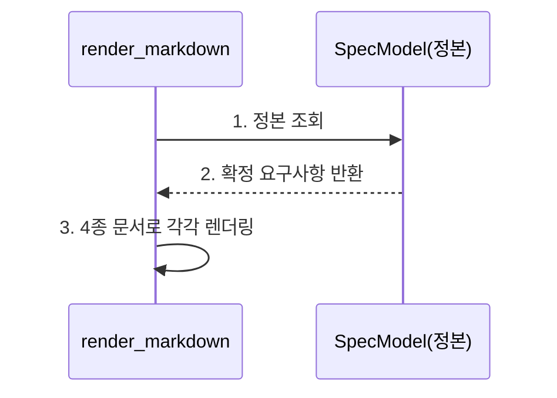
```mermaid
sequenceDiagram
    participant SYS as render_markdown
    participant M as SpecModel(정본)
    SYS->>M: 1. 정본 조회
    M-->>SYS: 2. 확정 요구사항 반환
    SYS->>SYS: 3. 4종 문서로 각각 렌더링
```

| # | 설명 |
|---|---|
| 1 | 렌더러가 정본(SpecModel)을 조회한다 |
| 2 | 정본이 확정된 요구사항 데이터를 돌려준다 |
| 3 | 같은 데이터로 4종 문서(US+AC/SRS/작업지시서/KeyFeature)를 각각 만든다 |

#### REQ-G01-003 — CLI 단독 실행

- 요약: 명령줄 인터페이스만으로 동작하며 OpenWebUI 같은 별도 웹 UI를 전제로 하지 않는다.
- 상세: 실행 환경 의존성을 최소화해, 웹 서버나 브라우저 없이도 전체 파이프라인이 끝까지 동작해야 한다.
- 담당(레이어/모듈): cli/__main__.py (L5)
- Success Criteria:
  - [ ] 웹 UI가 없는 순수 터미널 환경에서 전체 파이프라인이 완주된다

**Description**

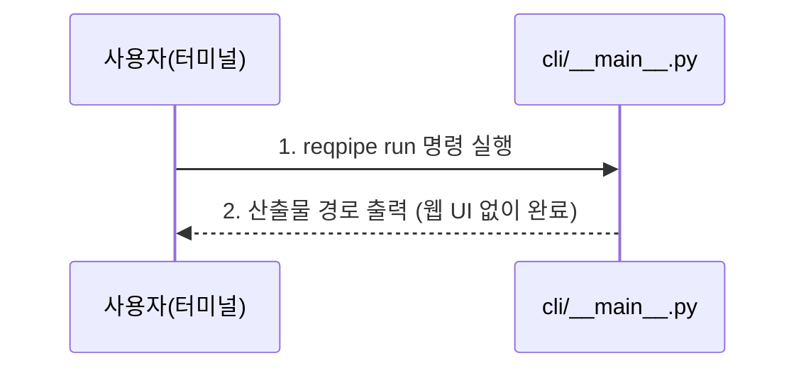
```mermaid
sequenceDiagram
    participant U as 사용자(터미널)
    participant CLI as cli/__main__.py
    U->>CLI: 1. reqpipe run 명령 실행
    CLI-->>U: 2. 산출물 경로 출력 (웹 UI 없이 완료)
```

| # | 설명 |
|---|---|
| 1 | 사용자가 터미널에서 명령을 실행한다 |
| 2 | 브라우저·웹서버 없이 CLI만으로 결과가 나온다 |

#### REQ-G01-004 — 코어/도메인팩 분리 및 명시적 도메인 지정

- 요약: 공통 코어와 도메인 팩(web_internal/android_aaos/mcu_firmware)을 분리하고, 도메인은 CLI 인자로 명시한다.
- 상세: 도메인마다 다른 어휘·규칙을 코어에 섞지 않고 플러그인처럼 분리해, 코어 코드가 특정 분야에 종속되지 않게 한다.
- 담당(레이어/모듈): policy/profile_schema.py (L1)
- Success Criteria:
  - [ ] `--domain` 인자 없이 실행하면 오류로 종료된다(자동 추측 금지)
  - [ ] 도메인 팩 3종이 서로 코드를 공유하지 않고 교체 가능하다

**Description**

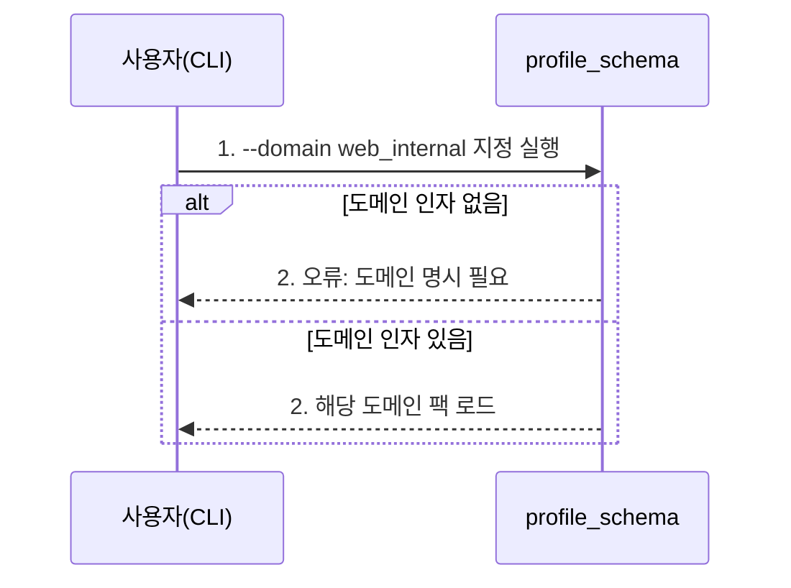
```mermaid
sequenceDiagram
    participant U as 사용자(CLI)
    participant SYS as profile_schema
    U->>SYS: 1. --domain web_internal 지정 실행
    alt 도메인 인자 없음
        SYS-->>U: 2. 오류: 도메인 명시 필요
    else 도메인 인자 있음
        SYS-->>U: 2. 해당 도메인 팩 로드
    end
```

| # | 설명 |
|---|---|
| 1 | 사용자가 CLI 인자로 도메인을 지정해 실행한다 |
| 2 (없음) | 인자가 없으면 추측하지 않고 오류로 중단한다 |
| 2 (있음) | 지정된 도메인 팩만 로드한다 |

#### REQ-G01-005 — 도메인 LLM 위임 금지 + 어휘 하드코딩 금지

- 요약: 도메인 판별을 LLM에 맡기지 않고, 코어에 도메인 전용 단어를 직접 박아넣지 않는다.
- 상세: REQ-G01-004의 분리 원칙을 지키기 위한 금지 규칙. LLM이 "아마 웹 프로젝트인 것 같다"고 추측하는 것도 금지된다.
- 담당(레이어/모듈): policy 전체 + checks/test_leakage.py (L1/L5)
- Success Criteria:
  - [ ] 코어 코드에서 도메인 전용 단어(web/aaos/mcu)가 단어경계 검사로 0건 검출된다
  - [ ] 도메인 판별 로직에 LLM 호출이 없다

**Description**

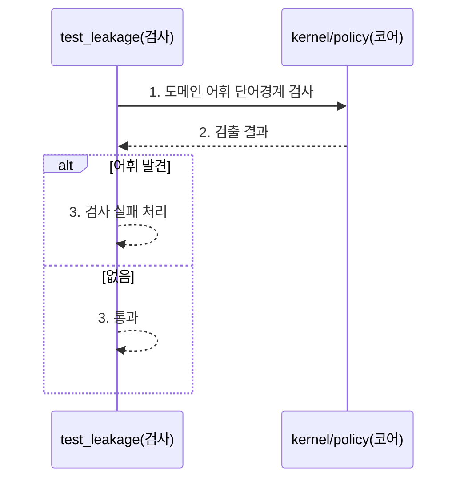
```mermaid
sequenceDiagram
    participant SYS as test_leakage(검사)
    participant CORE as kernel/policy(코어)
    SYS->>CORE: 1. 도메인 어휘 단어경계 검사
    CORE-->>SYS: 2. 검출 결과
    alt 어휘 발견
        SYS-->>SYS: 3. 검사 실패 처리
    else 없음
        SYS-->>SYS: 3. 통과
    end
```

| # | 설명 |
|---|---|
| 1 | 검사 도구가 코어 코드를 훑어 도메인 어휘를 찾는다 |
| 2 | 검출 결과를 받는다 |
| 3 | 하나라도 발견되면 검사를 실패시킨다 |

#### REQ-G01-006 — RAG 인덱스 대상 한정

- 요약: 코드·설정 저장소와 승인 문서만 RAG 대상으로 하고, 티켓·PR은 제외한다.
- 상세: 검색 대상을 신뢰할 수 있는 출처로 한정해, AI가 승인되지 않은 논의(티켓 코멘트 등)를 근거로 쓰지 못하게 막는다.
- 담당(레이어/모듈): adapters/index_hybrid.py (L4)
- Success Criteria:
  - [ ] 인덱싱 대상 목록에 티켓/PR 경로가 0건이다
  - [ ] 승인 문서(SRS/기획서/ADR)만 인덱스에 포함된다

**Description**

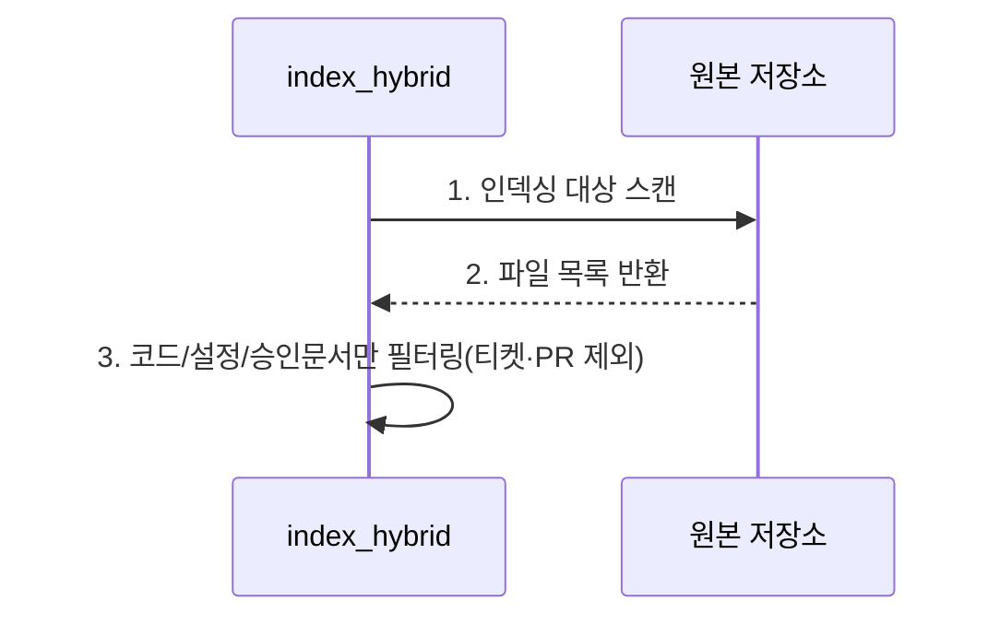
```mermaid
sequenceDiagram
    participant SYS as index_hybrid
    participant SRC as 원본 저장소
    SYS->>SRC: 1. 인덱싱 대상 스캔
    SRC-->>SYS: 2. 파일 목록 반환
    SYS->>SYS: 3. 코드/설정/승인문서만 필터링(티켓·PR 제외)
```

| # | 설명 |
|---|---|
| 1 | 인덱서가 저장소를 스캔한다 |
| 2 | 전체 파일 목록을 받는다 |
| 3 | 허용된 종류(코드·설정·승인문서)만 남기고 나머지는 제외한다 |

## 그룹 2. 요구 수집·슬롯·증거 (G02)

> 담당(레이어/모듈, 공통): adapters/doc_loader.py + kernel/model_requirement.py, model_evidence.py (L4/L0)

#### REQ-G02-001 — 문서 평탄화·병합셀·ID 부여

- 요약: 표를 평탄화하고, 병합셀은 forward-fill하며, 이미지·문장마다 ID를 부여한다.
- 상세: 원문의 표 구조를 한 줄짜리 값으로 펴서(평탄화) 정리하고, 여러 칸이 합쳐진 칸(병합셀)은 빈 칸을 바로 위 값으로 채우며(forward-fill), 그림 자리는 이미지 ID로, 문장마다는 고유 문장 ID로 표시해 나중에 원문을 추적할 수 있게 한다.
- 담당(레이어/모듈): adapters/doc_loader.py (L4)
- Success Criteria:
  - [ ] 모든 표 셀이 평탄화되어 빈 값 없이 채워진다
  - [ ] 모든 문장에 고유 문장 ID가 부여된다
  - [ ] 이미지 자리에 플레이스홀더가 남아 원문 위치를 추적할 수 있다

**Description**

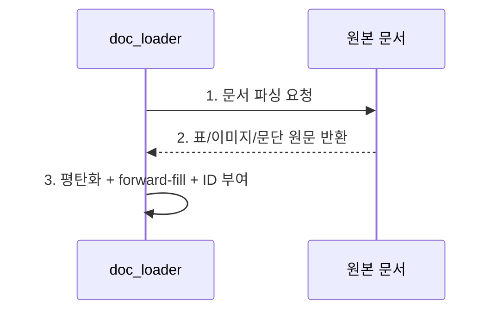
```mermaid
sequenceDiagram
    participant SYS as doc_loader
    participant DOC as 원본 문서
    SYS->>DOC: 1. 문서 파싱 요청
    DOC-->>SYS: 2. 표/이미지/문단 원문 반환
    SYS->>SYS: 3. 평탄화 + forward-fill + ID 부여
```

| # | 설명 |
|---|---|
| 1 | 로더가 원본 문서를 읽는다 |
| 2 | 표·이미지·문단 원문을 받는다 |
| 3 | 평탄화, 병합셀 채움, ID 부여를 순서대로 적용한다 |

#### REQ-G02-002 — 어미 사전 1차 분류 + LLM 위임

- 요약: 어미 사전으로 먼저 분류하고, 판단 안 되는 것만 LLM에 맡긴다.
- 상세: "~해야 한다"류 표현을 규칙(어미 사전)으로 먼저 걸러내 비용과 오류를 줄이고, 애매한 문장만 LLM으로 넘긴다.
- 담당(레이어/모듈): adapters/modality_tagger.py (L4)
- Success Criteria:
  - [ ] 어미 사전으로 분류 가능한 문장은 LLM을 호출하지 않는다
  - [ ] 미해결 문장만 LLM 호출 로그에 남는다

**Description**

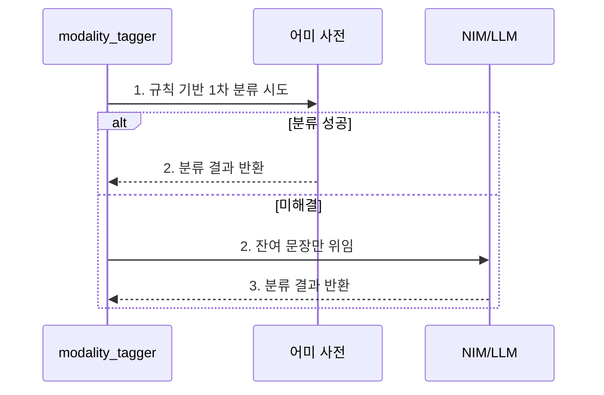
```mermaid
sequenceDiagram
    participant SYS as modality_tagger
    participant DICT as 어미 사전
    participant LLM as NIM/LLM
    SYS->>DICT: 1. 규칙 기반 1차 분류 시도
    alt 분류 성공
        DICT-->>SYS: 2. 분류 결과 반환
    else 미해결
        SYS->>LLM: 2. 잔여 문장만 위임
        LLM-->>SYS: 3. 분류 결과 반환
    end
```

| # | 설명 |
|---|---|
| 1 | 어미 사전으로 먼저 분류를 시도한다 |
| 2 (성공) | 사전만으로 분류되면 그대로 끝난다 |
| 2~3 (미해결) | 안 되는 것만 LLM에 넘겨 결과를 받는다 |

#### REQ-G02-003 — 슬롯 하드코딩 금지, SlotValue 구조

- 요약: 슬롯명을 코드에 고정하지 않고 dict 기반 SlotValue(required/risk/depends_on 포함)로 관리한다.
- 상세: 요구사항 항목 이름을 자유롭게 추가·삭제할 수 있는 구조로 관리해, 새 도메인이 추가돼도 코어 코드를 고치지 않아도 되게 한다.
- 담당(레이어/모듈): kernel/model_requirement.py (L0)
- Success Criteria:
  - [ ] 새 슬롯을 코드 수정 없이 설정만으로 추가할 수 있다
  - [ ] 모든 슬롯에 required/risk/depends_on 속성이 존재한다

**Description**

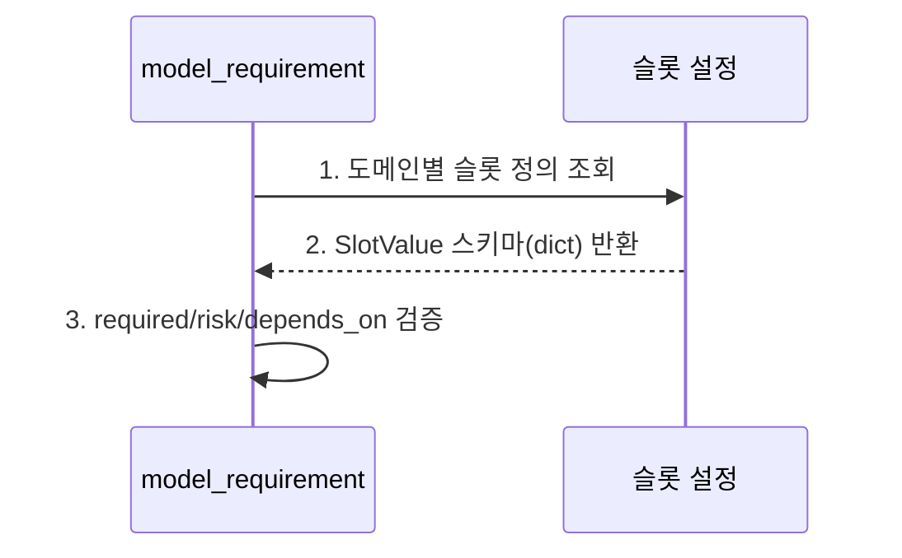
```mermaid
sequenceDiagram
    participant SYS as model_requirement
    participant CFG as 슬롯 설정
    SYS->>CFG: 1. 도메인별 슬롯 정의 조회
    CFG-->>SYS: 2. SlotValue 스키마(dict) 반환
    SYS->>SYS: 3. required/risk/depends_on 검증
```

| # | 설명 |
|---|---|
| 1 | 모델이 슬롯 정의를 설정에서 조회한다 |
| 2 | dict 형태의 SlotValue 스키마를 받는다(하드코딩 없음) |
| 3 | 각 슬롯의 필수/위험도/의존 속성을 검증한다 |

#### REQ-G02-004 — Evidence 5요소 기록

- 요약: 근거마다 출처 위치·스냅샷·커밋·성격·도출방식을 기록한다.
- 상세: 모든 근거(Evidence)에 원본 위치(source_uri), 시점 스냅샷, 커밋 해시, 규범/서술 구분(nature), 원문그대로/가공/추론 구분(derivation)을 남겨 추적 가능성을 확보한다.
- 담당(레이어/모듈): kernel/model_evidence.py (L0)
- Success Criteria:
  - [ ] 5개 필드가 모두 채워지지 않으면 Evidence 생성이 거부된다

**Description**

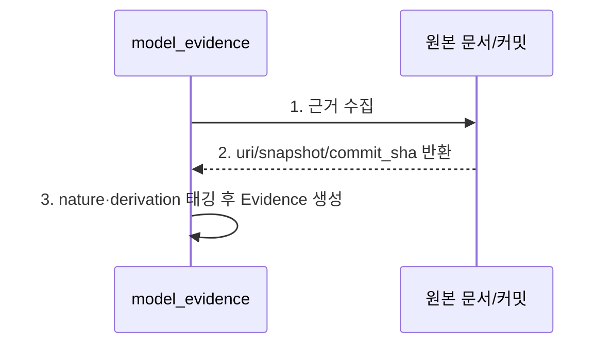
```mermaid
sequenceDiagram
    participant SYS as model_evidence
    participant SRC as 원본 문서/커밋
    SYS->>SRC: 1. 근거 수집
    SRC-->>SYS: 2. uri/snapshot/commit_sha 반환
    SYS->>SYS: 3. nature·derivation 태깅 후 Evidence 생성
```

| # | 설명 |
|---|---|
| 1 | 근거를 원본에서 수집한다 |
| 2 | 위치·스냅샷·커밋 정보를 받는다 |
| 3 | 성격과 도출방식을 태깅해 Evidence 레코드를 완성한다 |

#### REQ-G02-005 — descriptive 근거 단독 자동채택 금지

- 요약: 서술적(descriptive) 근거 하나만으로 자동 확정하지 않고, 승인 문서만 최고 신뢰등급(A밴드)으로 인정한다.
- 상세: 설명 글은 참고는 되지만 확정 근거가 될 수 없으며, 공식 승인을 받은 문서만 가장 신뢰할 수 있는 등급으로 취급한다.
- 담당(레이어/모듈): policy/gate_l1_rules.py (L1)
- Success Criteria:
  - [ ] descriptive 근거만 있는 요구사항은 G1 게이트를 통과하지 못한다

**Description**

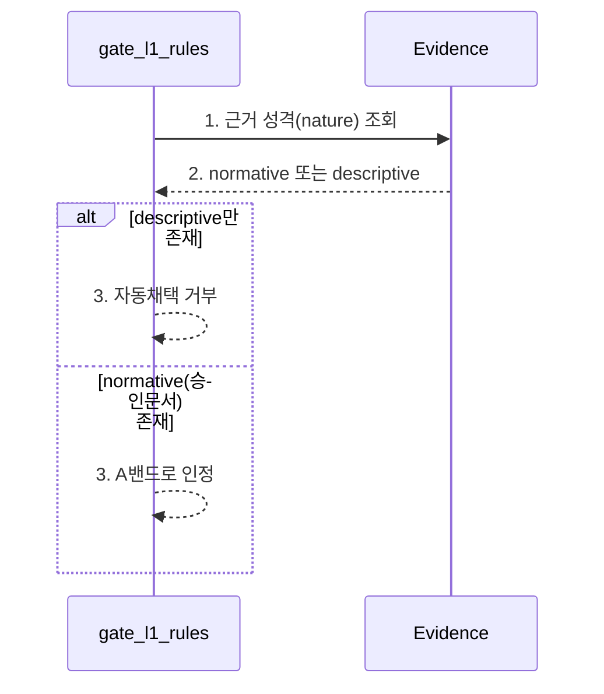
```mermaid
sequenceDiagram
    participant SYS as gate_l1_rules
    participant EV as Evidence
    SYS->>EV: 1. 근거 성격(nature) 조회
    EV-->>SYS: 2. normative 또는 descriptive
    alt descriptive만 존재
        SYS-->>SYS: 3. 자동채택 거부
    else normative(승인문서) 존재
        SYS-->>SYS: 3. A밴드로 인정
    end
```

| # | 설명 |
|---|---|
| 1 | 게이트 규칙이 근거의 성격을 확인한다 |
| 2 | 규범적(normative)인지 서술적(descriptive)인지 판정받는다 |
| 3 | 서술적 근거만 있으면 거부, 승인 문서면 최고 등급으로 인정 |

#### REQ-G02-006 — 출처 없는 값 진입 금지, 인터뷰도 증거화

- 요약: 출처 없는 값을 산출물에 넣지 않고, 인터뷰 답변도 근거로 기록한다.
- 상세: 대화로 얻은 답도 문서만큼 추적 가능하게 evidence로 남겨야, 나중에 "이 값이 왜 여기 있는지" 설명할 수 있다.
- 담당(레이어/모듈): kernel/model_evidence.py + app/interview_session.py (L0/L3)
- Success Criteria:
  - [ ] Evidence가 연결되지 않은 값은 산출물 렌더링에서 제외된다
  - [ ] 인터뷰 답변 100%가 `interview://` 출처로 기록된다

**Description**

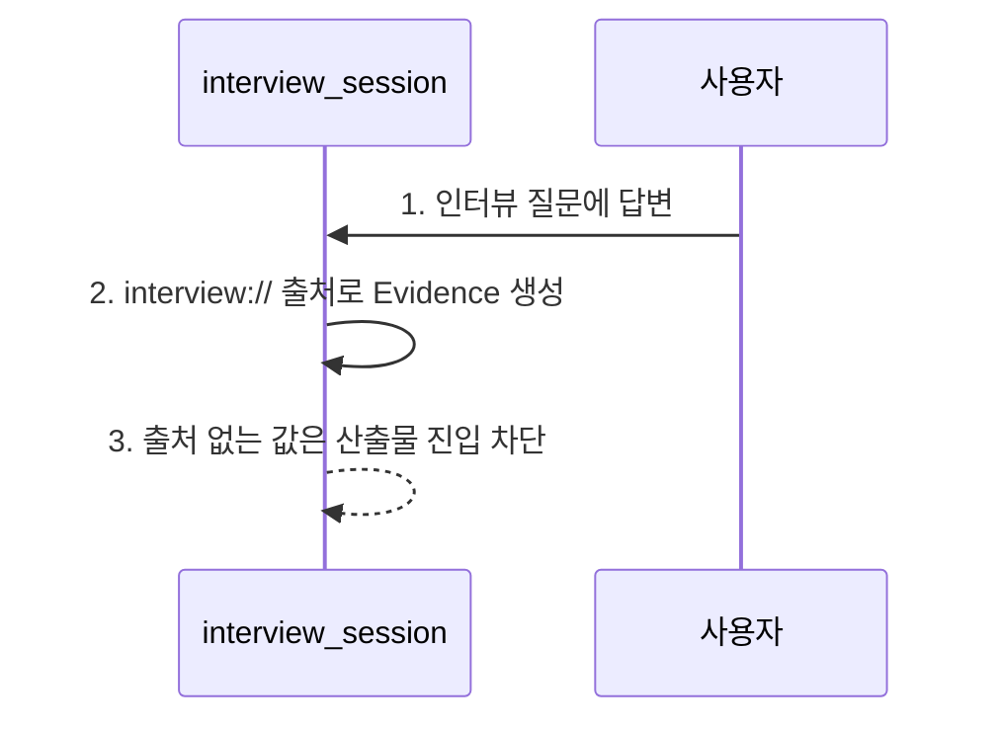
```mermaid
sequenceDiagram
    participant SYS as interview_session
    participant U as 사용자
    U->>SYS: 1. 인터뷰 질문에 답변
    SYS->>SYS: 2. interview:// 출처로 Evidence 생성
    SYS-->>SYS: 3. 출처 없는 값은 산출물 진입 차단
```

| # | 설명 |
|---|---|
| 1 | 사용자가 인터뷰 질문에 답한다 |
| 2 | 답변을 근거(Evidence)로 기록한다 |
| 3 | 근거 없는 값은 어떤 값이든 산출물에 들어가지 못한다 |

#### REQ-G02-007 — 원형 보존 + BM25/임베딩 하이브리드 검색

- 요약: 설정키·플래그 원형을 보존한 채, 단어검색(BM25)과 의미검색(임베딩)을 함께 쓰는 결정적 순서 검색을 제공한다.
- 상세: 검색 정확도를 높이기 위해 단어 일치(BM25)와 의미 유사도(임베딩) 검색을 결합하되, 원본 설정값 표기는 바꾸지 않고, 같은 질의는 항상 같은 순서로 결과가 나오게 한다.
- 담당(레이어/모듈): adapters/index_hybrid.py (L4)
- Success Criteria:
  - [ ] 동일 질의 반복 시 결과 순서가 항상 동일하다
  - [ ] 설정키/플래그 원문이 검색 색인 전후로 변형되지 않는다

**Description**

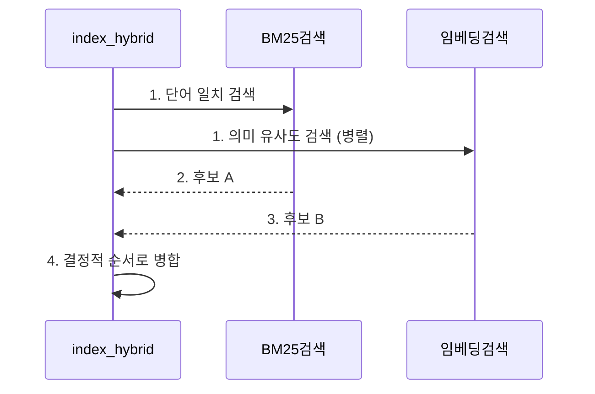
```mermaid
sequenceDiagram
    participant SYS as index_hybrid
    participant BM as BM25검색
    participant EMB as 임베딩검색
    SYS->>BM: 1. 단어 일치 검색
    SYS->>EMB: 1. 의미 유사도 검색 (병렬)
    BM-->>SYS: 2. 후보 A
    EMB-->>SYS: 3. 후보 B
    SYS->>SYS: 4. 결정적 순서로 병합
```

| # | 설명 |
|---|---|
| 1 | BM25(단어)와 임베딩(의미) 검색을 동시에 수행한다 |
| 2~3 | 두 검색기의 후보를 각각 받는다 |
| 4 | 항상 같은 규칙으로 병합해 순서를 고정한다 |

## 그룹 3. 가정·질문·인터뷰·승인 (G03)

> 담당(레이어/모듈, 공통): app/question_engine.py, app/interview_session.py, app/provisional.py (L3)

#### REQ-G03-001 — Assumption 등급·Provisional 표식

- 요약: 가정마다 safe/risky 등급과 잠정(Provisional) 표식·전파 기록을 관리한다.
- 상세: 답이 없어 일단 "이렇다 치고" 진행하는 가정을 위험도별로 구분하고, 임시 확정 상태가 다른 요구사항에 어떻게 퍼졌는지도 함께 기록한다.
- 담당(레이어/모듈): kernel/model_assumption.py (L0)
- Success Criteria:
  - [ ] 모든 가정에 safe/risky 등급이 존재한다
  - [ ] Provisional 표식이 있는 항목은 전파 대상 목록을 함께 가진다

**Description**

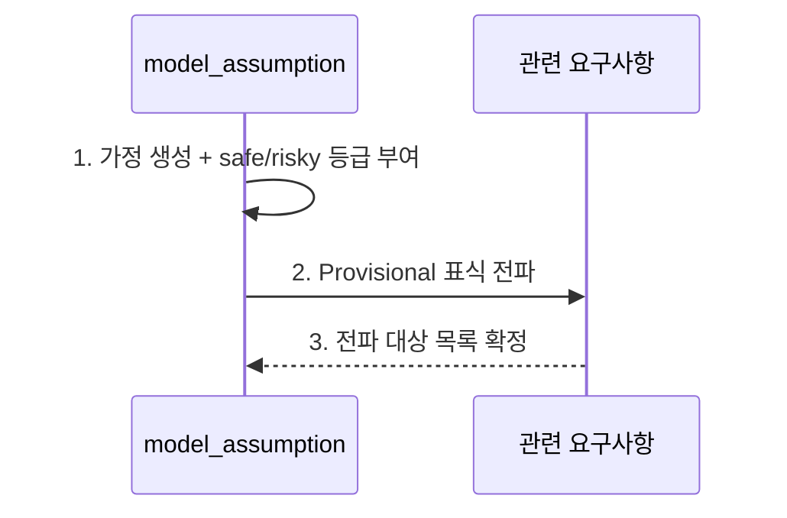
```mermaid
sequenceDiagram
    participant SYS as model_assumption
    participant REQ as 관련 요구사항
    SYS->>SYS: 1. 가정 생성 + safe/risky 등급 부여
    SYS->>REQ: 2. Provisional 표식 전파
    REQ-->>SYS: 3. 전파 대상 목록 확정
```

| # | 설명 |
|---|---|
| 1 | 가정을 만들며 위험도 등급을 매긴다 |
| 2 | 잠정 상태임을 관련 요구사항에 퍼뜨린다 |
| 3 | 어디까지 퍼졌는지 목록으로 확정한다 |

#### REQ-G03-002 — 고객 대기 임시확정·전파·릴리스 차단

- 요약: 고객 응답 대기 항목을 임시 확정하고 전파하되, 릴리스는 막는다.
- 상세: 고객 답변을 기다리는 동안 작업이 멈추지 않도록 임시값으로 진행하지만, 이 값이 하나라도 남아있으면 최종 출시(릴리스)는 허용하지 않는다.
- 담당(레이어/모듈): app/provisional.py (L3)
- Success Criteria:
  - [ ] Provisional 1건 이상 존재 시 REQ-G05-006(릴리스 게이트)이 실패한다

**Description**

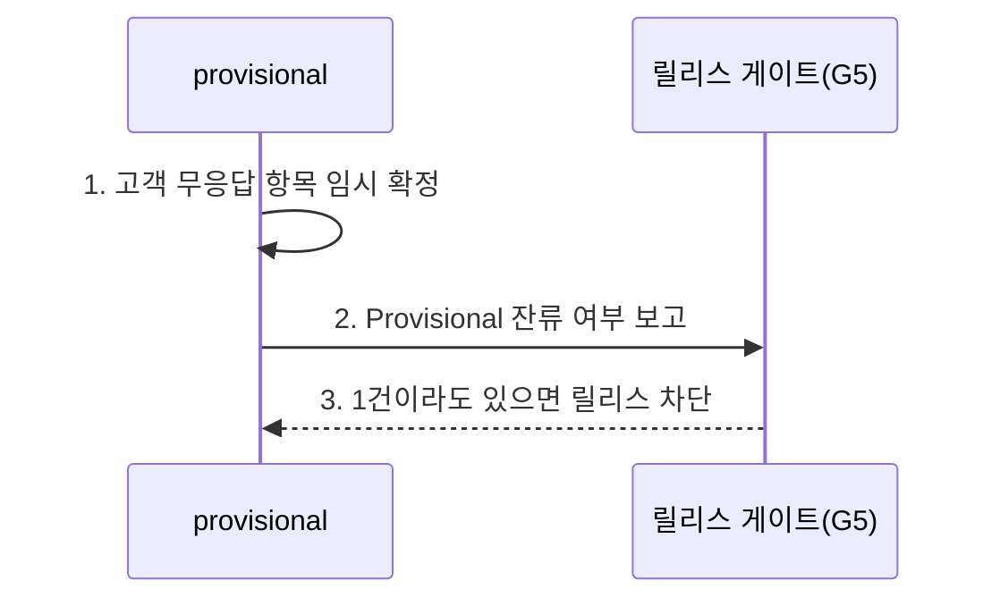
```mermaid
sequenceDiagram
    participant SYS as provisional
    participant REL as 릴리스 게이트(G5)
    SYS->>SYS: 1. 고객 무응답 항목 임시 확정
    SYS->>REL: 2. Provisional 잔류 여부 보고
    REL-->>SYS: 3. 1건이라도 있으면 릴리스 차단
```

| # | 설명 |
|---|---|
| 1 | 응답을 기다리는 항목을 임시로 확정해 진행을 이어간다 |
| 2 | 릴리스 게이트에 잔류 여부를 알린다 |
| 3 | 하나라도 남아있으면 출시를 막는다 |

#### REQ-G03-003 — 질문 Top-3+추천, score·MMR

- 요약: 질문을 상위 3개+추천 1개로 만들고, 점수와 MMR 중복제거를 적용한다.
- 상세: 영향도·불확실성·차단정도에서 비용을 뺀 점수(score)로 순위를 매기고, 비슷한 질문이 중복 노출되지 않도록 다양성 재순위(MMR)를 적용한다.
- 담당(레이어/모듈): app/question_engine.py (L3)
- Success Criteria:
  - [ ] 매 질의마다 옵션이 정확히 3개+추천 1개로 생성된다
  - [ ] 상위 후보 간 MMR 유사도가 임계값 이하로 유지된다

**Description**

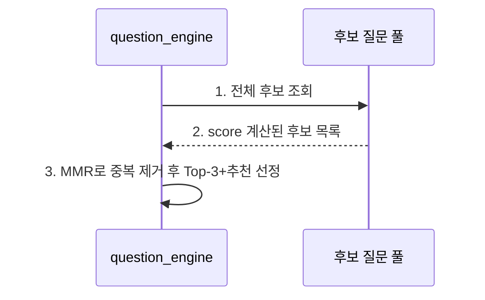
```mermaid
sequenceDiagram
    participant SYS as question_engine
    participant CAND as 후보 질문 풀
    SYS->>CAND: 1. 전체 후보 조회
    CAND-->>SYS: 2. score 계산된 후보 목록
    SYS->>SYS: 3. MMR로 중복 제거 후 Top-3+추천 선정
```

| # | 설명 |
|---|---|
| 1 | 질문 엔진이 후보 풀을 조회한다 |
| 2 | 점수가 매겨진 후보를 받는다 |
| 3 | 중복을 제거하고 상위 3개+추천을 뽑는다 |

#### REQ-G03-004 — depends_on 보류, 동점 선언순, 난수 금지

- 요약: 의존 관계가 있는 질문은 보류하고, 동점은 등록 순서로, 순서 결정에 난수를 쓰지 않는다.
- 상세: 재현 가능한 결과를 위해 질문 순서 결정 로직에서 무작위성을 완전히 배제한다.
- 담당(레이어/모듈): app/question_engine.py (L3)
- Success Criteria:
  - [ ] 동일 입력 재실행 시 질문 순서가 항상 동일하다(diff 0건)

**Description**

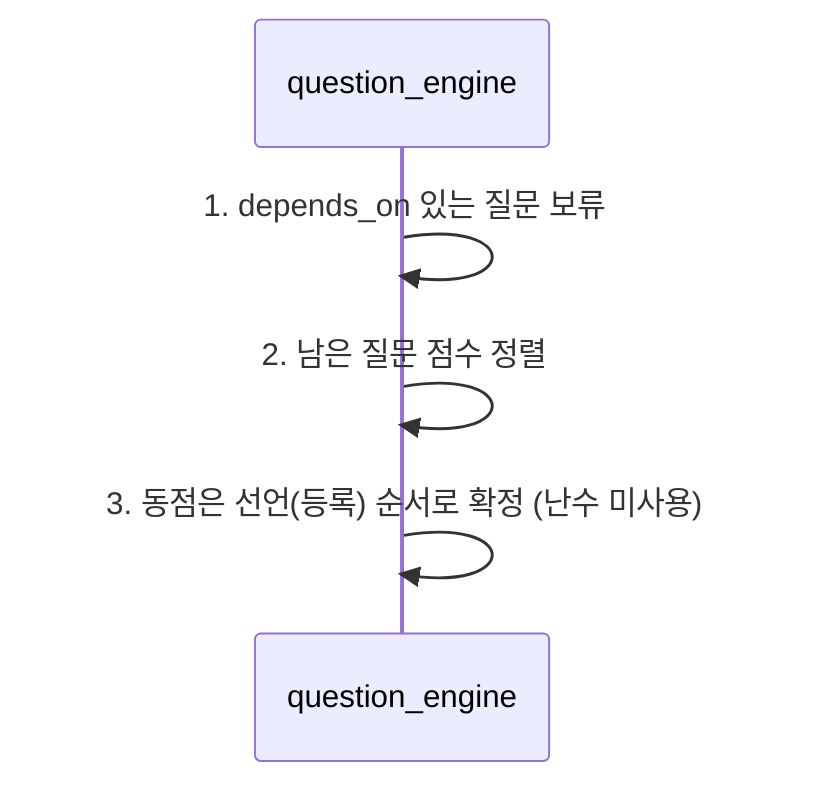
```mermaid
sequenceDiagram
    participant SYS as question_engine
    SYS->>SYS: 1. depends_on 있는 질문 보류
    SYS->>SYS: 2. 남은 질문 점수 정렬
    SYS->>SYS: 3. 동점은 선언(등록) 순서로 확정 (난수 미사용)
```

| # | 설명 |
|---|---|
| 1 | 다른 항목에 의존하는 질문은 뒤로 미룬다 |
| 2 | 나머지를 점수로 정렬한다 |
| 3 | 점수가 같으면 등록된 순서를 쓴다(난수 금지) |

#### REQ-G03-005 — 인터뷰 최대 5턴, interview:// 근거

- 요약: 대화형 확인을 최대 5턴으로 제한하고, 답변을 interview:// 출처로 기록한다.
- 상세: 인터뷰가 끝없이 이어지지 않도록 상한을 두고, 5턴을 넘기면 남은 항목은 질문 큐로 전환한다.
- 담당(레이어/모듈): app/interview_session.py (L3)
- Success Criteria:
  - [ ] 6번째 턴이 시작되지 않고 5턴에서 자동 종료된다

**Description**

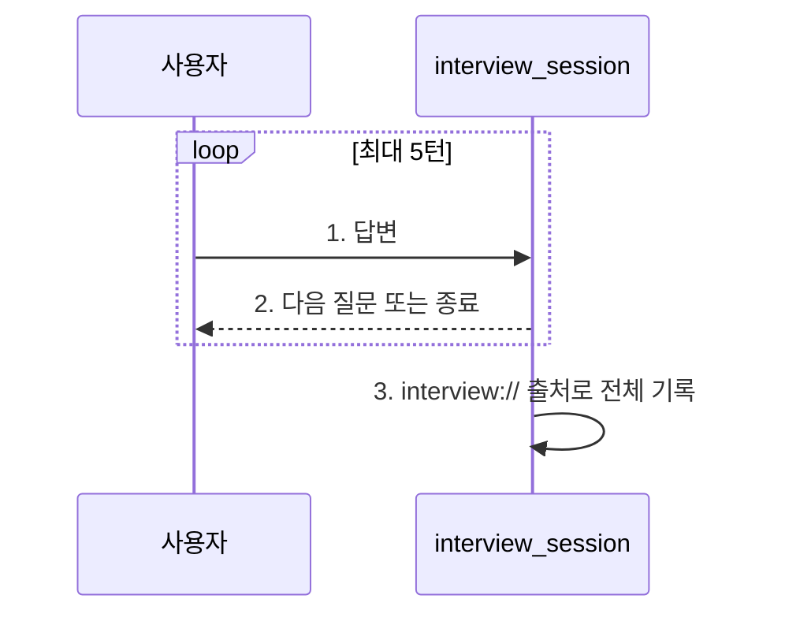
```mermaid
sequenceDiagram
    participant U as 사용자
    participant SYS as interview_session
    loop 최대 5턴
        U->>SYS: 1. 답변
        SYS-->>U: 2. 다음 질문 또는 종료
    end
    SYS->>SYS: 3. interview:// 출처로 전체 기록
```

| # | 설명 |
|---|---|
| 1~2 | 최대 5번까지 질문·답변을 주고받는다 |
| 3 | 전체 대화를 근거로 기록한다 |

#### REQ-G03-006 — 무응답 시 추천안 채택, 보안/법규는 BLOCKED 유지

- 요약: 응답이 없으면 추천안을 가정으로 채택하되, 보안·법규·정합성 문제는 계속 막힘 상태로 둔다.
- 상세: 일반적인 질문은 무응답 시 추천값으로 넘어가지만, 위험도가 높은 항목(보안·법규 관련)은 절대 임의로 진행시키지 않는다.
- 담당(레이어/모듈): app/question_engine.py + policy/timer_policy.py (L3/L1)
- Success Criteria:
  - [ ] 일반 항목은 타임아웃 시 추천안으로 자동 진행된다
  - [ ] 보안/법규 항목은 타임아웃 후에도 BLOCKED 상태를 유지한다

**Description**

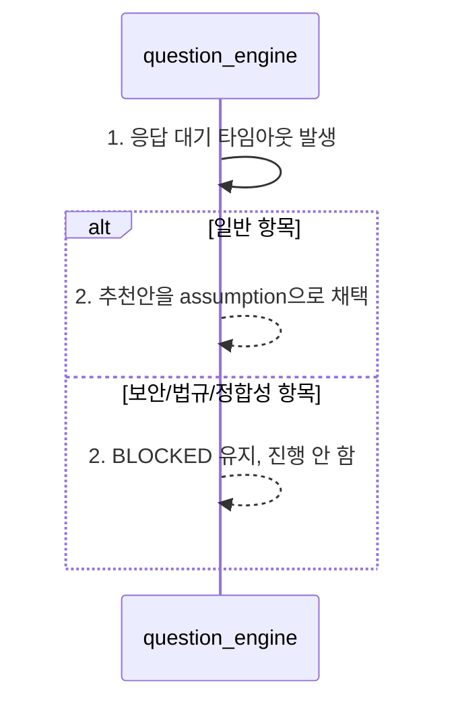
```mermaid
sequenceDiagram
    participant SYS as question_engine
    SYS->>SYS: 1. 응답 대기 타임아웃 발생
    alt 일반 항목
        SYS-->>SYS: 2. 추천안을 assumption으로 채택
    else 보안/법규/정합성 항목
        SYS-->>SYS: 2. BLOCKED 유지, 진행 안 함
    end
```

| # | 설명 |
|---|---|
| 1 | 응답 대기 시간이 지난다 |
| 2 (일반) | 추천안으로 임시 채택하고 진행한다 |
| 2 (위험) | 절대 임의 진행하지 않고 막힌 상태를 유지한다 |

#### REQ-G03-007 — 고객 질문은 카카오링크, 내부 단일 승인자

- 요약: 고객 대상 질문은 카카오톡 링크로, 내부는 단 한 명의 승인자가 승인한다.
- 상세: 대외 채널(카카오링크)과 대내 채널(내부 단일 승인자)을 명확히 분리해, 승인 권한이 여러 사람에게 흩어지지 않게 한다.
- 담당(레이어/모듈): adapters/notify_kakao_manual.py (L4)
- Success Criteria:
  - [ ] 고객용 질문은 100% 카카오링크 경로로만 나간다
  - [ ] 내부 승인 기록에 승인자가 항상 1명으로 고정된다

**Description**

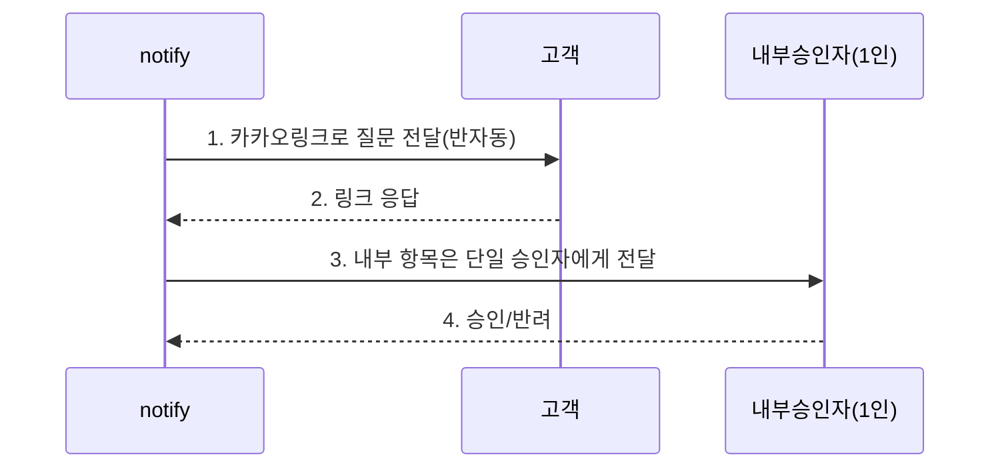
```mermaid
sequenceDiagram
    participant SYS as notify
    participant C as 고객
    participant I as 내부승인자(1인)
    SYS->>C: 1. 카카오링크로 질문 전달(반자동)
    C-->>SYS: 2. 링크 응답
    SYS->>I: 3. 내부 항목은 단일 승인자에게 전달
    I-->>SYS: 4. 승인/반려
```

| # | 설명 |
|---|---|
| 1~2 | 고객용 질문은 카카오링크로만 오간다 |
| 3~4 | 내부용 질문은 정해진 한 명의 승인자만 처리한다 |

#### REQ-G03-008 — customer 항목 내부 큐 비노출

- 요약: 고객용 질문 항목을 내부 CLI 대기열에 노출하지 않는다.
- 상세: 고객이 볼 내용과 내부 담당자가 볼 내용을 분리해, 내부 큐 조회만으로 고객 관련 민감 질문이 새어나가지 않게 한다.
- 담당(레이어/모듈): cli/commands_ask.py (L5)
- Success Criteria:
  - [ ] `reqpipe ask` 내부 큐 조회 결과에 audience=customer 항목이 0건이다

**Description**

```mermaid
sequenceDiagram
    participant U as 내부 사용자(CLI)
    participant SYS as commands_ask
    U->>SYS: 1. ask 큐 조회
    SYS->>SYS: 2. audience=internal만 필터링
    SYS-->>U: 3. 내부용 질문만 반환
```

| # | 설명 |
|---|---|
| 1 | 내부 사용자가 질문 큐를 조회한다 |
| 2 | 고객용 항목을 걸러낸다 |
| 3 | 내부용만 보여준다 |

#### REQ-G03-009 — 반자동 알림(생성까지만), 발송은 사람

- 요약: 메시지·링크 생성까지는 시스템이 하고, 실제 발송은 사람이 한다.
- 상세: 전송 전 사람의 최종 확인을 강제해, 자동화가 실수로 잘못된 내용을 발송하는 사고를 막는다.
- 담당(레이어/모듈): adapters/notify_kakao_manual.py (L4)
- Success Criteria:
  - [ ] 시스템이 자동으로 카카오톡을 직접 발송하는 코드 경로가 없다(사람의 클릭이 항상 개입)

**Description**

```mermaid
sequenceDiagram
    participant SYS as notify_kakao_manual
    participant U as 담당자(사람)
    participant C as 고객
    SYS->>SYS: 1. 메시지+링크 초안 생성
    SYS-->>U: 2. 초안 확인 요청
    U->>C: 3. 사람이 직접 발송
```

| # | 설명 |
|---|---|
| 1 | 시스템이 메시지와 링크까지만 만든다 |
| 2 | 담당자에게 확인을 요청한다 |
| 3 | 최종 발송은 반드시 사람이 수행한다 |

## 그룹 4. 추적·결정·산출물 (G04)

> 담당(레이어/모듈, 공통): app/trace_service.py, kernel/model_trace.py, kernel/model_decision.py (L3/L0)

#### REQ-G04-001 — 추적 그래프 생성·질의·영향분석

- 요약: TraceNode/TraceEdge와 관계 종류(derives/verifies/implements/conflicts/assumes)로 추적 그래프를 만들고 조회·영향분석한다.
- 상세: 요구사항 간의 관계를 그래프로 관리해, "이걸 바꾸면 무엇이 영향받는가"를 자동으로 추적할 수 있게 한다.
- 담당(레이어/모듈): app/trace_service.py (L3)
- Success Criteria:
  - [ ] 임의의 노드 변경 시 영향받는 노드 목록을 1초 내로 조회할 수 있다

**Description**

```mermaid
sequenceDiagram
    participant U as 사용자
    participant SYS as trace_service
    U->>SYS: 1. 특정 요구사항 변경 영향 질의
    SYS->>SYS: 2. 그래프 순회(derives/verifies/...)
    SYS-->>U: 3. 영향받는 노드 목록 반환
```

| # | 설명 |
|---|---|
| 1 | 사용자가 영향 분석을 요청한다 |
| 2 | 추적 서비스가 관계 그래프를 순회한다 |
| 3 | 영향받는 항목 목록을 돌려준다 |

#### REQ-G04-002 — 멱등 해시 ID, 난수 금지

- 요약: 동일 입력 재호출 시 동일 ID가 나오는 해시 기반 식별자를 쓰고 난수를 쓰지 않는다.
- 상세: ReqId/EvId/RunId/NodeId를 해시로 생성해, 같은 입력을 다시 처리해도 항상 같은 ID가 나오게(멱등) 만든다.
- 담당(레이어/모듈): kernel/ids.py (L0)
- Success Criteria:
  - [ ] 동일 입력으로 100회 재실행해도 ID가 항상 동일하다

**Description**

```mermaid
sequenceDiagram
    participant SYS as ids.py
    participant IN as 입력 데이터
    SYS->>IN: 1. 입력 내용 조회
    IN-->>SYS: 2. 원문 반환
    SYS->>SYS: 3. 해시 계산 → ID 생성 (난수 미사용)
```

| # | 설명 |
|---|---|
| 1~2 | 입력 내용을 가져온다 |
| 3 | 해시로만 ID를 만들어 재현성을 보장한다 |

#### REQ-G04-003 — DecisionRecord 전체 필드

- 요약: 결정 기록에 3안+추천+선택+근거+승인자+확정시각을 남긴다.
- 상세: 모든 결정이 "왜, 누가, 언제" 확정했는지 완전히 추적 가능하도록 7개 필드를 빠짐없이 기록한다.
- 담당(레이어/모듈): kernel/model_decision.py (L0)
- Success Criteria:
  - [ ] 7개 필드 중 하나라도 비어있으면 DecisionRecord 생성이 거부된다

**Description**

```mermaid
sequenceDiagram
    participant SYS as model_decision
    participant I as 승인자
    SYS->>I: 1. 3안+추천 제시
    I-->>SYS: 2. 선택 + 근거 전달
    SYS->>SYS: 3. 승인자·시각 포함해 DecisionRecord 확정
```

| # | 설명 |
|---|---|
| 1 | 승인자에게 3가지 안과 추천을 보여준다 |
| 2 | 승인자가 선택과 근거를 준다 |
| 3 | 전체를 기록으로 확정한다 |

#### REQ-G04-004 — 동일 상위 파생 모순은 상위 문제로 판정

- 요약: 같은 상위 항목에서 파생된 두 항목이 모순되면 상위 항목을 원인으로 본다.
- 상세: 하위 항목끼리 다투게 두지 않고, 공통 원인인 상위 요구사항을 다시 검토하도록 되돌린다(루프백).
- 담당(레이어/모듈): policy/loopback_rules.py (L1)
- Success Criteria:
  - [ ] 모순 탐지 시 루프백 대상이 항상 공통 상위 노드로 지정된다

**Description**

```mermaid
sequenceDiagram
    participant SYS as loopback_rules
    participant A as 하위항목A
    participant B as 하위항목B
    SYS->>A: 1. 두 항목 비교
    SYS->>B: 1. 두 항목 비교
    SYS->>SYS: 2. 모순 탐지
    SYS-->>SYS: 3. 공통 상위 항목으로 루프백
```

| # | 설명 |
|---|---|
| 1 | 같은 상위에서 나온 두 하위 항목을 비교한다 |
| 2 | 서로 모순됨을 탐지한다 |
| 3 | 하위가 아니라 상위 항목으로 되돌린다 |

#### REQ-G04-005 — 단일 정본에서 4종 파생

- 요약: 단 하나의 정본(SpecModel)에서 4종 산출물을 파생해 렌더링한다.
- 상세: REQ-G01-002와 연결되는 규칙으로, 정본이 아닌 다른 곳에서 산출물을 만들 수 없게 한다.
- 담당(레이어/모듈): kernel/model_artifact.py (L0)
- Success Criteria:
  - [ ] 4종 산출물 모두 동일한 SpecModel 버전에서 생성되었음이 기록된다

**Description**

```mermaid
sequenceDiagram
    participant SYS as model_artifact
    participant SPEC as SpecModel(정본)
    SYS->>SPEC: 1. 정본 버전 조회
    SPEC-->>SYS: 2. 확정 데이터 반환
    SYS->>SYS: 3. 4종 산출물 각각 파생
```

| # | 설명 |
|---|---|
| 1 | 정본의 현재 버전을 조회한다 |
| 2 | 확정된 데이터를 받는다 |
| 3 | 이 데이터로만 4종을 만든다(다른 출처 금지) |

#### REQ-G04-006 — 다이어그램 텍스트(.mmd) 산출, 바이너리 금지

- 요약: 다이어그램을 텍스트(.mmd) 형식으로만 만들고 그림 파일(바이너리)에 의존하지 않는다.
- 상세: 텍스트 형식이라야 버전 관리 도구로 변경 내용을 한 줄씩 비교(diff)할 수 있다.
- 담당(레이어/모듈): adapters/render_diagram.py (L4)
- Success Criteria:
  - [ ] 산출된 다이어그램 파일이 전부 `.mmd` 텍스트이며 `git diff`로 변경 내용이 보인다

**Description**

```mermaid
sequenceDiagram
    participant SYS as render_diagram
    participant SPEC as SpecModel
    SYS->>SPEC: 1. 구조 데이터 조회
    SPEC-->>SYS: 2. 노드/관계 반환
    SYS->>SYS: 3. .mmd 텍스트로 산출(바이너리 미사용)
```

| # | 설명 |
|---|---|
| 1~2 | 다이어그램에 필요한 구조 데이터를 가져온다 |
| 3 | 텍스트 파일로만 만든다 |

## 그룹 5. 파이프라인·게이트·루프백 (G05)

> 담당(레이어/모듈, 공통): app/graph_build.py, app/stages/*.py, app/gates/*.py (L3)

#### REQ-G05-001 — S0~S11 12단계 순차 실행

- 요약: 환경 준비부터 릴리스까지 12단계를 정해진 순서로 실행한다.
- 상세: 각 단계는 앞 단계의 결과물을 입력으로 받아야만 시작할 수 있다(임의 순서·건너뛰기 금지).
- 담당(레이어/모듈): app/graph_build.py (L3)
- Success Criteria:
  - [ ] 단계를 건너뛰고 실행을 시도하면 즉시 오류로 중단된다

**Description**

```mermaid
sequenceDiagram
    participant SYS as graph_build
    loop S0부터 S11까지
        SYS->>SYS: 1. 이전 단계 산출물 확인
        SYS->>SYS: 2. 다음 단계 실행
    end
```

| # | 설명 |
|---|---|
| 1 | 이전 단계가 끝났는지 확인한다 |
| 2 | 확인되면 다음 단계로 진행한다(순서 고정) |

#### REQ-G05-002 — 5개 게이트 통과 필수

- 요약: G1 완결성, G2 미확정 0건, G3 계약완비, G4 TODO-테스트연결, G5 수락기준을 각각 만족해야 진행한다.
- 상세: 각 게이트는 특정 단계 사이의 품질 관문으로, 하나라도 통과하지 못하면 다음 단계로 넘어갈 수 없다.
- 담당(레이어/모듈): app/gates/*.py (L3)
- Success Criteria:
  - [ ] 5개 게이트 각각에 독립적인 판정 로직과 테스트가 존재한다

**Description**

```mermaid
sequenceDiagram
    participant SYS as gates
    SYS->>SYS: 1. 현재 게이트 조건 평가
    alt 통과
        SYS-->>SYS: 2. 다음 단계 진입 허용
    else 미달
        SYS-->>SYS: 2. 진행 차단, 사유 반환
    end
```

| # | 설명 |
|---|---|
| 1 | 게이트가 조건을 평가한다 |
| 2 | 통과하면 진행, 아니면 차단하고 이유를 알린다 |

#### REQ-G05-003 — 루프백 12케이스 규칙표, LLM 판정 금지

- 요약: 되돌아갈지 여부는 정해진 12가지 규칙으로만 판정하며 LLM이 판단하지 않는다.
- 상세: 재현성과 신뢰성을 위해 루프백 판정을 결정적 규칙표로 고정한다.
- 담당(레이어/모듈): policy/loopback_rules.py (L1)
- Success Criteria:
  - [ ] 루프백 판정 코드 경로에 LLM 호출이 0건이다

**Description**

```mermaid
sequenceDiagram
    participant SYS as loopback_rules
    participant DEF as 결함
    SYS->>DEF: 1. 결함 유형 조회
    DEF-->>SYS: 2. 유형 반환
    SYS->>SYS: 3. 12케이스 규칙표 매칭(LLM 미사용)
```

| # | 설명 |
|---|---|
| 1~2 | 발생한 결함의 유형을 확인한다 |
| 3 | 규칙표에서 매칭되는 케이스를 찾아 되돌릴 층을 정한다 |

#### REQ-G05-004 — 동일 결함 2회 재발 시 강제 승격

- 요약: 같은 결함이 두 번 반복되면 한 단계 위로 강제로 끌어올린다.
- 상세: 같은 층에서 계속 고쳐도 재발하면, 더 상위 원인이 있다고 보고 자동으로 상위 검토를 강제한다.
- 담당(레이어/모듈): policy/loopback_rules.py (L1)
- Success Criteria:
  - [ ] 동일 결함 ID가 2회 재발 시 자동으로 상위 계층 루프백이 트리거된다

**Description**

```mermaid
sequenceDiagram
    participant SYS as loopback_rules
    SYS->>SYS: 1. 결함 재발 카운트 확인
    alt 2회 이상
        SYS-->>SYS: 2. 상위 계층으로 강제 승격
    else 1회
        SYS-->>SYS: 2. 동일 계층에서 재시도
    end
```

| # | 설명 |
|---|---|
| 1 | 같은 결함이 몇 번째인지 센다 |
| 2 | 2회째면 강제로 상위로, 아니면 같은 층에서 재시도 |

#### REQ-G05-005 — 자기보고 금지, 미검증 TODO 완료 금지

- 요약: 진행률을 스스로 보고하지 않고, 테스트 없는 TODO를 완료 처리하지 않는다.
- 상세: "다 됐다"는 판단을 시스템 스스로 내리지 않고, 반드시 테스트 통과라는 객관적 증거로만 완료를 인정한다.
- 담당(레이어/모듈): app/gates/g4_impl.py (L3)
- Success Criteria:
  - [ ] 연결된 테스트가 없는 TODO는 "완료" 상태로 전환될 수 없다

**Description**

```mermaid
sequenceDiagram
    participant SYS as g4_impl
    participant T as TODO
    SYS->>T: 1. 완료 처리 요청
    SYS->>SYS: 2. 연결된 테스트 존재·통과 여부 확인
    alt 테스트 통과
        SYS-->>T: 3. 완료 처리
    else 테스트 없음/실패
        SYS-->>T: 3. 완료 거부
    end
```

| # | 설명 |
|---|---|
| 1 | TODO를 완료 처리하려는 시도가 들어온다 |
| 2 | 테스트가 실제로 통과했는지 확인한다 |
| 3 | 증거가 있어야만 완료로 처리한다 |

#### REQ-G05-006 — 수락 미달·Provisional 잔류 시 릴리스 금지

- 요약: 수락 기준 미달이거나 임시확정이 1건이라도 남으면 릴리스를 만들지 않는다.
- 상세: G5 게이트의 최종 방어선으로, 품질 기준과 미해결 항목 여부를 동시에 확인한다.
- 담당(레이어/모듈): app/gates/g5_accept.py (L3)
- Success Criteria:
  - [ ] AC 미달 또는 provisional 잔류 상태에서 릴리스 산출물이 생성되지 않는다

**Description**

```mermaid
sequenceDiagram
    participant SYS as g5_accept
    SYS->>SYS: 1. AC 100%·커버리지 70% 확인
    SYS->>SYS: 2. Provisional 잔류 여부 확인
    alt 둘 다 충족
        SYS-->>SYS: 3. 릴리스 생성
    else 하나라도 미달
        SYS-->>SYS: 3. 릴리스 차단
    end
```

| # | 설명 |
|---|---|
| 1 | 수락 기준(AC/커버리지)을 확인한다 |
| 2 | 임시확정 잔류 여부를 확인한다 |
| 3 | 모두 충족해야만 릴리스를 만든다 |

## 그룹 6. 모델·능력협상·LLM 호출 (G06)

> 담당(레이어/모듈, 공통): adapters/llm_openai_compat.py, app/capability.py, app/llm_call.py (L4/L3)

#### REQ-G06-001 — Nemotron/Hermes, 모델ID 하드코딩·서버설정 런타임 해소

- 요약: Nemotron 계열 Hermes를 쓰고, 모델 ID는 코드에 고정, 서버 설정은 실행 시점에 결정한다.
- 상세: 어떤 모델을 쓸지는 코드로 명확히 고정해 예측 가능하게 하되, 접속 주소 같은 환경별 설정은 실행할 때(런타임) 읽어온다.
- 담당(레이어/모듈): adapters/llm_openai_compat.py (L4)
- Success Criteria:
  - [ ] 모델 ID가 코드에 상수로 존재한다
  - [ ] 서버 URL이 환경변수/설정파일에서만 오고 코드에 없다

**Description**

```mermaid
sequenceDiagram
    participant SYS as llm_openai_compat
    participant CFG as 런타임 설정
    SYS->>SYS: 1. 코드에 고정된 모델 ID 사용
    SYS->>CFG: 2. 서버 접속 정보 조회
    CFG-->>SYS: 3. 런타임 설정값 반환
```

| # | 설명 |
|---|---|
| 1 | 모델 이름은 코드에 고정된 값을 쓴다 |
| 2~3 | 서버 주소 등은 실행할 때 설정에서 읽는다 |

#### REQ-G06-002 — 부팅 핸드셰이크, 프로브 실패 시 최악값 고정

- 요약: 시작할 때 능력을 협상하고, 확인에 실패하면 예외 없이 최악값(ctx 32K/S3/sanitize always)으로 고정한다.
- 상세: 모델 서버가 무엇을 지원하는지 미리 확인해두고, 확인 자체가 실패해도 시스템이 멈추지 않게 가장 안전한 값으로 동작한다.
- 담당(레이어/모듈): app/capability.py (L3)
- Success Criteria:
  - [ ] 프로브 실패 시나리오에서 예외가 발생하지 않고 최악값으로 계속 동작한다

**Description**

```mermaid
sequenceDiagram
    participant SYS as capability
    participant NIM as NIM 서버
    SYS->>NIM: 1. 능력 확인(프로브) 요청
    alt 성공
        NIM-->>SYS: 2. 실제 능력치 반환
    else 실패
        SYS-->>SYS: 2. 최악값(ctx32K/S3/sanitize always) 고정
    end
```

| # | 설명 |
|---|---|
| 1 | 시작할 때 서버 능력을 확인한다 |
| 2 (성공) | 실제 능력치를 받아 사용한다 |
| 2 (실패) | 가장 보수적인 값으로 고정해 안전하게 계속 동작한다 |

#### REQ-G06-003 — ready/live 분리, 추론성공으로 준비 대체 금지

- 요약: 추론 성공 여부로 준비 상태를 대신 판단하지 않고 ready와 live를 따로 확인한다.
- 상세: "한 번 응답이 왔다"는 것과 "서비스가 정상적으로 준비됐다"는 것은 다른 개념이므로 두 상태를 분리해 확인한다.
- 담당(레이어/모듈): ports/transport_port.py (L2)
- Success Criteria:
  - [ ] health 조회에 ready/live 두 종류의 응답이 독립적으로 존재한다

**Description**

```mermaid
sequenceDiagram
    participant SYS as transport_port
    participant NIM as NIM 서버
    SYS->>NIM: 1. health(ready) 조회
    NIM-->>SYS: 2. ready 상태 반환
    SYS->>NIM: 3. health(live) 조회
    NIM-->>SYS: 4. live 상태 반환
```

| # | 설명 |
|---|---|
| 1~2 | 준비 상태를 별도로 확인한다 |
| 3~4 | 생존 상태도 별도로 확인한다(둘을 섞지 않음) |

#### REQ-G06-004 — S0~S3 사다리, 새니타이저 무조건 적용, 4콜 분할

- 요약: 구조화 출력을 4단계 안전수준으로 처리하고, 위험 내용 필터(새니타이저)를 무조건 적용하며, 추출 호출을 4번으로 나눈다.
- 상세: 안전 수준을 단계적으로(S0~S3) 적용하고, 새니타이저는 예외 없이 항상 거치며, 한 번의 큰 호출 대신 4개의 작은 호출로 나눠 오류 범위를 좁힌다.
- 담당(레이어/모듈): app/llm_call.py (L3)
- Success Criteria:
  - [ ] 새니타이저를 우회하는 코드 경로가 0건이다
  - [ ] 추출 호출이 정확히 4단계로 나뉘어 로그에 남는다

**Description**

```mermaid
sequenceDiagram
    participant SYS as llm_call
    participant SAN as 새니타이저
    loop 4콜 분할
        SYS->>SAN: 1. 각 호출 결과 전달
        SAN-->>SYS: 2. 필터링된 결과 반환
    end
```

| # | 설명 |
|---|---|
| 1 | 4개로 나뉜 호출 각각의 결과를 새니타이저에 넘긴다 |
| 2 | 필터링을 거친 안전한 결과만 받는다(예외 없이 항상 통과) |

#### REQ-G06-005 — structured 실패는 unknown 슬롯으로

- 요약: 구조화 출력이 실패하면 예외 대신 "모름(unknown)" 슬롯으로 처리해 정상 질문 경로로 합류시킨다.
- 상세: LLM 호출 실패를 시스템 중단이 아니라 "사람에게 물어볼 일"로 자연스럽게 바꾼다.
- 담당(레이어/모듈): app/llm_call.py (L3)
- Success Criteria:
  - [ ] structured 실패 시 프로그램이 종료되지 않고 질문 큐에 항목이 추가된다

**Description**

```mermaid
sequenceDiagram
    participant SYS as llm_call
    participant Q as 질문엔진
    SYS->>SYS: 1. 구조화 출력 시도
    alt 실패
        SYS->>Q: 2. unknown 슬롯으로 전달
        Q-->>SYS: 3. 질문 큐에 편입
    else 성공
        SYS-->>SYS: 2. 정상 처리
    end
```

| # | 설명 |
|---|---|
| 1 | 구조화 출력을 시도한다 |
| 2~3 (실패) | 예외 대신 모름 상태로 만들어 질문으로 돌린다 |

#### REQ-G06-006 — 호스티드 유지, self-host는 트리거 4건 충족 시만

- 요약: 외부 호스팅 서버를 계속 쓰고, 직접 운영 전환은 정해진 조건 4가지를 모두 만족할 때만 검토한다.
- 상세: 인프라 부담을 줄이기 위해 기본은 호스티드 방식을 유지하고, 전환은 신중하게 조건부로만 검토한다.
- 담당(레이어/모듈): policy/profile_schema.py (L1)
- Success Criteria:
  - [ ] self-host 전환 코드 경로가 트리거 4건 미충족 시 실행되지 않는다

**Description**

```mermaid
sequenceDiagram
    participant SYS as profile_schema
    SYS->>SYS: 1. self-host 전환 조건 4건 확인
    alt 4건 모두 충족
        SYS-->>SYS: 2. 전환 검토 허용
    else 미충족
        SYS-->>SYS: 2. 호스티드 유지
    end
```

| # | 설명 |
|---|---|
| 1 | 전환 조건 4가지를 확인한다 |
| 2 | 모두 충족해야만 전환을 검토한다 |

#### REQ-G06-007 — 호스티드 키만 사용, NGC pull 키는 보류

- 요약: 호스티드용 열쇠만 쓰고, 자체 운영용 열쇠(NGC pull 키)는 직접 운영 전환 전까지 쓰지 않는다.
- 상세: 아직 쓰지 않는 자격증명을 미리 활성화해두지 않아 보안 노출 범위를 최소화한다.
- 담당(레이어/모듈): adapters/llm_openai_compat.py (L4)
- Success Criteria:
  - [ ] self-host 전환 전에는 NGC pull 키를 읽는 코드 경로가 실행되지 않는다

**Description**

```mermaid
sequenceDiagram
    participant SYS as llm_openai_compat
    participant KEY as 키 저장소
    SYS->>KEY: 1. 호스티드 키만 조회
    KEY-->>SYS: 2. 호스티드 키 반환 (NGC 키는 조회 안 함)
```

| # | 설명 |
|---|---|
| 1 | 호스티드용 키만 요청한다 |
| 2 | self-host 전환 전에는 다른 키를 건드리지 않는다 |

## 그룹 7. 기밀등급·분류 (G07)

> 담당(레이어/모듈, 공통): policy/classify.py, policy/inherit.py, policy/downgrade.py (L1)

#### REQ-G07-001 — C0/C1/C2 판정, 미지정은 C1

- 요약: 비기밀(C0)/사내한정(C1)/기밀(C2) 등급을 판정하며, 등급 미지정 입력은 C1으로 처리한다.
- 상세: 등급을 명시하지 않은 데이터를 가장 안전하지 않은 쪽(C0)으로 취급하지 않고, 중간 안전 수준(C1)을 기본값으로 삼는다.
- 담당(레이어/모듈): policy/classify.py (L1)
- Success Criteria:
  - [ ] 등급 미지정 입력 100%가 C1로 분류된다

**Description**

```mermaid
sequenceDiagram
    participant SYS as classify
    participant IN as 입력 데이터
    SYS->>IN: 1. 등급 판정 요청
    alt 등급 명시됨
        IN-->>SYS: 2. C0/C1/C2 중 하나
    else 미지정
        SYS-->>SYS: 2. 기본값 C1 적용
    end
```

| # | 설명 |
|---|---|
| 1 | 데이터의 등급을 확인한다 |
| 2 | 명시돼 있으면 그대로, 없으면 C1로 기본 처리한다 |

#### REQ-G07-002 — 파생 등급은 입력 최댓값 상속

- 요약: 파생 산출물의 등급은 입력 근거 등급 중 가장 높은 것을 물려받는다.
- 상세: C0과 C2 데이터를 합쳐 만든 결과물은 더 낮은 C0이 아니라 더 엄격한 C2로 취급해야 안전하다.
- 담당(레이어/모듈): policy/inherit.py (L1)
- Success Criteria:
  - [ ] 서로 다른 등급 입력 2개 이상을 합친 결과물의 등급이 항상 최댓값과 같다

**Description**

```mermaid
sequenceDiagram
    participant SYS as inherit
    participant IN as 입력들(등급 혼재)
    SYS->>IN: 1. 입력별 등급 조회
    IN-->>SYS: 2. 등급 목록 반환
    SYS->>SYS: 3. 최댓값을 파생 결과 등급으로 지정
```

| # | 설명 |
|---|---|
| 1~2 | 여러 입력의 등급을 모은다 |
| 3 | 가장 높은 등급을 결과물에 물려준다 |

#### REQ-G07-003 — 승인 없는 강등 금지, 거부 반환

- 요약: 승인 기록 없이 등급을 낮출 수 없으며, 시도하면 거부한다.
- 상세: 등급을 낮추는(강등) 행위는 위험하므로, 반드시 승인 기록을 동반해야만 허용한다.
- 담당(레이어/모듈): policy/downgrade.py (L1)
- Success Criteria:
  - [ ] 승인 기록이 없는 강등 시도가 100% 거부된다

**Description**

```mermaid
sequenceDiagram
    participant U as 요청자
    participant SYS as downgrade
    U->>SYS: 1. 등급 강등 요청
    SYS->>SYS: 2. 승인 기록 존재 여부 확인
    alt 승인 있음
        SYS-->>U: 3. 강등 처리
    else 승인 없음
        SYS-->>U: 3. 거부
    end
```

| # | 설명 |
|---|---|
| 1 | 등급을 낮춰달라는 요청이 들어온다 |
| 2 | 승인 기록이 있는지 확인한다 |
| 3 | 있어야만 처리하고, 없으면 거부한다 |

## 그룹 8. 외부송신·게이트·전송 (G08)

> 담당(레이어/모듈, 공통): policy/egress_gate.py, app/egress_broker.py, adapters/transport_https.py (L1/L3/L4)

#### REQ-G08-001 — P0 전면허용 + 사후감사

- 요약: 첫 단계(P0)에서는 외부 송신을 전면 허용하되 사후 감사를 적용한다.
- 상세: 초기 단계는 기록·감사를 전제로 전면 허용 모드로 두고, 이후 단계에서 차단 모드로 전환한다.
- 담당(레이어/모듈): policy/egress_gate.py (L1)
- Success Criteria:
  - [ ] P0 모드에서 모든 송신이 사후 감사 로그에 남는다

**Description**

```mermaid
sequenceDiagram
    participant SYS as egress_gate
    participant AUD as audit_chain
    SYS->>SYS: 1. P0 모드 확인(전면허용)
    SYS->>AUD: 2. 송신 후 감사 기록
```

| # | 설명 |
|---|---|
| 1 | 현재 모드가 P0(전면허용)임을 확인한다 |
| 2 | 보낸 뒤 반드시 감사 기록을 남긴다 |

#### REQ-G08-002 — 하드금지 3범주, 모드 무관 차단

- 요약: 개인정보/크리덴셜/고객사 실명+계약조건 3범주는 어떤 모드에서도, 어떤 설정으로도 뒤집을 수 없이 차단한다.
- 상세: 이 3가지는 시스템에서 가장 강력한 안전장치로, 정책 파일이나 "P0라서 허용"이라는 예외조차 적용되지 않는다.
- 담당(레이어/모듈): policy/egress_gate.py (L1)
- Success Criteria:
  - [ ] 3범주 각각에 대해 P0/enforce 모드 모두에서 차단 테스트가 통과한다

**Description**

```mermaid
sequenceDiagram
    participant SYS as egress_gate
    participant REQ as 송신요청
    SYS->>REQ: 1. 내용 분류
    alt 하드금지 3범주 해당
        SYS-->>SYS: 2. 모드 무관 무조건 차단
    else 해당 없음
        SYS-->>SYS: 2. 일반 판정 절차 진행
    end
```

| # | 설명 |
|---|---|
| 1 | 보내려는 내용을 분류한다 |
| 2 | 3범주에 해당하면 모드와 상관없이 무조건 막는다 |

#### REQ-G08-003 — 판정 우선순위 코드 상수 고정

- 요약: 판정 순서를 "하드금지 > 허용목록 > 운영모드" 순서로 코드에 고정한다.
- 상세: 우선순위가 설정 파일에 있으면 실수로 바뀔 수 있으므로, 코드 상수로 고정해 변경 자체를 어렵게 만든다.
- 담당(레이어/모듈): policy/egress_gate.py (L1)
- Success Criteria:
  - [ ] 우선순위 값이 설정 파일이 아닌 코드 상수로 존재한다

**Description**

```mermaid
sequenceDiagram
    participant SYS as egress_gate
    SYS->>SYS: 1. deny_hard 검사
    SYS->>SYS: 2. allowlist 검사
    SYS->>SYS: 3. mode(운영모드) 검사
```

| # | 설명 |
|---|---|
| 1 | 가장 먼저 하드금지 여부를 본다 |
| 2 | 다음으로 허용목록을 본다 |
| 3 | 마지막으로 운영 모드를 본다(이 순서는 고정) |

#### REQ-G08-004 — egress_broker 유일 통로, 순서 강제

- 요약: 외부로 나가는 유일한 통로는 egress_broker이며 classify→gate→WAL→send→commit 순서를 강제한다.
- 상세: 모든 외부 송신이 반드시 이 5단계를 거치도록 강제해, 우회 경로가 생기지 않게 한다.
- 담당(레이어/모듈): app/egress_broker.py (L3)
- Success Criteria:
  - [ ] egress_broker를 거치지 않고 외부로 나가는 코드 경로가 0건이다

**Description**

```mermaid
sequenceDiagram
    participant N as 요청 노드
    participant B as egress_broker
    participant G as egress_gate
    participant A as audit_chain
    participant T as transport_https
    N->>B: 1. 송신 요청
    B->>G: 2. classify + gate 판정
    B->>A: 3. WAL 기록(begin)
    B->>T: 4. send(req, decision)
    B->>A: 5. commit
```

| # | 설명 |
|---|---|
| 1 | 어떤 단계 노드든 송신은 브로커를 거친다 |
| 2 | 등급 분류와 게이트 판정을 받는다 |
| 3 | 기록 장부에 먼저 적는다(WAL begin) |
| 4 | 실제로 전송한다 |
| 5 | 기록을 확정한다(commit) |

#### REQ-G08-005 — send(req, decision) 필수 인자

- 요약: 전송 함수는 Decision을 필수 인자로 요구해, 게이트를 거치지 않은 전송 코드가 애초에 작성될 수 없게 한다.
- 상세: 함수 시그니처(형태) 자체에 게이트 판정 결과가 없으면 컴파일/타입 검사 단계에서부터 막히게 설계한다.
- 담당(레이어/모듈): ports/transport_port.py (L2)
- Success Criteria:
  - [ ] `decision` 인자 없이 `send()`를 호출하는 코드는 타입 검사에서 실패한다

**Description**

```mermaid
sequenceDiagram
    participant B as egress_broker
    participant T as TransportPort
    B->>T: 1. send(req, decision) 호출
    alt decision 없음
        T-->>B: 2. 타입 오류(호출 자체 불가)
    else decision 있음
        T-->>B: 2. 정상 송신 진행
    end
```

| # | 설명 |
|---|---|
| 1 | 전송 함수를 호출한다 |
| 2 | decision이 없으면 애초에 호출이 성립하지 않는다 |

#### REQ-G08-006 — EgressDecision 생성은 egress_gate 전용

- 요약: 전송 허가 판정(EgressDecision)은 오직 policy/egress_gate에서만 만들 수 있다.
- 상세: 다른 어떤 모듈도 스스로 "허가됐다"는 값을 만들어낼 수 없게 해, 우회 발급을 막는다.
- 담당(레이어/모듈): policy/egress_gate.py (L1)
- Success Criteria:
  - [ ] EgressDecision 생성자를 호출하는 코드가 policy/egress_gate.py 밖에 0건이다

**Description**

```mermaid
sequenceDiagram
    participant OTHER as 다른 모듈
    participant GATE as egress_gate(유일 발급처)
    OTHER->>GATE: 1. 판정 요청
    GATE-->>OTHER: 2. EgressDecision 반환(발급은 여기서만)
```

| # | 설명 |
|---|---|
| 1 | 다른 모듈은 판정을 요청만 할 수 있다 |
| 2 | 실제 Decision 발급은 게이트만 한다 |

#### REQ-G08-007 — HMAC 지문 대조

- 요약: 요청 바이트 지문(HMAC)을 Decision에 내장하고, 송신 직전 재계산해 대조하며 불일치 시 송신하지 않는다.
- 상세: 판정 시점과 실제 전송 시점 사이에 내용이 바뀌는 것(TOCTOU 공격)을 막기 위한 마지막 검증 장치다.
- 담당(레이어/모듈): adapters/transport_https.py (L4)
- Success Criteria:
  - [ ] 판정 후 내용이 조작된 요청은 전송 직전 재계산에서 100% 차단된다

**Description**

```mermaid
sequenceDiagram
    participant B as egress_broker
    participant T as transport_https
    B->>T: 1. send(req, decision) — decision에 지문 내장
    T->>T: 2. req 바이트 재계산
    alt 지문 일치
        T-->>B: 3. 송신 진행
    else 불일치
        T-->>B: 3. 송신 거부
    end
```

| # | 설명 |
|---|---|
| 1 | 판정 시점의 지문이 함께 전달된다 |
| 2 | 전송 직전 지문을 다시 계산한다 |
| 3 | 같아야만 실제로 보낸다 |

#### REQ-G08-008 — 소켓 import는 transport_https.py에만

- 요약: 네트워크 연결 관련 코드는 오직 `adapters/transport_https.py` 한 파일에서만 허용한다.
- 상세: 다른 파일에서 직접 네트워크를 여는 것을 원천 차단해 유일 통로 원칙(REQ-G08-004)을 코드 레벨에서 강제한다.
- 담당(레이어/모듈): checks/test_socket_owner.py (L5)
- Success Criteria:
  - [ ] 정적 검사에서 socket/requests/httpx import가 지정 파일 밖에서 발견되면 실패한다

**Description**

```mermaid
sequenceDiagram
    participant SYS as test_socket_owner
    SYS->>SYS: 1. 전체 코드 AST 스캔
    alt transport_https.py 외 소켓 사용 발견
        SYS-->>SYS: 2. 검사 실패
    else 없음
        SYS-->>SYS: 2. 통과
    end
```

| # | 설명 |
|---|---|
| 1 | 코드 전체를 훑는다 |
| 2 | 지정 파일 밖 소켓 사용이 있으면 실패시킨다 |

#### REQ-G08-009 — 픽스처 재생 시 소켓 0건

- 요약: 저장된 응답으로 테스트하는 픽스처 재생 방식에서는 실제 네트워크 연결을 하나도 만들지 않는다.
- 상세: 테스트가 인터넷 연결 없이도 항상 같은 결과로 동작하게(M1 네트워크 차단 요건과 연결) 보장한다.
- 담당(레이어/모듈): adapters/llm_replay.py (L4)
- Success Criteria:
  - [ ] 픽스처 재생 테스트 실행 중 네트워크 소켓 생성이 0건으로 측정된다

**Description**

```mermaid
sequenceDiagram
    participant TEST as 테스트
    participant SYS as llm_replay
    TEST->>SYS: 1. 저장된 응답으로 재생 요청
    SYS-->>TEST: 2. 픽스처 데이터 반환(네트워크 미사용)
```

| # | 설명 |
|---|---|
| 1 | 테스트가 재생 모드로 호출한다 |
| 2 | 저장해둔 데이터만으로 응답하고 실제 연결은 만들지 않는다 |

#### REQ-G08-010 — enforce 전환 전 사전 산출

- 요약: 기록만 하는 모드에서 차단까지 하는 모드로 바꾸기 전에, 차단될 건수와 사유 분포를 미리 계산해둔다.
- 상세: 갑자기 모드를 바꿨다가 대량으로 차단되는 사고를 막기 위해, 전환 전 시뮬레이션 결과를 미리 확인한다.
- 담당(레이어/모듈): cli/commands_audit.py (L5)
- Success Criteria:
  - [ ] `reqpipe audit --simulate-enforce` 실행 시 차단 예상 건수·사유 분포가 출력된다

**Description**

```mermaid
sequenceDiagram
    participant U as 사용자(CLI)
    participant SYS as commands_audit
    U->>SYS: 1. enforce 전환 시뮬레이션 요청
    SYS->>SYS: 2. 과거 기록으로 차단 예상 건수 계산
    SYS-->>U: 3. 건수·사유 분포 출력
```

| # | 설명 |
|---|---|
| 1 | 사용자가 전환 전 시뮬레이션을 요청한다 |
| 2 | 과거 기록 기준으로 예상 차단을 계산한다 |
| 3 | 결과를 보여줘 실제 전환 여부를 판단하게 한다 |

## 그룹 9. 감사·보존·무결성 (G09)

> 담당(레이어/모듈, 공통): adapters/audit_chain.py, policy/retention.py (L4/L1)

#### REQ-G09-001 — 원문 전량 보관 + AES-256-GCM 암호화

- 요약: 전송 본문 원문을 전부 보관하며 저장 시 강력 암호화(AES-256-GCM)를 적용한다.
- 상세: 나중에 "무엇을 왜 보냈는지" 완전히 재현할 수 있도록 원문을 암호화해 전량 보관한다.
- 담당(레이어/모듈): adapters/audit_chain.py (L4)
- Success Criteria:
  - [ ] 저장된 모든 레코드가 암호화 상태이며 평문으로 디스크에 남지 않는다

**Description**

```mermaid
sequenceDiagram
    participant SYS as audit_chain
    participant KEY as 암호키
    SYS->>KEY: 1. 암호화 키 조회
    KEY-->>SYS: 2. 키 반환
    SYS->>SYS: 3. AES-256-GCM으로 원문 암호화 후 저장
```

| # | 설명 |
|---|---|
| 1~2 | 저장 전 암호화 키를 가져온다 |
| 3 | 원문을 암호화해 저장한다 |

#### REQ-G09-002 — 감사키 부재/복호 실패 시 신규 전송 거부

- 요약: 감사용 암호 열쇠가 없거나 복호화에 실패하면 새로운 전송을 거부한다.
- 상세: 기록이 불가능한 상태에서는 전송도 불가능하게 만들어, "기록 없는 전송"이 생기지 않게 한다.
- 담당(레이어/모듈): adapters/audit_chain.py (L4)
- Success Criteria:
  - [ ] 감사키 부재 상태를 인위로 재현하면 이후 모든 전송 요청이 거부된다

**Description**

```mermaid
sequenceDiagram
    participant SYS as audit_chain
    participant B as egress_broker
    SYS->>SYS: 1. 감사키 상태 점검
    alt 키 없음/복호 실패
        SYS-->>B: 2. 신규 전송 거부 신호
    else 정상
        SYS-->>B: 2. 전송 허용
    end
```

| # | 설명 |
|---|---|
| 1 | 감사키 상태를 점검한다 |
| 2 | 문제가 있으면 이후 전송을 아예 막는다 |

#### REQ-G09-003 — intent→send→outcome 2단 WAL

- 요약: "보내려는 의도 → 실제 전송 → 결과" 순서로 먼저 기록하는 방식(write-ahead)을 쓰며, 의도 기록 실패 시 전송하지 않는다.
- 상세: 장부에 먼저 "보내려고 한다"를 적어야만 실제로 보낼 수 있게 해, 기록 없는 송신이 원천적으로 불가능하게 만든다.
- 담당(레이어/모듈): adapters/audit_chain.py (L4)
- Success Criteria:
  - [ ] intent 기록이 실패한 상황에서 send가 호출되지 않는다(테스트로 검증)

**Description**

```mermaid
sequenceDiagram
    participant B as egress_broker
    participant WAL as audit_chain(WAL)
    participant T as transport_https
    B->>WAL: 1. begin(intent 기록)
    alt 기록 성공
        WAL-->>B: 2. wal_id 반환
        B->>T: 3. 실제 전송
        T-->>B: 4. 결과
        B->>WAL: 5. commit(outcome 기록)
    else 기록 실패
        WAL-->>B: 2. 실패 반환
        B-->>B: 3. 전송 자체를 중단
    end
```

| # | 설명 |
|---|---|
| 1~2 | 먼저 "보내려는 의도"를 장부에 적는다 |
| 3~4 | 기록이 성공해야만 실제로 전송한다 |
| 5 | 결과까지 장부에 남긴다 |

#### REQ-G09-004 — SHA-256 해시체인 무결성

- 요약: 이전 기록의 해시값을 다음 기록에 이어 붙이는 해시체인으로 변조를 탐지한다.
- 상세: 중간 기록 하나를 몰래 바꾸면 그 이후 모든 해시가 어긋나므로, 변조 여부를 수학적으로 검증할 수 있다.
- 담당(레이어/모듈): adapters/audit_chain.py (L4)
- Success Criteria:
  - [ ] 임의로 중간 레코드를 조작하면 `verify_chain()`이 실패를 반환한다

**Description**

```mermaid
sequenceDiagram
    participant SYS as audit_chain
    participant REC as 새 레코드
    SYS->>REC: 1. 이전 해시(prev_hash) 포함해 계산
    REC-->>SYS: 2. SHA-256(prev_hash+record) 저장
    SYS->>SYS: 3. verify_chain 호출 시 전체 재계산 대조
```

| # | 설명 |
|---|---|
| 1~2 | 새 기록마다 이전 해시를 포함해 연결한다 |
| 3 | 검증할 때 전체를 다시 계산해 대조한다 |

#### REQ-G09-005 — audit.begin 실패 시 송신 중단

- 요약: 기록 시작 자체가 실패하면 송신을 중단한다.
- 상세: REQ-G09-003의 핵심을 다시 강조하는 항목으로, 어떤 예외 상황에서도 "기록 없이 보내는" 경우가 없어야 한다.
- 담당(레이어/모듈): app/egress_broker.py (L3)
- Success Criteria:
  - [ ] begin 실패를 강제 재현했을 때 송신 호출이 0건이다

**Description**

```mermaid
sequenceDiagram
    participant B as egress_broker
    participant WAL as audit_chain
    B->>WAL: 1. begin 시도
    WAL-->>B: 2. 실패 응답
    B-->>B: 3. 송신 코드 경로 자체를 실행하지 않음
```

| # | 설명 |
|---|---|
| 1~2 | 기록 시작을 시도했지만 실패한다 |
| 3 | 실패하면 그 즉시 송신을 하지 않는다 |

#### REQ-G09-006 — 보존기한 경과 시 벽시계 기준 파기, 파기 사실도 기록

- 요약: 보존기한(잠정 90일)이 지난 기록을 실제 시각 기준으로 파기하고, 파기 사실도 체인에 남긴다.
- 상세: 파기 후에도 "언제 무엇을 파기했는지"는 남겨둬, 전체 장부 검증(chain verify)이 계속 통과하게 한다.
- 담당(레이어/모듈): policy/retention.py (L1)
- Success Criteria:
  - [ ] 90일 경과 레코드 파기 후에도 `verify_chain()`이 통과한다

**Description**

```mermaid
sequenceDiagram
    participant SYS as retention
    participant WAL as audit_chain
    SYS->>SYS: 1. 벽시계 기준 90일 경과 레코드 탐색
    SYS->>WAL: 2. 원문 파기 + "파기함" 레코드 추가
    WAL-->>SYS: 3. chain verify 통과 확인
```

| # | 설명 |
|---|---|
| 1 | 기한이 지난 기록을 실제 시각으로 찾는다 |
| 2 | 원문은 지우되 "파기했다"는 사실은 남긴다 |
| 3 | 파기 후에도 장부 전체 검증이 여전히 통과해야 한다 |

#### REQ-G09-007 — 예외 부여/사용/만료 3종 레코드

- 요약: 예외를 "부여했다/사용했다/만료됐다" 각각 별도로 감사 장부에 남기며, 예외 1건당 3종 레코드가 존재해야 한다.
- 상세: 예외의 전체 생애주기를 추적할 수 있어야, 나중에 오남용 여부를 점검할 수 있다.
- 담당(레이어/모듈): policy/exception_ledger.py (L1)
- Success Criteria:
  - [ ] 임의의 예외 1건을 끝까지 추적하면 부여/사용/만료 3종 레코드가 모두 발견된다

**Description**

```mermaid
sequenceDiagram
    participant SYS as exception_ledger
    participant WAL as audit_chain
    SYS->>WAL: 1. 예외 부여 레코드
    SYS->>WAL: 2. 예외 사용 레코드
    SYS->>WAL: 3. 예외 만료 레코드
```

| # | 설명 |
|---|---|
| 1 | 예외를 줄 때 기록한다 |
| 2 | 예외가 실제로 쓰일 때 기록한다 |
| 3 | 예외가 만료될 때도 기록한다 |

#### REQ-G09-008 — OS 키링 우선, 부재 시 mode 600 파일

- 요약: 운영체제가 제공하는 안전한 저장소(OS 키링)를 우선 쓰고, 없으면 접근 제한된 파일(mode 600)에 열쇠를 보관한다.
- 상세: 플랫폼별로 가장 안전한 저장 방식을 우선하되, 지원되지 않는 환경에서도 최소한의 보호(파일 권한 제한)는 유지한다.
- 담당(레이어/모듈): adapters/audit_chain.py (L4)
- Success Criteria:
  - [ ] OS 키링이 없는 환경에서 열쇠 파일 권한이 항상 600으로 설정된다

**Description**

```mermaid
sequenceDiagram
    participant SYS as audit_chain
    participant OS as OS 키링
    SYS->>OS: 1. 키링 사용 가능 여부 확인
    alt 사용 가능
        OS-->>SYS: 2. 키링에 저장
    else 사용 불가
        SYS-->>SYS: 2. mode 600 파일로 저장
    end
```

| # | 설명 |
|---|---|
| 1 | OS 키링이 있는지 확인한다 |
| 2 | 있으면 키링에, 없으면 권한 제한 파일에 저장한다 |

## 그룹 10. 탐지·하드금지·명부 (G10)

> 담당(레이어/모듈, 공통): policy/detectors/*.py (L1)

#### REQ-G10-001 — 결정적 규칙(정규식+엔트로피)으로 탐지

- 요약: 개인정보와 크리덴셜을 정규식과 무작위성 측정(엔트로피)이라는 결정적 규칙으로 탐지한다.
- 상세: AI의 확률적 판단이 아니라, 항상 같은 결과가 나오는 규칙 기반 탐지를 사용한다.
- 담당(레이어/모듈): policy/detectors/rules_pii.py, rules_credential.py (L1)
- Success Criteria:
  - [ ] 동일 입력에 대해 탐지 결과가 100번 실행해도 항상 동일하다

**Description**

```mermaid
sequenceDiagram
    participant SYS as detectors
    participant TXT as 검사 대상 텍스트
    SYS->>TXT: 1. 정규식 패턴 매칭
    SYS->>TXT: 2. 엔트로피(무작위성) 측정
    SYS-->>SYS: 3. 두 결과 종합해 탐지 확정
```

| # | 설명 |
|---|---|
| 1 | 정해진 패턴(정규식)으로 먼저 찾는다 |
| 2 | 무작위성이 높은 문자열(키처럼 보이는 것)을 추가로 찾는다 |
| 3 | 둘을 합쳐 최종 탐지 결과를 낸다 |

#### REQ-G10-002 — NER·LLM 분류기 사용 금지

- 요약: 개체명 인식(NER)이나 LLM 분류기를 탐지에 쓰지 않고 재현성·설명가능성을 유지한다.
- 상세: AI 기반 탐지는 결과가 매번 조금씩 달라질 수 있어, 보안이 걸린 이 영역에서는 쓰지 않는다.
- 담당(레이어/모듈): policy/detectors/*.py (L1)
- Success Criteria:
  - [ ] 탐지 모듈 코드에 NER/LLM 호출이 0건이다

**Description**

```mermaid
sequenceDiagram
    participant SYS as detectors
    SYS->>SYS: 1. 규칙 기반 탐지만 수행 (NER/LLM 미사용)
    SYS-->>SYS: 2. 결과와 판단 근거(어떤 규칙에 걸렸는지) 함께 기록
```

| # | 설명 |
|---|---|
| 1 | 규칙만으로 탐지한다 |
| 2 | 어떤 규칙에 왜 걸렸는지 설명 가능한 형태로 남긴다 |

#### REQ-G10-003 — 명부 사전 매칭

- 요약: 고객사·인명 명부 사전으로 매칭해 실명을 찾는다.
- 상세: 규칙만으로는 찾기 어려운 고유명사(회사명·사람이름)를 별도로 관리하는 목록과 대조한다.
- 담당(레이어/모듈): policy/detectors/roster_match.py (L1)
- Success Criteria:
  - [ ] 명부에 등록된 이름이 텍스트에 포함되면 100% 탐지된다

**Description**

```mermaid
sequenceDiagram
    participant SYS as roster_match
    participant R as 명부 사전
    participant TXT as 텍스트
    SYS->>R: 1. 명부 로드
    R-->>SYS: 2. 인명·고객사 목록 반환
    SYS->>TXT: 3. 목록과 대조
```

| # | 설명 |
|---|---|
| 1~2 | 명부를 불러온다 |
| 3 | 텍스트에서 명부에 있는 이름을 찾는다 |

#### REQ-G10-004 — 명부 미로드 시 미탐 표기 + 기동 경고

- 요약: 명부가 로드되지 않으면 실명 범주를 "못 찾았을 수 있다(미탐)"로 표시하고, 시작 화면에 경고를 남긴다.
- 상세: 명부 없이도 시스템은 계속 동작하되, "이 부분은 검증되지 않았다"는 것을 숨기지 않고 알린다.
- 담당(레이어/모듈): policy/detectors/roster_match.py (L1)
- Success Criteria:
  - [ ] 명부 없이 기동하면 배너에 경고 문구가 표시된다

**Description**

```mermaid
sequenceDiagram
    participant SYS as roster_match
    participant U as 사용자
    SYS->>SYS: 1. 명부 로드 시도
    alt 로드 실패
        SYS-->>U: 2. 기동 배너에 경고 표시
        SYS-->>SYS: 3. 실명 범주 결과를 "미탐"으로 표기
    end
```

| # | 설명 |
|---|---|
| 1 | 명부를 불러오려 시도한다 |
| 2 | 실패하면 시작 화면에 경고를 띄운다 |
| 3 | 이후 판정 결과에도 "확인 안 됨"을 표시한다 |

#### REQ-G10-005 — 명부 부재를 이유로 자동 통과 금지

- 요약: 명부가 없다는 이유로 해당 범주를 그냥 통과시키지 않는다.
- 상세: "확인할 수 없으니 안전하다고 치자"는 식의 fail-open(실패 시 허용)을 금지하고, 대신 명확히 경고 상태로 남긴다(REQ-G10-004와 짝을 이룸).
- 담당(레이어/모듈): policy/detectors/roster_match.py (L1)
- Success Criteria:
  - [ ] 명부 부재 상태에서도 실명 관련 항목이 "안전"으로 자동 분류되지 않는다

**Description**

```mermaid
sequenceDiagram
    participant SYS as roster_match
    SYS->>SYS: 1. 명부 없음 확인
    SYS-->>SYS: 2. "안전" 자동 판정 금지, 경고 상태 유지
```

| # | 설명 |
|---|---|
| 1 | 명부가 없다는 것을 확인한다 |
| 2 | 그래도 "문제 없음"으로 자동 처리하지 않는다 |

#### REQ-G10-006 — 정규화 및 수치 토큰 추출

- 요약: 단위·조사·불용어를 정규화하고 숫자 표현(수치 토큰)을 추출한다.
- 상세: 텍스트를 일관된 형태로 다듬어야 탐지 규칙이 오탐·미탐 없이 안정적으로 동작한다.
- 담당(레이어/모듈): policy/detectors/normalize.py (L1)
- Success Criteria:
  - [ ] 같은 의미의 다른 표기(예: "3개월" vs "3 개월")가 동일하게 정규화된다

**Description**

```mermaid
sequenceDiagram
    participant SYS as normalize
    participant TXT as 원문
    SYS->>TXT: 1. 단위/조사/불용어 정리
    TXT-->>SYS: 2. 정규화된 텍스트 반환
    SYS->>SYS: 3. 수치 토큰 추출
```

| # | 설명 |
|---|---|
| 1~2 | 표현을 일관된 형태로 다듬는다 |
| 3 | 숫자 표현을 따로 뽑아낸다 |

## 그룹 11. 예외·정책파일 (G11)

> 담당(레이어/모듈, 공통): policy/exception_ledger.py (L1)

#### REQ-G11-001 — 내부 단일 승인자 건별 예외, 전역해제 금지

- 요약: 내부 단일 승인자만 건별로 예외를 줄 수 있으며 전역·카테고리 단위 해제는 금지한다.
- 상세: 예외는 "이 건 하나만" 허용하는 방식이어야 하며, "이 종류는 앞으로 다 허용" 같은 광범위한 해제를 막는다.
- 담당(레이어/모듈): policy/exception_ledger.py (L1)
- Success Criteria:
  - [ ] 카테고리 전체를 한 번에 해제하는 API/명령이 존재하지 않는다

**Description**

```mermaid
sequenceDiagram
    participant I as 내부승인자(1인)
    participant SYS as exception_ledger
    I->>SYS: 1. 특정 건(item_id) 예외 요청
    SYS->>SYS: 2. 건별 범위로만 등록 (전역 해제 옵션 없음)
```

| # | 설명 |
|---|---|
| 1 | 승인자가 특정 건에 대한 예외를 요청한다 |
| 2 | 그 건 하나에만 한정해 등록한다 |

#### REQ-G11-002 — TTL 72h + 갱신 1회, 벽시계 기준 만료

- 요약: 예외에 유효기간(잠정 72시간)과 갱신 1회 제한을 두고, 실제 시각으로 만료를 계산한다.
- 상세: 예외가 영구화되지 않도록 시간 제한을 두고, 갱신도 무한정 허용하지 않는다.
- 담당(레이어/모듈): policy/exception_ledger.py (L1)
- Success Criteria:
  - [ ] 72시간 경과 후 자동 만료되며, 2번째 갱신 시도는 거부된다

**Description**

```mermaid
sequenceDiagram
    participant SYS as exception_ledger
    participant CLK as 벽시계
    SYS->>CLK: 1. 현재 시각 조회
    SYS->>SYS: 2. 부여 시각 + 72h와 비교
    alt 만료
        SYS-->>SYS: 3. 자동 회수
    else 갱신 요청(1회째)
        SYS-->>SYS: 3. 1회 한정 연장 허용
    end
```

| # | 설명 |
|---|---|
| 1~2 | 실제 시각 기준으로 남은 유효기간을 계산한다 |
| 3 | 만료면 회수하고, 첫 갱신 요청만 1번 허용한다 |

#### REQ-G11-003 — 예외 범위 3요소 한정

- 요약: 예외 범위를 항목번호(item_id)·범주(category)·내용지문(payload_hash) 3가지로 한정한다.
- 상세: 이 3가지가 모두 일치할 때만 예외가 적용돼, "비슷하지만 다른 건"에는 적용되지 않는다.
- 담당(레이어/모듈): policy/exception_ledger.py (L1)
- Success Criteria:
  - [ ] 3요소 중 하나라도 다른 요청에는 기존 예외가 적용되지 않는다

**Description**

```mermaid
sequenceDiagram
    participant SYS as exception_ledger
    participant REQ as 새 송신요청
    SYS->>REQ: 1. item_id/category/payload_hash 비교
    alt 3개 모두 일치
        SYS-->>REQ: 2. 예외 적용
    else 하나라도 다름
        SYS-->>REQ: 2. 예외 미적용(일반 판정)
    end
```

| # | 설명 |
|---|---|
| 1 | 새 요청과 예외 등록 조건 3가지를 비교한다 |
| 2 | 셋 다 같아야만 예외가 적용된다 |

#### REQ-G11-004 — 재기동 시 TTL 캐치업 회수

- 요약: 프로그램을 다시 시작할 때 유효기간이 지난 예외를 점검해 즉시 회수한다.
- 상세: 꺼져 있던 동안 만료된 예외가 다시 켰을 때도 그대로 남아있지 않도록 시작 시점에 정리한다.
- 담당(레이어/모듈): policy/exception_ledger.py (L1)
- Success Criteria:
  - [ ] 꺼진 상태로 TTL이 지난 예외가 재기동 직후 즉시 회수된다

**Description**

```mermaid
sequenceDiagram
    participant SYS as exception_ledger
    participant CLK as 벽시계
    SYS->>SYS: 1. 재기동 시작
    SYS->>CLK: 2. 현재 시각 조회
    SYS->>SYS: 3. 만료된 예외 일괄 회수
```

| # | 설명 |
|---|---|
| 1 | 프로그램이 다시 시작된다 |
| 2 | 실제 시각을 확인한다 |
| 3 | 그 사이 만료된 예외를 모두 정리한다 |

#### REQ-G11-005 — 정책파일 스키마·검토일 검사, 미충족 시 기동 중단

- 요약: 시작할 때 정책 설정 파일(egress_policy.yaml)의 형식과 검토일이 유효한지 검사하고, 문제 있으면 시작을 멈춘다.
- 상세: 잘못되거나 오래된 정책으로 동작하는 것을 막기 위해, 시작 자체를 거부하는 강한 방어(fail-closed)를 적용한다.
- 담당(레이어/모듈): policy/exception_ledger.py + cli/wiring.py (L1/L5)
- Success Criteria:
  - [ ] 검토일이 만료된 정책 파일로는 기동이 거부된다

**Description**

```mermaid
sequenceDiagram
    participant SYS as wiring(기동)
    participant POL as egress_policy.yaml
    SYS->>POL: 1. 스키마·reviewed_on 검사
    alt 유효
        POL-->>SYS: 2. 기동 계속
    else 무효/만료
        POL-->>SYS: 2. 기동 중단
    end
```

| # | 설명 |
|---|---|
| 1 | 시작할 때 정책 파일을 검사한다 |
| 2 | 유효해야만 계속 켜지고, 아니면 멈춘다 |

#### REQ-G11-006 — 저장 스키마 마이그레이션 관리, 수기변경 검출

- 요약: 저장 형식의 정본을 마이그레이션 파일로 관리하고, 콘솔에서 직접 손으로 바꾼 것을 버전 불일치로 검출한다.
- 상세: 데이터베이스 구조 변경 이력을 코드로 관리해, 몰래 손으로 고친 부분이 있으면 시작할 때 걸러낸다.
- 담당(레이어/모듈): adapters/store_sqlite.py, store_baas.py (L4)
- Success Criteria:
  - [ ] 콘솔에서 스키마를 수기로 바꾸면 다음 기동 시 버전 불일치 오류가 발생한다

**Description**

```mermaid
sequenceDiagram
    participant SYS as store adapters
    participant DB as 저장소
    SYS->>DB: 1. schema_version 조회
    DB-->>SYS: 2. 현재 버전 반환
    alt 마이그레이션 파일과 불일치
        SYS-->>SYS: 3. 수기 변경 감지, 경고/중단
    end
```

| # | 설명 |
|---|---|
| 1~2 | 저장소의 현재 스키마 버전을 확인한다 |
| 3 | 코드 관리 버전과 다르면 수기 변경으로 판단한다 |

## 그룹 12. 타이머·에스컬레이션·알림 (G12)

> 담당(레이어/모듈, 공통): policy/timer_policy.py, adapters/notify_console.py, notify_telegram.py (L1/L4)

#### REQ-G12-001 — 벽시계만 제공, monotonic 비노출

- 요약: 실제 시각(벽시계)만 제공하고 시스템 내부 시계(monotonic)는 겉으로 노출하지 않는다.
- 상세: monotonic 시계는 재부팅하면 리셋되므로, 사람이 이해하는 실제 시간과 혼동되면 안 된다.
- 담당(레이어/모듈): ports/clock_port.py (L2)
- Success Criteria:
  - [ ] ClockPort의 공개 API에 monotonic 값을 반환하는 메서드가 없다

**Description**

```mermaid
sequenceDiagram
    participant SYS as 호출자
    participant CLK as clock_port
    SYS->>CLK: 1. now() 호출
    CLK-->>SYS: 2. 벽시계 시각만 반환(monotonic 없음)
```

| # | 설명 |
|---|---|
| 1 | 시각을 요청한다 |
| 2 | 실제 시각만 돌려준다 |

#### REQ-G12-002 — 에스컬레이션 L0→L3, 업무시간 정지, 캐치업·병합

- 요약: 문제를 4h/24h/48h 순서로 단계적으로 위에 알리며, 업무 외 시간은 멈추고, 재기동 시 밀린 시간을 확인하고 알림을 합친다.
- 상세: 야간·주말에는 시계를 멈춰 불필요한 새벽 알림을 막고, 여러 알림이 쌓였을 때는 중복 없이 하나로 합쳐 보낸다.
- 담당(레이어/모듈): app/escalation.py (L3)
- Success Criteria:
  - [ ] 업무 외 시간에는 에스컬레이션 타이머가 진행되지 않는다
  - [ ] 재기동 시 밀린 알림이 중복 없이 1개로 병합되어 전달된다

**Description**

```mermaid
sequenceDiagram
    participant SYS as escalation
    participant CLK as 벽시계(업무시간 인지)
    SYS->>CLK: 1. 경과 시간 확인(업무시간만 카운트)
    alt 4h/24h/48h 도달
        SYS-->>SYS: 2. L1/L2/L3로 승격 알림
    end
    SYS->>SYS: 3. 재기동 시 캐치업 + 알림 병합
```

| # | 설명 |
|---|---|
| 1 | 업무시간만 계산에 포함해 경과 시간을 잰다 |
| 2 | 단계별 기준에 도달하면 알림 등급을 올린다 |
| 3 | 다시 켰을 때 밀린 것을 확인하고 하나로 합쳐 보낸다 |

#### REQ-G12-003 — 가동시간 기준 타이머 금지

- 요약: "프로그램이 켜져 있던 시간"을 기준으로 타이머를 만들 수 없다.
- 상세: REQ-G12-001/002를 재확인하는 규칙으로, 반드시 실제 시각 기준으로만 타이머를 설계해야 한다.
- 담당(레이어/모듈): policy/timer_policy.py (L1)
- Success Criteria:
  - [ ] 코드 검사에서 가동시간 기반 타이머 패턴이 0건 발견된다

**Description**

```mermaid
sequenceDiagram
    participant SYS as timer_policy
    SYS->>SYS: 1. 타이머 정의 검사
    SYS-->>SYS: 2. 벽시계 기준만 허용(가동시간 기준 거부)
```

| # | 설명 |
|---|---|
| 1 | 타이머가 어떻게 정의됐는지 검사한다 |
| 2 | 실제 시각 기준만 허용한다 |

#### REQ-G12-004 — 콘솔 기본 + 텔레그램 내부 알림

- 요약: 기본으로 콘솔 알림을 주고, 내부 담당자에게는 텔레그램 알림도 제공한다.
- 상세: 별도 설정 없이도 콘솔로 알림을 받을 수 있고, 필요하면 텔레그램으로도 받을 수 있게 두 채널을 지원한다.
- 담당(레이어/모듈): adapters/notify_console.py, notify_telegram.py (L4)
- Success Criteria:
  - [ ] 콘솔 알림은 추가 설정 없이 기본 동작한다
  - [ ] 텔레그램 알림은 설정 시에만 추가로 발송된다

**Description**

```mermaid
sequenceDiagram
    participant SYS as notify
    participant CONSOLE as 콘솔
    participant TG as 텔레그램(선택)
    SYS->>CONSOLE: 1. 알림 출력(기본)
    opt 텔레그램 설정됨
        SYS->>TG: 2. 알림 추가 발송
    end
```

| # | 설명 |
|---|---|
| 1 | 콘솔에는 항상 알림이 뜬다 |
| 2 | 설정돼 있으면 텔레그램으로도 보낸다 |

## 그룹 13. 데이터·저장·상태 (G13)

> 담당(레이어/모듈, 공통): ports/store_port.py, adapters/store_sqlite.py, store_baas.py (L2/L4)

#### REQ-G13-001 — BaaS/SQLite 공통 계약, 벤더 심볼 비노출

- 요약: 클라우드 저장소(BaaS)와 로컬 DB(SQLite) 모두 같은 저장 규칙(StorePort)을 쓰며, 코어에 특정 제품명이 드러나지 않는다.
- 상세: 나중에 저장소를 바꿔도 코어 코드는 손대지 않도록, 추상화된 계약 뒤로 구체적 구현을 감춘다.
- 담당(레이어/모듈): ports/store_port.py (L2)
- Success Criteria:
  - [ ] kernel/policy/app 코드에 특정 DB 제품명이 0건 등장한다

**Description**

```mermaid
sequenceDiagram
    participant APP as app(오케스트레이션)
    participant PORT as StorePort(추상 계약)
    participant IMPL as SQLite 또는 BaaS
    APP->>PORT: 1. save(entity) 호출
    PORT->>IMPL: 2. 실제 구현으로 위임
    IMPL-->>APP: 3. 결과 반환(구현 세부사항 은닉)
```

| # | 설명 |
|---|---|
| 1 | 오케스트레이션은 추상 계약만 호출한다 |
| 2 | 실제로는 SQLite든 BaaS든 뒤에서 처리된다 |
| 3 | 어떤 구현인지 몰라도 동일하게 동작한다 |

#### REQ-G13-002 — 멱등 저장, 조회 None 허용, 선언순 고정, 순환 거부

- 요약: 같은 입력 저장 시 같은 ID, 읽기는 없으면 None, 조회 순서는 선언 순서 고정, 순환 참조는 거부한다.
- 상세: 저장소 동작을 예측 가능하게 만드는 4가지 규칙을 한 번에 정의한 항목이다.
- 담당(레이어/모듈): ports/store_port.py (L2)
- Success Criteria:
  - [ ] 각 4개 규칙에 대한 단위 테스트가 개별적으로 존재하고 통과한다

**Description**

```mermaid
sequenceDiagram
    participant APP as 호출자
    participant STORE as StorePort
    APP->>STORE: 1. save(같은 엔티티 재저장)
    STORE-->>APP: 2. 항상 같은 ID
    APP->>STORE: 3. load(없는 ID)
    STORE-->>APP: 4. None 반환(예외 아님)
    APP->>STORE: 5. link(A→B→A) 시도
    STORE-->>APP: 6. 순환이므로 거부
```

| # | 설명 |
|---|---|
| 1~2 | 같은 내용을 다시 저장해도 ID가 같다 |
| 3~4 | 없는 걸 찾으면 오류 대신 없음(None)을 준다 |
| 5~6 | 순환 관계를 만들려 하면 거부한다 |

#### REQ-G13-003 — 체크포인터 + 단일 작업디렉터리

- 요약: 진행 상태를 저장·재개하는 도구(SqliteSaver)와 DB·WAL·픽스처·산출물을 모두 한 개의 작업 폴더에 모은다.
- 상세: 상태가 여러 곳에 흩어지지 않게 해, 나중에 클라우드로 옮길 때도 폴더 하나만 복사하면 되게 만든다.
- 담당(레이어/모듈): app/graph_build.py (L3)
- Success Criteria:
  - [ ] 작업 폴더 하나를 복사하는 것만으로 실행 상태가 완전히 재현된다

**Description**

```mermaid
sequenceDiagram
    participant SYS as graph_build
    participant DIR as 단일 작업디렉터리
    SYS->>DIR: 1. 상태 저장(체크포인트)
    DIR-->>SYS: 2. 저장 완료
    SYS->>DIR: 3. 재시작 시 동일 폴더에서 이어읽기
```

| # | 설명 |
|---|---|
| 1~2 | 진행 상태를 한 폴더에 저장한다 |
| 3 | 다시 시작할 때도 같은 폴더에서 이어간다 |

#### REQ-G13-004 — 단일 프로세스+스레드풀, 병렬은 4콜만, 전면 async 금지

- 요약: 하나의 프로세스와 작업분배용 스레드풀로 동작하며, 동시 처리는 정보추출 4콜에만 허용하고 전체를 비동기(async)로 만들지 않는다.
- 상세: 지나치게 복잡한 동시성 모델을 피해 디버깅과 재현성을 우선한다.
- 담당(레이어/모듈): app/llm_call.py (L3)
- Success Criteria:
  - [ ] 4콜 추출 구간 외 코드에 async/await 패턴이 없다

**Description**

```mermaid
sequenceDiagram
    participant SYS as llm_call
    SYS->>SYS: 1. 단일 프로세스에서 순차 실행
    par 추출 4콜만 병렬
        SYS->>SYS: 2. 콜1~4 동시 실행
    end
```

| # | 설명 |
|---|---|
| 1 | 기본은 순차 실행이다 |
| 2 | 정보 추출용 4콜만 예외적으로 동시에 처리한다 |

#### REQ-G13-005 — 마이그레이션 버전 노출, 수기변경 검출

- 요약: 마이그레이션 버전을 겉으로 드러내 콘솔 수기 변경을 시작할 때 검출한다.
- 상세: REQ-G11-006과 짝을 이루는 항목으로, 저장 계층 자체에서도 버전 검사를 수행한다.
- 담당(레이어/모듈): adapters/store_sqlite.py (L4)
- Success Criteria:
  - [ ] `schema_version()` 호출로 현재 버전을 조회할 수 있다

**Description**

```mermaid
sequenceDiagram
    participant SYS as store_sqlite
    participant U as 사용자(CLI)
    U->>SYS: 1. schema_version() 조회
    SYS-->>U: 2. 현재 버전 반환
```

| # | 설명 |
|---|---|
| 1 | 사용자가 버전을 조회할 수 있다 |
| 2 | 코드 관리 버전과 비교해 수기 변경을 알아챌 수 있다 |

## 그룹 14. 실행호스트·배포·설정 (G14)

> 담당(레이어/모듈, 공통): cli/wiring.py, cli/__main__.py (L5)

#### REQ-G14-001 — P0 로컬 PC 단독 실행

- 요약: 첫 단계(P0)에서는 로컬 PC 한 대에서 단독으로 실행되어야 한다.
- 상세: 클라우드 인프라 없이도 전체 기능이 동작해야, 초기 개발·검증 비용을 최소화할 수 있다.
- 담당(레이어/모듈): cli/wiring.py (L5)
- Success Criteria:
  - [ ] 인터넷 연결 없는 로컬 PC에서 M1 범위 테스트가 전량 통과한다

**Description**

```mermaid
sequenceDiagram
    participant U as 사용자(로컬 PC)
    participant SYS as reqpipe
    U->>SYS: 1. 로컬에서 실행
    SYS-->>U: 2. 클라우드 의존 없이 동작
```

| # | 설명 |
|---|---|
| 1 | 로컬 PC에서 실행한다 |
| 2 | 외부 인프라 없이도 동작한다 |

#### REQ-G14-002 — 단일 패키지+venv, P0 도커 불요

- 요약: 파이썬 패키지 하나와 격리 환경(venv)으로 배포하며, P0에서는 컨테이너 도구(도커)를 요구하지 않는다.
- 상세: 설치 장벽을 낮춰, 도커 지식이 없어도 `pip install`류 명령만으로 실행할 수 있게 한다.
- 담당(레이어/모듈): cli/wiring.py (L5)
- Success Criteria:
  - [ ] 도커 없는 환경에서 venv만으로 설치·실행이 성공한다

**Description**

```mermaid
sequenceDiagram
    participant U as 사용자
    participant PKG as 파이썬 패키지
    U->>PKG: 1. venv 생성 + pip install
    PKG-->>U: 2. 도커 없이 실행 가능
```

| # | 설명 |
|---|---|
| 1 | 격리 환경을 만들고 패키지를 설치한다 |
| 2 | 도커 없이 바로 실행된다 |

#### REQ-G14-003 — deploy.yaml 프로파일로 어댑터 선택, 코어는 클라우드 SDK 모름

- 요약: 어떤 구현체를 쓸지 설정 파일로 선택하며, 핵심 로직은 클라우드 도구(SDK)를 직접 알지 못한다.
- 상세: REQ-G13-001의 원칙을 배포 설정 레벨에서도 지킨다 — 코어는 "무엇을 쓰는지" 몰라도 동작해야 한다.
- 담당(레이어/모듈): cli/wiring.py (L5)
- Success Criteria:
  - [ ] `deploy.yaml`을 바꾸는 것만으로 코드 수정 없이 다른 어댑터로 전환된다

**Description**

```mermaid
sequenceDiagram
    participant U as 사용자
    participant CFG as deploy.yaml
    participant WIRE as wiring(합성)
    U->>CFG: 1. 프로파일 지정
    WIRE->>CFG: 2. 프로파일 조회
    CFG-->>WIRE: 3. 어댑터 선택 정보 반환
    WIRE->>WIRE: 4. 해당 어댑터로 조립(코어는 몰라도 됨)
```

| # | 설명 |
|---|---|
| 1 | 사용자가 설정 파일로 프로파일을 정한다 |
| 2~3 | 조립 모듈이 이 설정을 읽는다 |
| 4 | 설정에 맞는 어댑터로 조립하되 코어는 이 사실을 모른다 |

#### REQ-G14-004 — DI 합성 루트는 cli/wiring 전용

- 요약: 여러 부품을 엮어 실제로 동작하게 만드는 지점(DI 합성 루트)을 `cli/wiring` 한 곳에만 둔다.
- 상세: 조립 로직이 여기저기 흩어지면 무엇이 무엇을 쓰는지 추적하기 어려워지므로, 단 하나의 지점으로 모은다.
- 담당(레이어/모듈): cli/wiring.py (L5)
- Success Criteria:
  - [ ] `cli/wiring.py` 외 파일에서 어댑터를 직접 인스턴스화하는 코드가 0건이다

**Description**

```mermaid
sequenceDiagram
    participant CLI as cli/__main__.py
    participant WIRE as cli/wiring.py(유일 조립점)
    CLI->>WIRE: 1. 실행 요청
    WIRE->>WIRE: 2. 모든 부품 조립(DI)
    WIRE-->>CLI: 3. 조립된 시스템 반환
```

| # | 설명 |
|---|---|
| 1 | CLI가 실행을 요청한다 |
| 2 | 오직 이 파일에서만 부품을 조립한다 |
| 3 | 완성된 시스템을 돌려준다 |

#### REQ-G14-005 — run/ask/audit/conformance 서브커맨드

- 요약: 실행(run)/질문조회(ask)/기록조회(audit)/검사(conformance) 4개의 하위 명령을 제공한다.
- 상세: 사용자가 목적에 맞는 명령만 골라 쓸 수 있도록 기능을 명확히 나눈다.
- 담당(레이어/모듈): cli/commands_run.py, commands_ask.py, commands_audit.py (L5)
- Success Criteria:
  - [ ] `reqpipe --help`에 4개 서브커맨드가 모두 나열된다

**Description**

```mermaid
sequenceDiagram
    participant U as 사용자
    participant CLI as cli/__main__.py
    U->>CLI: 1. reqpipe <run|ask|audit|conformance>
    CLI->>CLI: 2. 해당 서브커맨드로 라우팅
    CLI-->>U: 3. 결과 반환
```

| # | 설명 |
|---|---|
| 1 | 사용자가 4개 중 하나의 명령을 실행한다 |
| 2 | 해당 기능으로 연결된다 |
| 3 | 결과를 돌려받는다 |

## 그룹 15. 아키텍처·레이어·검사 (G15)

> 담당(레이어/모듈, 공통): checks/test_layering.py, test_leakage.py (L5). 아키텍처 원본은 [archive/ARCH_S3_v1.2/](archive/ARCH_S3_v1.2/) 참고.

#### REQ-G15-001 — 6층 단방향 구조

- 요약: L0 kernel→L1 policy→L2 ports→L3 app→L4 adapters→L5 cli 순서로 한쪽 방향만 참조하도록 지킨다.
- 상세: 안쪽 층(kernel)은 바깥쪽 층을 몰라야 하고, 바깥쪽 층만 안쪽을 알 수 있다.
- 담당(레이어/모듈): checks/test_layering.py (L5)
- Success Criteria:
  - [ ] 역방향 import가 1건이라도 있으면 정적검사가 실패한다

**Description**

```mermaid
sequenceDiagram
    participant SYS as test_layering
    SYS->>SYS: 1. 전체 파일 import 관계 스캔
    SYS->>SYS: 2. 허용된 방향(L5→L0)인지 검사
    alt 역방향 발견
        SYS-->>SYS: 3. 실패(FAIL)
    else 정상
        SYS-->>SYS: 3. 통과(PASS)
    end
```

| # | 설명 |
|---|---|
| 1 | 모든 파일의 import를 훑는다 |
| 2 | 정해진 방향인지 확인한다 |
| 3 | 위반이 있으면 실패시킨다 |

#### REQ-G15-002 — adapters는 policy 참조 금지, 판정은 값으로만

- 요약: 바깥 층(adapters)이 안쪽 층(policy)을 직접 참조하지 못하며, 판정 결과는 값(EgressDecision)으로만 전달된다.
- 상세: 어댑터에서 정책을 직접 호출해 우회 판단을 내리는 것을 막는 핵심 규칙이다.
- 담당(레이어/모듈): checks/test_layering.py (L5)
- Success Criteria:
  - [ ] adapters 폴더의 파일이 policy 폴더를 import하면 검사가 실패한다

**Description**

```mermaid
sequenceDiagram
    participant AD as adapters
    participant PL as policy
    AD--xPL: 1. 직접 참조 시도(금지)
    Note over AD,PL: 대신 값(EgressDecision)만 전달받음
```

| # | 설명 |
|---|---|
| 1 | 어댑터가 정책 모듈을 직접 부르는 것은 금지된다 — 판정된 값만 받는다 |

#### REQ-G15-003 — app은 adapters 참조 금지

- 요약: 오케스트레이션 담당(app)이 외부 연동 담당(adapters)을 직접 참조하지 못한다.
- 상세: app은 ports(추상 계약)를 통해서만 adapters의 기능을 쓸 수 있어야 한다.
- 담당(레이어/모듈): checks/test_layering.py (L5)
- Success Criteria:
  - [ ] app 폴더 파일이 adapters 폴더를 import하면 검사가 실패한다

**Description**

```mermaid
sequenceDiagram
    participant APP as app
    participant POR as ports(추상)
    participant AD as adapters
    APP->>POR: 1. 추상 계약 호출
    POR->>AD: 2. 실제 구현 위임(app은 모름)
```

| # | 설명 |
|---|---|
| 1~2 | app은 추상 계약만 알고, 실제 구현은 포트 뒤에 숨겨진다 |

#### REQ-G15-004 — transport_port는 egress_broker 전용

- 요약: 전송 계약(transport_port)을 egress_broker 외의 곳에서 직접 참조하지 못한다.
- 상세: REQ-G08-004의 유일 통로 원칙을 레이어 검사로도 다시 강제한다.
- 담당(레이어/모듈): checks/test_layering.py (L5)
- Success Criteria:
  - [ ] egress_broker 외 파일이 transport_port를 import하면 검사가 실패한다

**Description**

```mermaid
sequenceDiagram
    participant SYS as test_layering
    SYS->>SYS: 1. transport_port 참조 파일 검색
    alt egress_broker 외 참조 발견
        SYS-->>SYS: 2. 실패
    else 없음
        SYS-->>SYS: 2. 통과
    end
```

| # | 설명 |
|---|---|
| 1 | 전송 계약을 참조하는 곳을 모두 찾는다 |
| 2 | 브로커 외에 참조가 있으면 실패시킨다 |

#### REQ-G15-005 — 레이어 위반 1건이면 정적검사 실패

- 요약: 위반이 단 1건이라도 있으면 정적검사를 실패시킨다.
- 상세: "이번만 봐준다"는 예외가 없는 zero-tolerance(무관용) 규칙이다.
- 담당(레이어/모듈): checks/test_layering.py (L5)
- Success Criteria:
  - [ ] CI 파이프라인이 위반 1건에서도 `FAIL n건 exit1`로 종료된다

**Description**

```mermaid
sequenceDiagram
    participant CI as CI 파이프라인
    participant SYS as test_layering
    CI->>SYS: 1. 검사 실행
    SYS-->>CI: 2. 위반 건수 반환
    alt 1건 이상
        CI-->>CI: 3. 빌드 실패 처리
    end
```

| # | 설명 |
|---|---|
| 1~2 | CI가 검사를 돌리고 결과를 받는다 |
| 3 | 단 1건이라도 있으면 실패로 처리한다 |

#### REQ-G15-006 — 도메인 어휘 누출 단어경계 검사

- 요약: 핵심 로직(코어)에 특정 분야 단어(web/aaos/mcu)가 새면 단어경계 검사로 실패시킨다.
- 상세: REQ-G01-005와 연결되는 실제 검사 구현 항목이다.
- 담당(레이어/모듈): checks/test_leakage.py (L5)
- Success Criteria:
  - [ ] 코어 코드에 도메인 어휘가 1건이라도 있으면 검사가 실패한다

**Description**

```mermaid
sequenceDiagram
    participant SYS as test_leakage
    participant CORE as kernel/policy
    SYS->>CORE: 1. 단어경계 기준 스캔
    CORE-->>SYS: 2. 발견 여부 반환
    alt 발견됨
        SYS-->>SYS: 3. 실패
    end
```

| # | 설명 |
|---|---|
| 1~2 | 코어 코드에서 도메인 단어를 찾는다 |
| 3 | 발견되면 실패시킨다 |

#### REQ-G15-007 — 스캐폴딩 마커 밖 사람 수정 보존

- 요약: 뼈대 코드 자동 생성(스캐폴딩) 시, 생성 영역 표시(마커) 밖 사람이 고친 부분은 덮어쓰지 않는다.
- 상세: 자동 생성과 사람이 직접 짠 코드가 공존할 때, 사람의 작업이 사라지지 않도록 보호한다.
- 담당(레이어/모듈): adapters/scaffold_fs.py (L4)
- Success Criteria:
  - [ ] 마커 밖에 사람이 추가한 코드가 재생성 후에도 그대로 남는다

**Description**

```mermaid
sequenceDiagram
    participant SYS as scaffold_fs
    participant FILE as 기존 파일
    SYS->>FILE: 1. 마커 안쪽만 재생성 대상 확인
    FILE-->>SYS: 2. 마커 밖 사람 코드 위치 반환
    SYS->>SYS: 3. 마커 안쪽만 덮어쓰기, 밖은 보존
```

| # | 설명 |
|---|---|
| 1~2 | 파일에서 마커의 안/밖을 구분한다 |
| 3 | 마커 안쪽만 새로 쓰고 바깥은 그대로 둔다 |

#### REQ-G15-008 — 적용 전 계획(plan/apply) 제공

- 요약: 스캐폴딩을 실제로 적용하기 전에 사람이 확인할 수 있는 계획을 먼저 보여준다.
- 상세: 무엇이 바뀔지 미리 보여줘, 실수로 원치 않는 파일이 덮어써지는 사고를 막는다.
- 담당(레이어/모듈): ports/scaffold_port.py (L2)
- Success Criteria:
  - [ ] `plan` 명령 실행 시 실제 파일 변경 없이 변경 계획만 출력된다

**Description**

```mermaid
sequenceDiagram
    participant U as 사용자
    participant SYS as scaffold_port
    U->>SYS: 1. plan 요청
    SYS-->>U: 2. 변경 계획만 출력(파일 미변경)
    U->>SYS: 3. apply 승인
    SYS->>SYS: 4. 실제 적용
```

| # | 설명 |
|---|---|
| 1~2 | 계획만 먼저 보여준다(실제 변경 없음) |
| 3~4 | 사용자가 승인해야 실제로 적용된다 |

## 그룹 16. 검증·수락·마일스톤 (G16)

> 담당(레이어/모듈, 공통): app/gates/g5_accept.py, policy/gate_l1_rules.py, rubric_l2.py (L1/L3)

#### REQ-G16-001 — AC 100% + 라인 70%, 측정실패 시 불통과

- 요약: 인수조건(AC) 100%와 새 코드 줄 커버리지 70%를 만족해야 하며, 측정 자체가 실패하면 통과시키지 않는다.
- 상세: "측정할 수 없으니 일단 통과"가 아니라, 측정 실패도 곧 불통과로 처리하는 fail-closed 원칙을 따른다.
- 담당(레이어/모듈): app/gates/g5_accept.py (L3)
- Success Criteria:
  - [ ] 커버리지 측정 도구가 오류를 내면 게이트가 실패 상태로 종료된다

**Description**

```mermaid
sequenceDiagram
    participant SYS as g5_accept
    participant COV as 커버리지 측정
    SYS->>COV: 1. AC 충족률 + 라인 커버리지 측정
    alt 측정 성공 & 기준 충족
        COV-->>SYS: 2. 통과
    else 측정 실패 또는 기준 미달
        COV-->>SYS: 2. 불통과
    end
```

| # | 설명 |
|---|---|
| 1 | 두 지표를 측정한다 |
| 2 | 측정이 실패해도, 기준 미달이어도 통과시키지 않는다 |

#### REQ-G16-002 — 구조 규칙 13종으로 G1 검사

- 요약: 근거 실재 여부·스냅샷 일치·수치 일치·순환 여부·충돌 대칭 등 13가지 구조 규칙으로 G1 게이트를 검사한다.
- 상세: G1(요구 완결성) 게이트는 사람의 판단이 아니라 13개의 자동화된 구조 규칙으로만 판정한다.
- 담당(레이어/모듈): policy/gate_l1_rules.py (L1)
- Success Criteria:
  - [ ] 13개 규칙 각각에 대해 독립적인 테스트 케이스가 존재한다

**Description**

```mermaid
sequenceDiagram
    participant SYS as gate_l1_rules
    participant REQ as 요구사항 데이터
    SYS->>REQ: 1. 13개 규칙 순차 적용
    REQ-->>SYS: 2. 규칙별 통과/실패 결과
    SYS->>SYS: 3. 전체 통과 시에만 G1 통과
```

| # | 설명 |
|---|---|
| 1~2 | 13가지 규칙을 하나씩 적용해 결과를 모은다 |
| 3 | 모두 통과해야 G1을 통과한다 |

#### REQ-G16-003 — 루브릭 5축×3점, 프롬프트 의존 금지

- 요약: G2 이후 단계를 5개 기준×3점 만점 채점표(루브릭)라는 정해진 계약으로 채점하며 프롬프트 표현에 의존하지 않는다.
- 상세: AI에게 보내는 지시문을 살짝 바꿔도 채점 결과가 흔들리지 않도록, 채점 기준 자체를 고정된 계약으로 못박는다.
- 담당(레이어/모듈): policy/rubric_l2.py (L1)
- Success Criteria:
  - [ ] 같은 입력에 프롬프트 표현만 바꿔도 채점 결과가 동일하다

**Description**

```mermaid
sequenceDiagram
    participant SYS as rubric_l2
    participant ITEM as 검토 대상 항목
    SYS->>ITEM: 1. 5축 각각 0~3점 채점
    ITEM-->>SYS: 2. 축별 점수 반환
    SYS->>SYS: 3. 정해진 계약으로 합산/판정
```

| # | 설명 |
|---|---|
| 1~2 | 5개 기준으로 점수를 매긴다 |
| 3 | 고정된 규칙으로 합산해 판정한다 |

#### REQ-G16-004 — M1 네트워크 차단 상태 전량 테스트

- 요약: M1(뼈대) 단계에서는 네트워크 연결을 아예 막은 상태로 모든 테스트를 통과해야 한다.
- 상세: 뼈대 단계가 외부 의존 없이도 완결되게 만들어, 이후 단계(LLM·외부 연동 추가)가 실패해도 최소 동작은 보장한다.
- 담당(레이어/모듈): checks/ (L5)
- Success Criteria:
  - [ ] 네트워크 인터페이스를 비활성화한 환경에서 M1 테스트 스위트가 100% 통과한다

**Description**

```mermaid
sequenceDiagram
    participant CI as 테스트 환경(네트워크 차단)
    participant M1 as M1 모듈들
    CI->>M1: 1. 전체 테스트 실행
    M1-->>CI: 2. 네트워크 없이도 전부 통과
```

| # | 설명 |
|---|---|
| 1~2 | 네트워크가 없는 환경에서도 M1은 전부 통과해야 한다 |

#### REQ-G16-005 — M1→M2→M3 순서 배치

- 요약: M1 50모듈(뼈대)→M2 36모듈(외부·렌더)→M3 3모듈(판정·릴리스) 순서로 만든다.
- 상세: 의존성이 적은 것부터 순서대로 구현해, 앞 단계가 뒤 단계의 전제조건이 되게 한다.
- 담당(레이어/모듈): app/graph_build.py (L3)
- Success Criteria:
  - [ ] M2 모듈 구현이 M1 모듈 완료 없이 시작되지 않는다(일정표 기준)

**Description**

```mermaid
sequenceDiagram
    participant TEAM as 개발
    TEAM->>TEAM: 1. M1 50모듈 완료(외부의존 없음)
    TEAM->>TEAM: 2. M2 36모듈 착수(외부·렌더 붙이기)
    TEAM->>TEAM: 3. M3 3모듈 착수(자동판정·릴리스)
```

| # | 설명 |
|---|---|
| 1 | 뼈대부터 완성한다 |
| 2 | 그 다음 외부 연동을 붙인다 |
| 3 | 마지막으로 자동 판정·출시 기능을 넣는다 |

#### REQ-G16-006 — 메트릭 집계 및 임계 경고

- 요약: 빈칸 채움 비율·자동채택 비율·질문 턴수·인용 실패 건수를 집계하고 기준 초과 시 경고한다.
- 상세: 시스템이 잘 동작하는지 스스로 판단하지 않고(REQ-G05-005), 대신 객관적 지표를 집계해 사람이 판단하게 돕는다.
- 담당(레이어/모듈): app/metrics.py (L3)
- Success Criteria:
  - [ ] 4개 지표가 매 실행마다 기록되며, 임계 초과 시 경고 로그가 남는다

**Description**

```mermaid
sequenceDiagram
    participant SYS as metrics
    participant RUN as 실행 결과
    SYS->>RUN: 1. 채움률/자동채택률/턴수/citation_miss 수집
    RUN-->>SYS: 2. 값 반환
    alt 임계 초과
        SYS-->>SYS: 3. 경고 기록
    end
```

| # | 설명 |
|---|---|
| 1~2 | 4가지 지표를 모은다 |
| 3 | 기준을 넘으면 경고를 남긴다 |

## 그룹 17. 에이전트 (G17)

> 담당(레이어/모듈, 공통): app/agent_loop(v1.2 제안), 기존 app/stages·gates 재사용 (L3). v1.2 델타 제안으로 승인 전 상태다(D43~D44 참고, [02_REQUIREMENTS.md 그룹17](02_REQUIREMENTS.md#그룹-17-에이전트-agent-v12-진전제안)).

#### REQ-G17-001 — 계획→검색→실행→새니타이저→게이트→기록→검증 루프

- 요약: 단계마다 7단계 순서의 에이전트 루프를 돈다.
- 상세: 에이전트가 마음대로 순서를 건너뛰지 않고, 정해진 7단계를 매번 반복해 예측 가능하게 동작한다.
- 담당(레이어/모듈): app/agent_loop (L3, 제안)
- Success Criteria:
  - [ ] 임의의 단계 실행 로그에 7단계가 모두 순서대로 기록된다

**Description**

```mermaid
sequenceDiagram
    participant AG as 에이전트 루프
    AG->>AG: 1. 계획
    AG->>AG: 2. 검색(RAG)
    AG->>AG: 3. 실행(LLM)
    AG->>AG: 4. 새니타이저
    AG->>AG: 5. 게이트 검사
    AG->>AG: 6. 기록(Evidence/Trace/WAL)
    AG->>AG: 7. 검증(루프백 판정)
```

| # | 설명 |
|---|---|
| 1 | 무엇을 할지 계획한다 |
| 2 | 필요한 근거를 검색한다 |
| 3 | LLM으로 실행한다 |
| 4 | 위험 내용을 걸러낸다 |
| 5 | 규칙 게이트를 통과하는지 본다 |
| 6 | 모든 것을 기록으로 남긴다 |
| 7 | 결과를 검증해 다음 단계나 루프백을 정한다 |

#### REQ-G17-002 — 5역할 분리, 상호 대체 금지

- 요약: 계획자·검색자·실행자·검증자·질문자 5역할을 분리하며, 한 역할이 다른 역할의 검사를 대신하지 않는다.
- 상세: 실행자가 스스로 "내가 한 일이 맞다"고 검증까지 해버리면 자기 검열이 무의미해지므로, 역할을 물리적으로 분리한다.
- 담당(레이어/모듈): app/agent_loop (L3, 제안)
- Success Criteria:
  - [ ] 각 역할이 별도 함수/모듈로 구현되어 서로의 내부 로직을 호출하지 않는다

**Description**

```mermaid
sequenceDiagram
    participant P as 계획자
    participant R as 검색자
    participant E as 실행자
    participant V as 검증자
    participant Q as 질문자
    P->>R: 1. 필요한 근거 요청
    R->>E: 2. 근거 전달, 실행 위임
    E->>V: 3. 결과를 검증자에게 전달(스스로 검증 안 함)
    V->>Q: 4. 애매하면 질문자에게 위임
```

| # | 설명 |
|---|---|
| 1~2 | 계획자가 검색자를 거쳐 실행자에게 넘긴다 |
| 3 | 실행자는 자기 결과를 스스로 검증하지 않고 검증자에게 넘긴다 |
| 4 | 검증자가 애매하면 질문자를 부른다 |

#### REQ-G17-003 — 새니타이저 건너뛰기 금지

- 요약: 실행자가 새니타이저를 건너뛸 수 없게 한다.
- 상세: REQ-G06-004의 "새니타이저 무조건 적용"을 에이전트 루프에서도 다시 강제한다.
- 담당(레이어/모듈): app/agent_loop (L3, 제안)
- Success Criteria:
  - [ ] 실행자 코드에서 새니타이저를 우회하는 경로가 0건이다

**Description**

```mermaid
sequenceDiagram
    participant E as 실행자
    participant SAN as 새니타이저
    E->>SAN: 1. 실행 결과 전달(우회 불가)
    SAN-->>E: 2. 필터링된 결과만 반환
```

| # | 설명 |
|---|---|
| 1~2 | 실행자는 반드시 새니타이저를 거쳐야만 결과를 받는다 |

#### REQ-G17-004 — 검증자는 루프백 12케이스로만 판정, LLM 금지

- 요약: 검증자가 루프백 12케이스 규칙표로만 층을 판정하며 LLM으로 판정하지 않는다.
- 상세: REQ-G05-003을 에이전트 구조에서도 재확인하는 항목이다.
- 담당(레이어/모듈): app/agent_loop (L3, 제안)
- Success Criteria:
  - [ ] 검증자 코드에 LLM 호출이 0건이다

**Description**

```mermaid
sequenceDiagram
    participant V as 검증자
    participant RULE as 루프백 12케이스 규칙표
    V->>RULE: 1. 결함 유형 매칭
    RULE-->>V: 2. 되돌릴 계층 결정(규칙만 사용)
```

| # | 설명 |
|---|---|
| 1~2 | 검증자는 규칙표만 참조해 판정한다(LLM 미사용) |

#### REQ-G17-005 — 반복 상한(단계당 5회), 초과 시 사람 대기

- 요약: 에이전트 반복에 상한(예: 5회)을 두고, 초과하면 사람 대기로 멈춘다.
- 상세: 에이전트가 같은 실패를 무한 반복하지 않도록 상한을 두고, 상한 도달 시 자동으로 사람에게 넘긴다.
- 담당(레이어/모듈): app/agent_loop (L3, 제안)
- Success Criteria:
  - [ ] 6번째 반복 시도 전에 자동으로 STOP 상태로 전환된다

**Description**

```mermaid
sequenceDiagram
    participant AG as 에이전트 루프
    participant U as 사람
    loop 최대 5회
        AG->>AG: 1. 계획→검증 반복
    end
    AG-->>U: 2. 5회 초과 시 사람 대기로 정지
```

| # | 설명 |
|---|---|
| 1 | 같은 단계를 최대 5번까지 반복한다 |
| 2 | 초과하면 자동 정지하고 사람을 기다린다 |

#### REQ-G17-006 — 모든 행동을 Evidence·Trace·WAL에 기록

- 요약: 에이전트의 모든 행동을 근거·추적·기록장부에 남기며 출처 없는 행동은 산출물에 반영하지 않는다.
- 상세: REQ-G02-006의 "출처 없는 값 금지" 원칙을 에이전트의 모든 행동으로 확장한다.
- 담당(레이어/모듈): app/agent_loop (L3, 제안)
- Success Criteria:
  - [ ] 에이전트 행동 로그 100%가 Evidence/Trace/WAL 중 하나 이상에 대응된다

**Description**

```mermaid
sequenceDiagram
    participant AG as 에이전트
    participant LOG as Evidence/Trace/WAL
    AG->>LOG: 1. 모든 행동 기록
    LOG-->>AG: 2. 기록 확인
    AG->>AG: 3. 기록 없는 행동은 산출물 미반영
```

| # | 설명 |
|---|---|
| 1~2 | 모든 행동을 3가지 기록 체계 중 하나에 남긴다 |
| 3 | 기록되지 않은 행동은 결과물에 반영되지 않는다 |

## 그룹 18. RAG (G18)

> 담당(레이어/모듈, 공통): adapters/index_hybrid.py, ports/index_port.py (L4/L2). v1.2 델타 제안(D45~D48, 승인 전).

#### REQ-G18-001 — 코드·승인문서만 대상, 티켓·PR·미승인 글 제외

- 요약: 코드·설정 저장소와 승인 문서만을 RAG 대상으로 하며 티켓·PR·미승인 글을 포함하지 않는다.
- 상세: REQ-G01-006을 RAG 구현 레벨에서 다시 한번 못박는 항목이다.
- 담당(레이어/모듈): adapters/index_hybrid.py (L4)
- Success Criteria:
  - [ ] 인덱스에 포함된 문서 100%가 승인 문서 또는 코드/설정이다

**Description**

```mermaid
sequenceDiagram
    participant SYS as index_hybrid
    participant SRC as 전체 저장소
    SYS->>SRC: 1. 인덱싱 대상 스캔
    SRC-->>SYS: 2. 전체 파일 목록
    SYS->>SYS: 3. 승인문서·코드만 필터(티켓·PR 제외)
```

| # | 설명 |
|---|---|
| 1~2 | 저장소 전체를 스캔한다 |
| 3 | 허용된 종류만 남긴다 |

#### REQ-G18-002 — 평탄화·forward-fill·ID로 자른 뒤 색인, 원형 보존

- 요약: 표 평탄화·병합셀 처리·문장ID·이미지ID로 자른 뒤 BM25+임베딩 색인을 만들며 설정키·플래그 원형을 보존한다.
- 상세: REQ-G02-001과 REQ-G02-007의 처리 방식을 RAG 색인 생성 파이프라인에 그대로 적용한다.
- 담당(레이어/모듈): adapters/doc_loader.py + index_hybrid.py (L4)
- Success Criteria:
  - [ ] 색인 전후로 설정키·플래그 표기가 100% 동일하게 유지된다

**Description**

```mermaid
sequenceDiagram
    participant LOADER as doc_loader
    participant IDX as index_hybrid
    LOADER->>LOADER: 1. 평탄화+forward-fill+ID부여
    LOADER->>IDX: 2. 정리된 청크 전달(원형 보존)
    IDX->>IDX: 3. BM25+임베딩 색인 생성
```

| # | 설명 |
|---|---|
| 1~2 | 문서를 정리해 청크 단위로 넘긴다(설정키 원형 유지) |
| 3 | 두 방식의 색인을 만든다 |

#### REQ-G18-003 — 등급 필터 + k건, 결정적 순서

- 요약: 검색 시 기밀등급(C0/C1/C2) 필터와 지정 개수(k)를 적용하고 결과 순서를 결정적으로 유지한다.
- 상세: 검색자의 권한 등급을 넘는 문서는 애초에 결과에 포함되지 않아야 한다.
- 담당(레이어/모듈): ports/index_port.py (L2)
- Success Criteria:
  - [ ] 검색자 등급보다 높은 등급 문서가 결과에 0건 포함된다
  - [ ] 동일 질의 반복 시 결과 순서가 항상 동일하다

**Description**

```mermaid
sequenceDiagram
    participant U as 호출자(등급 C1)
    participant SYS as index_port
    U->>SYS: 1. search(query, k=5, 등급필터=C1)
    SYS->>SYS: 2. C1 이하 문서만 후보로 검색
    SYS-->>U: 3. 결정적 순서로 k건 반환
```

| # | 설명 |
|---|---|
| 1 | 호출자의 등급과 함께 검색을 요청한다 |
| 2 | 그 등급 이하 문서만 검색 대상으로 삼는다 |
| 3 | 정해진 개수를 항상 같은 순서로 돌려준다 |

#### REQ-G18-004 — 답마다 출처 부착, 근거 없으면 자동채택 금지

- 요약: 답마다 출처(uri·sha·snapshot)를 붙이며 근거가 실재하지 않으면 자동채택하지 않는다.
- 상세: RAG 검색 결과를 인용할 때도 REQ-G02-004/005의 근거 규칙을 그대로 따른다.
- 담당(레이어/모듈): adapters/index_hybrid.py (L4)
- Success Criteria:
  - [ ] RAG 인용 결과 100%에 uri/sha/snapshot이 첨부된다

**Description**

```mermaid
sequenceDiagram
    participant SYS as index_hybrid
    participant AG as 호출 에이전트
    SYS-->>AG: 1. 검색 결과(출처 포함) 반환
    AG->>AG: 2. 출처 있는 결과만 채택
    AG-->>AG: 3. 출처 없으면 자동채택 거부
```

| # | 설명 |
|---|---|
| 1 | 검색 결과에는 항상 출처가 따라온다 |
| 2~3 | 출처가 실재해야만 채택하고, 없으면 거부한다 |

#### REQ-G18-005 — LLM 실패는 unknown 슬롯으로, 빈출처 우회 금지

- 요약: LLM 출력 실패를 unknown 슬롯으로 돌려 정상 질문 경로에 합류시키며 빈 출처로 우회하지 않는다.
- 상세: REQ-G06-005의 원칙을 RAG 결과 처리에도 동일하게 적용한다.
- 담당(레이어/모듈): app/llm_call.py (L3)
- Success Criteria:
  - [ ] 빈 출처(uri="") 값으로 산출물에 진입하는 경로가 0건이다

**Description**

```mermaid
sequenceDiagram
    participant SYS as llm_call
    participant Q as 질문엔진
    SYS->>SYS: 1. RAG 결과로 답변 시도
    alt 실패/출처 없음
        SYS->>Q: 2. unknown 슬롯으로 전달(빈 출처 금지)
    else 성공
        SYS-->>SYS: 2. 정상 처리
    end
```

| # | 설명 |
|---|---|
| 1 | 검색 결과로 답을 만들려 시도한다 |
| 2 | 실패하거나 출처가 없으면 빈 값 대신 "모름"으로 처리한다 |

#### REQ-G18-006 — RAG 조회도 egress_broker 순서 준수

- 요약: RAG 조회 자체가 외부 송신 게이트를 우회하지 않으며 외부 문서를 가져올 때도 egress_broker 순서를 따른다.
- 상세: RAG가 외부 웹의 문서를 가져와야 하는 경우에도, 그 가져오기 행위 자체가 REQ-G08-004의 유일 통로 원칙을 지켜야 한다.
- 담당(레이어/모듈): app/egress_broker.py (L3)
- Success Criteria:
  - [ ] 외부 문서 가져오기 코드 경로가 egress_broker를 거치지 않고 존재하는 경우가 0건이다

**Description**

```mermaid
sequenceDiagram
    participant RAG as RAG 검색기
    participant B as egress_broker
    participant EXT as 외부 문서
    RAG->>B: 1. 외부 문서 가져오기 요청
    B->>B: 2. classify→gate→WAL 순서 적용
    B->>EXT: 3. 승인된 경우에만 실제 조회
```

| # | 설명 |
|---|---|
| 1 | RAG도 외부 문서가 필요하면 브로커를 거친다 |
| 2 | 일반 외부 송신과 동일한 절차를 적용받는다 |
| 3 | 승인된 경우에만 실제로 가져온다 |

